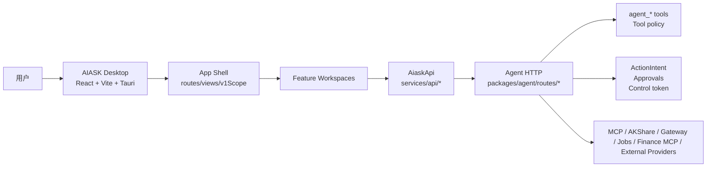

# AIASK V1 前端从零重建详细开发方案

## 0. 文档信息

| 项目 | 内容 |
|---|---|
| 文档名称 | AIASK V1 前端从零重建详细开发方案 |
| 文档版本 | 1.0.0 |
| 更新日期 | 2026-06-21 |
| 编写目的 | 在“整个前端已删除/不得恢复旧前端”的前提下，基于标准化功能规范重新生成可排期、可派单、可开发、可验收的 V1 前端开发方案 |
| 输入规范目录 | `frontend-screenshots/AIASK标准化功能规范-2026-06-20` |
| 参考主规范 | `AIASK项目开发技术规范-V1前端产品化-2026-06-21.md` |
| 技术方案 | 不变：React 18、Vite 6、TypeScript、Tauri 2、React Router、Agent HTTP、Vitest、Testing Library、Playwright、TanStack Table/Virtual、Lightweight Charts、lucide-react |
| 适用对象 | 产品经理、前端开发、后端开发、QA、交付负责人 |
| V1 产品定位 | Agent 驱动的金融研究与自动化桌面工作台 |
| V1 关键边界 | 不展示 Strategy Factory、Factor Factory、Incubation Factory、Factory Events 四工厂产品入口 |

### 0.1 本文与旧前端代码的关系

本方案不恢复、不引用、不延续已删除的前端实现。当前原有前端已经清理，后续开发必须从空白工程骨架重新创建 `desktop` 前端包；历史 `desktop/src`、`desktop/e2e`、`desktop/dist`、`desktop/node_modules` 或其他旧前端文件不得被还原为本次开发起点、代码证据或交付物。

允许保留并复用的是“技术路线和包边界”：AIASK V1 前端仍以 `desktop` 作为 React/Vite/Tauri 桌面前端包，不新建 Next.js、Electron、Ant Design、shadcn 或另一套 Web 前端。重建时可以重新创建 `desktop/package.json`、`src-tauri`、`src`、`e2e` 等目录，但每个文件必须按本文和标准化功能规范重新落地。

### 0.2 文档输入范围

本方案覆盖以下规范文档的全部 V1 要求：

| 文档组 | 文件 | 在本文落点 |
|---|---|---|
| 总览与治理 | `00-项目完整功能总览.md`、`17-旧文档要求映射与开发阶段.md`、`18-代码证据索引.md`、`25-功能文档详细编写标准.md`、`26-问题到技术方案全局矩阵.md`、`99-外部规范参考.md`、`README.md` | 第 1、2、3、4、5、10、11、12 章 |
| Agent 主流程 | `01-AI对话与任务工作台.md`、`02-模型配置与LLM可用性.md`、`05-Agent工具与Hermes能力.md`、`06-会话历史归档与运行事件.md`、`14-金融联动右侧扩展栏.md` | 第 6、7、8.1-8.5 |
| 集成能力 | `03-MCP服务管理.md`、`04-Skills与Plugins管理.md`、`08-应用联动Gateway与Webhooks.md`、`24-Connectors统一连接器.md` | 第 8.6-8.9 |
| 数据与金融 | `09-股票数据源配置与测试.md`、`10-数据库状态与数据同步.md`、`12-股票雷达.md`、`13-热力图与市场温度.md`、`15-金融工作台.md`、`22-量化研究与报告.md`、`23-FinancialManager与Broker只读.md` | 第 8.10-8.16 |
| 自动化、安全、个人能力 | `07-记忆与个人能力.md`、`11-自动化盯盘与任务处理.md`、`16-安全门禁与验收矩阵.md`、`19-Native文件代码终端浏览器能力.md`、`20-Readiness健康诊断与运维.md`、`21-Learning-RL-MoA学习能力.md` | 第 8.17-8.21 |

### 0.3 阅读方式

PM 重点看第 1、2、5、8、9、11 章，确认产品范围、页面布局、用户故事、阶段交付和验收标准。

开发重点看第 3、4、6、7、8、10 章，按目录、组件、API、状态、PR 任务拆实现。

QA 重点看第 5、8、9、11、12 章，按状态矩阵、响应式、门禁、负向范围和发布阻断设计用例。

## 1. 重建前提与不可违反边界

### 1.1 当前执行前提

| 前提 | 说明 | 处理方式 |
|---|---|---|
| 原有前端已清理 | 以用户确认的“整个前端已删除且原有前端已清理”为项目事实 | 从空白工程骨架重建，不恢复旧前端文件，不把历史代码写成“已实现” |
| 技术方案不变 | React/Vite/Tauri/TypeScript/Agent HTTP 仍是目标栈 | 重新创建工程骨架，而不是更换技术路线 |
| 后端能力可作为接口依据 | Agent、AKShare MCP、Finance MCP、Quant Core 等后端包可继续作为 API/能力来源 | 前端只经 Agent HTTP 调用 |
| 标准化规范是产品输入 | `frontend-screenshots/AIASK标准化功能规范-2026-06-20` 是本次功能范围来源 | 所有页面必须能回指对应规范 |
| 四工厂不展示 | Strategy Factory、Factor Factory、Incubation Factory、Factory Events 不作为 V1 产品入口 | 不建导航、不建卡片、不建正向路由、不进 e2e 正向矩阵 |

### 1.2 严禁事项

1. 禁止从旧 `desktop/src` 复制页面、组件、mock 或测试作为重建实现，除非后续获得明确批准并逐文件审查。
2. 禁止把后端存在、mock 存在、类型存在写成 V1 前端已完成。
3. 禁止让前端直连 Python、MCP server、AKShare manager、策略工厂、SQLite 或本地交易软件。
4. 禁止在 V1 前端展示四工厂产品入口。
5. 禁止显示 API key、token、password、broker 凭据等 secret 原值。
6. 禁止提供实盘下单、撤单、实盘交易入口。
7. 禁止把 mock/e2e 通过写成 live provider 或生产可用。

### 1.3 可复用与不可复用

| 类型 | 是否可复用 | 规则 |
|---|---|---|
| 技术栈 | 可复用 | 保持 React 18、Vite 6、Tauri 2、TypeScript、Vitest、Playwright |
| 包名与目录名 | 可复用 | 仍使用 `desktop` 作为前端包根目录 |
| Agent HTTP endpoint | 可复用 | 以 `packages/agent/src/aiask_agent/routes/*` 为接口来源 |
| 外部成熟方案 | 可复用 | 以 `99-外部规范参考.md` 的采用/不采用原则为准 |
| 历史前端源码 | 默认不可复用 | 只能作为后续人工审查输入，不作为本方案开发依据 |
| 四工厂前端 | 不可复用 | V1 不展示 |

## 2. V1 产品范围

### 2.1 V1 必须做的产品入口

| 一级分组 | 页面/能力 | 用户目标 | 功能编号 |
|---|---|---|---|
| 核心工作 | Workbench、模型配置、项目/上下文 | 发起任务、选择模型、管理上下文 | `WB`、`MODEL` |
| 运行证据 | Sessions、Runs/Events、Artifacts/Sources | 查历史、追踪执行、定位错误、查看产物 | `RUN` |
| 工具与审批 | Tools、Intents、Approvals、Native 风险 | 查工具、看 schema、处理受控动作 | `TOOL`、`OPS` |
| 集成能力 | MCP、Connectors、Plugins、Skills、Gateway、Webhooks | 管理外部能力、平台投递、插件技能 | `MCP`、`PLUGIN`、`GATEWAY` |
| 数据基础 | Stock Data Sources、Data & Sync | 配数据源、看数据库新鲜度、生成同步计划 | `DATA` |
| 金融观察 | Stock Radar、Market Temperature | 看候选、风险、市场温度、行业热度 | `RADAR`、`MARKET` |
| 金融研究 | Finance Lab、Quant Research、Financial Manager、Broker Read-only | 研究、报告、只读查询、券商只读快照 | `FIN`、`QUANT` |
| 自动化 | Automation、Workflows | 管理 jobs、运行历史、受控调度和 V1 工作流入口 | `AUTO` |
| 运维安全 | Settings、Readiness/Health、Security | 配置、诊断、发布前检查、权限门禁 | `OPS` |
| 个人与学习 | Local User、Memory、Learning/RL/MoA | 用户画像、数据权利、学习建议、RL 运行 | `USER`、`LEARN` |

### 2.2 V1 不展示的能力

| 不展示能力 | 后端/兼容代码是否可存在 | 前端处理 |
|---|---|---|
| Strategy Factory | 可存在 | 不建导航、不建页面入口、不建推荐动作；旧路径如需要必须回落 Finance Lab 或 404/Deferred |
| Factor Factory | 可存在 | 不展示产品入口；工具目录默认过滤相关工具名 |
| Incubation Factory | 可存在 | 不展示孵化工作台和接力卡片 |
| Factory Events | 可存在 | 不展示事件工厂页面；Stock Radar 独立实现 |

### 2.3 产品完成定义

一个 V1 页面只有同时满足以下条件，才算完成：

| 维度 | 完成标准 |
|---|---|
| 产品 | 有明确用户故事、首屏目标、主操作、不做事项 |
| 页面 | 有路由、导航入口、布局、响应式、状态画面 |
| API | 所有调用走 `AiaskApi`，有 Agent endpoint、请求/响应字段和错误码 |
| 安全 | 只读/写入/副作用/本地高权限/金融风险动作分区，门禁明确 |
| 数据 | loading、empty、filter_empty、error、degraded、gated、blocked、stale、mock、success 全覆盖 |
| 测试 | 有 Vitest、API/mock test、Playwright mock e2e、必要 live smoke 前置 |
| 边界 | 不展示四工厂，不泄露 secret，不误写 mock 为 live |

## 3. 技术架构

### 3.1 总体架构



### 3.2 目标工程目录

本目录是重建目标，不代表当前文件已经存在。

```text
desktop/
├── package.json
├── vite.config.ts
├── tsconfig.json
├── index.html
├── src-tauri/
├── e2e/
│   ├── aiask-v1.spec.ts
│   └── support/
├── src/
│   ├── main.tsx
│   ├── App.tsx
│   ├── routes.ts
│   ├── views.ts
│   ├── v1Scope.ts
│   ├── styles.css
│   ├── types/
│   ├── services/
│   │   ├── aiaskApi.ts
│   │   └── api/
│   ├── mock/
│   ├── hooks/
│   ├── components/
│   └── features/
│       ├── workbench/
│       ├── models/
│       ├── runs/
│       ├── tools/
│       ├── integrations/
│       ├── data/
│       ├── finance/
│       ├── automation/
│       ├── ops/
│       └── user/
```

### 3.3 包边界

| 包/目录 | 职责 | 禁止 |
|---|---|---|
| `desktop` | UI、路由、状态、API client、mock/live 展示、测试 | 直接调用 Python/MCP/manager/DB |
| `packages/agent` | Desktop-facing HTTP、`agent_*` tools、intents、approvals、connectors、gateway、jobs | 暴露 secret 或 raw manager 给前端/模型 |
| `packages/akshare-mcp` | 金融数据、AKShare/Tushare/TDX/TQCenter、数据同步、市场温度、股票雷达、量化服务 | 被 Desktop 直接调用 |
| `packages/finance-mcp-servers` | 券商只读/交易风险隔离能力 | 在 V1 前端出现实盘交易入口 |
| `packages/strategy-factory` | 后续版本策略工厂后端能力 | V1 前端展示入口 |

### 3.4 外部成熟技术采用

| 来源 | 采用原则 | 落地 |
|---|---|---|
| OpenAI Tools / Conversation State | 工具调用和会话状态必须可解释、可恢复 | Workbench、Tools、Runs、Sessions |
| MCP 官方文档 | servers/tools/resources/prompts/OAuth 分层 | MCP/Connectors 页面 |
| OpenAPI 3.2 / JSON Schema | method/path/schema/error 明确 | 所有 API 表、工具 schema、表单校验 |
| RFC 9457 Problem Details | 错误结构化、可解释、可审计 | `error_code`、trace、用户提示、技术详情 |
| OWASP API Security / ASVS | secret、权限、访问控制、审计、错误处理 | Settings、Security、Gateway、Native、Finance |
| Tauri Security | 桌面本地能力边界清晰 | Native/full mode gated |
| React / React Router / Vite | 组件化、路由、构建保持既定栈 | App Shell、Routes、Views |
| Vitest / Testing Library / Playwright | 单测行为、真实浏览器流程、mock/live 区分 | 单测、e2e、发布门禁 |
| TanStack Table/Virtual | 大表格、事件流、工具目录可组合和虚拟化 | Runs、Tools、Data、Finance |
| Lightweight Charts | 金融图表轻量展示，数据源和时间可见 | Market Temperature、Quant |
| AKShare / Tushare | 数据源要显示免费/付费、限流、freshness、missing、stale | Data、Radar、Market、Quant |

## 4. 全局前端设计规范

### 4.1 信息架构

V1 第一屏不是官网，不做营销页。应用默认进入 Workbench，左侧是克制的产品导航，中间是工作区，右侧按需显示上下文、证据、审批或详情。

| 导航分组 | 页面 | 顺序 |
|---|---|---|
| 工作 | Workbench、Projects/Contexts、Models | 1 |
| 运行 | Sessions、Runs/Events、Artifacts/Sources、Tools/Intents/Approvals | 2 |
| 集成 | Integrations、MCP/Connectors、Plugins/Skills、Gateway/Webhooks | 3 |
| 金融 | Finance Lab、Data & Sync、Stock Radar、Market Temperature、Quant Research、Financial Manager、Automation/Workflows | 4 |
| 运维 | Settings、Readiness/Health、Security、Local User、Learning/RL/MoA、Native Diagnostics | 5 |

### 4.2 页面标准骨架

所有页面使用同一骨架，避免临时堆卡片。

```text
FeatureWorkspace
├── PageHeader: 标题、说明、状态 badge、主操作
├── MetricStrip: 关键指标、可用性、更新时间、门禁状态
├── FilterBar: 搜索、状态、时间、provider、symbol、风险等级
├── MainRegion: 表格、列表、时间线、图表或表单
├── DetailPanel: 选中项详情、schema、参数、结果、审计
├── ActionPanel: 只读/预览/创建意图/审批/重试
└── EvidencePanel: endpoint、trace、source、redacted JSON、mock/live 标记
```

### 4.3 通用组件清单

| 组件 | 职责 | 第一阶段是否必做 |
|---|---|---|
| `AppShell` | 左侧导航、顶部连接状态、主内容区、右侧详情区 | 是 |
| `PageShell` | 页面统一头部、状态、动作、布局容器 | 是 |
| `StatusBadge` | ready/degraded/error/gated/blocked/mock 状态 | 是 |
| `MetricCard` | 指标摘要 | 是 |
| `FilterBar` | 搜索、选择、tab、日期、状态过滤 | 是 |
| `DataTable` | 标准表格、排序、空态、错误态 | 是 |
| `DetailDrawer` | 详情抽屉/右侧面板 | 是 |
| `RawEvidencePanel` | 默认折叠 redacted JSON、endpoint、trace | 是 |
| `GatedActionButton` | token/approval/intent/full mode 门禁按钮 | 是 |
| `EmptyState` | 空态和下一步动作 | 是 |
| `ErrorState` | 错误码、用户提示、技术详情、重试 | 是 |
| `ChartPanel` | Lightweight Charts 封装 | P4 |
| `VirtualList` | 大事件流/工具目录/运行历史虚拟化 | P3/P4 |

### 4.4 状态画面标准

| 状态 | 用户看到什么 | 开发要求 |
|---|---|---|
| `loading` | skeleton 或保留旧数据的加载提示 | 不清空已有可用数据 |
| `empty` | 空原因和下一步 | 提供配置、刷新、返回或创建入口 |
| `filter_empty` | 筛选无结果 | 保留筛选器，提供清空 |
| `success` | 主数据、更新时间、来源 | 显示 endpoint/source/mock/live |
| `error` | 用户提示、错误码、trace、重试 | 不只 toast |
| `degraded` | 哪些能力不可用、哪些可继续 | partial data 可见 |
| `gated` | 缺 token/OAuth/full mode/权限 | 按钮禁用或创建 intent 失败原因可见 |
| `blocked` | 后端策略拒绝原因 | 不提供绕过 |
| `stale` | 数据过期、as_of、stale_days | 给 Data & Sync 入口 |
| `mock` | 明确 mock 数据源 | 不写 live ready |

### 4.5 响应式要求

| 断点 | 布局 |
|---|---|
| `>=1200px` | 主内容 + 右侧详情/证据，表格列密度高但按钮不挤压 |
| `768-1199px` | 主内容优先，详情下置或折叠，筛选器换行 |
| `<768px` | 单列，表格卡片化或内部横滚，动作按钮固定高度并换行 |

## 5. 阶段计划

### 5.1 阶段总览

| 阶段 | 名称 | 目标 | 交付物 | 退出标准 |
|---|---|---|---|---|
| P0 | 清理结果确认与工程骨架 | 确认旧前端已清理且不恢复，创建干净工程骨架 | `desktop` 新骨架、技术栈、基础脚本、V1 scope | 可以启动空壳应用，导航只含 V1 |
| P1 | 设计系统与 API 基座 | 建 PageShell、状态组件、AiaskApi、mock/live 基座 | 共享组件、API client、mock server、错误模型 | 核心组件有单测 |
| P2 | Agent 主流程 | Workbench、Models、Sessions/Runs、Tools/Approvals | 核心 Agent 闭环 | 用户能发任务、看运行、看工具、处理意图 |
| P3 | 集成能力 | MCP、Connectors、Plugins/Skills、Gateway/Webhooks | 集成页面和门禁 | 外部能力可管理但受控 |
| P4 | 数据与金融主线 | Data、Radar、Market、Finance Lab、Quant、Manager/Broker | 金融 V1 主线 | 无四工厂，金融只读/intent 清楚 |
| P5 | 自动化、运维、个人学习 | Jobs、Workflows、Settings、Readiness、Security、User、Learning/RL、Native | 发布前诊断和个人能力 | 高风险动作全 gated |
| P6 | 发布硬化 | 自动化测试、响应式截图、build、打包说明 | 测试报告、截图、发布说明 | typecheck/unit/build/e2e 通过 |

### 5.2 P0 清理结果确认与工程骨架

| 子阶段 | 做什么 | 如何完成 | 交付物 | 验收 |
|---|---|---|---|---|
| P0-S1 清理结果确认 | 记录原有前端已清理，确认不会恢复历史源码 | 检查 `desktop` 旧源码、旧 e2e、旧 dist、旧 node_modules 不作为开发输入 | `前端清理确认记录` | 开发计划只从新骨架开始，不引用历史前端实现 |
| P0-S2 工程重建策略 | 决定保留 `desktop` 包名，重建源代码 | 创建空白 Vite/Tauri/TS 骨架 | `desktop/package.json`、`vite.config.ts`、`src-tauri`、`src/main.tsx` | `npm run dev` 能启动空壳 |
| P0-S3 V1 scope | 定义可见 view 和 deferred view | 新建 `src/v1Scope.ts`、`routes.ts`、`views.ts` | V1 route/view 表 | 四工厂不在导航 |
| P0-S4 基础 App Shell | 左侧导航、主内容、右侧详情容器 | 新建 `App.tsx`、`AppShell`、基础 CSS | 可点击空页面 | 旧四工厂路径不可进入产品页 |
| P0-S5 基础测试 | route/view/scope 单测 | Vitest 覆盖 V1/deferred | `routes.test.ts`、`views.test.ts` | 单测通过 |

### 5.3 P1 设计系统与 API 基座

| 子阶段 | 做什么 | 如何完成 | 交付物 | 验收 |
|---|---|---|---|---|
| P1-S1 PageShell | 建统一页面容器 | Header、MetricStrip、FilterSlot、Main、Detail、Evidence | `components/PageShell.tsx` | 页面可统一加载状态 |
| P1-S2 状态组件 | 建 badge、empty、error、gated、evidence | 统一颜色、文案、按钮、trace 展示 | `components/shared/*` | 所有状态组件有单测 |
| P1-S3 API core | 建 Agent HTTP client | `requestJson`、token、timeout、Problem Details 兼容、redaction | `services/aiaskApi.ts`、`services/api/core.ts` | mock/live 可切换 |
| P1-S4 mock 基座 | 建 mock data 和 mock transport | `mockApi.ts`、`mock/*` | mock health、models、workbench、runs | e2e 可用 mock |
| P1-S5 全局 hooks | 连接状态、token/mode、toasts、selection | `useAppConnectionSettings`、`useLiveQuery` | 基础状态 hook | 离线/degraded 可显示 |
| P1-S6 基础视觉验收 | 1440/1024/768/375 布局基线 | Playwright 截图 | 截图记录 | 无重叠、无文字溢出 |

### 5.4 P2 Agent 主流程

| 子阶段 | 做什么 | 如何完成 | 交付物 | 验收 |
|---|---|---|---|---|
| P2-S1 Models | Provider 配置、模型列表、smoke | `routes/ai.py` -> `modelsApi` -> `ModelsWorkspace` | 模型状态页 | secret redacted，失败有错误分类 |
| P2-S2 Workbench | 输入任务、发送前预检、消息流 | `/v1/responses`、workbench summary | `WorkbenchWorkspace` | 可以发起 mock 任务并显示证据 |
| P2-S3 右侧证据 | 当前会话、工具、金融上下文、run/source | 右侧 `InspectorPanel` | 证据栏 | 回复能追到 run/event/artifact |
| P2-S4 Sessions | 会话列表、搜索、归档、恢复 | sessions API | `SessionsWorkspace` | 空态、搜索无结果、恢复上下文 |
| P2-S5 Runs/Events/Artifacts | 运行列表、事件时间线、产物预览 | runs API | `RunsWorkspace`、`ArtifactsWorkspace` | 失败 stage、trace、artifact source 可见 |
| P2-S6 Tools/Intents/Approvals | 工具目录、schema、风险、审批队列 | tools/intents/approvals API | `ToolsWorkspace` | raw manager 和四工厂工具不展示 |

### 5.5 P3 集成能力

| 子阶段 | 做什么 | 如何完成 | 交付物 | 验收 |
|---|---|---|---|---|
| P3-S1 Integrations | 集成总览 | 聚合 MCP/Gateway/Plugins/Skills/Connectors 状态 | `IntegrationsWorkspace` | 能跳转每个集成页 |
| P3-S2 MCP | servers/tools/resources/prompts/OAuth | `routes/mcp.py` | `McpWorkspace` | 不直连 MCP，OAuth 状态可见 |
| P3-S3 Connectors | summary/list/detail/test | `routes/connectors.py` | `ConnectorsWorkspace` | test 失败可读，secret 不回显 |
| P3-S4 Plugins/Skills | 生命周期、命令测试、启停 | `routes/plugins_skills.py` | `PluginsSkillsWorkspace` | 安装/删除/启停 gated |
| P3-S5 Gateway/Webhooks | daemon、platforms、messages、directory、webhook | `routes/gateway.py`、`webhooks.py` | `GatewayWorkspace`、`WebhooksPanel` | 发送/重试/trigger 需要 intent 或 token |

### 5.6 P4 数据与金融主线

| 子阶段 | 做什么 | 如何完成 | 交付物 | 验收 |
|---|---|---|---|---|
| P4-S1 Data Sources | AKShare/Tushare/TDX/TQCenter/本地源配置和测试 | `routes/desktop_data.py` | `StockDataSourcesWorkspace` | secret redacted，源状态红黄绿 |
| P4-S2 Data & Sync | 数据库状态、新鲜度、missing/stale、sync plan | data status/sync plan API | `DataSyncWorkspace` | 写入只创建 intent |
| P4-S3 Finance Lab | 金融 V1 枢纽 | 汇总 Data/Radar/Market/Quant/Manager/Automation | `FinanceLabWorkspace` | 无四工厂卡片 |
| P4-S4 Stock Radar | status、candidates、digest、run/push/schedule intents | `routes/desktop_finance.py` | `StockRadarWorkspace` | 筛选、详情、风险、intent |
| P4-S5 Market Temperature | 市场温度、行业热度、历史、图表 | finance API + Lightweight Charts | `MarketTemperatureWorkspace` | 样本不足 degraded，不画误导图 |
| P4-S6 Quant Research | preset、参数、data gate、run、report | quant API | `QuantResearchWorkspace` | 数据门禁失败不运行 |
| P4-S7 Financial Manager/Broker | 能力目录、只读查询、broker accounts/positions/orders | finance manager/broker API | `FinancialManagerWorkspace` | 无下单/撤单按钮 |

### 5.7 P5 自动化、运维、个人学习

| 子阶段 | 做什么 | 如何完成 | 交付物 | 验收 |
|---|---|---|---|---|
| P5-S1 Automation/Jobs | jobs 列表、编辑、运行历史 | `routes/jobs.py` | `AutomationWorkspace` | create/update/delete/run gated |
| P5-S2 Workflows | V1 工作流地图 | Data -> Radar -> Market -> Quant -> Manager -> Gateway/Automation | `WorkflowsWorkspace` | 不展示四工厂流程 |
| P5-S3 Settings/Security | endpoint、token、mode、redaction、安全规则 | settings/ops API | `SettingsWorkspace`、`SecurityWorkspace` | 不显示 secret |
| P5-S4 Readiness/Health | Agent/AI/MCP/Data/Finance/Gateway/Security gates | health/readiness/parity API | `ReadinessWorkspace` | 发布阻断项可见 |
| P5-S5 Local User/Memory | 画像、活动、偏好、导出、删除 dry_run | user API | `LocalUserWorkspace` | 删除必须先 dry_run |
| P5-S6 Learning/RL/MoA/Native | 学习建议、RL runs、Native 风险 | learning/rl/full-controls API | `LearningWorkspace`、`NativeDiagnostics` | start/apply/stop gated |

### 5.8 P6 发布硬化

| 子阶段 | 做什么 | 如何完成 | 交付物 | 验收 |
|---|---|---|---|---|
| P6-S1 单测补齐 | 每个 Workspace 至少覆盖状态和主操作 | Vitest + Testing Library | `*.test.tsx` | 核心单测通过 |
| P6-S2 API/mock 测试 | AiaskApi route、mock payload 对齐 | service tests | `aiaskApi.test.ts` | mock/live envelope 一致 |
| P6-S3 e2e 页面矩阵 | V1 页面全可打开，四工厂负向 | Playwright mock | `e2e/aiask-v1.spec.ts` | 页面矩阵通过 |
| P6-S4 响应式截图 | 1440/1024/768/375 | Playwright screenshot | 截图报告 | 无重叠、无溢出 |
| P6-S5 build/tauri | `npm run typecheck`、`npm run build`、Tauri build | CI/本地 | 构建记录 | 通过或有明确阻断 |
| P6-S6 发布说明 | mock/live、已知限制、配置 env 名、回滚 | Release notes | 发布文档 | PM/QA/交付签收 |

## 6. API 与数据契约

### 6.1 前端 API 分层

| 模块 | 目标文件 | 负责方法 |
|---|---|---|
| Core | `services/api/core.ts` | request、timeout、headers、token、error normalization |
| AI/Models | `services/api/ai.ts` | status、config、models、smoke、responses |
| Workbench/Runs | `services/api/workbench.ts` | summary、sessions、runs、events、artifacts、run control |
| Intents/Approvals | `services/api/intents.ts` | create/get/confirm/deny/list approvals |
| Integrations | `services/api/integrations.ts` | MCP、connectors、plugins、skills、gateway、webhooks |
| Data | `services/api/data.ts` | data status、sync plan、sources、source test |
| Finance | `services/api/finance.ts` | radar、market temperature、quant、financial manager、broker readonly |
| Ops/User | `services/api/ops.ts`、`services/api/user.ts` | health、readiness、settings、security、local user、learning/RL/native |

### 6.2 主要 Agent endpoint 对应

| 前端能力 | Agent route 来源 | 前端方法 |
|---|---|---|
| Health/Readiness | `routes/health.py`、`routes/hermes.py` | `health()`、`detailedHealth()`、`readiness()` |
| AI Models | `routes/ai.py` | `aiStatus()`、`aiConfigSave()`、`aiModels()`、`aiSmoke()` |
| Responses | `routes/responses.py` | `createResponse()` |
| Workbench summary | `routes/desktop_workbench.py` | `workbenchSummary()` |
| Sessions/Runs | `routes/run_history.py`、`routes/run_control.py` | `sessionsList()`、`runsList()`、`runEvents()`、`runCancel()` |
| Tools | `routes/tools*.py`、tool catalog | `toolsList()`、`toolCallReadonly()` |
| Intents/Approvals | `routes/intents.py`、`routes/approvals.py` | `createActionIntent()`、`confirmIntent()`、`approvalsList()` |
| MCP | `routes/mcp.py` | `mcpServers()`、`mcpTools()`、`mcpResources()`、`mcpPrompts()` |
| Connectors | `routes/connectors.py` | `connectorsList()`、`connectorDetail()`、`connectorTest()` |
| Plugins/Skills | `routes/plugins_skills.py` | `pluginsList()`、`skillsList()`、`pluginCommandTest()` |
| Gateway/Webhooks | `routes/gateway.py`、`routes/webhooks.py` | `gatewayStatus()`、`gatewaySendIntent()`、`webhooksList()` |
| Jobs | `routes/jobs.py` | `jobsList()`、`jobCreate()`、`jobUpdate()`、`jobRun()` |
| Data | `routes/desktop_data.py` | `dataStatus()`、`dataSyncPlan()`、`stockDataSources()` |
| Finance | `routes/desktop_finance.py` | `stockRadar*()`、`marketTemperature*()`、`quant*()`、`financialManager*()`、`broker*()` |
| User/Learning/Native | `routes/desktop_user.py`、`routes/learning_rl.py`、`routes/full_controls.py` | `localProfile*()`、`learning*()`、`rl*()`、`terminalBackends()` |

### 6.3 统一响应字段

| 字段 | 用途 | UI 表达 |
|---|---|---|
| `object` | 资源类型 | raw evidence |
| `id` | 稳定标识 | 列表 key、详情链接 |
| `status` | 状态 | `StatusBadge` |
| `data` | 主数据 | 页面主区域 |
| `error_code` | 错误分类 | ErrorState |
| `message` | 用户提示 | ErrorState 主文案 |
| `detail` | 技术详情 | 折叠区 |
| `trace_id` | 复现/审计 | EvidencePanel |
| `source` / `source_chain` | 数据来源 | EvidencePanel、金融可信度 |
| `as_of` / `updated_at` | 时间 | metric/detail |
| `requires_control_token` | control token 门禁 | `GatedActionButton` |
| `requires_approval` | 审批门禁 | Intent/Approval panel |
| `risk_level` / `side_effect` | 风险 | badge/action label |
| `secrets_redacted` | secret 保护 | Settings/Security |
| `mock` / `source_mode` | mock/live | 页面角标 |

## 7. 目标代码任务拆分

### 7.1 任务卡模板

| 字段 | 填写要求 |
|---|---|
| 任务编号 | `P阶段-模块-序号`，如 `P4-RADAR-003` |
| 来源规范 | 指向 `frontend-screenshots/AIASK标准化功能规范-2026-06-20/*.md` |
| 用户故事 | 作为谁，在什么场景，要完成什么，成功标准是什么 |
| 页面入口 | view id、route、导航入口、聚合页入口 |
| 目标文件 | 明确到 `desktop/src/...` |
| API | `AiaskApi` 方法、Agent route、请求/响应字段 |
| UI 状态 | 十类状态逐项说明 |
| 安全边界 | token、intent、approval、secret、read-only、deferred |
| 实现步骤 | 5-10 条可提交 PR 的步骤 |
| 测试 | Vitest、service test、e2e、截图、live smoke 前置 |
| 不做事项 | 四工厂、direct MCP、secret、live trade、mock/live |

### 7.2 PR 分组建议

| PR | 范围 | 主要文件 | 验收 |
|---|---|---|---|
| PR-00 | 工程骨架和 V1 scope | package、App、routes、views、v1Scope、styles | 空壳可启动，四工厂不可见 |
| PR-01 | 设计系统/API core/mock | components、services/api/core、mockApi | 共享组件单测 |
| PR-02 | Models + Workbench | models、workbench、ai API | 可发 mock 任务，模型状态可见 |
| PR-03 | Sessions/Runs/Tools/Approvals | runs、tools、intents | 证据链和审批闭环 |
| PR-04 | MCP/Connectors/Plugins/Gateway | integrations | 集成状态和门禁 |
| PR-05 | Data + Sources | data | freshness/sync plan/source test |
| PR-06 | Finance Lab + Radar + Market | finance lab、radar、market | 无四工厂，金融观察闭环 |
| PR-07 | Quant + Financial Manager/Broker | quant、financial-manager | 只读/intent 边界 |
| PR-08 | Automation + Workflows | jobs、workflows | V1 工作流，无四工厂 |
| PR-09 | Settings/Readiness/Security/User/Learning/Native | ops、user | 发布前诊断和个人能力 |
| PR-10 | e2e、截图、build、release | e2e、docs | 发布门禁通过 |

## 8. 页面级详细开发方案

### 8.1 Workbench AI 工作台

| 项目 | 内容 |
|---|---|
| 来源规范 | `01-AI对话与任务工作台.md`、`14-金融联动右侧扩展栏.md` |
| view/route | `workbench`、`/` |
| 目标文件 | `features/workbench/WorkbenchWorkspace.tsx`、`hooks/useAgentWorkbench.ts`、`components/AppContextPanel.tsx`、`components/InspectorPanel.tsx` |
| API | `workbenchSummary()`、`createResponse()`、`sessionsList()`、`runsList()`、`runEvents()` |

布局：

```text
Workbench
├── 顶部：endpoint/profile/model/mode/health 状态条
├── 左侧：最近 sessions/runs/project context
├── 中央：任务输入区、消息流、工具证据卡
└── 右侧：上下文、运行事件、artifact/source、审批提示
```

功能细化：

| 功能 | 页面表现 | 开发步骤 | 验收 |
|---|---|---|---|
| 发送前预检 | 模型、Agent、token、mode 状态 | 调 `aiStatus`、`health`、本地设置 hook | 离线/未配置不发送 |
| 消息流 | user/assistant/tool/error 分段 | 消息类型、run id、tool events 映射 | 工具名、参数摘要、结果摘要可见 |
| 证据追踪 | 点击消息打开 run/event/artifact | Inspector 选中状态 | 回复可追到来源 |
| 金融右栏 | symbol/context/source/risk | 从消息或运行事件提取金融上下文 | 不展示四工厂推荐 |
| 错误处理 | error_code、trace、retry | ErrorState + 保留输入 | API 错误可复现 |

### 8.2 Models 模型配置

| 项目 | 内容 |
|---|---|
| 来源规范 | `02-模型配置与LLM可用性.md` |
| view/route | `models`、`/models` 或 Settings 内 tab |
| 目标文件 | `features/models/ModelsWorkspace.tsx`、`services/api/ai.ts` |
| API | `/v1/ai/status`、`/v1/ai/config`、`/v1/ai/models`、`/v1/ai/smoke` |

布局：

```text
Models
├── provider 状态指标
├── provider preset 列表
├── 配置表单：base_url/model/env name/configured
├── 模型列表和手动模型输入
└── smoke test 结果和错误分类
```

开发要点：

| 功能 | 字段 | 交互 | 验收 |
|---|---|---|---|
| Provider 配置 | provider、base_url、model、configured、missing_env | 保存需 control token | secret 不回显 |
| 模型列表 | id、owned_by、context、status | 刷新/失败 fallback 手动输入 | 网络失败不阻塞保存 |
| Smoke test | latency、error_code、provider_error、trace | 点击测试 | auth/network/model_not_found 分类 |
| 发送前联动 | selected_model、ready/degraded | Workbench 读取状态 | 未配置时 Workbench 有跳转 |

### 8.3 Projects / Contexts

| 项目 | 内容 |
|---|---|
| 来源规范 | `01-AI对话与任务工作台.md`、`07-记忆与个人能力.md` |
| view/route | `projects-contexts`、`/projects` |
| 目标文件 | `features/workbench/ProjectsContextsWorkspace.tsx` |
| API | local desktop state、session/context APIs |

布局：项目列表 + 上下文详情 + 引用资源/最近会话 + 权限/数据来源。

必须支持：创建/选择项目、关联 session、查看上下文片段、空态引导回 Workbench。写入项目配置需 control token 或本地确认。

### 8.4 Sessions / Runs / Events / Artifacts

| 项目 | 内容 |
|---|---|
| 来源规范 | `06-会话历史归档与运行事件.md` |
| view/route | `sessions`、`runs-events`、`artifacts` |
| 目标文件 | `features/runs/SessionsWorkspace.tsx`、`RunsEventsWorkspace.tsx`、`ArtifactsWorkspace.tsx` |
| API | sessions、runs、events、artifacts、run cancel/steer |

布局：

```text
Sessions/Runs
├── 左侧 master list：session/run filters
├── 中央：timeline/table events
├── 右侧：selected item detail + evidence
└── 底部：artifacts/sources preview
```

验收重点：失败阶段、错误码、trace、artifact source、工具调用和审批事件不能隐藏；长事件流支持分页或虚拟滚动。

### 8.5 Tools / Intents / Approvals / Native 风险

| 项目 | 内容 |
|---|---|
| 来源规范 | `05-Agent工具与Hermes能力.md`、`16-安全门禁与验收矩阵.md`、`19-Native文件代码终端浏览器能力.md` |
| view/route | `tools-approvals`、`/tools` |
| 目标文件 | `features/tools/ToolsWorkspace.tsx`、`features/tools/IntentsApprovalsPanel.tsx` |
| API | tools catalog、tool readonly call、intents、approvals、full controls status |

布局：工具目录 + schema 详情 + 风险/side effect + intents 队列 + approvals 队列 + Native 风险概览。

边界：只展示 `agent_*` facade；过滤四工厂工具；本地文件/终端/浏览器/进程类能力只显示风险和受控入口，不让页面绕过 Agent。

### 8.6 Integrations 总览

| 项目 | 内容 |
|---|---|
| 来源规范 | `03-MCP服务管理.md`、`04-Skills与Plugins管理.md`、`08-应用联动Gateway与Webhooks.md`、`24-Connectors统一连接器.md` |
| view/route | `integrations`、`/integrations` |
| 目标文件 | `features/integrations/IntegrationsWorkspace.tsx` |

布局：MCP、Connectors、Plugins、Skills、Gateway、Webhooks、Readiness 卡片。每张卡显示 status、count、last_error、next action。卡片只跳 V1 页面。

### 8.7 MCP / Connectors

| 项目 | 内容 |
|---|---|
| 来源规范 | `03-MCP服务管理.md`、`24-Connectors统一连接器.md` |
| view/route | `mcp-connectors`、`/mcp`、`/connectors` |
| 目标文件 | `features/integrations/McpConnectorsWorkspace.tsx`、`ConnectorsWorkspace.tsx` |
| API | MCP servers/tools/resources/prompts/OAuth、connector summary/list/detail/test |

布局：tabs 分 servers、tools、resources、prompts、OAuth、connectors。详情区显示 schema、endpoint、last_error、redacted config。测试连接需显示结果，不回显 secret。

### 8.8 Plugins / Skills

| 项目 | 内容 |
|---|---|
| 来源规范 | `04-Skills与Plugins管理.md` |
| view/route | `plugins-skills`、`/plugins` |
| 目标文件 | `features/integrations/PluginsSkillsWorkspace.tsx` |
| API | skills list、plugins list、plugin commands/tools、install/update/delete/toggle/test |

布局：左侧 Skills，右侧 Plugins，底部 command/tool test 输出。install/update/delete/toggle 是写入动作，必须 gated。

### 8.9 Gateway / Webhooks

| 项目 | 内容 |
|---|---|
| 来源规范 | `08-应用联动Gateway与Webhooks.md` |
| view/route | `gateway`、`/gateway`、`/webhooks` |
| 目标文件 | `features/integrations/GatewayWorkspace.tsx`、`WebhooksPanel.tsx` |
| API | gateway status/daemon/platforms/messages/directory/send intent/retry、webhooks list/trigger |

布局：daemon 状态 + platforms 表格 + messages 表格 + directory + webhooks。发送、重试、trigger 必须 preview -> intent/approval。

### 8.10 Stock Data Sources

| 项目 | 内容 |
|---|---|
| 来源规范 | `09-股票数据源配置与测试.md` |
| view/route | `stock-data-sources` 或 Settings/Data tab |
| 目标文件 | `features/data/StockDataSourcesWorkspace.tsx` |
| API | stock data sources list/test/save |

布局：数据源卡片（AKShare/Tushare/TDX/TQCenter/local）、配置表单、测试结果、权限/限流说明。secret 只显示 env 名、configured、missing、expired。

### 8.11 Data & Sync

| 项目 | 内容 |
|---|---|
| 来源规范 | `10-数据库状态与数据同步.md` |
| view/route | `data-sync`、`/data` |
| 目标文件 | `features/data/DataSyncWorkspace.tsx` |
| API | data status、freshness、sync plan、create intent |

布局：数据库健康指标 + freshness 表 + missing/stale 列表 + sync plan preview + ActionIntent 面板。同步不直接写库，只创建受控意图。

### 8.12 Finance Lab

| 项目 | 内容 |
|---|---|
| 来源规范 | `15-金融工作台.md` |
| view/route | `finance-lab`、`/finance` |
| 目标文件 | `features/finance/FinanceLabWorkspace.tsx` |

布局：金融状态总览 + V1 页面入口卡：Data、Stock Radar、Market Temperature、Quant Research、Financial Manager、Broker Read-only、Automation/Workflows。严禁出现 Strategy/Factor/Incubation/Factory Events 卡片。

### 8.13 Stock Radar

| 项目 | 内容 |
|---|---|
| 来源规范 | `12-股票雷达.md` |
| view/route | `stock-radar`、`/finance/stock-radar` |
| 目标文件 | `features/finance/StockRadarWorkspace.tsx` |
| API | radar status、candidates、digest、run intent、push intent、schedule intent |

布局：radar status + filters + candidates table + candidate detail + digest + intent panel。候选字段包括 symbol、name、tier、score、risk、reason、source_chain、as_of。run/push/schedule 全部只创建 intent。

### 8.14 Market Temperature

| 项目 | 内容 |
|---|---|
| 来源规范 | `13-热力图与市场温度.md` |
| view/route | `market-temperature`、`/finance/market-temperature` |
| 目标文件 | `features/finance/MarketTemperatureWorkspace.tsx` |
| API | market temperature snapshot、industry history、readiness |

布局：市场温度指标 + 行业热力表 + 图表 + 历史 + 数据质量说明。样本不足、数据 stale、cache missing 时显示 degraded，不画误导图。

### 8.15 Quant Research

| 项目 | 内容 |
|---|---|
| 来源规范 | `22-量化研究与报告.md` |
| view/route | `quant-research`、`/finance/quant` |
| 目标文件 | `features/finance/QuantResearchWorkspace.tsx` |
| API | quant presets、data gate、run、report |

布局：preset 选择 + 参数表单 + data gate + run progress + report。报告展示 metrics、tables、charts、limitations、source_chain、raw evidence。内部后续工厂字段不得作为 V1 入口，文案写“后续版本准入/研究复核”，不写策略工厂入口。

### 8.16 Financial Manager / Broker Read-only

| 项目 | 内容 |
|---|---|
| 来源规范 | `23-FinancialManager与Broker只读.md` |
| view/route | `financial-manager`、`/finance/manager` |
| 目标文件 | `features/finance/FinancialManagerWorkspace.tsx` |
| API | financial manager catalog/status/query/intent、broker readiness/accounts/positions/orders/analytics |

布局：manager readiness + capability catalog + query form/result + broker tabs。broker 区固定只读标签，不出现下单、撤单、实盘交易按钮。

### 8.17 Automation / Workflows

| 项目 | 内容 |
|---|---|
| 来源规范 | `11-自动化盯盘与任务处理.md` |
| view/route | `automation`、`workflows` |
| 目标文件 | `features/automation/AutomationWorkspace.tsx`、`features/automation/WorkflowsWorkspace.tsx` |
| API | jobs list/create/update/delete/run/runs |

布局：jobs 指标 + jobs table + job detail/runs/editor。Workflows 显示 V1 工作流：Data -> Radar -> Market -> Quant -> Manager -> Gateway/Automation。无四工厂流程。

### 8.18 Settings / Security / Readiness

| 项目 | 内容 |
|---|---|
| 来源规范 | `16-安全门禁与验收矩阵.md`、`20-Readiness健康诊断与运维.md` |
| view/route | `settings`、`security`、`readiness-health` |
| 目标文件 | `features/ops/SettingsWorkspace.tsx`、`SecurityWorkspace.tsx`、`ReadinessWorkspace.tsx` |
| API | settings、health、detailed health、readiness、capability parity、security status |

布局：Settings 表单 + Security 风险矩阵 + Readiness gates。所有 secret redacted；next action 只指向 V1 页面，不能跳四工厂。

### 8.19 Local User / Memory

| 项目 | 内容 |
|---|---|
| 来源规范 | `07-记忆与个人能力.md` |
| view/route | `local-user`、`/user` |
| 目标文件 | `features/user/LocalUserWorkspace.tsx` |
| API | local profile、activity、preferences、export、delete dry_run/confirm |

布局：profile + preferences + activity + memory/search + data rights。删除必须先 dry_run，再确认；导出展示预览和范围。

### 8.20 Learning / RL / MoA

| 项目 | 内容 |
|---|---|
| 来源规范 | `21-Learning-RL-MoA学习能力.md` |
| view/route | `learning`、`/learning` |
| 目标文件 | `features/user/LearningWorkspace.tsx` |
| API | learning status/proposals/review/apply、rl envs/runs/start/stop/logs/results |

布局：learning proposals + review/apply panel + RL environments + runs/logs/results + MoA status。apply/start/stop 全部 gated。

### 8.21 Native Diagnostics

| 项目 | 内容 |
|---|---|
| 来源规范 | `19-Native文件代码终端浏览器能力.md` |
| view/route | `native-diagnostics` 或 Security/Readiness 内 tab |
| 目标文件 | `features/ops/NativeDiagnosticsWorkspace.tsx` |
| API | terminal backends/sessions、browser status、process/file/code tool status |

布局：能力状态 + 风险等级 + last action + gated action explanation。只展示 Agent facade 和风险，不直连本机能力。

## 9. 测试计划

### 9.1 自动化测试命令

| 场景 | 命令 | 必跑条件 |
|---|---|---|
| TypeScript | `cd desktop; npm run typecheck` | 每个 PR |
| 单元测试 | `cd desktop; npm test` | 每个组件/API/mock PR |
| 目标测试 | `cd desktop; npx vitest run <file> --environment jsdom` | 单页开发中 |
| 构建 | `cd desktop; npm run build` | 发布前、依赖变更 |
| Playwright mock | `cd desktop; npm run test:e2e:mock` | 页面矩阵、路由、响应式 |
| Live smoke | `cd desktop; npm run test:e2e:live` | 有真实 Agent 和明确前置时 |
| Agent contract | `uv run pytest packages/agent/tests/test_desktop_* packages/agent/tests/test_intents.py` | 改 Agent route 时 |

### 9.2 页面测试矩阵

| 页面 | 单测 | e2e |
|---|---|---|
| Workbench | 发送前预检、消息流、错误态 | mock 任务 -> run/event/artifact |
| Models | secret redaction、smoke result | 配置保存、模型测试 |
| Sessions/Runs/Artifacts | filter、timeline、失败 stage | 打开运行和产物 |
| Tools/Approvals | schema、deferred filter、approval 操作 | 搜索工具、创建/确认/拒绝 |
| MCP/Connectors | tabs、OAuth、connector test | 资源读取、测试失败 |
| Plugins/Skills | lifecycle gated | 无 token 禁用写入 |
| Gateway/Webhooks | send intent、retry、trigger | 不直接外发 |
| Data/Sources | freshness、stale、sync plan | 数据源测试、创建同步意图 |
| Finance Lab | V1 卡片 | 无四工厂卡片 |
| Stock Radar | candidate filter、detail、intent | 雷达候选和风险 |
| Market Temperature | chart fallback、degraded | 行业详情和历史 |
| Quant | data gate、run、report | preset -> run -> report |
| Financial Manager/Broker | read-only、intent、broker tabs | 无下单/撤单 |
| Automation/Workflows | jobs gated、runs | V1 workflow 无四工厂 |
| Settings/Security/Readiness | redaction、risk、next action | 发布 gates |
| User/Learning/Native | dry_run、gated、long logs | 删除预览、RL gated |

### 9.3 发布阻断

| 阻断项 | 判定 |
|---|---|
| 四工厂出现为产品入口 | 导航、Finance Lab、Workflows、Readiness next action、e2e 正向出现 |
| Desktop 越界调用 | 前端直连 Python/MCP/manager/SQLite/策略工厂 |
| secret 回显 | 页面、raw JSON、测试输出出现密钥原值 |
| 金融交易入口 | 出现实盘下单/撤单按钮 |
| mock/live 混淆 | mock e2e 写成生产可用 |
| 状态缺失 | 页面无 error/gated/blocked/stale/mock 处理 |
| 响应式失败 | 375/768/1024/1440 文字/控件重叠 |
| 构建或核心测试失败 | typecheck/unit/build/mock e2e 失败且无批准豁免 |

## 10. 联调与缺口处理

### 10.1 缺口分类

| 缺口 | 处理 |
|---|---|
| 有 Agent route，无前端 API | 先补 `services/api/*`，再做页面 |
| 有后端能力，无 Desktop-facing route | 补 Agent HTTP route，不让前端直连后端内部 |
| 有页面需求，无字段 | 在 API 契约中登记字段用途、类型、可空、状态 |
| 有 mock，无 live | 文档标注 mock-only，live smoke 另列前置 |
| 有工具，无 `agent_*` facade | 先补 tool facade 和 policy |
| 有副作用动作，无门禁 | 加 ActionIntent/approval/control token 或 blocked |

### 10.2 联调流程

```text
专项文档确认
  -> API 契约表
  -> Agent route/mock payload
  -> AiaskApi 方法
  -> 页面状态和组件
  -> Vitest
  -> Playwright mock
  -> live smoke 记录
  -> 文档更新
```

## 11. 交付验收清单

### 11.1 PM 验收

| 检查 | 标准 |
|---|---|
| 首屏 | 用户打开即知道如何发起任务、看状态、进入金融主线 |
| 范围 | 除四工厂外，规范目录 V1 能力都有入口 |
| 文案 | 不把后端内部名、mock、工厂兼容字段写成产品能力 |
| 不做事项 | 四工厂、实盘交易、secret、direct MCP 都明确不可用 |

### 11.2 开发验收

| 检查 | 标准 |
|---|---|
| 目录 | 目标目录清晰，按模块拆分 |
| API | 每个页面只通过 `AiaskApi` |
| 类型 | TypeScript 类型覆盖请求/响应/状态 |
| 状态 | 十类状态有统一组件和页面表达 |
| 测试 | 每个 Workspace 有单测和 e2e 路径 |

### 11.3 QA 验收

| 检查 | 标准 |
|---|---|
| 正向 | V1 页面主流程可完成 |
| 负向 | 四工厂入口、secret、direct MCP、live trade 全不可见 |
| 门禁 | token/OAuth/full mode/approval 缺失时不发危险请求 |
| 响应式 | 关键页面四个断点无重叠 |
| mock/live | UI 明确显示 mock/source |

### 11.4 交付验收

| 检查 | 标准 |
|---|---|
| 构建 | typecheck、unit、build、mock e2e 通过 |
| 发布说明 | env 名、mock/live、已知限制、回滚方式 |
| 安全 | secret redaction、ActionIntent、approval、broker read-only 记录完整 |
| 文档 | 本方案、规范目录和发布说明一致 |

## 12. 不做事项

1. 不恢复旧前端源码。
2. 不展示 Strategy Factory、Factor Factory、Incubation Factory、Factory Events。
3. 不让 Desktop 直接调用 Python、MCP、AKShare manager、策略工厂、SQLite 或交易软件。
4. 不显示 secret 原值。
5. 不提供实盘下单、撤单或实盘交易入口。
6. 不把 mock/e2e 结果写成 live provider 可用。
7. 不做官网、营销页、纯能力陈列墙。
8. 不引入未评审的新 UI 框架或重型状态库。

## 13. 下一步执行顺序

| 顺序 | 动作 | 产出 |
|---|---|---|
| 1 | 确认原有前端已清理并冻结“不恢复旧前端”原则 | 前端清理确认记录 |
| 2 | 从空白骨架创建 `desktop` 工程 | Vite/Tauri/React/TS 基础工程 |
| 3 | 实现 P0 scope、routes、views、AppShell | 空壳 V1 应用 |
| 4 | 实现 P1 设计系统和 API/mock 基座 | 可开发页面基础 |
| 5 | 按 PR-02 到 PR-09 逐模块交付页面 | V1 功能闭环 |
| 6 | P6 测试、截图、build、发布说明 | V1 发布包 |
