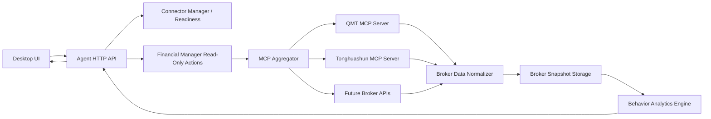

# AIASK Broker Read-Only Integration And Stock Behavior Analytics Development Plan

> Status: P0 implemented locally. Live trading remains disabled.
> Date: 2026-06-12
> Scope: connect user-authorized broker accounts in read-only mode, ingest real account/position/order/deal data, and build privacy-aware stock behavior analytics.

## 1. Executive Summary

AIASK can evolve into a real broker-account analytics product. The current repository already has the main architecture pieces:

- `packages/finance-mcp-servers` provides dedicated finance MCP servers for Tongdaxin, Tonghuashun, Eastmoney, and QMT.
- QMT and Tonghuashun already expose read-only account/position/order query tools.
- Agent Financial Manager already models a `broker-readonly` action group and keeps live order placement/cancellation blocked.
- Agent MCP wrapping keeps model-visible tools behind the `agent_*` facade and blocks non-read-only MCP actions.
- Agent session storage already has user activity and tool invocation audit tables with secret redaction.

The product should first ship as read-only broker data ingestion plus behavior analytics. Live trading must remain disabled until a separate risk, approval, and regulatory review is completed.

## 1.1 Implementation Status

P0 backend and Desktop integration are implemented:

- Agent exposes read-only broker readiness, sync, snapshot, and analytics HTTP routes.
- Broker snapshots and deterministic behavior analytics persist in Agent session storage.
- Desktop consumes only Agent HTTP and shows broker readiness, account metrics, position concentration, behavior metrics, and risk flags in Finance Lab.
- Mock Desktop API fixtures cover QMT read-only data and unconfigured Tonghuashun state.
- Tests cover consent, connector readiness, redaction, persistence, Desktop API routes, and Finance Lab rendering.

Live trading remains out of scope and blocked.

## 2. Current-State Evidence

### 2.1 Finance MCP Servers

Evidence:

- `packages/finance-mcp-servers/pyproject.toml` exposes:
  - `aiask-finance-tdx`
  - `aiask-finance-ths`
  - `aiask-finance-em`
  - `aiask-finance-qmt`
- `packages/finance-mcp-servers/src/aiask_finance_mcp/qmt/server.py` exposes:
  - `qmt_query_account`
  - `qmt_query_position`
  - `qmt_query_orders`
  - `qmt_query_stock_data`
  - guarded `qmt_place_order`
  - guarded `qmt_cancel_order`
- `packages/finance-mcp-servers/src/aiask_finance_mcp/tonghuashun/server.py` exposes:
  - `ths_query_balance`
  - `ths_query_position`
  - `ths_query_orders`
  - `ths_query_deals`
  - guarded `ths_place_order`
  - guarded `ths_cancel_order`

Important boundary:

- Read-only account, position, order, and deal tools can be used for analytics.
- Live place/cancel tools must remain behind broker-token guardrails and Agent-level stateful-action gates.

### 2.2 Agent Financial Manager

Evidence:

- `packages/agent/src/aiask_agent/server.py` has `broker-readonly` actions for THS/QMT account, position, and order reads.
- `live_trading_enabled` is `False`.
- `read_only_surfaces` includes THS/QMT read tools.
- `blocked_actions` includes THS/QMT place/cancel tools.

Implication:

- The current design already matches a safe first release: read real user brokerage data, analyze it, but do not trade.

### 2.3 MCP Aggregation And Tool Policy

Evidence:

- `packages/agent/src/aiask_agent/mcp_client.py` wraps financial MCP tools as `agent_mcp_*`.
- `packages/agent/src/aiask_agent/tool_registry.py` calls MCP tools only after side-effect classification.
- Non-read-only MCP actions are rejected with `MCP_STATEFUL_ACTION_BLOCKED` or routed toward intent-based approval.

Implication:

- Broker tools should be registered through MCP configuration and surfaced through Agent policy, not imported directly into Desktop or model-visible code.

### 2.4 Connector Inventory

Evidence:

- `packages/agent/src/aiask_agent/connector_manager.py` already lists financial connectors for Tongdaxin, Tonghuashun, Eastmoney, and QMT.
- The QMT connector expects `QMT_PATH` and `QMT_ACCOUNT`.
- The Tonghuashun connector expects `THS_CLIENT_PATH`.

Current local state from inspection:

- Current MCP config only has `akshare-local`.
- Dedicated QMT/THS finance MCP services are not currently registered.
- Current shell does not have QMT/THS broker environment variables configured.

## 3. Non-Negotiable Boundaries

- Desktop talks to Agent HTTP only.
- Desktop must not import finance MCP Python packages directly.
- Model-visible tools must stay behind the `agent_*` facade.
- Broker read tools must remain read-only.
- Live trading must remain disabled in this project phase.
- Do not log raw broker credentials, account passwords, broker tokens, API keys, cookies, or authorization headers.
- Do not print secret values in diagnostics; only report whether required variables are present.
- Broker account, position, order, deal, and behavior data are sensitive financial personal data and must require explicit user authorization.

## 4. Product Goals

### P0 Goals

- Let a user connect a local broker environment in read-only mode.
- Read account assets, positions, current-day orders, and current-day deals from supported brokers.
- Normalize broker-specific payloads into a shared schema.
- Persist broker snapshots with source, timestamp, user consent, and redaction metadata.
- Show broker connection/readiness status in Desktop through Agent HTTP.
- Generate first behavior analytics:
  - position concentration
  - cash ratio
  - industry/theme exposure if mapping data is available
  - turnover estimate
  - holding period estimate
  - trade frequency
  - win/loss distribution from available deal data
  - drawdown and volatility proxies where historical portfolio snapshots exist
- Preserve full audit trails for broker reads and analytics runs.

### P1 Goals

- Add multiple broker profiles per local user.
- Add scheduled read-only sync jobs with clear consent and pause controls.
- Add portfolio behavior timeline and change attribution.
- Add strategy-factory feedback links that compare actual user behavior against generated strategy plans.
- Add export/delete controls for broker-derived data.
- Add Plaid/Alpaca/Tradier/IBKR-style overseas read-only connectors if the product targets non-A-share accounts.

### P2 Goals

- Add behavior clustering and personalized coaching.
- Add risk preference inference with explicit user opt-in.
- Add privacy-preserving aggregate analytics.
- Add broker-agnostic investment diary and after-action review workflows.

## 5. Recommended Technical Architecture



Core rule:

- All broker data enters through read-only broker adapters and is normalized before storage or analytics.

## 6. Data Model

### 6.1 Broker Profile

Recommended table or storage object: `broker_profiles`

Fields:

- `broker_profile_id`
- `user_id`
- `provider`: `qmt`, `tonghuashun`, `alpaca`, `tradier`, `ibkr`, `plaid`, etc.
- `display_name`
- `account_ref_hash`
- `market`: `cn_a`, `us`, `hk`, etc.
- `read_only_enabled`
- `write_enabled`: default `false`
- `consent_status`
- `consent_version`
- `created_at`
- `updated_at`
- `last_sync_at`
- `status`
- `error_code`
- `metadata_json`

Do not store raw account passwords or raw broker tokens.

### 6.2 Account Snapshot

Recommended table: `broker_account_snapshots`

Fields:

- `snapshot_id`
- `broker_profile_id`
- `user_id`
- `provider`
- `account_ref_hash`
- `currency`
- `total_asset`
- `cash_available`
- `market_value`
- `frozen_cash`
- `buying_power`
- `source_tool`
- `source_run_id`
- `observed_at`
- `payload_json_sanitized`
- `created_at`

### 6.3 Position Snapshot

Recommended table: `broker_position_snapshots`

Fields:

- `snapshot_id`
- `broker_profile_id`
- `user_id`
- `symbol`
- `exchange`
- `name`
- `quantity`
- `available_quantity`
- `cost_basis`
- `last_price`
- `market_value`
- `unrealized_pnl`
- `unrealized_pnl_pct`
- `position_pct`
- `observed_at`
- `payload_json_sanitized`
- `created_at`

### 6.4 Order Snapshot

Recommended table: `broker_order_snapshots`

Fields:

- `snapshot_id`
- `broker_profile_id`
- `user_id`
- `order_ref_hash`
- `symbol`
- `side`
- `order_type`
- `price`
- `quantity`
- `filled_quantity`
- `status`
- `submitted_at`
- `updated_at`
- `observed_at`
- `payload_json_sanitized`
- `created_at`

### 6.5 Deal / Fill Snapshot

Recommended table: `broker_deal_snapshots`

Fields:

- `snapshot_id`
- `broker_profile_id`
- `user_id`
- `deal_ref_hash`
- `order_ref_hash`
- `symbol`
- `side`
- `price`
- `quantity`
- `amount`
- `fee`
- `occurred_at`
- `observed_at`
- `payload_json_sanitized`
- `created_at`

### 6.6 Behavior Analytics Result

Recommended table: `broker_behavior_analytics`

Fields:

- `analytics_id`
- `broker_profile_id`
- `user_id`
- `period_start`
- `period_end`
- `metrics_json`
- `signals_json`
- `risk_flags_json`
- `source_snapshot_ids_json`
- `model_version`
- `created_at`

## 7. API Surface

All routes should live in Agent and be consumed by Desktop through `desktop/src/services/aiaskApi.ts`.

### P0 Routes

- `GET /v1/desktop/broker-readiness`
  - Lists configured broker connectors, missing env names, readiness, and read-only status.
- `POST /v1/desktop/broker/sync`
  - Starts a read-only broker sync for a selected provider/profile.
  - Requires user consent and read-only mode.
- `GET /v1/desktop/broker/accounts`
  - Returns latest sanitized account snapshots.
- `GET /v1/desktop/broker/positions`
  - Returns latest sanitized position snapshots.
- `GET /v1/desktop/broker/orders`
  - Returns latest sanitized order/deal snapshots.
- `POST /v1/desktop/broker/analytics/run`
  - Runs behavior analytics over selected snapshots.
- `GET /v1/desktop/broker/analytics/latest`
  - Returns latest behavior analytics result.

### Response Requirements

Every response should include:

- `object`
- `success`
- `data`
- `error`
- `error_code`
- `secrets_redacted: true`
- `source_chain`
- `read_only: true`

## 8. Implementation Plan

### Phase 0: Readiness And Registration Audit

Tasks:

- Add a broker readiness service that combines:
  - `ConnectorManager`
  - `MCPAggregator.registration_diagnostics()`
  - finance MCP tool discovery
  - environment variable presence checks
- Report QMT and THS readiness without exposing values.
- Mark a connector as ready only when:
  - required environment variables are present
  - MCP server is registered
  - expected read-only tools are discovered
  - live trading remains disabled

Acceptance:

- QMT shows `missing_env` when `QMT_PATH` or `QMT_ACCOUNT` is absent.
- THS shows `missing_env` when `THS_CLIENT_PATH` is absent.
- Dedicated QMT/THS MCP tools appear only after registration/discovery.
- No secret values are returned.

### Phase 1: QMT Read-Only Sync

Tasks:

- Register `aiask-finance-qmt` as a stdio MCP server through Agent MCP config.
- Add a read-only sync orchestration path:
  - call `qmt_query_account`
  - call `qmt_query_position`
  - call `qmt_query_orders`
  - optionally call `qmt_query_stock_data` only for enrichment
- Normalize QMT payloads into shared snapshot objects.
- Persist sanitized snapshots.
- Add negative tests for missing config and connection failure.

Acceptance:

- With no QMT env, API returns structured readiness failure.
- With QMT env and MiniQMT connected, read-only snapshots are persisted.
- `qmt_place_order` and `qmt_cancel_order` remain unavailable from Financial Manager V1.

### Phase 2: Tonghuashun Read-Only Sync

Tasks:

- Register `aiask-finance-ths` as a stdio MCP server through Agent MCP config.
- Add read-only sync:
  - `ths_query_balance`
  - `ths_query_position`
  - `ths_query_orders`
  - `ths_query_deals`
- Normalize THS payloads into the same shared schema.
- Add connector health messages for easytrader dependency, client path, and client login state.

Acceptance:

- Missing `easytrader` returns a user-actionable dependency error.
- Missing `THS_CLIENT_PATH` returns structured readiness failure.
- Successful THS reads produce normalized snapshots.
- THS live place/cancel tools remain blocked.

### Phase 3: Storage And Retention

Tasks:

- Add migrations for broker profiles, account snapshots, positions, orders, deals, and analytics.
- Store only sanitized raw payload summaries.
- Hash account/order/deal references where possible.
- Add retention controls aligned with existing `user_data_policies`.
- Add export/delete support for broker-derived data.

Acceptance:

- Broker data can be deleted per user/profile.
- Audit rows remain sanitized.
- Tool invocation rows include `secrets_redacted = true`.

### Phase 4: Behavior Analytics Engine

Tasks:

- Implement deterministic analytics first:
  - concentration by position
  - cash ratio
  - top holdings
  - single-name exposure
  - order frequency
  - turnover estimate
  - buy/sell imbalance
  - average holding period estimate
  - realized trade summary from available deals
  - repeated loss pattern flags
  - chase-high / sell-low proxy where price history is available
- Keep model-based narrative optional and clearly marked as analysis, not investment advice.
- Add snapshot provenance to every metric.

Acceptance:

- Analytics run succeeds with only account + position data.
- Analytics improves when orders/deals are present.
- Each metric declares required inputs and missing-data limitations.

### Phase 5: Desktop UX

Tasks:

- Add Broker Read-Only panel under financial/connector surfaces.
- Show:
  - connector readiness
  - missing env names
  - last sync time
  - latest account summary
  - holdings table
  - order/deal history summary
  - behavior analytics cards
  - consent and pause controls
- Keep live trading controls absent or visibly disabled.

Acceptance:

- Desktop uses Agent HTTP only.
- User can see why a broker is not ready.
- User can trigger a read-only sync after consent.
- User can pause/delete broker-derived data.

### Phase 6: Overseas Broker Options

Tasks:

- Treat Alpaca and Tradier as direct API broker adapters.
- Treat IBKR Client Portal API as a more complex optional connector.
- Treat Plaid Investments as a read-only aggregation connector where available.
- Keep separate provider modules and normalized output contracts.

Acceptance:

- Overseas broker support does not weaken A-share QMT/THS guardrails.
- Each provider has an explicit auth, consent, and data retention story.

## 9. Security And Compliance

Required controls:

- Explicit user consent before broker sync.
- Clear read-only mode indicator.
- No raw broker credentials in SQLite, logs, HTTP responses, run events, or tool invocation summaries.
- Redact keys containing:
  - `api_key`
  - `authorization`
  - `broker_token`
  - `password`
  - `secret`
  - `token`
- Keep live trading disabled.
- Keep per-call broker token requirements on existing live tools.
- Add data export and delete.
- Add retention defaults:
  - detailed broker snapshots: configurable, default 180 days
  - analytics summaries: configurable, default 365 days
  - trade-risk audit: longer retention if live trading is ever separately approved

Compliance note:

- Real account, position, order, deal, and financial behavior data should be treated as sensitive personal financial information.
- Production use requires a privacy notice, separate authorization, purpose limitation, least-necessary collection, and revocation/deletion controls.

## 10. Test Plan

### Unit Tests

- Finance MCP read-only tool schemas remain stable.
- Trade-risk tools reject missing/mismatched broker tokens.
- Normalizers handle QMT and THS payload shape differences.
- Secret redaction covers broker fields.
- Analytics metrics handle missing orders/deals gracefully.

### Agent Tests

- Broker readiness returns missing env without leaking values.
- Financial Manager broker live actions remain blocked.
- MCP stateful actions remain blocked by Agent policy.
- Read-only sync records tool invocation audit.
- Broker analytics returns provenance and limitations.

### Desktop Tests

- Broker panel shows missing setup steps.
- Consent is required before sync.
- Sync loading/error/success states render correctly.
- Live trading controls are absent or disabled.
- Delete/export controls call Agent HTTP routes only.

### Manual Smoke Tests

- No broker env configured:
  - readiness shows missing config
  - sync is rejected safely
- QMT configured and MiniQMT logged in:
  - account/position/order reads work
  - snapshots persist
  - analytics runs
- THS configured and client logged in:
  - balance/position/order/deal reads work
  - snapshots persist
  - analytics runs

## 11. Suggested Verification Commands

Use focused tests first:

```powershell
$env:PYTHONPATH='packages/finance-mcp-servers/src;packages/agent/src'
uv run pytest packages/finance-mcp-servers/tests/test_trade_guard.py packages/finance-mcp-servers/tests/test_mcp_protocol.py packages/agent/tests/test_financial_manager_desktop_api.py packages/agent/tests/test_mcp_client.py -q
```

When adding Agent APIs:

```powershell
$env:PYTHONPATH='packages/agent/src'
uv run pytest packages/agent/tests/test_financial_manager_desktop_api.py packages/agent/tests/test_mcp_client.py -q
```

When adding Desktop UI:

```powershell
cd desktop
npm test -- --run
```

## 12. Rollout Checklist

- QMT/THS read-only MCP registration documented.
- Broker readiness route added.
- Broker sync route added.
- Normalized broker storage added.
- Behavior analytics engine added.
- Desktop panel added.
- Consent, pause, export, and delete controls added.
- Live trading still disabled.
- Secret redaction verified.
- Focused tests passing.
- Manual smoke checklist completed on a machine with the relevant broker client installed and logged in.

## 13. Open Decisions

- Whether broker snapshots should live in Agent SQLite, Quant Core storage, or a shared finance storage package.
- Whether QMT should be the only P0 real-account connector.
- Whether Tonghuashun should be P1 due to UI automation fragility.
- Whether overseas broker support belongs in `packages/akshare-mcp` live broker adapters or a separate broker connector package.
- How much broker-derived data should be eligible for learning/memory features, even with user opt-in.

## 14. Recommended P0 Cut

Build only this first:

- QMT read-only readiness.
- QMT read-only sync.
- Broker account/position/order snapshot storage.
- Deterministic behavior analytics.
- Desktop read-only broker panel.
- Consent, pause, delete.
- Tests proving live trading remains blocked.

This creates a useful real-account analytics product without increasing live trading risk.
