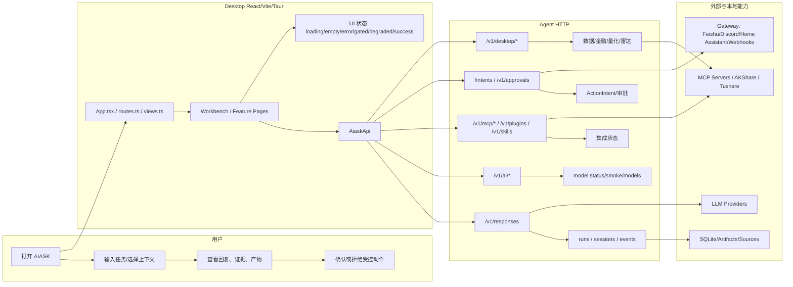
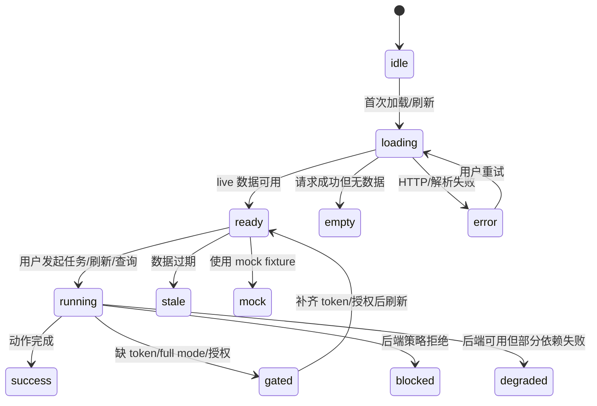
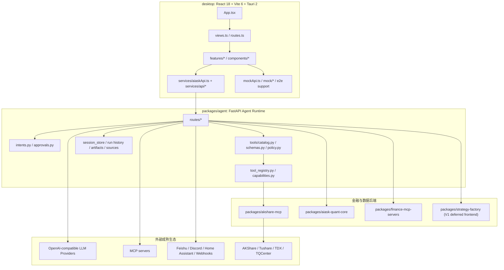

# AIASK 项目开发技术规范 - V1 前端产品化

## 文档信息

| 项目 | 内容 |
|---|---|
| 项目名称 | AIASK V1 前端产品化 |
| 文档版本 | 1.0.0 |
| 创建日期 | 2026-06-21 |
| 适用范围 | `desktop` React/Vite/Tauri 前端、Agent HTTP 契约、V1 产品化验收 |
| 主文档定位 | 根目录权威规范；旧功能文档和旧开发方案作为来源材料，不再继续无序追加 |
| 代码基准 | 当前仓库实码；以 `desktop/src`、`desktop/package.json`、`packages/agent/src/aiask_agent/routes/*`、`desktop/src/services/aiaskApi.ts` 为主证据 |
| 作者 | AIASK 产品化整理 |
| 审批人 | 待项目负责人确认 |

### 变更记录

| 版本 | 日期 | 变更内容 | 变更人 |
|---|---|---|---|
| 1.0.0 | 2026-06-21 | 按《项目开发技术规范》模板重建 V1 前端产品化规范，补齐代码事实、成熟技术调研、功能分解、流程、架构、API、前端、错误和测试 | Codex |

### 术语定义

| 术语 | 定义 | 代码证据 |
|---|---|---|
| Desktop | AIASK 桌面前端，负责 UI、路由、状态、mock/live 展示和用户交互 | `desktop/src/App.tsx`、`desktop/src/views.ts`、`desktop/package.json` |
| Agent HTTP | Desktop 唯一后端访问边界；前端不得直接导入 Python、MCP、manager 或数据库 | `desktop/src/services/aiaskApi.ts`、`desktop/src/services/api/*` |
| Agent Route | Agent 对 Desktop 暴露的 FastAPI/ASGI HTTP 契约 | `packages/agent/src/aiask_agent/routes/*` |
| `agent_*` 工具 | 模型可见工具门面；原始 manager 名称不得直接暴露给模型或前端主流程 | `packages/agent/src/aiask_agent/tools/catalog.py`、`tool_registry.py`、`tools/policy.py` |
| ActionIntent | 写入、外部投递、金融风险、插件/任务等副作用动作的审批意图 | `packages/agent/src/aiask_agent/routes/intents.py`、`desktop/src/services/aiaskApi.ts` |
| Control Token | 高权限操作令牌；用于区分只读状态和受控写入/管理动作 | `desktop/src/hooks/useAppConnectionSettings.ts`、Agent intent/approval routes |
| Mock Mode | 前端或 e2e 使用的模拟数据；只能证明 UI 行为，不能证明 live backend 生产可用 | `desktop/src/mockApi.ts`、`desktop/e2e/support/*` |
| V1 Deferred | 后端或兼容代码可以存在，但第一版前端不作为产品入口展示 | `desktop/src/routes.ts` 的 `V1_DEFERRED_VIEWS` |
| 四工厂 | `strategy-factory`、`factor-factory`、`incubation`、`factory-events` 四类工厂产品入口 | `desktop/src/types.ts` 仍保留类型；`desktop/src/routes.ts` 已 deferred |

### 当前代码事实总览

| 领域 | 当前事实 | V1 规范结论 |
|---|---|---|
| 技术栈 | `desktop/package.json` 使用 React 18、Vite 6、TypeScript、Tauri 2、`lucide-react`、Vitest/jsdom、Playwright、TanStack Table/Virtual、Lightweight Charts | 规范必须围绕现有栈写，不引入未使用框架作为默认方案 |
| 前端入口 | `desktop/src/App.tsx` lazy 加载各功能页；`views.ts` 注册视图；`routes.ts` 做路由映射 | V1 产品入口以 view/route/renderer 三处同时存在为准 |
| API 边界 | `AiaskApi` 包装 health、AI、runs、sessions、intents、MCP、Gateway、data、finance、quant、jobs、learning/RL 等 | 新增能力必须先补 Agent HTTP 与 `AiaskApi`，不允许页面直接调 Python/MCP |
| Agent 路由 | `packages/agent/src/aiask_agent/routes` 已按 ai、mcp、gateway、desktop_finance、desktop_data、run_history、intents 等拆分 | 文档中所有 endpoint 必须回指 route 家族 |
| V1 四工厂边界 | `routes.ts` 通过 `V1_DEFERRED_VIEWS` 排除四工厂正向路由，并将旧路径别名回 `finance-lab` | V1 不展示四工厂；兼容代码、mock、后端事实只能折叠为内部/deferred 证据 |
| 股票雷达 | `stock-radar` 已有 route、App renderer、API client 和 Agent `/v1/desktop/stock-radar/*` | 股票雷达是 V1 金融发现入口，不属于四工厂展示 |

---

## 1. 功能设计

### 1.1 需求背景与价值

**问题陈述**

AIASK 当前代码已经覆盖 Agent 对话、模型配置、MCP、插件技能、Gateway、数据、金融、量化、自动化、运行事件等大量能力，但旧文档存在三个问题：

1. 文档结构不统一，PM 不容易判断第一版到底能演示什么。
2. 部分描述只写“要实现什么”，缺少接口、状态、错误、验收和代码落点。
3. 后端存在、mock 可用、前端产品入口、live 可用四种状态容易混淆，尤其是四工厂边界。

**解决方案**

以本规范作为 V1 前端产品化主文档，把功能拆成用户故事、功能编号、业务规则、流程、架构、API、前端设计、错误码和测试用例。所有“已存在”必须回指代码路径；所有“待开发”必须写清落地文件和验收方式；所有成熟技术参考必须写清采用原则和不采用边界。

**业务价值**

| 对象 | 价值 |
|---|---|
| 产品经理 | 能按用户任务链评审范围、验收演示脚本和 V1/Deferred 边界 |
| 开发团队 | 能按编号拆任务，知道改哪些前端/API/mock/test 文件 |
| QA | 能按状态机、错误码和测试用例覆盖正常、异常、权限、降级、负向范围 |
| 运维/交付 | 能区分 mock/live、配置缺失、控制令牌缺失、外部平台不可用和金融风险阻断 |

### 1.2 用户角色与用户故事

| 编号 | 优先级 | 用户故事 | 成功标准 |
|---|---|---|---|
| US-WB-001 | P0 | 作为普通使用者，我希望打开应用后直接进入 AI 工作台，以便输入任务并得到可追踪回答 | 首屏是 Workbench，能看到模型状态、输入区、运行状态和近期会话 |
| US-WB-002 | P0 | 作为研究用户，我希望 AI 回复不只是 Markdown，而是展示模型、工具、来源、产物和审批，以便追踪结论依据 | 回复和右侧上下文能显示 run、tool invocation、artifact、source、intent |
| US-MODEL-001 | P0 | 作为配置用户，我希望看到模型 provider、base URL、model 和 smoke test 状态，以便知道为什么不能发送任务 | `/v1/ai/status`、`/v1/ai/models`、`/v1/ai/smoke` 状态可见；secret 不回显 |
| US-RUN-001 | P0 | 作为长期用户，我希望能恢复、搜索、归档会话并查看运行事件，以便继续未完成任务 | Sessions/Runs/Artifacts/Sources 可查，归档默认隐藏且可筛选 |
| US-MCP-001 | P0 | 作为高级用户，我希望管理 MCP tools/resources/prompts/OAuth，以便把外部上下文接入任务 | MCP 页面按 servers/tools/resources/prompts/OAuth 分层，资源读取和 OAuth 受 control token 约束 |
| US-PLUGIN-001 | P1 | 作为扩展用户，我希望查看 Skills 和 Plugins 状态、命令、工具测试，以便确认扩展是否可用 | 列表、详情、测试、启停/安装等动作区分只读和受控 |
| US-GATEWAY-001 | P1 | 作为运营用户，我希望外部平台投递先预览再审批，以便避免误发消息 | Gateway send 和 Webhook trigger 只创建 ActionIntent，不直接投递 |
| US-DATA-001 | P0 | 作为金融研究用户，我希望看到数据源、数据库、新鲜度和同步计划，以便判断分析结果可信度 | 数据状态、质量门禁、sync plan、source test 均可见且不泄露 token |
| US-RADAR-001 | P0 | 作为金融研究用户，我希望独立使用股票雷达查看候选、摘要、运行/推送/调度意图，以便发现研究对象 | `stock-radar` 可路由，run/push/schedule 均进入受控意图 |
| US-FIN-001 | P0 | 作为金融用户，我希望金融经理台和量化研究只做只读分析和受控意图，以便避免误认为可实盘交易 | Financial Manager、Quant、Broker read-only 明确只读、dry-run、blocked 或 intent |
| US-OPS-001 | P0 | 作为交付人员，我希望 Readiness/Health/Settings 显示缺失配置和修复路径，以便定位不可用原因 | health、readiness、settings、token、mode、mock/live 状态清晰 |

### 1.3 功能分解与优先级

| 功能编号 | 功能点 | 优先级 | 当前代码依据 | V1 验收标准 |
|---|---|---|---|---|
| WB-F001 | 工作台默认入口与任务输入 | P0 | `desktop/src/components/WorkbenchView.tsx`、`useAgentWorkbench.ts` | 打开应用即可输入任务，Agent 离线/模型不可用时显示原因 |
| WB-F002 | AI 回复证据化展示 | P0 | `TaskPanels.tsx`、`InspectorPanel.tsx`、run history routes | 回复关联 run/events/tools/artifacts/sources/intent |
| WB-F003 | 文件/上下文引用 | P1 | 当前无完整 upload contract；已有 artifacts/sources 读取 | V1 不假装已支持真实上传；先支持引用/证据展示，真上传需 Agent HTTP 合约 |
| MODEL-F001 | 模型状态与配置 | P0 | `features/models/ModelsWorkspace.tsx`、`routes/ai.py` | status/models/smoke/config 可见；key 不回显 |
| RUN-F001 | 会话列表、消息、归档 | P0 | `SessionsPage.tsx`、`routes/hermes.py`、`run_control.py` | 搜索/恢复/归档/undo 状态可追踪 |
| RUN-F002 | 运行事件和产物来源 | P0 | `RunsEventsPage.tsx`、`ArtifactsPage.tsx`、`routes/run_history.py` | 事件过滤、artifact/source 内容读取、外部 URL 边界明确 |
| MCP-F001 | MCP 服务和工具资源提示词 | P0 | `McpConnectorsPage.tsx`、`routes/mcp.py` | tools/resources/prompts/OAuth 分层；读取失败有错误码 |
| MCP-F002 | Connectors 列表、详情、测试 | P1 | `routes/connectors.py`、`services/api/integrations.ts` | list/detail/test 使用 control token 或禁用态 |
| PLUGIN-F001 | Skills 列表和应用 | P1 | `PluginsSkillsPage.tsx`、`routes/plugins_skills.py` | 技能可被任务上下文引用；变更动作受控 |
| PLUGIN-F002 | Plugins 命令/工具测试 | P1 | `plugins_skills.py`、`pluginCommands()` | command/tool test 可见，安装/启停受控 |
| GATEWAY-F001 | Gateway 状态、平台、消息、目录 | P1 | `GatewayPage.tsx`、`routes/gateway.py` | status/platforms/messages/directory/daemon 可见 |
| GATEWAY-F002 | Gateway 发送和 Webhook 触发 | P1 | `gatewaySendIntent()`、`webhookTriggerIntent()` | preview -> intent -> approval；不直接外部投递 |
| DATA-F001 | 数据状态与质量门禁 | P0 | `DataSyncWorkspace.tsx`、`routes/desktop_data.py` | status/freshness/missing/stale/gate 可见 |
| DATA-F002 | 数据源配置与测试 | P0 | `StockDataSourcesPanel`、`/v1/desktop/stock-data-sources` | 只显示配置状态和 env 名，不展示 secret |
| DATA-F003 | 同步计划 | P0 | `/v1/desktop/data/sync-plan` | 用户知道是生成计划或创建意图，不是静默同步 |
| RADAR-F001 | 股票雷达状态和候选 | P0 | `features/stock-radar/StockRadarWorkspace.tsx`、`desktop_finance.py` | status/candidates/digest 可查看 |
| RADAR-F002 | 雷达运行、推送、调度意图 | P0 | `stockRadarRunIntent()`、`stockRadarPushDigestIntent()`、`stockRadarScheduleUpdateIntent()` | 三类动作只创建 ActionIntent |
| FIN-F001 | Financial Manager 只读查询和受控意图 | P0 | `FinancialManagerWorkspace.tsx`、`desktop_finance.py` | catalog/status/query/intent 边界清楚 |
| FIN-F002 | Quant Research 运行与报告 | P0 | `QuantResearchWorkspace.tsx`、`/v1/desktop/quant/*` | preset/run/report 可追踪，报告不跳四工厂 |
| FIN-F003 | Broker read-only | P1 | broker readiness/accounts/positions/orders routes | 只读展示；实盘交易入口 blocked |
| OPS-F001 | Readiness/Health | P0 | `ReadinessHealthPage.tsx`、`routes/health.py`、`hermes_status.py` | next action 不跳四工厂；缺配置可定位 |
| OPS-F002 | Settings/Mode/Token | P0 | `SettingsWorkspace.tsx`、`useAppConnectionSettings.ts` | api token/control token/full mode/mock/live 状态明确 |

### 1.4 业务规则与边界

| 规则 | 说明 | 验收方式 |
|---|---|---|
| Desktop 只走 Agent HTTP | 前端不得 import Python、不得调用 MCP server/AKShare manager/数据库 | `rg` 检查前端 import；代码审查 |
| 模型可见工具必须是 `agent_*` | 原始 manager 名称、动态插件/MCP 工具不得绕过 facade | 工具目录和测试检查 `agent_` 前缀 |
| V1 不展示四工厂产品入口 | 不展示 `strategy-factory`、`factor-factory`、`incubation`、`factory-events` 导航、卡片、主流程按钮 | 路由测试、e2e、文案扫描 |
| 兼容代码不等于产品展示 | 类型、mock、旧测试、后端路由可以保留，但必须标记 internal/deferred | 文档和 UI 文案不得把兼容项写成 V1 必做入口 |
| 只读与写入分离 | status/list/query 可只读；sync、send、trigger、plugin change、financial intent 必须受控 | API 表必须写 token、side_effect、intent |
| Secret 不可见 | 文档和 UI 只展示 env 名、configured/missing/expired，不展示 key/token 值 | UI 测试和人工验收 |
| Mock 不等于 live | mock e2e 只证明交互；live smoke 需要真实 Agent/provider/data/platform | 发布说明和测试报告分列 |
| 金融交易不开放 | V1 可展示 broker read-only、风险、意图；不得提供实盘下单/撤单产品入口 | 金融页负向验收 |

---

## 2. 流程设计

### 2.1 核心业务流程图



### 2.2 首次可用流程

| 步骤 | 用户 | Desktop | Agent | 异常路径 |
|---|---|---|---|---|
| 1 | 打开应用 | 读取 endpoint/token/profile/mode/health | `/health`、`/v1/desktop/settings/status` | Agent 离线时进入 offline/degraded，不隐藏输入区 |
| 2 | 查看模型状态 | Workbench/Models 显示 provider/model/smoke | `/v1/ai/status`、`/v1/ai/models` | key 缺失只显示 env 名，不显示 secret |
| 3 | 输入任务 | Composer 保存草稿，附加上下文 | 无或预检 | 附件/上下文不可用时提示，不阻塞纯文本 |
| 4 | 发送 | `AiaskApi.response()` | `POST /v1/responses` | HTTP 失败显示错误码、trace 或 request id |
| 5 | 查看结果 | 展示 reply/events/tools/artifacts/sources | run/session/history routes | 工具失败进入 tool error 卡片，不混在自然语言中 |
| 6 | 受控动作 | 打开审批/意图区 | `/intents`、`/v1/approvals` | 无 control token 时按钮 disabled 或 blocked reason |

### 2.3 金融研究流程

| 步骤 | 页面 | API | 责任 |
|---|---|---|---|
| 数据预检 | Data / Workbench context | `/v1/desktop/data/status`、`agent_quant_data_gate` | 判断数据新鲜度、缺失、质量门禁 |
| 发现标的 | Stock Radar | `/v1/desktop/stock-radar/status|candidates|digest` | 只读查看候选和摘要 |
| 运行雷达 | Stock Radar | `stockRadarRunIntent()` -> `/intents` | 创建受控意图，不直接调策略/工厂 |
| 深度分析 | Financial Manager / Quant | `/v1/desktop/financial-manager/*`、`/v1/desktop/quant/*` | 只读分析、研究运行、报告证据 |
| 外部投递 | Gateway/Webhook | `gatewaySendIntent()`、`webhookTriggerIntent()` | preview -> intent -> approval |

### 2.4 状态机

所有 V1 页面必须至少实现并文档化以下状态：



| 状态 | UI 要求 | API/数据要求 |
|---|---|---|
| `idle` | 首屏不空白，有主操作和最近记录 | 不要求已完成请求 |
| `loading` | 显示加载骨架或 spinner，按钮防重复 | 只允许当前请求改变状态 |
| `ready` | 展示数据、来源、更新时间、权限 | 响应中有 `object/data/status` 或 envelope |
| `empty` | 说明为什么为空和下一步 | HTTP 成功，data/count 为空 |
| `error` | 展示用户可理解错误和开发可定位摘要 | 保留 `error_code`、HTTP status、trace/audit id |
| `degraded` | 黄灯，不夸大可用性 | 响应含 partial/warnings/missing/degraded |
| `gated` | 禁用高风险按钮，展示需要 token/授权 | control/full/OAuth 等门禁缺失 |
| `blocked` | 明确被策略拒绝，不提供绕过 | 后端返回 blocked reason |
| `stale` | 展示过期时间和刷新入口 | freshness/max_stale_days 可见 |
| `mock` | 清楚标记 mock，不写成生产可用 | source 为 mock fixture 或本地 mock server |

### 2.5 异常路径补全

| 异常 | 前端表现 | 后端/API 处理 | 验收 |
|---|---|---|---|
| Agent 离线 | 顶部/设置显示 offline；功能页可进入 degraded | 请求失败统一归类 network/unavailable | mock e2e 与离线手测 |
| 模型认证失败 | Workbench 禁止发送或发送前提示 | `/v1/ai/smoke` 返回 auth 类错误 | 不泄露 key，只展示 provider/env |
| control token 缺失 | 写入/发送/触发/调度按钮 disabled | 受控 route 或 intent 返回 gated | UI 显示补齐入口 |
| MCP 资源读取失败 | resource 行显示 error，可重试 | `/v1/mcp/resources/read` 返回结构化 error | server、uri、error_code 可见 |
| Gateway 发送失败 | 消息列表显示 failed/retry | `/v1/gateway/messages`、retry route | retry 不跳过审批边界 |
| 数据过期 | 数据页黄灯，分析页显示 stale | `/v1/desktop/data/status` 返回 stale/missing | 量化/雷达不把 stale 写成 ready |
| 外部 URL source | 直接按外部链接处理 | 不通过 Agent evidence helper 伪造 fetch | TaskPanels 测试覆盖 |
| 四工厂旧路径 | 路由回 `finance-lab` 或工作台 | `routeToView` 别名处理 | 不显示四工厂页面 |

---

## 3. 架构设计

### 3.1 系统全景图



### 3.2 模块划分与职责

| 模块 | 职责 | 不负责 |
|---|---|---|
| `desktop/src/App.tsx` | 应用壳、route match、renderer、全局状态传递 | 后端策略、MCP 直连、数据库读写 |
| `desktop/src/views.ts` | 产品视图注册、导航分组、图标、显示属性 | 判断后端是否授权执行 |
| `desktop/src/routes.ts` | route -> view、view -> route、V1 deferred alias | 删除后端能力 |
| `desktop/src/services/aiaskApi.ts` | Agent HTTP client 聚合入口 | 直接调用 Python 或外部平台 |
| `desktop/src/mockApi.ts` | mock/live UX、本地 e2e fixture | 证明 live 可用 |
| `packages/agent/src/aiask_agent/routes/*` | Desktop-facing HTTP 契约 | 前端 UI 逻辑 |
| Agent `tools/*` 与 `tool_registry.py` | `agent_*` 工具目录、schema、policy、MCP/manager 包装 | 暴露 raw manager 名称 |
| `packages/akshare-mcp` | 金融数据、MCP、manager plane、数据同步与研究能力 | Desktop UI |
| `packages/finance-mcp-servers` | 外部金融软件 MCP server 与 broker guardrail | V1 实盘交易 UI |

### 3.3 核心设计决策

| ADR | 问题 | 方案 | 理由 | 权衡/验收 |
|---|---|---|---|---|
| ADR-001 Desktop 只走 Agent HTTP | 前端能否直接调用 Python/MCP/DB？ | 禁止；所有能力通过 `AiaskApi` 和 Agent routes | 保持安全边界、测试边界、跨平台可控 | `rg` 检查前端 import；新增 API 必须更新 mock/test |
| ADR-002 模型可见工具必须 `agent_*` | 动态 MCP/manager 工具是否可直接暴露？ | 不可；Agent catalog/schema/registry 包装 | 防名称混淆、权限绕过和 raw manager 泄露 | 工具目录扫描 raw manager token |
| ADR-003 副作用动作走 ActionIntent | 外部投递、同步、金融动作是否可一键执行？ | preview -> intent -> approval/confirm | 保留用户确认、审计和 control token 门禁 | e2e 断言不直接发送/触发 |
| ADR-004 V1 不展示四工厂 | 后端存在四工厂是否等于 V1 展示？ | 不等于；路由和导航 deferred | 第一版产品聚焦工作台、数据、金融只读、雷达、集成、自动化 | 路由旧路径不打开四工厂 |
| ADR-005 Mock 与 live 分层 | mock e2e 通过能否写成生产可用？ | 不能；文档、UI、验收分 mock/live | 防止交付误解 | 测试报告列 mock/live/status |
| ADR-006 错误采用结构化 Problem Details 思路 | 错误信息如何统一？ | HTTP status + `error_code` + 用户消息 + trace/audit id；参考 RFC 9457 | 便于前后端、QA 和运维定位 | 不能暴露 secret 或 stack trace |

---

## 4. 功能说明：接口与数据

### 4.1 API 接口设计规范

| 规则 | AIASK V1 约定 |
|---|---|
| 协议 | 本地/内网 Agent HTTP；生产打包由 Tauri/Agent 配置决定 |
| 版本 | 现有 route 以 `/v1/*` 为主，ActionIntent 保留 `/intents` |
| 客户端 | 只允许 `desktop/src/services/aiaskApi.ts` 和 `desktop/src/services/api/*` 发起 |
| 请求编码 | JSON 为默认；如果未来支持文件上传，必须先定义 Agent upload contract |
| 认证 | 只读使用 API token；管理/写入/外部投递/高权限使用 control token 或 approval |
| 响应 | 保留当前 `object/data/status` 或 `ToolEnvelope` 风格，不隐藏 `error_code/meta/side_effect/secrets_redacted` |
| Secret | 请求可写入 secret 字段，但响应和文档不得展示真实值 |

通用 envelope 参考：

```json
{
  "success": true,
  "data": {},
  "error": null,
  "error_code": null,
  "meta": {
    "trace_id": "trace_xxx",
    "audit_event_id": "audit_xxx",
    "side_effect": {
      "level": "read_only",
      "confirmation_required": false,
      "idempotent": true
    }
  },
  "secrets_redacted": true
}
```

### 4.2 接口详细定义

| 功能 | Method/Endpoint | Token | Request | Response 关键字段 | Side effect | 前端方法 |
|---|---|---|---|---|---|---|
| 健康检查 | `GET /health`、`GET /health/detailed` | API | 无 | `status/service/runtime/tools/control` | 只读 | `health()`、`healthDetailed()` |
| AI 状态 | `GET /v1/ai/status` | API | 无 | provider/model/configured/errors | 只读 | `aiStatus()` |
| AI 配置保存 | `PATCH /v1/ai/config` | control | provider/base_url/model/key | secrets_redacted/status | 配置写入 | `aiConfigSave()` |
| AI 冒烟 | `POST /v1/ai/smoke` | API/control 视后端策略 | provider/model | success/error_code/latency | 外部 provider 调用 | `aiSmoke()` |
| 模型列表 | `GET /v1/ai/models` | API | provider/base_url | models/status | 只读/外部查询 | `aiModels()` |
| 创建回复 | `POST /v1/responses` | API | prompt/model/session/context | response/run/session/events | 可能触发工具，后端策略判定 | `response()` |
| 获取会话 | `GET /v1/hermes/sessions` | API | user/limit/include_archived | sessions | 只读 | `sessionsList()` |
| 会话消息 | `GET /v1/sessions/{id}/messages` | API | limit | messages | 只读 | `sessionMessages()` |
| 归档会话 | `POST /v1/sessions/{id}/archive` | control | reason | status/session | 状态写入 | `sessionArchive()` |
| 运行事件 | `GET /v1/runs/{id}/events` | API | filters | events | 只读 | `runEvents()` |
| 运行控制 | `/v1/runs/{id}/stop|cancel|steer` | control | action payload | status | 受控运行写入 | `runStop()` 等 |
| 工具目录 | `GET /v1/tools` | API | 无 | `agent_*` tools | 只读 | `tools()` |
| 调用工具 | `POST /v1/tools/{tool}` | API/control 视工具 | tool payload | ToolEnvelope | 按工具 side_effect | `callTool()` |
| 意图创建 | `POST /intents` | control | action/params/rationale | intent_id/status | 创建审批对象 | `createActionIntent()` |
| 意图确认/拒绝 | `POST /intents/{id}/confirm|deny` | control | reason | result/status | 执行或拒绝受控动作 | `confirmIntent()`、`denyIntent()` |
| 审批队列 | `GET /v1/approvals` | control | status/limit | approvals | 只读 | `approvalsList()` |
| MCP 列表 | `GET /v1/mcp/servers|tools|resources|prompts|oauth_status` | API/control | filters | items/warnings | 只读 | `mcp*()` |
| MCP 资源读取 | `POST /v1/mcp/resources/read` | control | server/uri | resource/content/error | 外部读取 | `mcpResourceRead()` |
| MCP OAuth | `POST /v1/mcp/oauth/start` | control | server | auth_url/status | 外部授权启动 | `mcpOauthStart()` |
| Skills | `GET/POST/PATCH/DELETE /v1/skills` | GET API；变更 control | skill payload | skills/status | 变更受控 | `skillsList()` 等 |
| Plugins | `GET/POST/PATCH /v1/plugins` | GET API；变更 control | plugin payload | plugins/status | 变更受控 | `pluginsList()` 等 |
| Gateway 状态 | `GET /v1/gateway/status|daemon/status|platforms|messages|directory` | control/API 视页面 | filters | platform/message/directory | 只读 | `gateway*()` |
| Gateway 发送 | `POST /intents` via `gatewaySendIntent()` | control | target/content/direct | intent | 外部投递意图 | `gatewaySendIntent()` |
| Webhook | `/v1/webhooks`、trigger intent | control | subscription/payload | subscription/intent | 外部触发意图 | `webhooks*()` |
| 数据状态 | `GET /v1/desktop/data/status` | API | codes/max_stale_days | database/freshness/missing/stale | 只读 | `dataStatus()` |
| 同步计划 | `POST /v1/desktop/data/sync-plan` | control/API 按后端 | codes/task_type | intent_request/commands/side_effect | 生成计划/受控同步 | `dataSyncPlan()` |
| 数据源配置 | `/v1/desktop/stock-data-sources` | GET API；写入 control | source config | configured/status/secrets_redacted | 配置写入 | `stockDataSources*()` |
| 股票雷达 | `/v1/desktop/stock-radar/status|candidates|digest` | API | filters | status/candidates/digest | 只读 | `stockRadar*()` |
| 股票雷达意图 | `stockRadarRunIntent/pushDigest/schedule` -> `/intents` | control | params/rationale | intent | 受控金融/投递/调度 | `stockRadar*Intent()` |
| Financial Manager | `/v1/desktop/financial-manager/catalog|status|query|intent` | query API；intent control | query/intent payload | catalog/status/result/intent | 查询只读，动作受控 | `financialManager*()` |
| Quant Research | `/v1/desktop/quant/presets|research-runs|report` | API/control 视 run | preset/body/id | research/report | 研究运行 | `quant*()` |
| Broker Read-only | `/v1/desktop/broker-readiness|accounts|positions|orders` | control/API 视策略 | filters | readiness/accounts/positions/orders | 只读 | `broker*()` |

### 4.3 数据设计规范

V1 文档必须把前端 TypeScript 类型、后端 payload 字段和 UI 状态对应起来。当前主类型来源：

| 数据对象 | 前端类型/代码 | 关键字段 | 规则 |
|---|---|---|---|
| `ToolEnvelope` | `desktop/src/types.ts` | `success/data/error/error_code/meta.side_effect` | 工具结果必须保留错误和副作用元数据 |
| `AuthState` | `desktop/src/types.ts` | `controlTokenConfigured/controlTokenProvided/fullModeActive/reason` | 高权限按钮必须读取门禁状态 |
| `DesktopDataStatus` | `desktop/src/types.ts` | `status/database/codes/missing_count/stale_count/secrets_redacted` | 数据质量不能只显示 ready/failed |
| `DesktopDataSyncPlan` | `desktop/src/types.ts` | `intent_request/commands/side_effect` | 同步必须显示计划和意图，不静默执行 |
| `FinancialSystemReadiness` | `desktop/src/types.ts` | `required_gates/optional_gates/next_actions/production_ready` | readiness next action 不跳四工厂 |
| `StockDataSourceConfig` | `desktop/src/types.ts` | `provider/enabled/configured/env_keys/secrets_redacted` | secret 字段只可提交，不可回显 |
| `GatewayMessage` | `desktop/src/types.ts` | `platform/target/status/retry_count/error_code` | 外部投递失败可追踪可重试 |
| `IntentRecord` | `desktop/src/types.ts` | `intent_id/action/status/params/result/error` | 所有副作用动作要能回到审批链路 |

字段格式规则：

- 时间字段使用 ISO 字符串或后端既有格式，UI 必须显示更新时间或相对时间。
- 金额、比例、收益、风险指标必须显示单位和数据来源。
- 状态枚举必须映射到 UI 色彩：ready/success 绿，degraded/stale 黄，error/failed 红，gated/blocked 灰或警示。
- 原始 payload 可以折叠显示，但不得展示 secret、token、完整栈追踪。

---

## 5. 前端设计

### 5.1 页面路由与结构

| 产品组 | V1 页面 | view id / route | 当前代码 | V1 要求 |
|---|---|---|---|---|
| 工作台 | Workbench | `workbench` / `/` | `WorkbenchView` | 默认入口，任务输入、模型状态、上下文、证据 |
| 项目上下文 | Projects / Contexts | `projects-contexts` / `/projects` | `ProjectsContextsPage` | endpoint/profile/readiness 上下文 |
| 会话运行 | Sessions / Runs / Artifacts | `sessions`、`runs-events`、`artifacts` | `features/agent-pages/*` | 历史、事件、产物、来源 |
| 审批工具 | Tools / Intents / Approvals | `tools-intents-approvals` | `ToolsIntentsApprovalsPage` | 工具目录、意图、审批统一入口 |
| 模型设置 | Models / Settings | `models`、`settings` | `ModelsWorkspace`、`SettingsWorkspace` | 模型配置、token/mode/mock/live 状态 |
| 集成 | Integrations / MCP / Plugins / Gateway | `integrations`、`mcp-connectors`、`plugins-skills`、`gateway` | `IntegrationsPage`、agent-pages | MCP、连接器、插件、技能、Gateway |
| 金融 | Finance Lab / Data / Market / Radar / Manager / Quant / Workflows | `finance-lab`、`data`、`market-temperature`、`stock-radar`、`financial-manager`、`quant`、`workflows` | `features/*` | 不展示四工厂；雷达独立 |
| 运维 | Readiness / Extensions / Legacy Diagnostics | `readiness-health`、`extensions-pilot`、legacy views | `ReadinessHealthPage` 等 | legacy/advanced 仅诊断，不作为 V1 主卖点 |

V1 Deferred 路由规则：

| 路径/view | V1 处理 |
|---|---|
| `strategy-factory` / `/finance/strategy` | 不作为产品入口；旧路径回 `finance-lab` |
| `factor-factory` / `/finance/factor` | 不作为产品入口；旧路径回 `finance-lab` |
| `incubation` / `/finance/incubation` | 不作为产品入口；旧路径回 `finance-lab` |
| `factory-events` / `/finance/events` / `/factory-events` | 不作为产品入口；旧路径回 `finance-lab`；Stock Radar 独立 |

### 5.2 核心组件树与状态管理

```text
App
├── AppSidebar
├── AppContextPanel
├── WorkbenchView
│   ├── ConversationComposer
│   ├── MessageTimeline
│   ├── ToolCallCard
│   ├── RunStatusStrip
│   └── WorkbenchContextPanel
├── Agent Pages
│   ├── SessionsPage
│   ├── RunsEventsPage
│   ├── ArtifactsPage
│   └── ToolsIntentsApprovalsPage
├── Integration Pages
│   ├── IntegrationsPage
│   ├── McpConnectorsPage
│   ├── PluginsSkillsPage
│   └── GatewayPage
├── Finance Pages
│   ├── DataSyncWorkspace
│   ├── MarketTemperatureWorkspace
│   ├── StockRadarWorkspace
│   ├── FinancialManagerWorkspace
│   ├── QuantResearchWorkspace
│   └── WorkflowsWorkspace
└── Settings/Ops
    ├── ModelsWorkspace
    ├── SettingsWorkspace
    └── ReadinessHealthPage
```

状态来源：

| 状态 | Hook/Client | 说明 |
|---|---|---|
| 连接与令牌 | `useAppConnectionSettings` | endpoint、api token、control token、profile、mode、health |
| 工作台任务 | `useAgentWorkbench` | prompt、responses、runs、events、intents、timeline |
| API | `AiaskApi` | 所有 live HTTP |
| Mock | `mockApi.ts`、`desktop/src/mock/*` | 本地演示和 e2e |
| 页面局部状态 | feature component state | filter、selected row、drawer、busy/error |

### 5.3 UI 交互与状态清单

| UI 状态 | 必须展示 |
|---|---|
| Loading | 加载中、按钮禁用、防重复点击 |
| Empty | 为什么为空、下一步操作、是否需要配置 |
| Error | 用户消息、错误码、可重试入口、开发定位摘要 |
| Degraded | 哪部分可用，哪部分缺失，是否可继续 |
| Gated | 缺 token/full mode/OAuth/permission 的原因 |
| Blocked | 后端策略拒绝原因，不提供绕过按钮 |
| Mock | 显示 mock/live 区别 |
| Stale | 数据更新时间、过期原因、刷新/同步计划 |
| Success | 操作结果、关联 run/intent/artifact/source |

视觉规则：

- 沿用当前 operational workbench 风格，不做营销落地页。
- 使用 `lucide-react` 图标，按钮文案必须表达动作性质：只读、预览、创建审批、确认、拒绝、重试。
- 表格使用现有组件或 TanStack Table/Virtual 的模式，长列表不一次性渲染。
- 图表使用现有 Lightweight Charts 或项目已有图表风格；金融图表必须标注数据来源和更新时间。

### 5.4 全局页面布局基线

V1 前端不是“功能清单页”，而是面向任务处理、运维排障和金融研究的桌面工作台。所有页面默认采用 `PageShell` 作为外壳，使用 `page-shell-header` 放标题、状态徽标、搜索和主动作，主体区域按“状态摘要 -> 主工作区 -> 详情/证据区”的顺序组织。

| 布局层 | 标准结构 | 适用页面 | 当前代码基础 |
|---|---|---|---|
| 应用壳 | 左侧导航 + 中央主内容 + 可选右侧上下文/Inspector | Workbench、Finance、Integrations、Readiness | `desktop/src/App.tsx`、`AppSidebar`、`AppContextPanel`、`InspectorPanel` |
| 页面壳 | 标题、说明、搜索、过滤器、动作按钮、loading/empty 容器 | Agent pages、Finance pages、Settings pages | `desktop/src/components/PageShell.tsx` |
| 指标条 | 3-8 个 `MetricCard`，展示状态、数量、延迟、缺失、风险 | Models、MCP、Data、Radar、Market、Finance、Readiness | `MetricCard`、`StatusBadge` |
| 主列表/表格 | 左侧或中心区域展示可筛选列表，列必须可扫描 | Sessions、Runs、Tools、Connectors、Gateway、Data、Radar、Quant | 现有 feature tables；长列表按 TanStack Table/Virtual 方案扩展 |
| 详情区 | 右侧抽屉、详情列或下方折叠区，展示参数、结果、错误、JSON | MCP、Plugins、Runs、Gateway、Connectors、Financial Manager | `RawEvidencePanel`、`JsonPanel`、各页面 selected item state |
| 动作区 | 只读动作、刷新、测试、创建意图、审批跳转分组 | Gateway、Data、Radar、Automation、Financial Manager | `ConfirmActionButton`、`GatedState`、ActionIntent API |
| 证据区 | 默认折叠，保留 raw payload、trace、source、artifact、tool invocation | Workbench、Runs、Quant、Data、Radar、Market | `RawEvidencePanel`、`TaskPanels`、`run_history.py` |

**桌面宽屏规则**

- `>= 1200px`：优先三栏，左侧列表 280-360px，中间主工作区自适应，右侧详情/证据 320-420px。
- `768px - 1199px`：两栏，列表和主工作区并列，详情改为页面内折叠或下方详情区。
- `< 768px`：单栏堆叠，过滤器横向滚动或换行，详情使用折叠区/底部 sheet；不得出现不可读横向溢出。
- 表格在窄屏必须降级为密集列表卡片：第一行是对象名称和状态，第二行是关键字段，更多字段进入详情。

**交互与可访问性规则**

- 每个页面只保留一个主动作；副作用动作必须写成“创建审批/创建意图/预览”，不能写成“直接执行”。
- 图标按钮必须有 `aria-label` 或可见文字；不可只靠颜色表达 ready/warn/error。
- loading 超过 300ms 显示 skeleton 或状态容器；异步按钮 disabled 并保留原输入。
- 表格支持搜索、状态过滤和选中行；选中行高亮不得改变行高。
- Raw JSON 默认折叠，打开后必须使用 secret redaction；不得把 token、api key、password 直接写入页面。

### 5.5 各功能页面布局矩阵

| 功能 | 页面布局 | 关键控件 | 详情/证据区 | 窄屏降级 |
|---|---|---|---|---|
| Workbench | 三栏：左侧近期会话/运行，中间消息流和输入框，右侧 Inspector/证据 | 发送、停止/取消、上下文选择、模型/模式状态 | Tool call、artifact、source、intent、run timeline | 左侧会话变抽屉，右侧证据变底部折叠 |
| Models | 设置页：顶部状态指标，左侧 provider 表单，右侧模型列表和 smoke 结果 | 保存配置、刷新模型、冒烟测试、provider preset | 配置来源、provider pool、smoke JSON | 表单分段折叠，模型列表卡片化 |
| MCP/Connectors | 指标条 + tabs：servers/tools/resources/prompts/OAuth/connectors + 右侧详情 | discover、resource read、prompt get、OAuth、connector test | server/tool/resource/prompt schema、测试结果 JSON | tabs 变下拉，详情下置 |
| Plugins/Skills | 技能/插件双栏或 tabs，插件卡片 + 命令/工具列表 | 启停、安装、命令测试、工具测试 | manifest、hooks、commands、errors | 插件卡片纵向堆叠 |
| Tools/Approvals | 三列：工具目录、意图队列、审批队列；右侧显示 schema 和 side effect | 搜索、按 side_effect/filter、确认/拒绝审批 | tool schema、intent payload、approval audit | 三列改 tabs |
| Sessions/Runs/Artifacts | master-detail：左侧会话/运行列表，中间消息/事件时间线，右侧 artifact/source | 搜索、include archived、归档/撤销、事件过滤 | artifact/source/content/tool invocation | 列表优先，详情点击展开 |
| User/Memory | 个人画像摘要 + 记忆搜索/活动时间线 + 治理区 | 保存画像、搜索记忆、导出预览、删除预览 | policy、activity、export/delete JSON | 治理区折叠到页面底部 |
| Gateway/Webhooks | 平台健康指标 + 消息表 + 目录列表 + webhook 面板 | start/stop/health、retry、send intent、trigger intent | message payload、directory、webhook JSON | 平台/消息/目录分 tabs |
| Stock Data Sources | preset 列表 + 配置表单 + 测试结果 | provider 选择、env 状态、保存、连接测试 | redacted config、test latency/error | preset 变横向 pills，表单单列 |
| Data Sync | 左侧同步计划表单，中间数据质量指标/表格，右侧 intent/history | 检查数据、生成计划、创建同步意图 | freshness、quality gate、plan JSON | 表单、指标、历史顺序堆叠 |
| Automation | 任务表 + 调度表单 + 运行历史/结果 | 创建/暂停/恢复/运行一次、刷新 | job payload、run result、blocked reason | 表格变任务卡片 |
| Stock Radar | 顶部雷达指标，中心候选表，右侧 digest/意图区 | tier/status/filter、run intent、push intent、schedule intent | candidate source_chain、digest、intent JSON | 候选表卡片化，digest 下置 |
| Market Temperature | 质量/缓存状态 + 市场指标 + 行业热力/历史趋势 | 日期/窗口/行业 drilldown、刷新 | cache readiness、quality snapshot、raw market JSON | 图表缩为摘要 + 可展开表格 |
| Finance Lab | V1 金融枢纽：数据、雷达、市场、量化、经理台、券商只读 | 跳转 V1 子页面、read-only broker refresh | broker readiness、account/position/order read-only | 模块卡片两列/单列 |
| Security Matrix | 安全门禁矩阵 + 风险分类 tabs + 负向验收 | 按风险/状态过滤、查看证据 | token/approval/redaction/check JSON | 矩阵转分组列表 |
| Readiness/Health | 维度指标 + 运行前检查 + next actions + live smoke | 刷新、诊断、跳转修复、live smoke 说明 | health/readiness JSON、trace | next actions 置顶 |
| Learning/RL/MoA | 学习状态 + proposal 表 + RL 配置表单 + run/result/logs | review/apply、start/stop run、config patch | proposal、run logs、results JSON | 配置折叠，run 详情下置 |
| Quant Research | 左侧参数表单，中间阶段流水线，右侧报告指标/证据 | preset、运行研究、查看报告 | stage evidence、report JSON、data gate | 参数在上，阶段和报告纵向 |
| Financial Manager/Broker | catalog/action 表 + query 表单 + 只读 broker 快照 | 只读 query、创建受控意图、刷新快照 | manager response、risk、read-only broker JSON | query 表单置顶，结果卡片化 |
| Native Capabilities | 能力卡片 + 受控操作面板 + 运行/进程/浏览器状态 | 文件/终端/浏览器/扫描只创建受控动作 | command result、process/browser JSON | 能力卡片单列 |
| Evidence/Plan/Matrix 文档页 | 文档不是运行页，但必须给筛选矩阵和证据索引布局 | 搜索、编号过滤、状态过滤、导出 | code evidence、ADR、source URL | 表格转分组清单 |

---

## 6. 开发规范

### 6.1 项目结构规范

| 类型 | 位置 | 规则 |
|---|---|---|
| App 壳和路由 | `desktop/src/App.tsx`、`views.ts`、`routes.ts` | 新页面必须同时考虑 view、route、renderer、navigation parent |
| API client | `desktop/src/services/aiaskApi.ts`、`services/api/*` | 新 endpoint 先加 client，再加页面调用 |
| 类型 | `desktop/src/types.ts`、`desktop/src/types/*` | API 字段进入类型，不在组件里散写 stringly payload |
| Mock | `desktop/src/mockApi.ts`、`desktop/src/mock/*`、`desktop/e2e/support/*` | live API 变更必须同步 mock |
| Feature | `desktop/src/features/<domain>` | 以 Workspace/Page 为容器，内部拆 StatusSummary、FilterBar、ResultTable、DetailDrawer、ActionPanel、EvidencePanel |
| Agent route | `packages/agent/src/aiask_agent/routes/*` | Desktop 缺契约时先定义 Agent route |
| Agent tool | `packages/agent/src/aiask_agent/tools/*` | 模型可见能力必须 `agent_*` |
| Tests | `desktop/src/**/*.test.tsx`、`desktop/e2e/*`、`packages/agent/tests/*` | 单测、API contract、mock e2e、必要 live smoke 分层 |

### 6.2 编码与注释规范

1. TypeScript 组件声明明确 props 类型，不在页面内散落未命名 payload。
2. 新按钮必须能回答：读、写、投递、执行、金融风险，还是只创建意图。
3. 新状态必须能回答：live、mock、cache、fallback、unavailable。
4. 复杂转换逻辑可以加短注释；普通赋值不加空洞注释。
5. 任何 secret 只展示配置状态和 env 名，不展示真实值。
6. 任何高权限 UI 只能显示后端策略结果，不能在前端“绕过”策略。

### 6.3 Git/PR 工作流

| 阶段 | 要求 |
|---|---|
| 需求评审 | PR 描述必须引用功能编号，如 `WB-F002`、`RADAR-F002` |
| 代码开发 | 先改 API client/type/mock，再改页面，再改测试 |
| 自测 | 至少运行目标 Vitest；路由/导航变更运行 routes/views tests |
| e2e | V1 页面矩阵不打开四工厂；新增页面补 mock e2e |
| Review | 必查安全门禁、secret redaction、mock/live 文案、四工厂负向范围 |
| 合并 | 文档、测试、截图/录屏或端点调用证据齐全 |

### 6.4 Definition of Done

一个功能进入 V1 完成状态必须同时满足：

1. 有用户故事和功能编号。
2. 有 route/API/client/type/mock/page/test 证据。
3. 有 loading/empty/error/degraded/gated/success 状态。
4. 有错误码和用户可理解提示。
5. 有 ActionIntent/approval/control token 或只读说明。
6. 有 mock e2e 或目标单测；高风险能力补 live smoke 说明。
7. 不展示四工厂产品入口，不误导为实盘交易能力。

---

## 7. 错误说明

### 7.1 错误码规范

格式：`[模块]-[类型]-[序号]`

| 模块 | 范围 |
|---|---|
| `WB` | 工作台、response、run、artifact、source |
| `MODEL` | provider、model list、smoke、config |
| `RUN` | sessions、runs、events、archive、undo |
| `MCP` | MCP server/tool/resource/prompt/OAuth |
| `PLUGIN` | skills、plugins、commands、tool tests |
| `GATEWAY` | Gateway、platform、message、directory、webhook |
| `DATA` | 数据源、数据库、freshness、sync plan |
| `RADAR` | 股票雷达 status/candidates/digest/intents |
| `FIN` | Financial Manager、Quant、Broker read-only |
| `OPS` | health、readiness、settings、token、mode |

错误类型：

| 类型 | 含义 | HTTP 示例 |
|---|---|---|
| `1xx` | 参数/输入错误 | 400 |
| `2xx` | 配置/认证/权限缺失 | 401/403 |
| `3xx` | 依赖不可用/降级/超时 | 424/503/504 |
| `4xx` | 业务规则阻断/状态冲突 | 409/422 |
| `5xx` | 后端内部错误 | 500 |

### 7.2 错误码表

| 错误码 | 用户提示 | 技术原因 | HTTP | 处理方案 |
|---|---|---|---|---|
| `WB-301` | Agent 当前不可用，请检查连接设置 | endpoint unreachable 或 health failed | 503 | 设置页检查 endpoint/token，允许重试 |
| `WB-401` | 当前任务被策略阻断 | tool/full mode/control policy blocked | 403/422 | 展示 blocked reason，不提供绕过 |
| `MODEL-201` | 模型密钥未配置或无效 | provider key missing/auth failed | 401 | 显示 env 名和配置入口，不展示 key |
| `MODEL-301` | 模型服务超时 | provider timeout | 504 | 允许重试或切换模型 |
| `RUN-101` | 会话不存在或已归档 | session id not found/archived | 404 | 提示筛选 include archived |
| `MCP-201` | MCP 授权缺失 | OAuth/token missing | 401/403 | 引导 OAuth 或配置 env |
| `MCP-302` | MCP 资源读取失败 | server/resource error | 424/500 | 展示 server、uri、error_code |
| `PLUGIN-401` | 插件操作需要控制令牌 | control token missing | 403 | 禁用按钮并显示门禁 |
| `GATEWAY-401` | 外部投递需要审批 | send/trigger not approved | 403/202 | 创建 intent，进入审批 |
| `GATEWAY-302` | 平台不可用或消息发送失败 | platform offline/rate limited | 424/429/503 | 显示 retry 状态 |
| `DATA-301` | 数据过期或缺失 | stale/missing exceeds gate | 422 | 展示同步计划或降级说明 |
| `DATA-201` | 数据源凭据缺失 | token/env missing | 401 | 显示 provider/env，不显示 secret |
| `RADAR-401` | 雷达动作已转为审批意图 | run/push/schedule side effect | 202 | 显示 intent id 和审批入口 |
| `FIN-501` | 当前不支持实盘交易 | live trading disabled/blocked | 403 | 只展示 read-only 或 dry-run |
| `OPS-301` | 系统准备度不足 | readiness gate failed | 424 | 展示 gate、evidence、next action |

### 7.3 全局异常处理机制

- 后端不应把 stack trace、secret、第三方凭据细节返回前端。
- 前端错误展示分两层：用户提示和技术详情折叠区。
- 技术详情最多展示：HTTP status、`error_code`、`trace_id`、`audit_event_id`、endpoint、safe payload 摘要。
- 参考 RFC 9457 Problem Details 的思想，但不强制替换现有 `ToolEnvelope`；现有 envelope 要保留兼容。

---

## 8. 功能测试

### 8.1 测试环境与命令

| 类型 | 命令/位置 | 说明 |
|---|---|---|
| Desktop typecheck | `cd desktop && npm run typecheck` | TS 类型、route/view 变更基础门禁 |
| Desktop 单测 | `cd desktop && npm test` 或目标 `vitest run` | 组件、API client、路由、状态 |
| Desktop mock e2e | `cd desktop && npm run test:e2e:mock` | V1 页面矩阵、mock 交互 |
| Desktop live e2e | `cd desktop && npm run test:e2e:live` | 需要真实 Agent/provider/data/platform |
| Agent contract | `packages/agent/tests/test_*` | route 契约、intents、financial manager、capabilities |
| 文档检查 | `rg` 结构/关键词扫描 | 确认新文档模板、四工厂边界、外部来源 |

### 8.2 测试用例

| 用例编号 | 功能 | 前置条件 | 步骤 | 预期 |
|---|---|---|---|---|
| TC-WB-001 | 工作台首屏 | 打开 Desktop | 进入 `/` | 看到输入区、模型/连接状态、最近任务；无四工厂入口 |
| TC-WB-002 | 创建任务 | 模型可用 | 输入 prompt 并发送 | 创建 response/run/session，事件和工具证据可追踪 |
| TC-WB-003 | Agent 离线 | endpoint 不可用 | 打开工作台 | 显示 offline/degraded，不误写 ready |
| TC-MODEL-001 | 模型配置缺失 | 未配置 key | 打开 Models/Workbench | 显示缺失 provider/env，发送受限，不泄露 key |
| TC-RUN-001 | 会话归档 | 存在会话 | 点击归档 | 需要 control token；归档后默认列表隐藏 |
| TC-RUN-002 | Artifact/Source | 存在 run | 打开 artifact/source | Agent source 走 Agent fetch；外部 URL 不被误拦截 |
| TC-MCP-001 | MCP 资源读取 | 有 MCP server | 读取 resource | 使用 control token；失败显示 server/uri/error |
| TC-PLUGIN-001 | 插件工具测试 | 插件存在 | 点击 command/tool test | 状态和错误可见；安装/启停受控 |
| TC-GATEWAY-001 | Gateway 发送 | 有平台配置 | 填写消息并创建发送审批 | 只创建 `gateway.send_message` intent，不直接外部投递 |
| TC-WEBHOOK-001 | Webhook 触发 | 有 webhook | 点击触发 | 创建 trigger intent 或 gated，不直接触发 |
| TC-DATA-001 | 数据状态 | 数据缺失或过期 | 打开 Data | 显示 missing/stale/quality gate 和同步计划入口 |
| TC-DATA-002 | 数据源测试 | 配置 provider | 点击测试 | 返回 success/error/latency；secret redacted |
| TC-RADAR-001 | 股票雷达只读 | 有 mock/live 数据 | 打开 Stock Radar | 显示 status/candidates/digest，不出现 factory-events 文案 |
| TC-RADAR-002 | 雷达受控动作 | 有 control token | 点击 run/push/schedule | 三者均创建 intent |
| TC-FIN-001 | Financial Manager 查询 | Agent 可用 | 发起只读 query | 结果可见；状态写入进入 intent |
| TC-QUANT-001 | 量化研究报告 | 有 preset | 运行研究并打开报告 | 参数、指标、证据可见，不跳四工厂 |
| TC-OPS-001 | Readiness next action | readiness 返回 strategy/factor/incubation | 点击修复建议 | 显示 deferred 或回 `finance-lab`，不打开四工厂 |
| TC-SCOPE-001 | 四工厂负向范围 | 任意状态 | 扫描导航、Finance、Settings、Readiness、e2e 页面矩阵 | 不出现四工厂产品入口 |

### 8.3 测试策略与通过标准

| 层级 | 通过标准 |
|---|---|
| 单元测试 | 新增/变更组件覆盖 loading/error/gated/success；route/view tests 不暴露四工厂 |
| API client 测试 | 每个新增 endpoint 断言 method、path、token、body、response |
| Agent contract | route 字段变更有后端测试，Desktop/mock 同步更新 |
| Mock e2e | V1 主链路能走通：Workbench -> Runs/Artifacts -> Integrations -> Data/Finance/Radar -> Gateway/Approvals |
| Live smoke | provider/MCP/data/source/platform 凭据齐全时另跑；缺凭据时记录 skipped_missing_credentials |
| 安全负向 | secret 不回显；control token 缺失时高权限按钮 disabled/gated；四工厂不作为 V1 入口 |
| 文档验收 | PM 能读功能，开发能落文件，QA 能按用例测试；所有“已存在”均回指代码路径 |

---

## 9. 成熟技术方案索引

| 来源 | 核验状态 | 采用原则 | AIASK 对应 | 不采用内容 | 验收影响 |
|---|---|---|---|---|---|
| OpenAI Tools `https://platform.openai.com/docs/guides/tools` | 已联网可访问 | 工具调用显式展示名称、参数摘要、结果、失败 | Workbench、run events、tool cards | 不照搬 OpenAI UI | AI 回复必须结构化展示工具证据 |
| OpenAI Conversation State `https://platform.openai.com/docs/guides/conversation-state` | 已联网可访问 | 会话 ID、历史、上下文恢复可追踪 | Sessions、responses、run history | 不把会话状态藏在浏览器本地 | 会话恢复/归档测试 |
| MCP 官方 `https://modelcontextprotocol.io/docs/getting-started/intro` | 已联网可访问 | tools/resources/prompts/OAuth 分层 | `routes/mcp.py`、McpConnectorsPage | 不让动态 MCP 绕过 `agent_*` | MCP 页面必须分层 |
| OpenAPI 3.2 `https://spec.openapis.org/oas/latest.html` | 已联网可访问 | endpoint、method、schema、response、错误明确 | Agent routes、AiaskApi | 不要求一次性生成全量 OpenAPI | 文档接口表必须精确 |
| JSON Schema `https://json-schema.org/overview/what-is-jsonschema` | 已联网可访问 | 工具参数和 payload 可验证 | `tools/schemas.py`、catalog | 不在组件里散写 schema | tool/API 合约验收 |
| RFC 9457 Problem Details `https://www.rfc-editor.org/rfc/rfc9457.html` | 已联网可访问 | 结构化错误思想 | error_code/meta/trace | 不强制替换现有 envelope | 错误说明统一 |
| OWASP API Security Top 10 `https://owasp.org/API-Security/editions/2023/en/0x11-t10/` | 已联网可访问 | API 权限、对象授权、数据暴露控制 | token、ActionIntent、redaction | 不做泛泛安全口号 | 安全负向测试 |
| OWASP ASVS `https://owasp.org/www-project-application-security-verification-standard/` | 已联网可访问 | 身份、访问控制、错误、日志基线 | control token、approval、audit | 不把 ASVS 全量当 V1 交付范围 | PR 安全检查 |
| FastAPI `https://fastapi.tiangolo.com/` | 已联网可访问 | Agent route 契约和响应模型 | `packages/agent/src/aiask_agent/routes/*` | 不让 Desktop 知道 Python 细节 | 后端 contract 测试 |
| Pydantic `https://docs.pydantic.dev/latest/` | 已联网可访问 | payload 校验和 redaction | Agent request/response models | 不在前端复制后端校验 | 错误路径一致 |
| Tauri Security `https://v2.tauri.app/security/` | 已联网可访问 | 桌面本地/远程权限边界 | Tauri Desktop、settings/mode | 不做营销页或无门禁本地高权限 | 本地高权限动作 gated |
| React `https://react.dev/learn` | 已联网可访问 | 组件组合、状态清晰 | `features/*`、components | 不引入额外状态库作为默认 | 组件拆分可维护 |
| React Router `https://reactrouter.com/start/library/routing` | 已联网可访问 | route/view 映射和旧路径 alias | `routes.ts` | 不保留四工厂正向路由 | 路由负向测试 |
| Vite `https://vite.dev/guide/` | 已联网可访问 | 快速构建和 dev server | `desktop/package.json` | 不改构建栈 | typecheck/build 验收 |
| Vitest `https://vitest.dev/guide/` | 已联网可访问 | 单元测试和 jsdom | `desktop/src/**/*.test.tsx` | 不用 e2e 替代单测 | 状态和 API client 测试 |
| Playwright `https://playwright.dev/docs/intro` | 已联网可访问 | 浏览器端流程验收 | `desktop/e2e/*` | 不把 mock e2e 写成 live ready | V1 主流程 e2e |
| Testing Library `https://testing-library.com/docs/react-testing-library/intro/` | 已联网可访问 | 用户视角组件断言 | component tests | 不断言实现细节为主 | 可访问性和交互测试 |
| TanStack Table `https://tanstack.com/table/latest/docs/introduction` | 已联网可访问 | 大表格列/排序/过滤 | data/runs/finance tables | 不手写难维护表格状态 | 表格功能验收 |
| TanStack Virtual `https://tanstack.com/virtual/latest/docs/introduction` | 已联网可访问 | 长列表虚拟化 | runs/events/messages | 小列表不强制使用 | 性能验收 |
| Lightweight Charts `https://tradingview.github.io/lightweight-charts/` | 已联网可访问 | 金融图表轻量展示 | market/quant/finance charts | 不承诺 TradingView 全能力 | 图表数据源标注 |
| AKShare `https://akshare.akfamily.xyz/` | 已联网可访问 | 免费数据源可用性和字段风险 | AKShare MCP/data | 不承诺免费源稳定 | 数据降级/质量门禁 |
| Tushare `https://tushare.pro/document/1` | 已联网可访问 | 付费/积分/token 数据源 | stock data sources | 不展示 token 值 | 数据源配置测试 |
| Feishu `https://open.feishu.cn/document/home/index` | 已联网可访问 | 应用授权、权限范围、回调 | Gateway/Connectors | 不在未授权时假装可发 | 外部投递 gated |
| Discord `https://discord.com/developers/docs/intro` | 已联网可访问 | Bot/app/channel 权限 | Gateway | 不绕过平台权限 | 平台状态和失败重试 |
| Home Assistant REST `https://developers.home-assistant.io/docs/api/rest` | 已联网可访问 | 读状态和调用服务分离 | Gateway/Connectors | 不把服务调用当只读 | side_effect 标注 |

---

## 10. 实码审计与联网核验加固

### 10.1 本轮重新审计的当前代码事实

| 证据 | 当前结论 | 对 V1 文档的硬约束 |
|---|---|---|
| `desktop/package.json` | 当前前端栈是 React 18、Vite 6、Tauri 2、React Router、Vitest、Playwright、TanStack Table/Virtual、Lightweight Charts、lucide-react | 前端开发方案必须基于现有栈，不能凭空换框架 |
| `desktop/src/App.tsx` | lazy renderer 已覆盖 Workbench、Sessions、Runs、Artifacts、Tools/Approvals、MCP、Gateway、Models、Settings、Data、Finance、Quant、Stock Radar、Market Temperature 等 | “页面已存在”必须同时引用 renderer、view、route 和测试 |
| `desktop/src/views.ts` | V1 主导航集中到核心功能、金融实验室、集成、准备度等，legacy 入口标记 diagnostic/replacement | PM 看到的是产品入口，不是所有 legacy/diagnostic 代码 |
| `desktop/src/routes.ts` | `V1_DEFERRED_VIEWS` 排除 `strategy-factory`、`factor-factory`、`incubation`、`factory-events`，旧路径 alias 回 `finance-lab` | 四工厂不得写成 V1 正向页面 |
| `desktop/src/v1Scope.ts` | `agent_factory_*`、`agent_factor_factory_*`、`agent_incubation_factory_*` 等工具被过滤 | 工具目录和 AI 推荐动作也要过滤 deferred factory |
| `desktop/src/services/aiaskApi.ts` 与 `desktop/src/services/api/*` | Desktop API 已按 ai/workbench/finance/integrations/intents/ops/desktopState 分层 | 文档接口必须精确到前端方法和 Agent endpoint |
| `packages/agent/src/aiask_agent/routes/*` | Agent routes 覆盖 AI、responses、run history、MCP、connectors、gateway、webhooks、jobs、learning/RL、desktop data/finance/user、intents/approvals | “后端已存在”只证明 HTTP contract，不证明前端产品完成 |
| `desktop/src/**/*.test.*`、`desktop/e2e/capabilities.spec.ts` | 已有 route/view/v1Scope、Workbench、Models、MCP、Gateway、Data、Stock Radar、Quant、Finance、Settings、Security、full matrix 测试 | 文档验收必须区分单测、mock e2e、live smoke |

### 10.2 联网核验不是只放 URL

本轮已直接访问并核验 OpenAI Tools、OpenAI Conversation State、MCP、OpenAPI 3.2、JSON Schema、RFC 9457、OWASP API Security、FastAPI、Pydantic、Tauri Security、React、React Router、Vite、Vitest、Playwright、Testing Library、TanStack Table/Virtual、Lightweight Charts、AKShare、Tushare、飞书、Discord、Home Assistant 等官方/行业来源均可访问。专项文档必须写“采用什么、不采用什么、AIASK 代码对应、验收影响”，只贴链接视为不合格。

### 10.3 对所有功能文档的新要求

| 要求 | 具体执行 |
|---|---|
| 不能一句话描述功能 | 每个功能必须写字段、按钮、状态、API、错误、门禁、测试 |
| 不能凭空说已实现 | 所有已实现结论必须引用 `desktop/src` 或 `packages/agent/src` 当前路径 |
| 不能忽略前端代码 | 必须检查 App renderer、view registry、route mapping、feature component、API client、mock/test |
| 不能忽略成熟方案 | 必须引用 `99-外部规范参考.md` 的联网核验表，并落到本功能的采用/不采用 |
| 不能混淆 mock/live | mock 只能证明 UI 行为，live provider/data/platform 需要单独 smoke 和凭据前置 |

---

## 11. 文档体系与保留规则

| 文档 | 新关系 |
|---|---|
| `AIASK第一版前端产品化开发方案.md` | 历史开发方案和细节来源，不再继续追加；新主文档按模板重排其要求 |
| `AIASK第一版前端产品化结构化开发方案.md` | 历史执行与验收记录来源，保留代码调用和截图证据价值 |
| `AIASK第一版前端产品化发布方案-结构化主文档.md` | 发布方案来源，保留范围和验收结论 |
| `frontend-screenshots/AIASK标准化功能规范-2026-06-20/*` | 专项功能文档目录；后续按 `25-功能文档详细编写标准.md` 升级 |
| 本文档 | V1 前端产品化规范主入口；PM/开发/QA 评审优先读本文 |

后续任何文档更新必须遵守：

1. 不删除旧要求，只能映射、合并、标记 deferred 或说明不采用原因。
2. 不把后端存在写成 V1 前端展示。
3. 不把 mock 通过写成 live 可用。
4. 不把四工厂写成 V1 产品入口。
5. 不引用不可验证的外部页面作为唯一依据。
