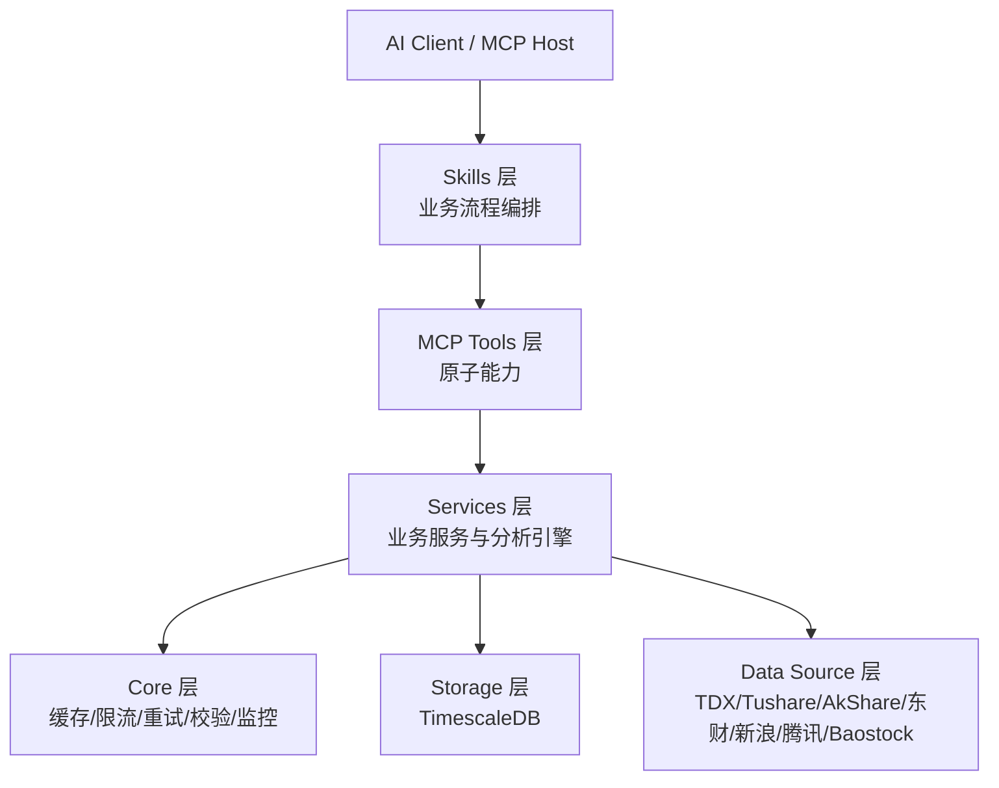
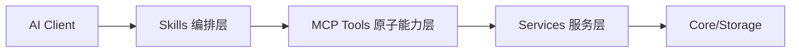

# AIASK - AI驱动的A股量化分析系统（akshare-mcp v2.0）

[](./LICENSE)
[](https://www.python.org/)
[](.)
[](https://modelcontextprotocol.io/)
[](.)

> 一个面向 A 股量化研究与智能投研场景的 **MCP (Model Context Protocol) 服务端系统**，以 `packages/akshare-mcp` 为核心实现，提供 **158 个 MCP 工具**、30+ 技术指标、回测/因子/风险/组合优化与 AI 增强分析能力。

---

## 目录

- [1. 项目介绍](#1-项目介绍)
- [2. 数据源处理策略](#2-数据源处理策略)
- [3. 必备条件与环境要求](#3-必备条件与环境要求)
- [4. 工具能力覆盖（158 个 MCP 工具）](#4-工具能力覆盖158-个-mcp-工具)
- [5. 技术方案与架构（含 Skills 层）](#5-技术方案与架构含-skills-层)
- [6. Skills 架构与使用](#6-skills-架构与使用)
- [7. AI 平台使用指南（含 Skills 路由）](#7-ai-平台使用指南含-skills-路由)
- [8. 文档导航](#8-文档导航)
- [9. 开发与测试](#9-开发与测试)
- [10. 项目特点与优势](#10-项目特点与优势)
- [11. 未来开发计划（Roadmap）](#11-未来开发计划roadmap)
- [12. FAQ（故障排查）](#12-faq故障排查)
- [13. 许可证与致谢](#13-许可证与致谢)

---

## 1. 项目介绍

### 1.1 核心定位

**AIASK** 是一个以 MCP 协议为核心的 A 股量化分析基础设施，目标是把“数据获取 → 分析计算 → 策略验证 → 投资决策”能力封装成可被 AI 客户端直接调用的标准化工具集。

### 1.2 价值主张

- **统一接口**：通过 MCP 暴露标准工具接口，降低不同 AI 平台接入成本。
- **多源容错**：内置数据源优先级与降级链路，提升可用性与连续性。
- **分析闭环**：覆盖数据、技术分析、回测、因子、风险、组合优化、智能决策。
- **生产可用**：支持缓存、限流、重试、数据验证与性能监控。

### 1.3 MCP 架构优势

- 与 AI 客户端天然对接（Claude Desktop、Cursor、Augment 等）。
- 工具调用协议统一，便于权限控制、审计与扩展。
- 业务能力与客户端解耦，服务端可独立升级迭代。

### 1.4 目标用户群体

- **量化研究者**：快速构建与验证策略、因子与风险模型。
- **个人投资者**：通过自然语言和结构化工具进行辅助决策。
- **机构用户**：将 MCP 能力接入内部投研与自动化流程。

---

## 2. 数据源处理策略

### 2.1 已实现数据源（代码可追溯）

当前核心实现位于 `packages/akshare-mcp`，已接入并在不同能力中使用的数据源包括：

- **TDX / TdxQuant**（本地通达信运行时，支持分钟级、盘口、公式与前端联动）
- **Tushare Pro**（高质量结构化日频/财务/公告/研报数据）
- **AKShare**（通用市场数据与多类补充接口）
- **东方财富（Eastmoney）**（指数推送、板块/资金流、公告等）
- **新浪（Sina）**（行情与盘口降级源）
- **腾讯（Tencent）**（行情降级源）
- **Baostock**（历史K线兜底）
- **eFinance**（部分历史与快照兜底）

### 2.2 优先级与降级逻辑（按能力域）

系统采用“**能力域独立优先链 + 自动降级**”策略，不同工具按场景走不同链路：

1. **实时行情**（示例）：`TDX/Tushare -> AKShare(分钟/全市场) -> Sina -> Tencent`
2. **历史K线**（示例）：`TDX/Tushare -> AKShare -> Tencent -> Baostock`
3. **指数行情**（示例）：`Eastmoney push2 -> AKShare(Sina指数接口)`
4. **分钟K线**（示例）：`TDX -> AKShare -> Sina`

说明：

- 全局调度逻辑由数据源管理层统一封装；
- 各工具在业务层再做“场景特化降级”；
- 任一上游不可用时，优先返回“可用但降级”的结果而非直接失败。

### 2.3 配置方式（必需 / 可选）

**必需配置（按场景）**：

- `TUSHARE_TOKEN`：启用 Tushare Pro 的前提。
- `TDX_PLUGIN_PATH`：启用 TDX 本地运行时能力（公式/盘口/分钟线/前端联动）的前提。

**可选配置（影响稳定性与性能）**：

- `TUSHARE_HTTP_URL`：Tushare 代理网关地址（用于内网/限流治理）。
- `TUSHARE_WHITELIST_PATH`：代理白名单路径（控制可透传接口范围）。
- `AKSHARE_SPOT_TTL_SECONDS`：行情缓存TTL，值越小越实时、调用成本越高。
- `AKSHARE_SPOT_TIMEOUT_SECONDS`：行情请求超时，值越大越稳但等待更长。

### 2.4 `.env` 示例（可直接复制）

```env
# ===== 必需（按功能启用） =====
TUSHARE_TOKEN=your_tushare_token
TDX_PLUGIN_PATH=C:/new_tdx/T0002/plugins/Python

# ===== 可选：代理与白名单 =====
TUSHARE_HTTP_URL=http://your-tushare-proxy
TUSHARE_WHITELIST_PATH=src/akshare_mcp/config/tushare_proxy_whitelist.json

# ===== 可选：行情缓存与超时 =====
AKSHARE_SPOT_TTL_SECONDS=2
AKSHARE_SPOT_TIMEOUT_SECONDS=15
```

#### TDX 配置说明（必需条件与快速验证）

为避免“已配置 `TDX_PLUGIN_PATH` 但能力不可用”的情况，建议按以下步骤检查：

1) **前置条件**
- 本机已安装并可正常启动通达信客户端（TDX）。
- `TDX_PLUGIN_PATH` 指向通达信插件 Python 目录，且当前用户有读取权限。
- 需要 TDX 实时能力时（公式、盘口、分钟线、前端同步），必须保证本地运行时可用。

2) **路径示例（按环境）**
- Windows 常见路径：`C:/new_tdx/T0002/plugins/Python`
- Wine（Linux/macOS）常见路径：`~/.wine/drive_c/new_tdx/T0002/plugins/Python`

3) **最小验证步骤**
```bash
# 1) 检查环境变量是否生效
python -c "import os; print(os.getenv('TDX_PLUGIN_PATH'))"

# 2) 启动 MCP 服务后，调用任一 TDX 能力做健康检查（示例）
# tdx_calculate_indicator(stock_code="600519", formula_name="MACD", formula_args="12,26,9")
```

4) **常见问题排查**
- 返回 `success=false` 且提示 TDX 不可用：优先检查客户端是否启动、路径是否正确。
- 路径已配置但仍失败：检查目录权限、路径分隔符、是否指向 `plugins/Python` 而非上级目录。
- 非交易时段数据与盘中不一致：属于数据时效差异，优先使用历史/收盘口径验证。
- 建议将 TDX 作为高优先实时源，同时保留 AKShare/Sina/Tencent 等降级链，避免单点不可用。


### 2.5 适用场景与限制

- **TDX**：盘中实时性与本地联动能力最强；限制是依赖本地客户端与插件环境。
- **Tushare Pro**：结构化与覆盖面好；限制是需要 Token 且受积分/频控影响。
- **AKShare/Eastmoney/Sina/Tencent**：适合作为公网降级链；限制是上游稳定性与字段一致性波动。
- **Baostock/eFinance**：适合历史数据兜底；限制是字段与时效性不如主源。

### 2.6 数据质量保障机制

- **Pydantic 校验**：统一输入输出数据结构。
- **重试机制（retry）**：应对瞬时网络抖动。
- **限流机制（rate_limiter）**：保护上游数据源与服务稳定性。
- **缓存机制（cache_manager / smart_cache）**：降低重复请求并提升响应效率。
- **测试与审计脚本**：包含数据质量审计、接口验证、回归测试。

---

## 3. 必备条件与环境要求

### 3.1 运行环境

- **Python**：`3.12+`
- **数据库**：PostgreSQL + TimescaleDB（推荐）

### 3.2 必需依赖

- `mcp`
- `pandas` / `numpy` / `scipy`
- `tushare`
- `pydantic`
- `asyncpg`
- `pandas-ta`
- `TA-Lib`
- `numba`

> 依赖定义见：`packages/akshare-mcp/pyproject.toml`

### 3.3 可选依赖

- **Ray**（并行计算）：`ray[default]`（用于批量回测、并行任务）
- Legacy 数据源扩展：`akshare` / `baostock` / `efinance`

### 3.4 环境变量配置清单（示例）

```env
# =========================
# Database (TimescaleDB)
# =========================
DB_HOST=localhost
DB_PORT=5432
DB_NAME=stockdb
DB_USER=postgres
DB_PASSWORD=your_password
DB_CONNECT_TIMEOUT_MS=10000

# =========================
# Tushare / Proxy
# =========================
TUSHARE_TOKEN=your_tushare_token
TUSHARE_HTTP_URL=http://your-tushare-proxy
TUSHARE_WHITELIST_PATH=src/akshare_mcp/config/tushare_proxy_whitelist.json

# =========================
# Runtime
# =========================
LOG_LEVEL=INFO
AKSHARE_SPOT_TTL_SECONDS=2
AKSHARE_SPOT_TIMEOUT_SECONDS=15
```

---

## 4. 工具能力覆盖（158 个 MCP 工具）

> 统计口径：`skill_tool_coverage_runtime.json`（`tool_count=158`，`skills_count=20`，覆盖率 `99.37%`）。
> 说明：以下为“能力域统计”，用于帮助理解覆盖范围；具体接口可通过 `available_tools` 实时查询。

### 4.1 能力域覆盖统计

| 能力域 | 工具数量 | 核心能力实现（能力描述） | 典型使用场景 |
|---|---:|---|---|
| 市场数据与行情交易 | 18 | 提供股票/ETF/指数的实时行情、盘口、分时与多周期K线、交易日历与新股新债信息 | 盘中盯盘、盘后复盘、策略数据准备 |
| 基本面/估值/财务 | 12 | 提供财务指标、估值建模（DCF/DDM/相对估值）、历史估值序列与诊断建议 | 基本面研究、估值对比、投前判断 |
| 资金流/新闻/事件 | 19 | 汇聚北向资金、板块资金流、龙虎榜、公告、研报与市场新闻事件 | 题材热度跟踪、事件驱动研究 |
| 技术分析与形态 | 3 | 提供技术指标计算、K线形态识别与指标结果解释 | 交易信号确认、择时辅助 |
| 回测与绩效评估 | 3 | 提供策略回测、批量回测与绩效评估/对比能力 | 策略验证、参数迭代 |
| 因子研究与量化验证 | 7 | 提供因子计算、IC检验、分组回测、OOS验证与稳健性检查 | 因子挖掘、研究报告产出 |
| 风险管理与组合优化 | 6 | 提供VaR/CVaR、压力测试、风险敞口与组合优化分析 | 组合风控、投后监控 |
| 搜索/语义/向量能力 | 4 | 提供语义检索、相似股票/形态检索与自然语言条件解析 | 快速选股、相似案例发现 |
| 数据同步/缓存/运维 | 12 | 提供数据同步、缓存管理、失败队列管理、日报与运维诊断 | 数据工程化、稳定性运维 |
| TDX联动 | 36 | 提供通达信公式、条件选股、前端同步、文件与板块交互能力 | 本地终端联动、公式验证 |
| Manager编排层 | 31 | 通过统一 `action + kwargs` 协议封装跨域流程编排 | AI Agent 工作流、低耦合集成 |
| Skills与工具发现 | 5 | 提供工具清单、分类查询、Skill发现与执行入口 | 自动路由、能力发现 |
| 其他通用能力 | 2 | 提供跨域辅助能力（如市场情绪指数） | 综合研判 |

### 4.2 覆盖结论（与代码对齐）

- 工具总量：**158**（已对齐运行时审计文件）。
- TDX 相关能力：**36/36 全覆盖**。
- Manager 编排能力：**31/31 全覆盖**。
- Skills 覆盖：**157/158（99.37%）**，当前缺口工具为 `factor_robustness_check`。

### 4.3 最小可用验证（5 分钟）

```bash
# 1) 查看工具总量与分类入口
python -c "from akshare_mcp.tools.tools_info import available_tools; import json; r=available_tools(); print('success=', r.get('success')); print('count=', len(r.get('data',{}).get('tools',[])))"

# 2) 验证行情能力（单只）
python -c "from akshare_mcp.tools.market.quote import get_realtime_quote; print(get_realtime_quote('600519').get('success'))"

# 3) 验证K线能力（历史）
python -c "from akshare_mcp.tools.market.kline import get_kline; print(get_kline('600519', period='daily', limit=5).get('success'))"
```

---

## 5. 技术方案与架构（含 Skills 层）

### 5.1 分层架构（Skills / MCP Tools / Services / Core）



### 5.2 架构价值

- **Skills 层**：把多步骤研究流程标准化，减少 AI 端反复拼接工具调用。
- **MCP Tools 层**：提供稳定、可组合的原子接口，便于审计与复用。
- **Services/Core 层**：负责业务逻辑、容错降级、性能优化与一致性校验。
- **Storage/Data Source 层**：提供时序数据沉淀与多数据源高可用能力。

### 5.3 核心技术栈

- **FastMCP / MCP Python SDK**：MCP 服务接入层
- **TimescaleDB + asyncpg**：时序数据存储与异步访问
- **Numba**：关键计算路径 JIT 加速
- **Ray（可选）**：并行回测/批处理
- **Pydantic**：输入输出模型校验

### 5.4 性能与稳定性设计

- 多级缓存（内存 / 进程缓存 / 智能缓存）
- 批量操作与异步 IO
- 回测/研究任务并行化（Ray）
- 多数据源自动降级与失败回退
- 失败队列（dead-letter）与同步任务状态可观测

---

## 6. Skills 架构与使用

### 6.1 Skills 的定位

Skills 是位于 MCP 工具之上的**流程编排层**：

- MCP Tools 提供“原子能力”（单一功能调用）
- Skills 负责“流程能力”（跨工具组合、步骤编排、标准化输出）
- 对 AI Client 来说，Skills 能显著降低调用复杂度，减少多轮工具拼接成本

### 6.2 20 个 Skills 清单（按场景分组）

| 分组 | Skills | 典型场景 |
|---|---|---|
| 市场与基本面 | `akshare-market`、`akshare-fundamental`、`akshare-fund-news` | 日常盯盘、财务与新闻联动分析 |
| 组合与投顾 | `akshare-portfolio`、`akshare-portfolio-manager-core`、`akshare-asset-allocation`、`akshare-investor-protection`、`akshare-ips-discipline`、`akshare-fee-costs` | 组合构建、约束检查、投后纪律 |
| 量化研究 | `akshare-quant`、`akshare-quant-research-process`、`akshare-quant-methods-foundation`、`akshare-quant-ml-signals`、`akshare-performance-attribution`、`akshare-quant-data-engineering` | 因子研究、回测验证、归因与数据工程 |
| 基金经理工作流 | `akshare-fund-manager-pro` | 研究-决策-风控-复盘的一体化流程 |
| TDX 专项 | `akshare-tdx-runtime-ops`、`akshare-tdx-formula-research`、`akshare-tdx-front-sync` | 通达信运行态诊断、公式验证、前端同步 |
| 宏观与期权 | `akshare-macro-options-alerts` | 宏观+期权联合监控与预警 |

### 6.3 Skills 与 MCP Tools 的关系



- Skills 的输入一般是“业务问题”，输出是“可执行结论/结构化报告”。
- MCP Tools 的输入一般是“明确参数”，输出是“原始或半结构化结果”。

### 6.4 典型 Skill 使用示例

- `akshare-fund-manager-pro`：适合“组合诊断 + 风险提示 + 调仓建议 + 报告输出”一站式任务。
- `akshare-quant-research-process`：适合“数据门禁 → 信号构建 → 回测评估 → OOS 验证 → 归因复盘”的标准研究链路。
- `akshare-tdx-runtime-ops`：适合“TDX 交互前预检”，先判断环境可用性，再进入公式/前端联动。

---


## 7. AI 平台使用指南（含 Skills 路由）

> 本项目推荐采用“双层调用策略”：优先 Skills（流程编排），必要时直调 MCP Tools（原子能力）。

### 7.1 接入配置（Claude Desktop / Cursor 通用）

```json
{
  "mcpServers": {
    "akshare-stock": {
      "command": "uv",
      "args": [
        "run",
        "--directory",
        "C:/path/to/AIASK/packages/akshare-mcp",
        "python",
        "start_server.py"
      ],
      "cwd": "C:/path/to/AIASK/packages/akshare-mcp",
      "env": {
        "PYTHONPATH": "C:/path/to/AIASK/packages/akshare-mcp/src"
      }
    }
  }
}
```

### 7.2 Skills 路由规则（推荐）

1. **任务是多步骤闭环**（如“研究→回测→风控→报告”）时，优先走 **Skills**。
2. **任务是单点能力调用**（如“取一只股票实时价”）时，直调 **MCP Tools**。
3. **先用 Skills，后按需下钻工具**：当需要解释中间结果或替换某一步时，再转工具级调用。
4. **TDX 相关任务先做运行态检查**：先走 `akshare-tdx-runtime-ops`，再执行公式/前端同步。

### 7.3 何时使用 Skills

适用以下场景：

- 需要跨多个能力域的组合任务（市场数据 + 因子 + 回测 + 风险）
- 需要标准化产出（报告结构、结论模板、审计轨迹）
- 需要降低提示词复杂度与人工编排成本

典型示例：

- `akshare-fund-manager-pro`：组合诊断、调仓建议、风险提示、报告汇总。
- `akshare-quant-research-process`：从数据门禁到 OOS 验证的一体化研究流程。

### 7.4 何时直接调用 MCP Tools

适用以下场景：

- 只需要一个原子结果（实时行情、单次K线、单次指标）
- 需要精细控制参数（窗口、周期、复权、阈值）
- 需要对单个环节做性能压测或故障定位

示例：

- 行情与K线快速核验：实时价格、分钟线、日线。
- 技术分析核验：单个指标计算或K线形态识别。

### 7.5 最小调用路径建议

- **研究型问题**：`Skills ->（必要时）MCP Tools -> 输出结论`
- **数据查询型问题**：`MCP Tools -> 直接返回`
- **生产流程**：`Skills -> Manager 编排 -> 存储/审计`

---

## 8. 文档导航

### 8.1 快速入门

- 核心服务文档：[`packages/akshare-mcp/README.md`](./packages/akshare-mcp/README.md)
- MCP 配置指南：[`packages/akshare-mcp/MCP_CONFIG_GUIDE.md`](./packages/akshare-mcp/MCP_CONFIG_GUIDE.md)
- 功能演示文档：[`DEMO.md`](./DEMO.md)（快速上手、进阶场景、端到端工作流）

### 8.2 API / 工具文档

- 工具审计数据：[`packages/akshare-mcp/TOOL_DOC_AUDIT_RAW.json`](./packages/akshare-mcp/TOOL_DOC_AUDIT_RAW.json)
- TDX 相关文档：[`docs/tdx-quant/README.md`](./docs/tdx-quant/README.md)

### 8.3 测试与质量文档

- 包内测试目录：[`packages/akshare-mcp/tests`](./packages/akshare-mcp/tests)
- 顶层测试报告：[`tests/API_COMPARISON_REPORT.md`](./tests/API_COMPARISON_REPORT.md)
- 覆盖率报告（本地生成）：`packages/akshare-mcp/htmlcov/index.html`

### 8.4 架构与评审资料

- MCP 功能审查摘要：[`.claude/context-summary-mcp-review.md`](./.claude/context-summary-mcp-review.md)
- TDX 扩展规划：[`TDX_MCP_EXTENSION_PLAN.md`](./TDX_MCP_EXTENSION_PLAN.md)

---

## 9. 开发与测试

### 9.1 安装步骤（可直接复制）

```bash
# 1) 进入核心服务目录
cd packages/akshare-mcp

# 2) 推荐：使用 uv 安装
uv sync

# 3) 或使用 pip
# python -m venv .venv
# .venv\Scripts\activate   # Windows
# pip install -r requirements.txt
# pip install -e .
```

### 9.2 启动服务

```bash
cd packages/akshare-mcp
uv run python start_server.py
```

### 9.3 数据库初始化与检查

```bash
cd packages/akshare-mcp
python scripts/verify_db_connection.py
python scripts/check_db_status.py
```

### 9.4 测试套件运行

```bash
cd packages/akshare-mcp
pytest tests/ -v
```

常用测试：

```bash
# 集成测试
pytest tests/test_integration.py -v

# 性能基准
pytest tests/test_performance_benchmark.py -v
pytest tests/test_backtest_performance.py -v
```

### 9.5 开发规范与贡献指南

- 代码风格：PEP 8 + Type Hints + Docstring
- 命名规范：snake_case / PascalCase / UPPER_SNAKE_CASE
- 提交前建议执行：

```bash
pytest tests/ -v
```

贡献流程建议：

1. Fork + 新建分支
2. 编写功能与测试
3. 本地通过测试后提交 PR
4. 在 PR 描述中说明影响范围与回归验证结果

---

## 10. 项目特点与优势

### 10.1 与常见量化平台的差异化

- **MCP Native**：天然适配 AI 工具生态，而非仅提供传统 REST 接口。
- **分析能力一体化**：数据、回测、因子、风险、组合优化、智能功能统一在同一工具面。
- **多数据源冗余设计**：减少单点数据源故障带来的服务中断。

### 10.2 MCP 协议独特价值

- AI 可直接“函数式调用”量化能力
- 便于在对话中完成端到端研究流程
- 可扩展到多客户端、多团队、多环境

### 10.3 性能与效率（工程视角）

- 回测与指标计算支持向量化与 JIT 加速
- 批量任务支持并行执行（Ray 可选）
- 缓存与异步 IO 提升高频调用效率

### 10.4 数据可靠性保障

- 主源 + 降级源 + 重试 + 校验 + 监控
- 支持代理白名单与数据访问治理
- 提供脚本化巡检与测试基线

### 10.5 社区与迭代

- 采用模块化架构，便于持续扩展工具与管理器
- 支持在不破坏上层客户端的前提下演进服务能力

---

## 11. 未来开发计划（Roadmap）

> 目标：在保持“158 个 MCP Tools + 20+ Skills”稳定能力的基础上，持续提升面向普通投资者的可用性、可解释性与协作效率。

### 11.1 前端开发（专业级可视化）
- **回答卡片渲染引擎**：基于 `DEMO.md` 第 8 章 JSON 协议，实现结论卡、风险卡、执行卡、来源时效卡的统一渲染。
- **交互式投研面板**：提供组合管理、实时监控、告警中心、策略执行建议的统一工作台。
- **回测可视化中心**：支持收益曲线、回撤曲线、交易分布、参数对比热力图等图形化展示。
- **移动端与响应式**：适配手机/平板/桌面，支持低带宽模式与关键信息优先加载。

### 11.2 用户策略管理
- **策略生成向导**：支持自然语言输入（如“稳健红利+回撤控制”）与模板化创建（均线、动量、风险平价等）。
- **策略资产化管理**：支持策略保存、版本管理、快照回滚、导入导出、团队分享。
- **策略绩效追踪**：沉淀策略全生命周期指标（收益、回撤、胜率、夏普、执行偏差）与历史回测记录。

### 11.3 因子库扩充
- **规模扩展**：从当前 32 个因子扩展到 100+，覆盖价值、质量、成长、情绪、波动、流动性等维度。
- **新增因子类型**：逐步增加机器学习因子、另类数据因子、高频微观结构因子。
- **因子工程能力**：提供因子组合、加权融合、正交化处理与自定义因子构建工具。

### 11.4 其他计划方向
- **TDX 联动增强**：扩展更多公式类型、批量信号推送、自动化板块管理与客户端同步能力。
- **多市场与多数据源**：持续扩展期货、期权、港股、美股等市场的数据接入与一致化处理。
- **云端部署与协作**：提供云端部署方案、权限体系、多用户协作与审计能力。
- **文档与教程体系**：补充视频教程、案例库、分层学习路径（新手/进阶/专业）与最佳实践手册。

### 11.5 里程碑建议（滚动更新）
| 阶段 | 重点目标 | 可交付成果 |
|---|---|---|
| P1（近期） | 新手体验与前端基础 | 回答卡片渲染、基础看板、策略向导 MVP |
| P2（中期） | 策略与因子能力扩展 | 策略版本管理、因子库 100+、可视化回测中心 |
| P3（长期） | 多市场与协作平台化 | 云端多用户协作、跨市场数据统一、完整教程体系 |

---

## 12. FAQ（故障排查）

### Q1: 启动后 AI 客户端看不到工具？

**排查顺序**：

1. 确认 `cwd` 指向 `packages/akshare-mcp`
2. 确认 `PYTHONPATH` 包含 `packages/akshare-mcp/src`
3. 手工运行 `uv run python start_server.py` 检查报错
4. 查看客户端 MCP 日志

### Q2: 数据库连接失败？

- 检查 `.env` 的 `DB_HOST/DB_PORT/DB_NAME/DB_USER/DB_PASSWORD`
- 确认 PostgreSQL/TimescaleDB 已启动
- 运行：

```bash
python packages/akshare-mcp/scripts/verify_db_connection.py
```

### Q3: TA-Lib 安装失败？

- 先安装系统层 TA-Lib，再安装 Python 包。
- macOS 可使用 `brew install ta-lib`。
- Windows 建议使用预编译 wheel 或 Conda 环境。

### Q4: Tushare 访问不稳定或限流？

- 检查 `TUSHARE_TOKEN` 是否有效
- 如使用代理，确认 `TUSHARE_HTTP_URL` 可达
- 配置白名单路径并检查代理支持接口

### Q5: 并行回测未生效？

- 确认已安装可选依赖：`ray[default]`
- 在回测参数中显式开启并行开关
- 先用小样本验证结果一致性，再扩大规模

---

## 13. 许可证与致谢

### 许可证

本项目采用 **MIT License**。

### 致谢

- [AKShare](https://github.com/akfamily/akshare)
- [Tushare](https://tushare.pro/)
- [TimescaleDB](https://www.timescale.com/)
- [Model Context Protocol](https://modelcontextprotocol.io/)

---

如果这个项目对你有帮助，欢迎 ⭐ Star 支持。

