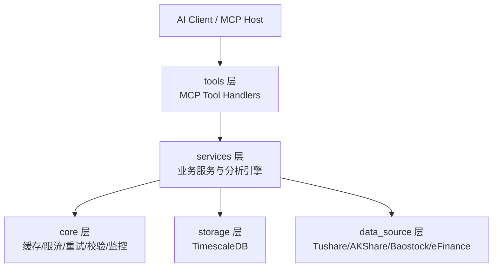

# AIASK - AI驱动的A股量化分析系统（akshare-mcp v2.0）

[](./LICENSE)
[](https://www.python.org/)
[](.)
[](https://modelcontextprotocol.io/)
[](.)

> 一个面向 A 股量化研究与智能投研场景的 **MCP (Model Context Protocol) 服务端系统**，以 `packages/akshare-mcp` 为核心实现，提供 100+ MCP 工具、30+ 技术指标、回测/因子/风险/组合优化与 AI 增强分析能力。

---

## 目录

- [1. 项目介绍](#1-项目介绍)
- [2. 数据源处理策略](#2-数据源处理策略)
- [3. 必备条件与环境要求](#3-必备条件与环境要求)
- [4. 实现的功能清单](#4-实现的功能清单)
- [5. 技术方案与架构](#5-技术方案与架构)
- [6. AI 平台使用指南](#6-ai-平台使用指南)
- [7. 文档导航](#7-文档导航)
- [8. 开发与测试](#8-开发与测试)
- [9. 项目特点与优势](#9-项目特点与优势)
- [10. FAQ（故障排查）](#10-faq故障排查)
- [11. 许可证与致谢](#11-许可证与致谢)

---

## 1. 项目介绍

### 1.1 核心定位

**AIASK** 是一个以 MCP 协议为核心的 A 股量化分析基础设施，目标是把“数据获取 → 分析计算 → 策略验证 → 投资决策”能力封装成可被 AI 客户端直接调用的标准化工具集。

### 1.2 价值主张

- **统一接口**：通过 MCP 暴露标准工具接口，降低不同 AI 平台接入成本。
- **多源容错**：内置数据源优先级与降级链路，提升可用性与连续性。
- **分析闭环**：覆盖数据、技术分析、回测、因子、风险、组合优化、智能决策。
- **生产可用**：支持缓存、限流、重试、数据验证与性能监控。

### 1.3 MCP 架构优势

- 与 AI 客户端天然对接（Claude Desktop、Cursor、Augment 等）。
- 工具调用协议统一，便于权限控制、审计与扩展。
- 业务能力与客户端解耦，服务端可独立升级迭代。

### 1.4 目标用户群体

- **量化研究者**：快速构建与验证策略、因子与风险模型。
- **个人投资者**：通过自然语言和结构化工具进行辅助决策。
- **机构用户**：将 MCP 能力接入内部投研与自动化流程。

---

## 2. 数据源处理策略

### 2.1 多数据源架构

当前核心实现位于 `packages/akshare-mcp`，采用多数据源策略，主要包括：

- **Tushare Pro**（主数据源）
- **AKShare**
- **Baostock**
- **eFinance**

### 2.2 数据源优先级与降级

根据项目实现与上下文审查结果，采用“优先主源 + 自动降级”的策略：

1. Tushare Pro（优先，支持代理与白名单）
2. Tushare Legacy（兼容兜底）
3. Baostock（历史数据兜底）
4. eFinance（最终兜底）

不同工具会根据数据类型（实时行情 / K 线 / 财务 / 资金流等）在内部使用各自的优先链路，确保在单源异常时仍可返回可用结果。

### 2.3 Tushare 代理服务配置

在 `.env` 中配置：

```env
TUSHARE_TOKEN=your_tushare_token
TUSHARE_HTTP_URL=http://your-tushare-proxy
TUSHARE_WHITELIST_PATH=src/akshare_mcp/config/tushare_proxy_whitelist.json
```

说明：

- `TUSHARE_HTTP_URL` 可用于私有代理或网关接入。
- `TUSHARE_WHITELIST_PATH` 用于控制代理接口白名单，降低误调用与风控风险。

### 2.4 数据质量保障机制

- **Pydantic 校验**：统一输入输出数据结构。
- **重试机制（retry）**：应对瞬时网络抖动。
- **限流机制（rate_limiter）**：保护上游数据源与服务稳定性。
- **缓存机制（cache_manager / smart_cache）**：降低重复请求并提升响应效率。
- **测试与审计脚本**：包含数据质量审计、接口验证、回归测试。

---

## 3. 必备条件与环境要求

### 3.1 运行环境

- **Python**：`3.12+`
- **数据库**：PostgreSQL + TimescaleDB（推荐）

### 3.2 必需依赖

- `mcp`
- `pandas` / `numpy` / `scipy`
- `tushare`
- `pydantic`
- `asyncpg`
- `pandas-ta`
- `TA-Lib`
- `numba`

> 依赖定义见：`packages/akshare-mcp/pyproject.toml`

### 3.3 可选依赖

- **Ray**（并行计算）：`ray[default]`（用于批量回测、并行任务）
- Legacy 数据源扩展：`akshare` / `baostock` / `efinance`

### 3.4 环境变量配置清单（示例）

```env
# =========================
# Database (TimescaleDB)
# =========================
DB_HOST=localhost
DB_PORT=5432
DB_NAME=stockdb
DB_USER=postgres
DB_PASSWORD=your_password
DB_CONNECT_TIMEOUT_MS=10000

# =========================
# Tushare / Proxy
# =========================
TUSHARE_TOKEN=your_tushare_token
TUSHARE_HTTP_URL=http://your-tushare-proxy
TUSHARE_WHITELIST_PATH=src/akshare_mcp/config/tushare_proxy_whitelist.json

# =========================
# Runtime
# =========================
LOG_LEVEL=INFO
AKSHARE_SPOT_TTL_SECONDS=2
AKSHARE_SPOT_TIMEOUT_SECONDS=15
```

---

## 4. 实现的功能清单

### 4.1 数据获取能力

- **100+ MCP 工具**（市场行情、K 线、财务、新闻、资金流、龙虎榜、两融、板块等）
- 单只/批量实时行情
- 日线/周线/月线/分钟级数据
- 事件与公告类信息聚合

### 4.2 技术分析能力

- **30+ 技术指标**（MA/EMA/MACD/RSI/KDJ/BOLL/ATR 等）
- K 线形态识别
- 趋势与波动分析

### 4.3 回测系统

- **4 类基础策略**（如 MA Cross、Momentum、RSI、均值回归）
- 参数优化
- 批量回测与并行执行（可选 Ray）
- 绩效指标输出（收益、回撤、夏普等）

### 4.4 因子系统

- **8 大类 32 个因子**
- IC 分析
- 分组回测
- 多因子评分

### 4.5 风险管理

- VaR / CVaR
- 压力测试
- 风险敞口分析

### 4.6 组合优化

- Black-Litterman
- Mean-Variance / Efficient Frontier
- Risk Parity
- 最大夏普比率配置

### 4.7 智能功能

- NLP 查询解析
- 向量搜索（相似形态 / 相似股票）
- 产业链知识图谱
- 智能诊断与投资建议

---

## 5. 技术方案与架构

### 5.1 三层架构（tools / services / core）



### 5.2 核心技术栈

- **FastMCP / MCP Python SDK**：MCP 服务接入层
- **TimescaleDB + asyncpg**：时序数据存储与异步访问
- **Numba**：关键计算路径 JIT 加速
- **Ray（可选）**：并行回测/批处理
- **Pydantic**：输入输出模型校验

### 5.3 性能优化方案

- 多级缓存（内存 / 进程缓存 / 智能缓存）
- 批量操作与异步 IO
- JIT 编译（Numba）优化关键数学计算
- 并行计算（Ray）提升批量任务吞吐

### 5.4 数据存储方案

- 采用 **TimescaleDB** 存储 K 线与时序指标数据
- 支持历史数据沉淀、增量同步与查询优化
- 配套脚本支持初始化、迁移、修复与审计

---

## 6. AI 平台使用指南

> 本项目核心是 MCP Server，推荐将 `packages/akshare-mcp` 作为统一服务入口。

### 6.1 Claude Desktop

在 Claude Desktop MCP 配置中添加：

```json
{
  "mcpServers": {
    "akshare-stock": {
      "command": "uv",
      "args": [
        "run",
        "--directory",
        "C:/path/to/AIASK/packages/akshare-mcp",
        "python",
        "start_server.py"
      ],
      "cwd": "C:/path/to/AIASK/packages/akshare-mcp",
      "env": {
        "PYTHONPATH": "C:/path/to/AIASK/packages/akshare-mcp/src"
      }
    }
  }
}
```

工具调用方式（示例场景）：

- 查询实时行情：`get_realtime_quote`
- 获取历史 K 线：`get_kline` / `get_kline_data`
- 运行回测：`run_simple_backtest` / `run_batch_backtest`

### 6.2 Cursor

Cursor 可直接复用 MCP JSON 配置（见 `packages/akshare-mcp/MCP_CONFIG_GUIDE.md`）。

建议：

- 将 `cwd` 固定到 `packages/akshare-mcp`
- 通过 `uv run` 避免虚拟环境路径问题
- 把 `.env` 与 MCP `env` 分层管理（敏感信息优先本地环境）

### 6.3 GitHub Copilot

Copilot 不直接作为 MCP Host，但可作为开发协同助手：

- 生成工具封装与测试样板
- 编写数据处理函数与类型注解
- 辅助补齐文档、注释、迁移脚本

最佳实践：

- 把 MCP 工具定义和服务逻辑拆分清晰（tools vs services）
- 提供明确函数签名与 docstring，提升补全质量
- 关键逻辑由测试约束，避免“看起来能跑”的幻觉代码

### 6.4 其他 AI 平台（通用 MCP 接入）

通用配置要点：

1. 指定 `command`（推荐 `uv` 或虚拟环境 python）
2. 指定 `cwd`（必须是 `packages/akshare-mcp`）
3. 注入必要环境变量（DB / Tushare / PYTHONPATH）
4. 通过平台工具面板验证 `available_tools`

### 6.5 平台对比与推荐

| 平台 | MCP 接入体验 | 适用场景 | 推荐级别 |
|---|---|---|---|
| Claude Desktop | 稳定、原生工具调用体验好 | 研究分析、策略问答、工具链编排 | ⭐⭐⭐⭐⭐ |
| Cursor | 代码与工具双栈协同强 | 开发调试、联调、测试驱动开发 | ⭐⭐⭐⭐⭐ |
| GitHub Copilot | 代码补全优秀，非 MCP Host | 代码生成、重构、测试补全 | ⭐⭐⭐⭐ |
| 其他支持 MCP 平台 | 取决于实现 | 私有化部署、多平台接入 | ⭐⭐⭐⭐ |

---

## 7. 文档导航

### 7.1 快速入门

- 核心服务文档：[`packages/akshare-mcp/README.md`](./packages/akshare-mcp/README.md)
- MCP 配置指南：[`packages/akshare-mcp/MCP_CONFIG_GUIDE.md`](./packages/akshare-mcp/MCP_CONFIG_GUIDE.md)

### 7.2 API / 工具文档

- 工具审计数据：[`packages/akshare-mcp/TOOL_DOC_AUDIT_RAW.json`](./packages/akshare-mcp/TOOL_DOC_AUDIT_RAW.json)
- TDX 相关文档：[`docs/tdx-quant/README.md`](./docs/tdx-quant/README.md)

### 7.3 测试与质量文档

- 包内测试目录：[`packages/akshare-mcp/tests`](./packages/akshare-mcp/tests)
- 顶层测试报告：[`tests/API_COMPARISON_REPORT.md`](./tests/API_COMPARISON_REPORT.md)
- 覆盖率报告（本地生成）：`packages/akshare-mcp/htmlcov/index.html`

### 7.4 架构与评审资料

- MCP 功能审查摘要：[`.claude/context-summary-mcp-review.md`](./.claude/context-summary-mcp-review.md)
- TDX 扩展规划：[`TDX_MCP_EXTENSION_PLAN.md`](./TDX_MCP_EXTENSION_PLAN.md)

---

## 8. 开发与测试

### 8.1 安装步骤（可直接复制）

```bash
# 1) 进入核心服务目录
cd packages/akshare-mcp

# 2) 推荐：使用 uv 安装
uv sync

# 3) 或使用 pip
# python -m venv .venv
# .venv\Scripts\activate   # Windows
# pip install -r requirements.txt
# pip install -e .
```

### 8.2 启动服务

```bash
cd packages/akshare-mcp
uv run python start_server.py
```

### 8.3 数据库初始化与检查

```bash
cd packages/akshare-mcp
python scripts/verify_db_connection.py
python scripts/check_db_status.py
```

### 8.4 测试套件运行

```bash
cd packages/akshare-mcp
pytest tests/ -v
```

常用测试：

```bash
# 集成测试
pytest tests/test_integration.py -v

# 性能基准
pytest tests/test_performance_benchmark.py -v
pytest tests/test_backtest_performance.py -v
```

### 8.5 开发规范与贡献指南

- 代码风格：PEP 8 + Type Hints + Docstring
- 命名规范：snake_case / PascalCase / UPPER_SNAKE_CASE
- 提交前建议执行：

```bash
pytest tests/ -v
```

贡献流程建议：

1. Fork + 新建分支
2. 编写功能与测试
3. 本地通过测试后提交 PR
4. 在 PR 描述中说明影响范围与回归验证结果

---

## 9. 项目特点与优势

### 9.1 与常见量化平台的差异化

- **MCP Native**：天然适配 AI 工具生态，而非仅提供传统 REST 接口。
- **分析能力一体化**：数据、回测、因子、风险、组合优化、智能功能统一在同一工具面。
- **多数据源冗余设计**：减少单点数据源故障带来的服务中断。

### 9.2 MCP 协议独特价值

- AI 可直接“函数式调用”量化能力
- 便于在对话中完成端到端研究流程
- 可扩展到多客户端、多团队、多环境

### 9.3 性能与效率（工程视角）

- 回测与指标计算支持向量化与 JIT 加速
- 批量任务支持并行执行（Ray 可选）
- 缓存与异步 IO 提升高频调用效率

### 9.4 数据可靠性保障

- 主源 + 降级源 + 重试 + 校验 + 监控
- 支持代理白名单与数据访问治理
- 提供脚本化巡检与测试基线

### 9.5 社区与迭代

- 采用模块化架构，便于持续扩展工具与管理器
- 支持在不破坏上层客户端的前提下演进服务能力

---

## 10. FAQ（故障排查）

### Q1: 启动后 AI 客户端看不到工具？

**排查顺序**：

1. 确认 `cwd` 指向 `packages/akshare-mcp`
2. 确认 `PYTHONPATH` 包含 `packages/akshare-mcp/src`
3. 手工运行 `uv run python start_server.py` 检查报错
4. 查看客户端 MCP 日志

### Q2: 数据库连接失败？

- 检查 `.env` 的 `DB_HOST/DB_PORT/DB_NAME/DB_USER/DB_PASSWORD`
- 确认 PostgreSQL/TimescaleDB 已启动
- 运行：

```bash
python packages/akshare-mcp/scripts/verify_db_connection.py
```

### Q3: TA-Lib 安装失败？

- 先安装系统层 TA-Lib，再安装 Python 包。
- macOS 可使用 `brew install ta-lib`。
- Windows 建议使用预编译 wheel 或 Conda 环境。

### Q4: Tushare 访问不稳定或限流？

- 检查 `TUSHARE_TOKEN` 是否有效
- 如使用代理，确认 `TUSHARE_HTTP_URL` 可达
- 配置白名单路径并检查代理支持接口

### Q5: 并行回测未生效？

- 确认已安装可选依赖：`ray[default]`
- 在回测参数中显式开启并行开关
- 先用小样本验证结果一致性，再扩大规模

---

## 11. 许可证与致谢

### 许可证

本项目采用 **MIT License**。

### 致谢

- [AKShare](https://github.com/akfamily/akshare)
- [Tushare](https://tushare.pro/)
- [TimescaleDB](https://www.timescale.com/)
- [Model Context Protocol](https://modelcontextprotocol.io/)

---

如果这个项目对你有帮助，欢迎 ⭐ Star 支持。
