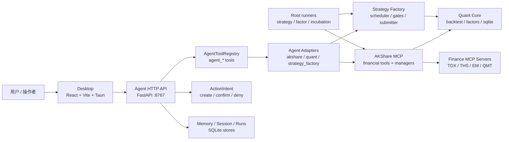

# AIASK 整体架构、能力与上线就绪评审报告（2026-05-29）

## 执行摘要

这份报告的核心目的不是列问题，而是回答三个问题：**AIASK 实际是什么、已经实现了哪些能力、它对我们项目有什么帮助**。上线风险仍会评估，但放在后半部分作为约束条件。

**总体判断：AIASK 已经不是单一工具或 Demo，而是一个面向 A 股量化研究、策略生产、数据治理和桌面工作台的金融系统级 Agent 平台。** 它由 Desktop、Agent HTTP Runtime、AKShare MCP、Strategy Factory、Quant Core、Finance MCP Servers 和 root runners 组成，已经形成“桌面操作 -> Agent API -> 金融工具/策略工厂/量化存储 -> 审批/回测/孵化/报告”的闭环。

**当前可用能力：**

| 能力域 | 当前实现状态 | 能做什么 |
| --- | --- | --- |
| 桌面工作台 | 已有较完整 UI 功能区 | 查看 Agent、工具、能力矩阵、金融经理、数据、量化、策略工厂、因子工厂、孵化、MCP、模型、自动化、设置等模块。 |
| Agent Runtime | 已实现 HTTP/API/工具注册/会话/审批 | 统一承接 Desktop 和模型调用，暴露 `agent_*` 工具，管理 ActionIntent、memory、session、runs、SSE、MCP、插件和网关。 |
| 金融数据与研究工具 | 已实现大面积 MCP 工具与 manager plane | 行情、K 线、财务、资金流、宏观、新闻、估值、技术分析、组合、回测、风控、搜索、语义、数据同步、深度个股分析。 |
| 策略工厂 | 已实现 DDD 分层和生产流水线主体 | 候选生成、数据收集、研究任务、回测筛选、质量门禁、去重、提交、事件驱动、策略面板、淘汰和孵化衔接。 |
| 因子挖掘与孵化 | 已实现服务和 runner | 因子候选生成、质量评估、active factor pool、衰减维护、孵化 intake、信号生成、forward verify、命中率报告、反馈与加速。 |
| 量化核心 | 已实现 backtest/factor/storage 基座 | 内置策略、DSL 策略、回测指标、技术/基本面/波动率因子、SQLite 持久化、策略生命周期和向量存储。 |
| 外部金融软件 MCP | 已有 TDX/THS/EM/QMT server 骨架 | 接入通达信、同花顺、东方财富、QMT 的行情/交易能力；实盘交易有 token/确认 guard。 |

**上线结论：Conditional。** AIASK 适合进入受限上线或内部试运行：本地/内网、只读研究、dry-run、paper/sandbox、人工确认的 ActionIntent 工作流。它暂不适合无约束生产环境，也不适合默认开启真实交易。风险数量：P0 4 项，P1 7 项，P2 6 项。

本报告基于当前代码、静态图谱、endpoint map、跨包依赖图、manifest、关键入口文件和既有诊断文档做评审；它不是完整生产压测，不是真实交易验收，也不是安全红队报告。评审过程中不读取 `.env` 内容，不引用密钥值，不操作 DB、日志、缓存或运行态数据。

## 项目实际定位

AIASK 的实际定位可以概括为：

> 一个面向中国金融市场的本地优先金融 Agent 平台，把桌面工作台、LLM Agent、MCP 金融工具、量化数据、策略工厂、因子工厂、孵化工厂和交易软件连接器组合在一起。

它不是简单的“问答机器人”，也不是单纯的 AKShare 封装。它更像一个金融研究和策略生产操作系统：

1. Desktop 给用户一个工作台入口。
2. Agent 统一承接 HTTP API、模型工具、审批、记忆、会话、插件、MCP 和跨平台网关。
3. AKShare MCP 提供金融数据、分析工具、manager plane 和领域服务。
4. Strategy Factory 负责策略从想法到候选、回测、门禁、提交、淘汰的生产流程。
5. Quant Core 提供因子、回测、DSL 和 SQLite 存储基础。
6. Finance MCP Servers 连接通达信、同花顺、东方财富、QMT 等外部金融软件。
7. root runners 提供策略工厂、因子工厂、孵化工厂等本地/运维入口。

从图谱看，这已经是一个中大型 monorepo：原始图 18,879 nodes / 49,016 edges，curated core 7,638 nodes / 19,921 edges。包级子图规模为 Agent 540/1,897，AKShare MCP 4,190/11,216，Strategy Factory 1,754/4,032，Quant Core 619/1,253，Desktop 429/1,111，Root runners 63/137。

## 实际架构

### 总体调用链



### 包与职责

| 子系统 | 位置 | 实际职责 | 关键证据 |
| --- | --- | --- | --- |
| Desktop | `desktop/` | 产品工作台和可视化控制台；只通过 Agent HTTP API 访问后端。 | `desktop/src/services/aiaskApi.ts`、`desktop/src/features/*`、`desktop/package.json` |
| Agent | `packages/agent` | FastAPI 服务、模型循环、工具注册、ActionIntent、memory/session、MCP 聚合、插件、技能、平台网关。 | `packages/agent/src/aiask_agent/server.py`、`tool_registry.py`、`runtime.py` |
| AKShare MCP | `packages/akshare-mcp` | 金融数据 MCP server、研究分析工具、manager plane、数据同步、因子/孵化/向量/深度分析服务。 | `packages/akshare-mcp/src/akshare_mcp/server.py`、`tools/`、`services/` |
| Strategy Factory | `packages/strategy-factory` | 策略生产流水线，DDD 分层，公共 facade，scheduler、cycle runner、quality gates、submitter、deduplicator、elimination。 | `packages/strategy-factory/src/strategy_factory/api/facade.py`、`application/`、`domain/` |
| Quant Core | `packages/aiask-quant-core` | 回测引擎、内置策略、DSL、因子计算、SQLite 存储、策略生命周期数据。 | `packages/aiask-quant-core/src/aiask_quant_core/backtest`、`factor_calculator`、`storage/sqlite` |
| Finance MCP Servers | `packages/finance-mcp-servers` | 通达信、同花顺、东方财富、QMT 独立 MCP server，含交易风险 guard。 | `packages/finance-mcp-servers/src/aiask_finance_mcp/*/server.py` |
| Root runners | repo 根目录 | 本地/运维入口，用于运行策略工厂、因子挖掘、孵化、信号跟踪。 | `run_strategy_factory.py`、`run_factor_mining_factory.py`、`run_incubation_factory.py` |

### 边界设计

AIASK 最重要的边界是：**Desktop 不直连 MCP 或 manager；模型只看见 `agent_*` 工具；真实交易必须经过确认/token guard。**

`packages/agent/src/aiask_agent/tools/policy.py` 对 model-visible 工具名做强约束：必须以 `agent_` 开头，并禁止 `strategy_manager`、`live_trading_manager`、`paper_trading_manager`、`execution_manager`、`available_tools`、`get_tool_contract` 等直接 manager token。`packages/agent/src/aiask_agent/tool_registry.py` 负责注册工具、统一 envelope、处理非只读 MCP 调用转 ActionIntent。

Desktop 通过 `desktop/src/services/aiaskApi.ts` 调用 `/health/detailed`、`/v1/tools`、`/v1/responses`、`/v1/mcp/*`、`/intents`、`/v1/desktop/*` 等 Agent HTTP API。endpoint map 当前识别出 117 个端点，其中 62 个 Desktop+Agent 双边匹配，42 个 server-only，13 个 desktop-only。

## 已实现功能地图

### Desktop 工作台

Desktop 不是单页壳子，已经有大量业务功能区。`desktop/src/features` 下的功能模块包括：

| 功能区 | 作用 |
| --- | --- |
| `overview`、`workflows`、`coverage`、`capabilities` | 总览、流程、能力覆盖、工具/功能矩阵。 |
| `agent`、`ai-testing`、`models` | Agent 状态、AI smoke、模型供应商和测试入口。 |
| `financial-manager`、`data`、`quant` | 金融经理、数据状态/同步计划、量化预设与研究运行。 |
| `factory`、`factory-events`、`factor`、`incubation` | 策略工厂、事件驱动、因子工厂、孵化工厂。 |
| `mcp`、`connectors`、`skills`、`automation` | MCP server/tool、连接器、技能、自动化/任务。 |
| `event-console`、`settings`、`user` | 事件控制台、设置、用户 profile。 |

这说明 AIASK 的产品形态已经从“后端能力集合”进化到“可操作的桌面工作台”。它对我们项目的意义是：可以让非开发用户通过界面查看数据就绪、触发只读分析、创建审批意图、跟踪策略工厂和孵化状态。

### Agent Runtime

Agent 是整个系统的控制面和模型可见面。它已经实现：

| 能力 | 实现位置 | 说明 |
| --- | --- | --- |
| HTTP API | `packages/agent/src/aiask_agent/server.py` | `/v1/responses`、`/v1/tools`、`/v1/runs/*`、`/intents/*`、`/v1/mcp/*`、`/v1/desktop/*`、`/v1/gateway/*` 等。 |
| 模型运行循环 | `runtime.py` | 会话、规划、工具调用、事件、结果持久化。 |
| 工具注册 | `tool_registry.py` | 注册 finance-safe 和 general-full 工具，统一 envelope 和 side-effect 元数据。 |
| 工具策略 | `tools/policy.py` | `agent_*` 命名、toolset、禁用 manager 直曝。 |
| 金融安全工具 | `tools/catalog.py` | 21 个 finance-safe 工具，如 stock analysis、data gate、factor validation、backtest、portfolio risk、factory status、ActionIntent。 |
| 通用完整工具 | `tools/catalog.py`、`tools/schemas.py` | 98 个 general-full 目录工具；schema 中当前有 119 个 `agent_*` 工具定义。 |
| ActionIntent | `intents.py` | 对状态变更建立 create/confirm/deny 链路。 |
| Memory / Session | `memory.py`、`session_store.py` | 本地记忆、会话、响应和搜索。 |
| MCP 聚合 | `mcp_client.py` | 把外部 MCP server 聚合为 Agent 可控工具面。 |
| 插件/技能/网关 | `plugin_runtime.py`、`skill_packs.py`、`gateway.py` | 原生插件、技能包、Feishu/DingTalk/WeCom/Discord/Slack/Telegram/Matrix 等平台适配。 |
| 学习/RL | `learning_loop.py`、`rl_atropos.py` | 学习提案、反思、RL 环境/运行管理。 |

Agent 对我们项目最大的帮助是把“模型能做什么”和“系统允许它做什么”分开。模型只看到安全包装后的 `agent_*` 工具，真正的金融 manager、MCP、策略工厂和交易路径被 Agent 控制、审计和分级。

### 金融数据与 AKShare MCP

AKShare MCP 是金融能力最密集的包。它的 `server.py` 创建 FastMCP server，按 startup profile 注册 core/heavy 工具，并支持 stdio/SSE/streamable HTTP 类运行形态。

已实现的工具和服务覆盖：

| 能力域 | 代表模块 |
| --- | --- |
| 市场数据 | `tools/market/*`、`tools/basic_data.py`、`tools/finance.py`、`tools/fund_flow.py`、`tools/macro.py`、`tools/options.py` |
| 分析工具 | `tools/technical.py`、`tools/backtest.py`、`tools/portfolio.py`、`tools/valuation.py`、`tools/decision.py`、`tools/decision_consensus.py` |
| 搜索与语义 | `tools/search.py`、`tools/semantic/*`、`tools/research.py`、`tools/ai_workflows.py` |
| 数据质量与同步 | `tools/data_quality.py`、`tools/data_sync.py`、`tools/db_freshness.py`、`services/data_sync.py` |
| manager plane | `tools/managers/*`，包括 strategy、quant、risk、portfolio、paper/live trading、data_sync、fundamental、technical、watchlist 等 |
| 深度分析 | `services/stock_deep_analysis/*`，支持 target resolution、上下文组装、证据包、综合、报告 artifact。 |
| 向量平台 | `services/vector_platform.py`、`services/vector_search.py`、`services/text_embedding.py` |
| 因子挖掘 | `services/factor_mining_factory/*` |
| 孵化工厂 | `services/incubation_factory/*` |

对我们项目而言，这一层是“金融知识和数据工具底座”：它把分散的行情、财务、资金、新闻、估值、技术、回测、风控、搜索和同步能力聚合成可被 Agent 和 Desktop 调用的服务。

### Strategy Factory

Strategy Factory 是 AIASK 里最像“策略生产线”的部分，不只是脚本集合。它采用 api/application/domain/infrastructure 分层，`api/facade.py` 是稳定外部门面，懒加载导出 `StrategyFactoryScheduler`、`ResearchPlaneRunner`、`StockStrategyMatrixPlanner`、`FactorResearchBuilder`、`StrategySpawner`、`BacktestFilter`、`Deduplicator`、`StrategySubmitter`、`EliminationChecker` 等。

核心流程大致是：

```mermaid
flowchart LR
  Market["市场/因子/事件输入"] --> Research["Research Tasks\nopportunity / matrix / factor"]
  Research --> Spawn["StrategySpawner\n生成候选策略"]
  Spawn --> Collect["DataCollector\n收集验证数据"]
  Collect --> Backtest["BacktestFilter\n回测筛选"]
  Backtest --> Gates["Quality Gates\nGate A/B/C + submission gate"]
  Gates --> Dedup["Deduplicator\n去重"]
  Dedup --> Submit["StrategySubmitter\n提交/记录"]
  Submit --> Review["Review / Domain Events\n治理和审计"]
  Review --> Incubation["Incubation Factory\nforward verify / feedback"]
```



已实现能力包括：

| 能力 | 说明 |
| --- | --- |
| 调度与运行 | `StrategyFactoryScheduler`、`FactoryCycleRunner`、pipeline/cycle runner。 |
| 研究生成 | 市场机会扫描、全市场矩阵、因子研究、事件驱动研究。 |
| 候选策略 | 候选规范、生命周期阶段、命名、目标股票和策略族映射。 |
| 回测与筛选 | 回测筛选、A/B/C 质量门禁、submission gate、治理 artifact。 |
| 去重与提交 | Deduplicator、StrategySubmitter、compact contracts、防止大 payload 污染。 |
| 事件与任务 | LocalEventDrivenResearchEngine、FactoryTaskBoard、domain events。 |
| 淘汰与孵化衔接 | EliminationChecker、promotion thresholds、incubation budget。 |

这对我们项目的价值是把“策略想法”变成“可追踪的生产对象”：每个策略可以被生成、验证、去重、提交、孵化、淘汰，而不是停留在一次性的 notebook 或 prompt 输出。

### Quant Core

Quant Core 是 AIASK 的量化基础库。它不承担 Agent 控制面，而是给 AKShare MCP 和 Strategy Factory 提供可复用的量化计算和存储能力。

已实现能力：

| 能力 | 代表实现 |
| --- | --- |
| 回测 | `backtest/advanced.py`、`backtest/builtin_strategies.py`、`backtest/dsl_strategy.py` |
| 内置策略 | MA Cross、Momentum、RSI、Buy and Hold、DSL rule strategy。 |
| 回测指标 | equity curve、profit factor、expectancy、capacity penalty、交易规则、执行审计。 |
| 因子计算 | `factor_calculator/fundamental.py`、`technical.py`、`volatility.py`、`analysis.py` |
| 数据管道 | `data_pipeline/cross_section.py`、`condition_stats.py` |
| SQLite 存储 | `storage/sqlite/*`，覆盖 market、financials、factor、strategy、artifact、vector、incubation 等。 |

它对我们项目的帮助是把量化能力从业务工具中抽出来，形成可复用核心：策略工厂、因子工厂、深度分析和回测都可以共享相同的 backtest/factor/storage 语义。

### 因子工厂与孵化工厂

AIASK 不只是生成策略，也在实现“因子 -> 策略 -> 孵化 -> 反馈”的长期循环。

**因子挖掘工厂**位于 `packages/akshare-mcp/src/akshare_mcp/services/factor_mining_factory`，核心 `FactorMiningFactory` 支持 mining cycle、maintenance、active factor pool、候选过滤、批量验证、IC 证据、质量评分、衰减维护、隔离池提升和反馈记录。

**孵化工厂**位于 `packages/akshare-mcp/src/akshare_mcp/services/incubation_factory`，核心 `IncubationFactoryRunner` 组织 intake、signal generation、forward verification、metrics recording、hit-rate reporting、feedback writer、alert monitor、accelerator 等阶段。

这部分对我们项目尤其关键：它让策略不是“一次生成就结束”，而是进入持续观测、前向验证、命中率统计、反馈回写和晋级/淘汰的闭环。

### 外部金融软件接入

`packages/finance-mcp-servers` 提供四类独立 MCP server：

| Server | 入口 | 用途 |
| --- | --- | --- |
| 通达信 | `aiask-finance-tdx` | pytdx 行情/交易软件连接。 |
| 同花顺 | `aiask-finance-ths` | easytrader 连接，含下单/撤单 guard。 |
| 东方财富 | `aiask-finance-em` | efinance 行情。 |
| QMT | `aiask-finance-qmt` | XtQuant/QMT 客户端连接，含下单/撤单 guard。 |

`packages/finance-mcp-servers/src/aiask_finance_mcp/_shared/trade_guard.py` 明确要求实盘下单/撤单携带 broker token，并返回 trade_risk、confirmation_required、explicit_token_required 等 side-effect 元数据。这说明项目已经把“能接交易软件”和“允许真实交易”区分开了。

## 能支撑的业务闭环

### 闭环一：桌面金融研究

用户可以从 Desktop 查看工具目录、数据状态、模型状态、能力矩阵和金融经理，通过 Agent 调用 `agent_analyze_stock`、`agent_quant_data_gate`、`agent_data_validation`、`agent_portfolio_risk` 等工具。后端再落到 AKShare MCP 和 Quant Core，返回可解释 envelope。

适合场景：个股研究、数据健康检查、组合风险、行情/财务/资金流查询、研究报告生成。

### 闭环二：量化研究与回测

Desktop 或 Agent 调用量化研究入口，Agent 通过 `agent_quant_research_run`、`agent_factor_validation`、`agent_backtest_suite` 落到 `adapters/quant.py`、AKShare MCP 和 Quant Core。Quant Core 提供策略、因子、回测和存储能力。

适合场景：因子验证、技术策略回测、组合风险检查、研究报告 artifact 持久化。

### 闭环三：策略工厂

策略工厂从市场机会、因子、事件、全市场矩阵等输入生成候选策略，经 DataCollector、BacktestFilter、Quality Gates、Deduplicator、Submitter 等阶段，形成可审计策略对象。Agent 对外暴露 `agent_factory_status`、`agent_factory_runs`、`agent_strategy_review_snapshot`、`agent_strategy_domain_events`、`agent_factory_event_*` 等只读工具；写操作走 ActionIntent。

适合场景：批量策略候选生成、策略质量门禁、策略生命周期追踪、事件驱动研究任务。

### 闭环四：孵化和反馈

策略进入孵化后，Incubation Factory 执行 intake、信号生成、前向验证、指标记录、命中率报告、反馈写入和加速判断。它能把策略从“回测合格”推向“纸面/前向观察中可持续评估”。

适合场景：paper observation、forward verification、命中率统计、策略晋级/淘汰反馈。

### 闭环五：MCP/插件/平台网关扩展

Agent 的 MCPAggregator、NativePluginManager、skill packs 和 GatewayRuntime 让 AIASK 不局限在金融数据本身。它可以接外部 MCP server、插件、技能、Feishu/Lark/Discord/Slack/Telegram/Matrix/Home Assistant 等平台。

适合场景：把金融 Agent 接到团队协作、告警、自动化任务、第三方工具和内部插件生态。

## 对我们项目的帮助

AIASK 对我们项目的帮助可以分成短期、中期、长期三层。

**短期：马上变成统一的金融研究工作台。** 我们可以用它把原本分散在脚本、notebook、命令行、MCP 工具和文档里的能力集中到 Desktop 和 Agent API：查数据、看工具、做个股分析、跑数据门禁、看策略工厂状态、创建审批意图。

**中期：形成策略生产和验证流水线。** Strategy Factory、Factor Mining Factory、Incubation Factory 已经搭起了从因子挖掘到策略生成、回测门禁、前向孵化、反馈学习的结构。我们的项目可以少造大量基础设施，把精力放在数据质量、策略逻辑、门禁和业务规则上。

**长期：成为金融 Agent 平台底座。** Agent 的 `agent_*` 工具策略、MCP 聚合、插件、技能、memory/session、model provider、platform gateway 和 RL/learning loop，让 AIASK 具备平台化扩展潜力。后续可以接更多金融软件、内部数据源、团队通知渠道、审计系统和自动化流程。

最有价值的不是某个单点工具，而是这套边界：Desktop 只走 Agent，Agent 只暴露安全工具，金融 manager 被包在 adapter 后面，交易风险路径保留确认/token guard。这个结构让系统可以做大，而不是随着工具增多变成不可控脚本堆。

## 系统架构评审

### Desktop

Desktop 目前承担“操作者工作台”的角色。它不是直接调用 Python/MCP，而是通过 `desktop/src/services/aiaskApi.ts` 访问 Agent HTTP API。功能区已经覆盖 Agent、capabilities、financial-manager、data、quant、factory、factory-events、factor、incubation、mcp、models、automation、settings 等。

架构评价：方向正确。它把复杂后端能力做成可视化入口，但 mock/live parity 和 endpoint drift 需要继续收敛。

### Agent

Agent 是控制面。`server.py` 提供 HTTP API，`runtime.py` 管模型运行，`tool_registry.py` 管工具注册，`tools/policy.py` 管边界，`intents.py` 管状态变更审批，`mcp_client.py` 管 MCP 聚合。

架构评价：这是 AIASK 的核心护城河。它把模型、工具、审批、记忆、插件、MCP 和外部平台统一到一个受控入口。

### AKShare MCP

AKShare MCP 是金融领域能力面。它既可以作为 MCP server，也被 Agent adapter 间接使用。它实现了大量 market/research/manager/services 能力，是当前最大子图。

架构评价：能力很强，但也最复杂。需要用数据质量、manager protocol、工具契约和运行态监控来控制复杂度。

### Strategy Factory

Strategy Factory 是策略生产线，已经有清晰 DDD 分层和 public facade。它把策略生成、验证、提交、淘汰、孵化衔接纳入统一流程。

架构评价：是 AIASK 从“分析工具”升级为“策略生产系统”的关键。上线时应先限制在 dry-run/paper，等门禁和前向验证充分后再扩大自动化程度。

### Quant Core

Quant Core 提供量化计算和存储底座。它降低了 Strategy Factory 和 AKShare MCP 的重复实现，形成 backtest/factor/storage 基础。

架构评价：定位正确。后续重点是 schema、DB 膨胀、迁移和存储性能门禁。

### Root runners

Root runners 是本地/运维入口，不是产品 API。它们可以跑策略工厂、因子工厂、孵化工厂和信号跟踪。

架构评价：实用，但生产使用必须通过 runbook 和短模式约束，避免误启动长跑或写入流程。

## 上线就绪度矩阵

| 模块 | 功能闭环 | 测试覆盖 | 运维能力 | 风控边界 | 数据依赖 | 成熟度 |
| --- | --- | --- | --- | --- | --- | --- |
| Desktop | 多功能区已成形，主链路走 Agent API。 | 有 Vitest/typecheck/build 命令，本次未完整执行。 | 本地 Vite/Tauri 清晰。 | 依赖 Agent 审批与工具边界。 | 通过 Agent 间接获取。 | Conditional |
| Agent | HTTP、tool registry、runtime、intents、memory、MCP、plugins 基本闭环。 | 有 targeted tests，需完整 `make test-agent`。 | loopback 服务和 control token 模式明确。 | `agent_*` policy 已实现。 | 依赖 MCP/Factory/Quant。 | Conditional |
| AKShare MCP | 金融数据、研究、manager、数据同步、因子/孵化服务覆盖广。 | 有 finance targeted tests，需现数据复验。 | sync/status/backfill 基础存在。 | manager side-effect 和 live guard 部分存在。 | 多源数据和 SQLite。 | Conditional |
| Strategy Factory | 策略生产流水线主体已实现。 | 包内测试存在，生产门禁需完整回归。 | runner 可操作。 | 适合 dry-run/paper。 | 本地 DB、行情、因子、回测。 | Conditional |
| Quant Core | 回测、因子、DSL、SQLite 基座已实现。 | 需 DB/schema/膨胀回归。 | SQLite 简洁。 | 间接影响策略和风控。 | 本地 DB 完整性。 | Conditional |
| Finance MCP Servers | TDX/THS/EM/QMT server 骨架存在。 | 需 broker sandbox/e2e。 | 依赖外部软件。 | 下单/撤单 guard 存在。 | 外部客户端/账号/行情。 | Read-only Conditional / Live Not Ready |
| Root runners | 可触发工厂和维护流程。 | 需短模式 smoke。 | 运维入口明确。 | 应默认 status/dry-run/once。 | 依赖后端 runtime。 | Conditional |

## 关键上线约束与风险清单

这里保留风险，但它们不是项目全部，只是决定“能否无条件上线”的约束。

### P0 阻断风险

| ID | 风险 | 影响 | 建议动作 |
| --- | --- | --- | --- |
| P0-1 | 完整上线验收闭环尚未完成。 | 不能证明当前组合链路可稳定生产运行。 | 跑完 `make test-agent`、`make test-finance`、Desktop test/typecheck/build、code graph rebuild。 |
| P0-2 | 实盘交易不能默认开放。 | 可能造成真实资金风险。 | live order 默认禁用；完成 broker sandbox 下缺 token/错 token/正确 token/审计全链路测试。 |
| P0-3 | 数据 freshness 和数据源可得性需门禁证明。 | 决策可能基于 stale、placeholder 或缺失数据。 | 关键表 freshness、placeholder、fallback、不可得字段解释进入 API/UI。 |
| P0-4 | Strategy Factory 不能直接自动实盘推广。 | 可能把未充分验证策略推向真实交易。 | 先限 dry-run/paper；补样本外验证、门禁、look-ahead 防护和完整回归。 |

### P1 上线前强烈建议修复

| ID | 风险 | 建议动作 |
| --- | --- | --- |
| P1-1 | Endpoint map 仍有 42 server-only 和 13 desktop-only。 | 建 endpoint allowlist，区分真实缺口、mock、文案和未来能力。 |
| P1-2 | Desktop ActionIntent 中仍有 `strategy_manager.*` action 字符串。 | 建 typed allowlist，UI 展示业务 action，Agent 内部映射 manager target。 |
| P1-3 | AKShare MCP、Strategy Factory、Quant Core 跨包耦合较强。 | 补 facade contract tests 和 graph diff 阈值。 |
| P1-4 | 运行观测和 runbook 还不够统一。 | 建 readiness dashboard、SLO、告警和失败恢复流程。 |
| P1-5 | SQLite 膨胀风险需要 stage 复测。 | stage 跑 6 小时，记录 DB size、单行大对象、裁剪/vacuum。 |
| P1-6 | MCP 历史 P0/P1 修复需要现代码/现数据复验。 | 抽样自动化复测最终核对清单。 |
| P1-7 | Desktop mock/live parity 需要收敛。 | 从 `/v1/tools` 和 schema 生成 mock fixture，减少手写漂移。 |

### P2 后续优化

| ID | 风险 | 建议动作 |
| --- | --- | --- |
| P2-1 | 文档状态分散。 | 建单一 readiness dashboard。 |
| P2-2 | 静态 graph 不能覆盖所有动态调用。 | 与 contract tests、endpoint tests、import lint 组合。 |
| P2-3 | 环境依赖较复杂。 | 增加 bootstrap health check 和环境报告。 |
| P2-4 | UI 副作用提示可更强。 | stateful/trade_risk 操作统一 badge、确认状态和审计入口。 |
| P2-5 | root runners 容易被误当产品 API。 | runbook 明确生产使用方式，默认短模式。 |
| P2-6 | AKShare MCP 体量大，长期模块化需继续。 | 数据、manager protocol、research analytics、strategy adapter contract-first 分层。 |

## 接口与边界审计

**Desktop 边界：总体正确。** Desktop 主体通过 Agent HTTP API 工作，未发现直接 import Python 包或直接调用 MCP manager 的证据。需要处理的是 ActionIntent 里 `strategy_manager.*` 字符串的协议语义，避免后续误用。

**Agent 工具边界：已有硬约束。** `tools/policy.py` 要求 model-visible tool 名必须 `agent_*`，并禁止直接 manager token。schema 中当前识别 119 个 `agent_*` 工具，catalog 中 finance-safe 21 个、general-full 98 个。

**交易风险边界：代码层存在 guard。** finance MCP 的下单/撤单路径使用 broker token guard，AKShare live trading manager 也保留 confirmation/token guard。上线口径是 read-only、dry-run、paper 先行，live 交易单独验收。

**跨包边界：方向合理但耦合需管控。** 主要跨包边为 `akshare-mcp -> strategy-factory` 47、`strategy-factory -> aiask-quant-core` 21、`akshare-mcp -> aiask-quant-core` 16、`agent -> akshare-mcp` 4。这说明 Agent 仍较薄，金融后端内部耦合较深，需要 contract tests 管住。

## 测试与验证缺口

已可复用的验证命令和证据：

```bash
python scripts/code_graph/build_aiask_code_graph.py --out reports/code-graph/full-2026-05-29 --clean
pytest -q tests/test_code_graph_tool.py tests/test_extended_agent_capabilities.py::test_toolsets_gate_general_tools tests/test_tool_registry.py::test_registry_exposes_only_aiask_financial_allowlist
```

本次报告修订只做文档和证据校验，没有重新执行完整测试套件、没有跑生产压测、没有触发真实交易、没有操作 DB/日志/缓存。上线前最小完整验证命令应包括：

```bash
make test-agent
make test-finance
cd desktop && npm test
cd desktop && npm run typecheck
cd desktop && npm run build
```

建议补充的上线门禁：

| 门禁 | 最小验收 |
| --- | --- |
| Code graph rebuild | 图谱生成成功，节点/边异常变动有解释，endpoint map 无未解释 drift。 |
| Agent registry policy | 所有 model-visible 工具名 `agent_*`，无 forbidden manager token。 |
| Desktop contract | Desktop 所有生产 API 在 Agent 找到对应端点或明确 feature flag。 |
| Data freshness | 关键表 freshness、placeholder、fallback、不可得字段说明全部可见。 |
| Strategy Factory dry-run | 短模式可重复通过，并输出质量门禁证据。 |
| DB soak | stage 跑 6 小时，DB 文件小于 100 MB，单行大对象不过阈值。 |
| Live trading negative tests | 缺 token、错 token、无确认全部拒绝并有 trade_risk envelope。 |
| Broker sandbox positive test | 仅 sandbox 环境允许正确 token 通过，且产生完整审计记录。 |

## 30/60/90 天行动计划

| 时间 | 目标 | 行动 | 退出标准 |
| --- | --- | --- | --- |
| 30 天 | 受限上线：只读、dry-run、paper、人工确认 ActionIntent。 | 跑完整回归；建立 endpoint allowlist；live order 默认禁用；数据 freshness gate 上 UI；Strategy Factory 限 dry-run/paper；DB soak 一次。 | P0 全部有证据关闭；桌面和 Agent 主链路可演示；上线说明明确禁止无约束实盘。 |
| 60 天 | 稳定化：让系统可观测、可恢复、可持续运行。 | readiness dashboard；graph diff CI；facade contract tests；MCP P0/P1 抽样复测；ActionIntent allowlist；runner runbook。 | 每次发布有自动 readiness 报告；endpoint drift 可解释；关键指标有告警。 |
| 90 天 | 能力扩展：从内部受限使用走向小流量生产试点。 | broker sandbox e2e；paper/live 分层权限；策略门禁补齐样本外、命中率、期望值、look-ahead 防护；数据源 fallback 产品化。 | 可做小范围 read-only/analysis 生产试点；live 仍需单独审批和 sandbox/小额度受控账户验证。 |

## 最终结论

AIASK 的实际完成度比“问题报告”能体现的要高得多：它已经具备桌面、Agent、MCP、量化核心、策略生产、因子挖掘、孵化反馈、外部金融软件连接器和插件/网关扩展的整体架构。它现在最适合承担我们项目的**金融 Agent 工作台和策略生产底座**。

但上线口径必须务实：**内部受限使用可以推进，无约束生产和真实交易暂不应开放。** 下一步最重要的不是继续堆功能，而是把已有能力的验收、契约、数据质量、运行观测和风控闭环补齐。
