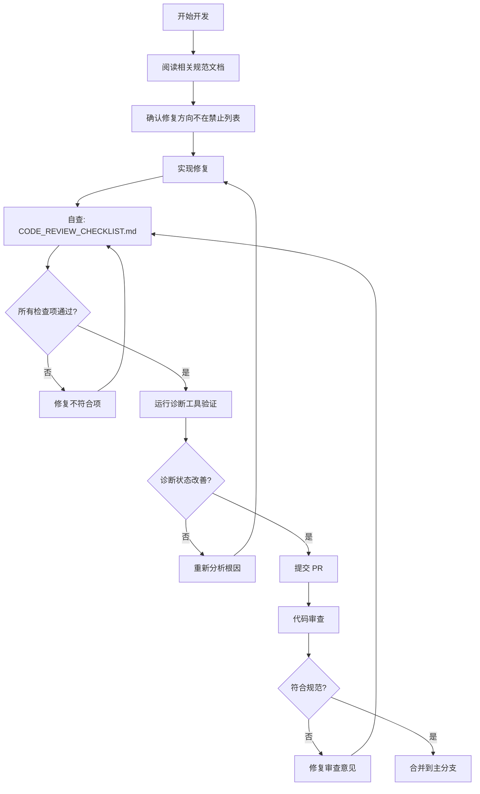

# 策略工厂规范更新报告

**日期**: 2026-06-21  
**版本**: v2.0 - 强制性规范版  
**更新类型**: 重大更新 - 从参考文档升级为强制性规范

> 更正 / 当前口径说明（截至 2026-06-23）
>
> 本文保留 2026-06-21 当时的规范升级记录，不重写原始更新时间线。需要补充的是，报告中关于“`ExecutionUniverseContract` 不存在 / 尚未回迁”“canonical bootstrap 尚未回到 `strategy-factory`”等判断已经过时。当前真实架构结论应以 `docs/factory-architecture/01`、`03`、`09`、`12`、`13` 以及仓库根目录 `四工厂独立化与MCP瘦身拆分开发方案-2026-06-23.md` 为准。

---

## 更新摘要

本次更新将策略工厂规范文档从"参考建议"升级为**强制性技术规范**，明确禁止打补丁式修复，要求所有代码修改必须按照规范进行根因修复。

### 核心变更

1. ✅ **明确规范地位** - 所有规范文档标注为"强制性规范"，不是参考建议
2. ✅ **列举禁止行为** - 明确列出 7 大类禁止的修复方式
3. ✅ **提供正确路径** - 针对 5 个根本问题，给出详细的正确修复方案
4. ✅ **建立验收标准** - 每个规范章节都包含可执行的验收标准
5. ✅ **强化代码审查** - 创建详细的代码审查清单，所有提交必须通过

---

## 更新的文档

### 1. README.md

**变更内容**：
- 添加"规范地位与强制性"章节
- 列举"违反规范的典型行为"
- 更新"目标读者与强制要求"
- 添加"强制性要求"和快速导航

**关键要求**：
> 所有策略工厂相关的代码开发、架构修改、功能添加、问题修复，**必须**先检查是否符合本规范。

### 2. 02-策略工厂全链路生命周期规范.md

**变更内容**：
- 添加"⚠️ 强制性规范"章节
- 列举 5 项禁止行为和 5 项强制要求
- 添加"规范符合性验收标准"章节
- 提供代码示例对比（正确 vs 错误）
- 添加 5 个验收项和 4 个强制性测试要求

**关键禁止行为**：
1. ❌ 禁止绕过统一生命周期状态机，从多个局部表查询拼接状态
2. ❌ 禁止把业务覆盖层状态写入数据库主状态字段
3. ❌ 禁止在没有证据表支撑的情况下，假设策略"已完成某阶段"
4. ❌ 禁止用 Quality Session 的补偿逻辑掩盖生产链路缺陷
5. ❌ 禁止把 `bootstrap_pending` 解释为 production hard gate 通过

### 3. 06-运行与诊断手册.md

**变更内容**：
- 添加"⚠️ 强制性规范"章节
- 列举 5 项禁止行为和 5 项强制要求
- 扩展"失败分级"表格，添加"禁止措施"列
- 添加"运维操作强制性规范"章节
- 添加"紧急情况处理流程"图

**关键禁止行为**：
1. ❌ 禁止通过修改 Quality Session 环境变量来掩盖生产问题
2. ❌ 禁止手工修改数据库来"修复"证据链路
3. ❌ 禁止单纯增加 timeout 数值而不诊断调度预算失配
4. ❌ 禁止把 `bootstrap_pending` 报告为"健康"或"接近通过"
5. ❌ 禁止在诊断报告中用 `success` 掩盖 `partial_infra` 或 `failed`

### 4. 11-禁止的修复方式与正确路径.md（新文档）

**目的**: 针对 5 个根本问题，列举禁止的修复方式和正确的修复路径

**涵盖问题**：
1. **问题 1**: 状态没有统一来源
   - ❌ 禁止：从多个表拼接状态
   - ✅ 正确：实现 `StrategyLifecycleLedger` 统一入口

2. **问题 2**: Quality Session 成为隐形控制面
   - ❌ 禁止：在验证脚本中启用补偿逻辑
   - ✅ 正确：Quality Session 回归纯验证

3. **问题 3**: LLM 超时是调度预算失配
   - ❌ 禁止：单纯增加 timeout
   - ✅ 正确：分阶段预算 + 批次限流

4. **问题 4**: Paper 执行双路径不一致
   - ❌ 禁止：各自实现查询逻辑
   - ✅ 正确：实现 `ExecutionUniverseContract` 统一契约

5. **问题 5**: Audit 正确卡住，但缺证据生产
   - ❌ 禁止：放宽 production hard gate 标准
   - ✅ 正确：补全证据生产链路（exit signal + stale close）

**每个问题都包含**：
- 禁止的代码示例
- 为什么禁止
- 正确的实现代码
- 验收标准

### 5. CODE_REVIEW_CHECKLIST.md（新文档）

**目的**: 提供详细的代码审查清单，确保所有提交都符合规范

**包含内容**：
- **提交前检查**（开发人员自查）: 10 大类检查项
  1. 规范符合性检查
  2. 统一状态机检查
  3. Quality Session 纯验证模式检查
  4. 调度预算检查
  5. 执行宇宙一致性检查
  6. 证据链路完整性检查
  7. Audit Gate 语义检查
  8. 健康报告诚实性检查
  9. 数据库操作检查
  10. 文档更新检查

- **代码审查检查**（审查人员）: 5 大类检查项
  1. 根因修复检查
  2. 架构一致性检查
  3. 测试覆盖检查
  4. 诊断能力检查
  5. 运维友好性检查

- **特殊场景检查**: 5 个高风险场景的额外检查项
  1. 修改 Quality Session
  2. 修改 Timeout 参数
  3. 修改 Audit Gate
  4. 添加补偿逻辑
  5. 修改状态机

- **验收测试清单**: 自动化测试 + 手工验证

- **拒绝合并的典型理由**: 7 种必须修复后才能合并的情况

---

## 规范执行机制

### 开发流程

### 验收要求

**所有代码提交必须满足**：

1. ✅ 通过 [CODE_REVIEW_CHECKLIST.md](CODE_REVIEW_CHECKLIST.md) 所有检查项
2. ✅ 运行 `diagnose_factory_health.py` 确认修复效果
3. ✅ 不引入新的"局部真相来源"
4. ✅ 不在 Quality Session 中启用补偿逻辑
5. ✅ 健康报告诚实（不掩盖 failed/partial_infra/blocked）

**如果上述任何一项不满足，代码不得合并。**

---

## 规范与代码的当前差距

### 已明确但尚未实现的组件

| 组件 | 规范要求 | 当前状态 | 优先级 |
| --- | --- | --- | --- |
| `StrategyLifecycleLedger` | 统一生命周期状态查询入口 | ❌ 不存在 | **P1** |
| `ExecutionUniverseContract` | SignalTracker 和 Incubation 共用契约 | ❌ 不存在 | **P2** |
| Exit signal generation | 生成平仓信号 | ❌ 不存在 | **P2** |
| Stale close policy | 持仓超期自动平仓 | ⚠️ 只在 Quality Session 中 | **P2** |
| 分阶段调度预算 | 按阶段设置独立 timeout | ❌ 整轮超时 | **P1** |
| 批次限流 | LLM 批次并发控制 | ❌ 全量并发 | **P1** |

### 已违反规范的代码

| 违规行为 | 位置 | 修复优先级 |
| --- | --- | --- |
| Quality Session 启用补偿逻辑 | `run_strategy_factory_quality_session.py:273-278` | **P0** - 立即停止 |
| 整轮 timeout 包住所有任务 | `_factory_scheduler_loop_parts/models.py:70-85` | **P1** - 必须修复 |
| SignalTracker 和 Incubation 各自查询策略集合 | 多处 | **P2** - 必须统一 |
| 只生产 open position，不生产 close | `incubation_parts/runtime.py` | **P2** - 必须补全 |

---

## 后续行动

### 立即行动（P0）

1. ✅ 冻结 Quality Session 的补偿开关（已通过本次规范更新明确禁止）
2. ⏳ 向所有开发人员宣导规范更新，强调强制性
3. ⏳ 设置 Git hook，在提交前检查是否修改了禁止的文件/行

### 短期行动（1-2 周，P1）

1. ⏳ 实现 `StrategyLifecycleLedger` 统一状态查询
2. ⏳ 修复调度预算失配（分阶段 + 批次限流）
3. ⏳ 创建自动化验收测试（替代手工验证）

### 中期行动（2-4 周，P2）

1. ⏳ 实现 `ExecutionUniverseContract` 统一契约
2. ⏳ 补全证据生产链路（exit signal + stale close）
3. ⏳ 重构 Quality Session 为纯验证模式

---

## 规范更新的预期效果

### 阻止新问题引入

**之前**：
- 开发人员不知道哪些做法是被禁止的
- 代码审查缺乏统一标准
- 打补丁式修复不断累积

**之后**：
- 所有禁止行为都有明确列举
- 代码审查有详细清单可依据
- 违反规范的代码无法合并

### 引导正确修复方向

**之前**：
- 遇到问题不知道如何正确修复
- 容易选择"快速但错误"的方式
- 根因问题长期得不到解决

**之后**：
- 每个常见问题都有正确修复路径
- 代码示例对比让正确做法一目了然
- 验收标准确保修复效果可验证

### 提升代码质量

**之前**：
- 多个"局部真相来源"导致状态不一致
- 验证脚本承担生产职责
- 健康报告掩盖真实问题

**之后**：
- 统一状态机作为单一真相来源
- 验证脚本回归纯验证
- 健康报告必须诚实

---

## 相关文档

- [README.md](README.md) - 规范概览和阅读顺序
- [02-策略工厂全链路生命周期规范.md](02-策略工厂全链路生命周期规范.md) - 强制性生命周期规范
- [06-运行与诊断手册.md](06-运行与诊断手册.md) - 强制性运维规范
- [11-禁止的修复方式与正确路径.md](11-禁止的修复方式与正确路径.md) - 禁止行为和正确路径
- [CODE_REVIEW_CHECKLIST.md](CODE_REVIEW_CHECKLIST.md) - 代码审查清单

---

## 附录：规范更新统计

### 文档修改统计

| 文档 | 修改类型 | 新增内容 | 修改内容 |
| --- | --- | --- | --- |
| README.md | 重大更新 | 规范地位、禁止行为、快速导航 | 目标读者、阅读顺序 |
| 02-策略工厂全链路生命周期规范.md | 重大更新 | 强制性规范、验收标准、代码示例 | 规范符合性要求 |
| 06-运行与诊断手册.md | 重大更新 | 强制性规范、运维规范、处理流程 | 失败分级 |
| 11-禁止的修复方式与正确路径.md | 新建 | 5 个问题的禁止/正确路径、代码示例 | - |
| CODE_REVIEW_CHECKLIST.md | 新建 | 10+5+5 类检查项、验收测试、拒绝理由 | - |

### 强制性要求统计

- 新增禁止行为：**17 项**
- 新增强制要求：**15 项**
- 新增验收标准：**9 项**
- 新增代码审查检查项：**50+ 项**

### 影响范围

- 受影响的开发人员：所有策略工厂相关开发人员
- 受影响的代码修改：所有策略工厂相关代码提交
- 预期拒绝率：初期可能较高（20-30%），随着宣导和理解加深逐步降低

---

**规范更新负责人**: AI Assistant  
**审批日期**: 待定  
**生效日期**: 待定（建议立即生效）
