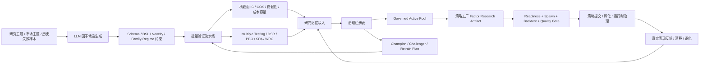

# 策略工厂与自动因子挖掘优化方案

- 日期：2026-04-01
- 适用仓库：`/Users/mac/Desktop/股票`
- 覆盖范围：`packages/strategy-factory`、`packages/akshare-mcp`、`apps/bff/src/strategy`、`apps/bff/src/factor`、`apps/web/app/factor`

## 一、执行摘要

当前仓库已经具备“策略工厂”和“自动因子挖掘”的核心工程骨架，但两条链路的成熟度并不对称。策略工厂侧已经有较完整的调度、readiness、质量门禁、去重、提交、孵化与运行时治理结构；自动因子挖掘侧也已经具备候选生成、候选验证、研究记忆和候选池治理的模块化能力。问题在于，这些能力目前还没有稳定地形成“生成 -> 验证 -> 治理入池 -> 被策略工厂消费 -> 结果反馈回研究记忆”的闭环。

从实际质量看，项目现在更像是“有工厂骨架、因子研究能力分散存在、但闭环自动化尚未完全打通”的状态。策略生成质量更多依赖下游的工厂级质量门禁，而不是依赖上游稳健的自动因子治理体系。因此，优化重点不应只是提升 LLM 生成数量，而应优先补足闭环编排、验证门槛、一致性治理和可回放性。

这份方案的核心目标有三点：

1. 把自动因子挖掘从“会生成”提升为“会验证、会留痕、会治理、可入池”。
2. 把策略工厂从“消费因子摘要”提升为“消费有治理证据的因子池和研究血缘”。
3. 把当前零散的研究、验证、回放、模型注册能力收束成稳定的质量闭环。

## 二、当前真实实现全景

### 2.1 策略工厂实际链路

当前策略工厂的真实入口和主干路径是：

- MCP 入口：`packages/akshare-mcp/src/akshare_mcp/tools/managers/strategy_manager.py`
- 工厂调度：`packages/strategy-factory/src/strategy_factory/application/factory_scheduler.py`
- 单次运行编排：`packages/strategy-factory/src/strategy_factory/application/cycle_runner.py`
- 因子研究 artifact 组装：`packages/strategy-factory/src/strategy_factory/application/factor_research.py`
- 质量门禁与提交：`packages/strategy-factory/src/strategy_factory/application/quality_gates.py`、`deduplicator.py`、`submission_gate.py`、`submitter.py`

实际执行流程可概括为：

1. `strategy_manager` 触发工厂运行或查询工厂状态。
2. `factory_scheduler` 负责调度、启动 warmup、调用单次 cycle。
3. `cycle_runner` 依次执行：
   - `collect`
   - `factor_research`
   - `readiness`
   - `spawn/autonomy`
   - `backtest / quality_gate`
   - `dedup`
   - `submit`
   - `incubation / vector / experiment / runtime`
4. `factor_research` 会读取快照中的因子历史，并尝试从 `quant_manager(action="factor_candidate_registry", op="active_pool")` 拉取治理后的候选池。
5. readiness 决定这轮工厂是否继续推进，并将结果汇总到 summary 中。

结论：策略工厂已经是“真实可运行的后端编排系统”，不是只有 UI 页面；但它对上游因子质量的信任基础，当前主要来自 `factor_candidate_registry(active_pool)` 的治理结果，而不是来自调度器自身对因子挖掘闭环的保证。

### 2.2 自动因子挖掘实际链路

当前自动因子挖掘的核心入口和主干路径是：

- MCP 入口：`packages/akshare-mcp/src/akshare_mcp/tools/managers/quant_manager.py`
- 候选生成：`packages/akshare-mcp/src/akshare_mcp/tools/managers/quant_mgr_generation.py`
- 候选验证：`packages/akshare-mcp/src/akshare_mcp/tools/managers/quant_mgr_validation.py`
- 验证流水线：`packages/akshare-mcp/src/akshare_mcp/services/factor_validation_pipeline.py`
- 研究记忆 / 候选池治理：`packages/akshare-mcp/src/akshare_mcp/tools/managers/quant_mgr_registry.py`、`packages/akshare-mcp/src/akshare_mcp/services/factor_research_memory.py`
- 调度器：`packages/akshare-mcp/src/akshare_mcp/services/factor_scheduler.py`

实际执行流程可概括为：

1. `quant_manager(action="llm_factor_mining")` 生成候选因子 artifact。
2. `quant_manager(action="validate_factor_candidate")` 编译 DSL，并完成横截面、OOS、稳健性、成本容量等验证。
3. 验证结果可以写入研究记忆和 artifact 注册表。
4. `quant_manager(action="factor_candidate_registry")` 基于验证 artifact 汇总治理后的候选池。
5. `strategy_factory.factor_research` 仅读取治理后的 `active_pool`，不会直接消费原始 LLM 产物。

结论：自动因子挖掘模块是“分层能力完整，但调度闭环不完整”。生成、验证、记忆、治理都存在，但没有稳定地被调度器串成自动闭环。

## 三、现状诊断与质量判断

### 3.1 已有优势

- 已有分层清晰的工程结构，不是把所有逻辑塞进单一 manager。
- 策略工厂有 readiness、quality gate、dedup、submit、runtime 的真实门禁。
- 因子挖掘不只停留在 IC 计算，还包含 DSL 编译、OOS、稳健性、相似度、成本容量等扩展验证。
- 已有 `factor_research_memory`、`factor_candidate_registry`、`replay_factor_episode` 等后续治理接口，说明架构方向是对的。

### 3.2 当前核心缺口

#### 缺口 1：调度器没有把因子生成闭环推进到治理入池

已确认 `packages/akshare-mcp/src/akshare_mcp/services/factor_scheduler.py` 在自动路径中只执行了 `llm_factor_mining`，没有继续执行 `validate_factor_candidate`，也没有刷新 `factor_candidate_registry(active_pool)` 所依赖的治理结果。

这意味着：

- 调度器显示绿色，不代表 governed candidate pool 是新的。
- 策略工厂读取到的 `active_pool` 可能是陈旧的，甚至是空的。
- 当前系统自动化的是“生成”，不是“生成 -> 验证 -> 治理”。

#### 缺口 2：策略工厂 stale 因子刷新路径会直接报错

已确认 `packages/strategy-factory/src/strategy_factory/application/cycle_runner.py` 使用了 `asyncio.wait_for(...)` 和 `asyncio.TimeoutError`，但文件顶部没有导入 `asyncio`。

这意味着：

- 一旦 `factor_research.summary.stale == true`，刷新路径会触发 `NameError`。
- 工厂不会拿到刷新后的 artifact，而是退回 degraded/fallback 结果。
- readiness 和质量判断建立在错误的 fallback 上。

#### 缺口 3：验证入口与多重检验门槛不一致

已确认 `packages/akshare-mcp/src/akshare_mcp/tools/managers/quant_mgr_validation.py` 允许仅用 3 个股票代码进入验证，而下游多重检验审计至少要 4 个股票才可用。

这意味着：

- 候选因子可能在没有真正 multiple-testing evidence 的情况下获得 `review` 或 `promote`。
- 注册表当前只硬阻断 `high` 风险，而对“审计不可用”只是中等惩罚。
- 结果是 3 票样本的候选仍可能进入 `active_pool`。

#### 缺口 4：model registry / champion-challenger 控制面没有真正接到 quant_manager

当前仓库已有：

- `packages/akshare-mcp/src/akshare_mcp/services/rolling_model_registry.py`
- `packages/akshare-mcp/src/akshare_mcp/services/model_retrain_scheduler.py`

但 `quant_manager.py` 当前暴露的 action 中，没有把 `model_registry` 和 `champion_challenger` 这类能力真正接出来。

这意味着：

- 模型注册、冠军/挑战者评审、生命周期扫描、重训练计划和执行状态虽然在测试和服务设计中被期待，但在实际工具路由里并未形成稳定入口。
- 因子验证成果无法自然进入“上线治理”层。

### 3.3 对策略生成质量的总体判断

当前策略生成质量评估结论如下：

- 中游和下游质量控制相对较强：readiness、quality gate、dedup、submit、runtime 管控已经形成骨架。
- 上游因子研究闭环偏弱：生成很多，但验证门槛不完全对齐，治理入池不稳定，回流路径不完整。
- 因此，当前策略质量更依赖“工厂后置筛选”，而不是“因子前置治理”。

一句话判断：现在的系统更像“下游工厂比较认真、上游研究闭环还没有完全工程化”。

## 四、外部研究对本项目最有价值的结论

### 4.1 因子生成不应只是自由生成，而应是“受约束的研究代理”

近期自动 alpha/factor 研究普遍强调三点：

- LLM 不应直接产出最终可交易因子，而应产出带有结构约束、研究理由、预期 regime、持有期假设、可验证表达式的候选。
- 候选生成需要带“新颖性约束”，避免在记忆库里反复生成同构信号。
- 生成后需要自动进入批量回放和验证，而不是停在 artifact 生成。

这与当前仓库很契合，因为仓库已经有 DSL 编译器、memory 和 registry，只差把三者串起来。

### 4.2 多重检验和回测过拟合必须从“加分项”变成“入池硬门槛”

外部研究对量化研究的共识非常明确：

- 大规模尝试因子后，传统单次显著性几乎必然高估真实效果。
- 需要引入 purged / combinatorial cross-validation、DSR、PBO、SPA、White Reality Check 等纠偏手段。
- “没有证据”不能等同于“风险中等”，在自动化系统里应默认阻断，而不是默认放行。

这对当前项目的启示是：

- multiple-testing 审计不可用时，不应只降分，应该阻止进入 governed `active_pool`。
- 工厂 readiness 不应只看“有没有因子池”，还要看“因子池中的证据是否完整”。

### 4.3 编排层需要可恢复、可回放、可观测

工作流系统的最佳实践表明，研究生成、验证、回放、入池、策略工厂消费这些动作应具备：

- 幂等性
- 明确阶段状态
- 超时与重试边界
- 可恢复的 run 记录
- 输入输出 artifact 血缘

这对本项目的启示是：

- `factor_scheduler` 和 `factory_scheduler` 不能只记录“是否跑过”，还要记录“跑到哪一步、哪一步失败、对应产物是什么”。
- 调度状态绿色必须能对应到真实产物 freshness 和血缘，而不是只对应一个时间戳。

### 4.4 registry 和 feature governance 需要统一语义

MLflow/Feast 一类系统最值得借鉴的不是具体产品，而是三种统一语义：

- artifact / model / feature 都有稳定 ID 和 lineage
- promotion 有明确 stage，不是只靠一个 recommendation 字段
- 在线消费和离线研究共享同一套 freshness / data quality 语义

这对本项目的启示是：

- 因子候选、模型注册、策略工厂消费应该共享统一的 stage 和 lineage 语言。
- `review/promote` 还不够，建议扩展为 `draft -> validated -> governed -> champion/challenger -> retired`。

## 五、目标架构



目标不是把所有事情都塞给一个调度器，而是形成一条清晰的证据链：

- 每个候选从哪里来
- 经过了哪些验证
- 为什么能入池
- 被哪些策略消费
- 后续表现如何
- 是否该保留、降级、重训、淘汰

## 六、仓库定制化改造蓝图

### 6.1 P0：先修“真实会坏”的路径，补上最小闭环

目标周期：1 到 3 天

#### P0-1 修复 stale factor refresh 直接崩溃

改造目标：

- 在 `packages/strategy-factory/src/strategy_factory/application/cycle_runner.py` 补齐 `asyncio` 导入。
- 确保 stale artifact auto-refresh 成功后，重新构建 factor artifact，而不是落回 degraded fallback。

验收标准：

- `test_scheduler_refreshes_stale_factor_research_before_continuing` 通过。
- `test_scheduler_runs_startup_warmup_before_collect` 通过。
- `test_scheduler_summary_exposes_run_level_audit_metrics` 通过。

#### P0-2 把 factor_scheduler 从“只生成”升级为“生成 -> 验证 -> 入治理池”

改造目标：

- 在 `packages/akshare-mcp/src/akshare_mcp/services/factor_scheduler.py` 中，为每次 `llm_factor_mining` 结果补一段候选批处理：
  - 逐个或批量调用 `validate_factor_candidate`
  - 汇总 validation artifact
  - 刷新 registry summary / active_pool
- 如果 validation 全失败，调度结果必须反映“生成成功但治理失败”，而不是直接显示绿色。

建议增加的调度元信息：

- `generated_candidate_count`
- `validated_candidate_count`
- `validation_failed_count`
- `registry_refresh_status`
- `active_pool_count_after_run`
- `governed_active_count_after_run`

改造文件：

- `packages/akshare-mcp/src/akshare_mcp/services/factor_scheduler.py`
- `packages/akshare-mcp/src/akshare_mcp/tools/managers/quant_mgr_generation.py`
- `packages/akshare-mcp/src/akshare_mcp/tools/managers/quant_mgr_validation.py`
- `packages/akshare-mcp/src/akshare_mcp/tools/managers/quant_mgr_registry.py`

验收标准：

- 调度器状态绿色时，`active_pool` 必须同步更新。
- 若本轮有生成无验证，scheduler summary 必须明确标记为 partial/degraded。
- 策略工厂读取到的 governed pool freshness 与 scheduler 最近一次有效入池时间一致。

#### P0-3 对齐验证样本门槛，杜绝 3-code 候选误入池

改造目标：

- 将 `validate_factor_candidate` 的最小 `codes` 数量提高到至少 4。
- 或者保留 3-code 本地分析能力，但对 registry admission 增加硬门槛：
  - `multiple_testing.available == false` 时，禁止进入 governed `active_pool`
  - 或明确标记为 `blocked`

建议优先方案：

- 研究阶段允许低样本探索。
- 治理入池阶段强制 `n_stocks >= 4`，并要求 multiple-testing 审计可用。

改造文件：

- `packages/akshare-mcp/src/akshare_mcp/tools/managers/quant_mgr_validation.py`
- `packages/akshare-mcp/src/akshare_mcp/services/factor_validation_pipeline.py`
- `packages/akshare-mcp/src/akshare_mcp/tools/managers/quant_mgr_registry.py`

验收标准：

- 3-code 候选不能进入 `active_pool`。
- `risk_audit.multiple_testing_available == false` 时默认 blocked，而不是仅降分。

#### P0-4 把 champion-challenger / model registry 接入 quant_manager

改造目标：

- 在 `quant_manager.py` 中补齐以下 action：
  - `champion_challenger`
  - `model_registry`
- 建议新增独立 handler 模块，例如：
  - `packages/akshare-mcp/src/akshare_mcp/tools/managers/quant_mgr_model_registry.py`

该模块至少要支持：

- `review`
- `list`
- `summary`
- `lifecycle_scan`
- `schedule_retrain`
- `retrain_list`
- `retrain_summary`
- `execute_retrain`
- `retrain_status`

并与现有服务对接：

- `rolling_model_registry.py`
- `model_retrain_scheduler.py`
- `replay_factor_episode`
- `factor_candidate_registry`

验收标准：

- `test_quant_manager_model_registry_and_champion_challenger_review` 通过。
- `test_quant_manager_model_registry_lifecycle_scan_and_retrain_plan` 通过。
- `test_quant_manager_execute_retrain_and_retrain_status` 通过。

#### P0-5 收紧策略工厂 readiness 的因子证据要求

改造目标：

- 在 `strategy_factory` 的 readiness 中增加“证据完整性”概念，而不是只看 governed pool 是否存在。
- 具体建议：
  - `active_candidate_count == 0` 且调度器宣称最近运行成功时，标记 warning
  - governed pool 中 blocked 比例过高时，降低 readiness score
  - 因子 freshness 不只看 IC history，也看 governed pool 的最近验证时间

改造文件：

- `packages/strategy-factory/src/strategy_factory/application/factor_research.py`
- `packages/strategy-factory/src/strategy_factory/application/cycle_runner.py`

### 6.2 P1：提升因子生成与治理质量，让系统“更会选”

目标周期：1 到 2 周

#### P1-1 让 LLM 候选生成从单次产出升级为“研究 episode”

建议做法：

- 每次 `llm_factor_mining` 不只输出候选列表，还输出：
  - 研究主题
  - 假设摘要
  - 预期适用 regime
  - 预期持有期
  - 与现有 memory 的相似度摘要
  - 候选的新颖性说明
- 在生成阶段先做 schema、DSL 可编译性和 memory novelty 预筛。

改造价值：

- 降低无效候选进入验证流水线的比例。
- 让后续 replay 与 retrain 有更完整的研究上下文。

#### P1-2 把 multiple-testing 纠偏从“附加报告”升级为“治理评分主轴”

建议做法：

- 对 `factor_validation_pipeline.py` 的综合评分逻辑进行重构，把以下结果提升为主评分维度：
  - purged / k-fold 稳定性
  - degradation
  - DSR
  - PBO
  - SPA / White Reality Check
- 将当前“审计不可用 -> 中等惩罚”改为：
  - 研究可继续
  - 入池不允许

改造价值：

- 大幅降低“看起来有 IC、其实是数据窥探”的候选入池概率。

#### P1-3 重构 registry 状态机

建议把当前 recommendation 体系扩展为更稳定的 stage 体系：

- `draft`
- `validated`
- `governed`
- `challenger`
- `champion`
- `retired`

配套要求：

- `factor_candidate_registry(active_pool)` 只暴露 `governed/challenger/champion`
- `champion/challenger` 与 factor family、expected regime、数据窗口保持血缘绑定
- retirement 必须带 reason code

#### P1-4 让策略工厂消费“因子血缘”，而不是只消费摘要

建议做法：

- `factor_research.build()` 中不仅拉 `top_candidates`，还应拉：
  - source generation artifact id
  - validation artifact id
  - family
  - expected regime
  - latest validation age
  - blocked reason counts
- 在策略生成 spec 中写入 factor lineage，用于后续 review report、runtime 风控、退化归因。

改造价值：

- 工厂产出的策略不再是“引用了一组名字不明的因子”，而是能追到研究来源和验证证据。

#### P1-5 增加面向运营的可观测性

建议增加 BFF/Web 可读的状态面板：

- 最近一次自动挖掘 run 的候选数、通过数、入池数
- governed pool 各 family / regime 分布
- blocked reason 分布
- champion/challenger 数量
- retrain plan 队列

优先落点：

- `apps/bff/src/factor`
- `apps/bff/src/strategy`
- `apps/web/app/factor`

### 6.3 P2：做成真正可持续迭代的研究操作系统

目标周期：2 到 4 周

#### P2-1 引入 durable workflow 语义

不一定要立刻引入完整的 Temporal，但建议至少在语义上对齐：

- 每个 run 有稳定 run_id
- 每一步有 stage 状态和重试边界
- 失败可恢复
- artifact 血缘可回放

可先在现有调度器中实现轻量版状态机，再评估是否迁移到更强的工作流引擎。

#### P2-2 统一 feature / factor / model registry 语义

建议逐步形成统一数据层：

- 因子候选 registry
- 研究记忆 memory
- model registry
- retrain plan registry
- strategy lineage registry

最终目标不是引入新组件本身，而是让系统具备统一查询语言：

- “这个策略引用了哪些 governed 因子？”
- “这个因子来自哪次生成，最近一次验证何时完成？”
- “这个 champion 因子是否已出现退化并触发 retrain？”

#### P2-3 引入真实结果反馈闭环

建议将以下反馈写回 memory / registry：

- 策略孵化期 forward return
- runtime 风险事件
- 因子拥挤度变化
- factor decay / regime shift

这一步完成后，自动因子挖掘才真正变成“会学习的研究系统”，而不是只会不断生成新候选。

## 七、建议的实施顺序

### Sprint 1

- 修复 `cycle_runner.py` 的 stale refresh 崩溃
- 把 `factor_scheduler.py` 串成生成 -> 验证 -> registry 刷新
- 对齐 validation / registry 的最小样本门槛
- 接出 `champion_challenger` 与 `model_registry`

### Sprint 2

- 重构 validation 评分与 blocked 规则
- 重构 registry stage 体系
- 在 `factor_research` 中引入因子血缘字段
- 调整 readiness，使其基于治理证据而不是只基于存在性

### Sprint 3

- 做研究 episode、replay、retrain 的闭环编排
- 做统一可观测性面板
- 做策略结果反馈回 memory / registry

## 八、测试与验收清单

### 8.1 必跑测试

```bash
pytest -q packages/strategy-factory/tests/test_factory_scheduler_readiness_controls.py
pytest -q packages/strategy-factory/tests/test_factor_research_freshness.py
pytest -q packages/strategy-factory/tests/test_quality_gates_runtime_execution.py
pytest -q packages/akshare-mcp/tests/test_factor_llm_p0.py
pytest -q packages/akshare-mcp/tests/test_factor_memory_p2.py
pytest -q packages/akshare-mcp/tests/test_strategy_factory_components.py
```

### 8.2 P0 完成判据

- stale factor refresh 不再报 `NameError`
- scheduler 一次成功运行后，能看到新的 validation artifact 和新的 governed `active_pool`
- 3-code 候选不会进入 `active_pool`
- `champion_challenger` 与 `model_registry` 能在 `quant_manager` 中正常调用
- strategy factory readiness summary 能反映 governed pool freshness 和 blocked 情况

### 8.3 中长期质量指标

- 自动挖掘每轮 `validated_candidate_count / generated_candidate_count`
- governed `active_pool` 的 family 多样性和 regime 覆盖度
- 入池候选的 multiple-testing evidence 完整率
- 被策略工厂实际消费的 governed 因子占比
- champion 因子的平均存活周期与 retrain 触发率
- 策略上线后 1 周 / 1 月的因子退化检测命中率

## 九、我建议你们优先做的 5 件事

1. 先修 `cycle_runner.py` 的 `asyncio` 缺失，这会直接影响工厂真实性能判断。
2. 立刻把 `factor_scheduler.py` 串成最小闭环，否则自动挖掘对策略工厂几乎没有持续供给价值。
3. 立刻阻断“multiple-testing 不可用仍可入池”的路径，这是质量底线问题。
4. 把 `model_registry` 和 `champion_challenger` 接到 `quant_manager`，否则重训练和生命周期治理无法闭环。
5. 让策略工厂读取“因子血缘 + freshness + blocked 证据”，而不是只读取一个候选池摘要。

## 十、参考依据

### 自动因子挖掘与研究代理

- [AlphaAgent](https://arxiv.org/abs/2502.16789)
- [Navigating the Alpha Jungle](https://arxiv.org/abs/2505.11122)
- [AlphaCFG](https://arxiv.org/abs/2601.22119)
- [QuantaAlpha](https://arxiv.org/abs/2602.07085)
- [FactorMiner](https://arxiv.org/abs/2602.14670)

### 多重检验、回测过拟合与研究纠偏

- [Backtest Overfitting in the Machine Learning Era](https://ssrn.com/abstract=4686376)
- [A Backtesting Protocol in the Era of Machine Learning](https://ssrn.com/abstract=3177057)
- [How the Sharpe Ratio Died](https://ssrn.com/abstract=3173146)
- [Thousands of Alpha Tests](https://doi.org/10.1093/rfs/hhaa111)
- [Data-Snooping and Technical Trading Rule Performance](https://doi.org/10.1093/jjfinec/nbi026)

### 编排、注册表与特征治理

- [Temporal Documentation](https://docs.temporal.io/)
- [MLflow Model Registry](https://mlflow.org/docs/latest/ml/model-registry/)
- [MLflow Registry Workflow](https://mlflow.org/docs/latest/ml/model-registry/workflow/)
- [Feast Use Cases](https://docs.feast.dev/master/getting-started/use-cases)
- [Feast Push vs Pull Model](https://docs.feast.dev/v0.46/getting-started/architecture/push-vs-pull-model)
- [Feast Data Quality Monitoring](https://docs.feast.dev/master/reference/dqm)

## 十一、结论

这套系统已经不是从零开始，真正缺的不是“再多写几个因子”或“再接一个模型”，而是把现有能力编排成闭环，并把证据门槛从“可选”改成“默认必需”。只要先完成 P0，项目就会从“局部先进、整体松散”进入“链路打通、质量可控”的阶段；完成 P1 之后，策略工厂和自动因子挖掘才会真正形成互相增强的研究生产系统。
