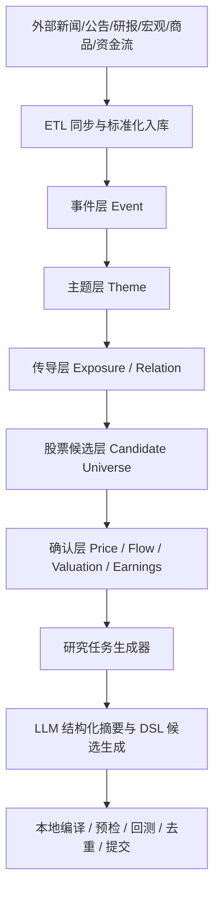

# 策略工厂事件驱动重构开发方案

## 2026-03-21 校准补充

- 本文现在应与根目录 `策略工厂整改详细清单.md` 保持同一整改口径，但要区分**当前代码现状**与**整改目标**。
- 当前代码现状：`strategy_preferences` 在提交门禁中默认仍可能作为硬门禁；整改目标是把它降级为软排序线索，而不是独立阻断规则。
- 当前代码现状：事件任务已在提交门禁中检查 `candidate_symbols` 对 `target_symbols` 的覆盖率，但回测阶段仍会混入代表股；整改目标是让事件链路做到全链 strict target consistency，避免被“行业字符串命中 + 大市值代表股”稀释。
- 当前代码现状：`refresh_existing` 在提交端默认要求 strict pass，但其在去重层的推断条件仍偏宽；整改目标是进一步收窄到“同血缘、同目标、同策略骨架、strict pass 通过”才允许刷新，否则应落为新候选。
- AI 的职责边界要再收窄一步：它可以标准化证据、压缩上下文、生成模板化 DSL，但不能突破目标池、不能替换一致性校验、不能掩盖 gate failure。

## 1. 文档目的

本方案用于指导策略工厂从“快照压缩 + 通用候选生成”模式，重构为“事件驱动 + 主题传导 + 暴露映射 + 市场确认 + 模板化策略生成”模式。

目标不是让 AI 看更多数据，而是让系统先有规律地选择研究证据，再基于高价值证据生成研究任务与候选策略。

本方案默认以下原则成立：

- 策略工厂运行时应尽量只读数据库，不在主流程中临时发起不可控的外部请求。
- 外部数据抓取应前移到独立 ETL 或同步任务，入库后再供策略工厂消费。
- LLM 只负责结构化摘要、事件标准化、别名扩展和模板化 DSL 生成，不负责直接决定股票池。
- 股票池必须由事件、主题、暴露、资金、价格和质量门禁共同决定。
- 任务一致性门禁必须输出结构化 `rule_id / blocking_reason / evidence_refs`，不能只给自然语言解释。

## 2. 现状问题

当前实现的核心问题不在 token 上限，而在研究对象定义方式错误。

### 2.1 当前研究任务来源过于粗糙

现有 `MarketOpportunityScanner` 主要依赖以下字段生成研究任务：

- `fear_greed_index`
- `hot_sectors`
- `cold_sectors`
- `factor_ic_trend`

并通过字符串匹配行业名称，再按市值排序取前几只股票作为 `target_symbols`。

这种方式的问题是：

- 只能看到聚合结果，看不到事件本身。
- 无法表达“地缘冲突 -> 原油涨价 -> 上游受益 / 下游受损”的方向性传导。
- 无法表达正负影响、持续时间、冲击强度、置信度等研究核心变量。
- 行业字符串命中并不等于业务暴露命中。
- 候选股票池缺乏事件相关性约束，容易退化成大市值常见股票集合。

### 2.2 LLM 输入被迫承担了错误职责

当前 external LLM provider 接收的是压缩后的：

- 市场快照
- 简化后的研究上下文
- 历史实验摘要
- 有限数量的候选股票信息

这会导致两个问题：

- 在进入 LLM 之前，很多真正关键的信息已经丢失。
- LLM 被迫在缺少事件证据和传导证据的情况下猜测研究方向。

结果是：

- LLM 更像在“给快照配一个故事”，不是在“围绕事件做研究”。
- 策略生成容易流于通用技术规则，缺乏真实市场驱动逻辑。

### 2.3 数据获取与策略运行边界不清晰

当前策略工厂主流程中还混杂了：

- 北向资金外部拉取
- 两融外部拉取
- 板块资金流外部拉取
- 指数 K 线多源降级拉取
- external LLM 网络请求

这不利于：

- 运行稳定性
- 结果可复现性
- 故障定位
- 离线模式
- 数据审计

## 3. 重构目标

重构后的策略工厂需要满足以下目标：

### 3.1 研究定义目标

- 研究任务应围绕“事件 / 主题 / 传导方向 / 股票子池”展开。
- 每个研究任务必须有明确证据包，而不是只依赖市场快照。
- 每个任务必须说明为什么研究这些股票，而不是别的股票。

### 3.2 运行方式目标

- 策略工厂运行时默认只读数据库。
- 外部新闻、商品、资金和事件数据通过独立任务提前入库。
- 运行结果应具备可追溯证据链。

### 3.3 AI 使用目标

- AI 负责标准化和总结，不负责直接替代筛选逻辑。
- AI 的输出必须服从固定结构，不允许自由生成不受约束的股票池。
- AI 必须建立在数据库已经筛出的高相关候选集上运行。

### 3.4 评估目标

- 候选池和事件之间具备更高相关性。
- 生成的研究任务具备更高解释性。
- 策略通过率和样本外稳定性优于当前方案。

## 4. 目标架构

## 4.1 分层架构



### 4.2 各层定义

#### A. ETL 入库层

职责：

- 拉取新闻、公告、研报、宏观、商品、资金流等数据。
- 做去重、标准化、时间对齐、来源标记。
- 存入数据库供后续层消费。

要求：

- 与策略工厂主调度解耦。
- 可单独重跑。
- 每类数据具备最新时间戳和源状态。

#### B. 事件层 Event

职责：

- 从文本和结构化数据中提取事件。
- 标准化事件类型、主体、客体、地理区域、商品、方向和时间窗。

典型字段：

- `event_type`
- `event_name`
- `source_type`
- `occurred_at`
- `entities`
- `commodities`
- `regions`
- `sentiment`
- `direction`
- `intensity`
- `horizon`
- `confidence`

#### C. 主题层 Theme

职责：

- 把事件映射为标准主题，不依赖简单关键词命中。
- 支持一对多映射和正负双向映射。

示例：

- 中东战事升级
  - 上游油气：正向
  - 油服设备：正向
  - 油运航运：视运价与制裁路径而定
  - 航空：负向
  - 高能耗化工：负向

#### D. 传导层 Exposure / Relation

职责：

- 解决“事件为什么会影响这家公司”的问题。
- 建立公司与主题、公司与商品、公司与供应链之间的关系。

需要覆盖：

- 行业归属
- 概念归属
- 上下游关系
- 海外区域敞口
- 收入来源暴露
- 成本敏感度暴露
- 商品 beta

#### E. 候选层 Candidate Universe

职责：

- 依据事件、主题和暴露关系，从全市场筛出高相关股票集合。
- 这是 LLM 能看到的股票集合上限，不允许让 LLM 自由扩展到全市场。

#### F. 确认层 Confirmation

职责：

- 对事件相关候选集做价格和资金验证。

确认信号建议包括：

- 近 5/20 日收益
- 成交量放大
- 资金流入
- 北向增持
- 两融变化
- 业绩预期修正
- 公告密度
- 估值位置

#### G. 研究任务层

职责：

- 把高相关事件和高相关股票子池组织成结构化研究任务。

每个任务至少应包含：

- `event_id`
- `theme_id`
- `direction`
- `horizon`
- `candidate_symbols`
- `target_symbol_policy`
- `strict_target_match`
- `evidence_bundle`
- `strategy_preferences`
- `priority`

#### H. LLM 层

职责应限制为：

- 事件摘要与标准化补全
- 别名扩展
- 证据归纳
- 模板化 DSL 候选生成

不应承担：

- 自由定义股票池
- 自由解释市场主题
- 在缺乏证据时拍脑袋造研究方向

## 5. 核心数据模型设计

建议在数据库中新增以下表。

### 5.1 `event_raw`

用途：保存原始事件文本和来源元数据。

建议字段：

- `id`
- `source_type`
- `source_name`
- `source_key`
- `title`
- `content`
- `published_at`
- `ingested_at`
- `language`
- `url`
- `dedup_hash`

### 5.2 `event_cluster`

用途：把多条相似新闻归并为一个标准事件。

建议字段：

- `id`
- `cluster_key`
- `event_type`
- `event_name`
- `summary`
- `direction`
- `intensity`
- `horizon`
- `confidence`
- `first_seen_at`
- `last_seen_at`
- `status`

### 5.3 `theme_ontology`

用途：定义主题本体和映射规则。

建议字段：

- `id`
- `theme_code`
- `theme_name`
- `parent_theme_code`
- `description`
- `default_direction_rule`
- `active`

### 5.4 `event_theme_hypothesis`

用途：表示某事件对某主题的潜在影响。

建议字段：

- `id`
- `event_id`
- `theme_id`
- `impact_direction`
- `impact_strength`
- `reasoning`
- `confidence`
- `created_at`

### 5.5 `company_theme_exposure`

用途：保存公司对主题的长期暴露度。

建议字段：

- `id`
- `symbol`
- `theme_id`
- `exposure_type`
- `exposure_score`
- `evidence_type`
- `evidence_ref`
- `updated_at`

### 5.6 `company_relation_edge`

用途：保存供应链、竞争、区域、商品等关系边。

建议字段：

- `id`
- `src_symbol`
- `dst_symbol`
- `relation_type`
- `weight`
- `direction`
- `evidence_ref`
- `updated_at`

### 5.7 `company_event_signal`

用途：保存某股票对某事件的即时信号评分。

建议字段：

- `id`
- `event_id`
- `symbol`
- `theme_score`
- `exposure_score`
- `price_confirm_score`
- `flow_confirm_score`
- `fundamental_confirm_score`
- `final_score`
- `updated_at`

### 5.8 `research_task_evidence`

用途：保存研究任务的证据包。

建议字段：

- `id`
- `task_key`
- `event_id`
- `theme_id`
- `symbol`
- `evidence_type`
- `evidence_payload`
- `weight`
- `created_at`

## 6. 模块重构方案

### 6.1 `collect.py`

当前职责偏向生成市场快照。重构后应拆为两类职责：

- `daily_market_snapshot`
- `event_theme_evidence_snapshot`

建议新增能力：

- 从数据库读取最近事件簇。
- 从数据库读取主题影响和公司暴露。
- 聚合公司级确认信号。
- 输出结构化证据摘要，而不是只有市场聚合数值。

### 6.2 `opportunity.py`

这是本次改造的第一优先模块。

应从当前的：

- 快照字段 -> 研究任务

改为：

- 事件簇 + 主题映射 + 公司暴露 + 确认信号 -> 研究任务

建议输出任务结构：

```json
{
  "task_key": "event_theme:2026-03-09:middle_east_oil_supply:upstream_oil_gas",
  "event_id": "evt_xxx",
  "theme_id": "theme_upstream_oil_gas",
  "theme": "upstream_oil_gas",
  "direction": "positive",
  "horizon": "swing_5_20d",
  "candidate_symbols": ["600028", "601857"],
  "strategy_preferences": ["momentum", "ma_cross"],
  "evidence_bundle": {
    "event_summary": "...",
    "theme_reason": "...",
    "symbol_scores": []
  }
}
```

### 6.3 `strategy_llm_provider.py`

建议收窄职责，保留以下用途：

- 补全事件摘要
- 归纳证据重点
- 在严格结构下生成 DSL 候选

建议移除或限制以下能力：

- 让 LLM 自由选择全市场股票
- 让 LLM 根据泛化快照自行决定主题

建议输入改为：

- 单个研究任务的证据包
- 限定候选股票列表
- 限定主题与方向
- 限定允许生成的 DSL 结构

### 6.4 `strategy_autonomy.py`

建议把自治生成入口由“市场快照驱动”改成“研究任务驱动”。

需要新增：

- 证据包传递
- 任务内股票子池约束
- LLM 输出与任务证据的一致性校验
- 事件主题标签写回候选策略元数据

### 6.5 `factory_scheduler.py`

建议改为编排以下阶段：

1. 读取当日数据库快照
2. 拉取事件簇和主题候选
3. 生成研究任务
4. 对研究任务调用自治生成
5. 回测与质量门禁
6. 归档证据和实验结果

### 6.6 新增 ETL 模块

建议新增独立模块，例如：

- `event_ingest.py`
- `theme_mapper.py`
- `exposure_builder.py`
- `signal_confirm.py`

这些模块应在策略工厂主运行之前完成数据更新。

## 7. LLM 职责边界

### 7.1 允许 LLM 做的事

- 将事件文本标准化为固定结构。
- 识别事件别名和主题别名。
- 对证据进行压缩摘要。
- 在固定股票池范围内生成 DSL 候选。
- 输出研究理由和风险提示。

### 7.2 不允许 LLM 做的事

- 从全市场自由选股。
- 在没有证据的情况下定义主题。
- 把行业名称字符串匹配当成公司暴露关系。
- 跳过数据库筛选直接决定任务优先级。

### 7.3 推荐调用方式

LLM 请求必须是单任务、单证据包、单股票子池，而不是整个市场的总览压缩包。

推荐 prompt 约束：

- 明确 `event`
- 明确 `theme`
- 明确 `direction`
- 明确 `candidate_symbols`
- 明确 `evidence_summary`
- 明确 `output_contract`

## 8. 分阶段实施计划

### Phase 0: 基线冻结

目标：记录当前策略工厂作为对照组。

任务：

- 保存当前运行结果与关键指标。
- 固化现有回测门槛。
- 记录策略通过率、提交率、平均耗时。

交付物：

- 基线报告
- 基线运行样本

### Phase 1: 数据层重构

目标：引入事件和主题相关表，建立独立入库通道。

任务：

- 新增数据库 schema。
- 实现新闻/公告/研报/宏观/商品 ETL。
- 构建 `event_raw` 和 `event_cluster`。
- 初步建立 `theme_ontology`。

交付物：

- 迁移脚本
- ETL 作业
- 基础事件库

### Phase 2: 暴露层与传导层

目标：把事件影响映射到具体股票。

任务：

- 建立 `company_theme_exposure`。
- 建立 `company_relation_edge`。
- 计算基础暴露分数。
- 构建事件到公司的候选筛选逻辑。

交付物：

- 暴露计算脚本
- 公司关系边数据
- 候选池打分函数

### Phase 3: 机会扫描器重写

目标：替换现有 `opportunity.py`。

任务：

- 改成事件主题驱动任务生成。
- 引入证据包输出。
- 保留必要的市场状态任务作为辅助，不再作为主任务来源。

交付物：

- 新版研究任务生成器
- 任务审计报告

### Phase 4: LLM 输入重构

目标：让 LLM 只消费任务证据包。

任务：

- 更新 provider 输入结构。
- 限制 LLM 只能在候选股票池内工作。
- 引入任务一致性校验。
- 在 provider 前后都执行 `target pool` 一致性检查，并把命中的阻断规则写回运行记录。

交付物：

- 新版 prompt contract
- 任务一致性校验器

### Phase 5: 回测与质量门禁升级

目标：验证事件驱动任务是否优于基线。

任务：

- 为不同事件类型建立分组统计。
- 跟踪样本内 / 样本外表现。
- 对比基线策略通过率与稳定性。

交付物：

- 事件驱动策略评估报告
- 对照实验结果

## 9. 验收标准

### 9.1 数据层验收

- 当日事件入库成功率达到目标阈值。
- 主题映射具备稳定输出。
- 公司暴露表具备可更新机制。

### 9.2 任务层验收

- 至少 70% 以上研究任务可以追溯到明确事件或主题。
- 任务中的 `candidate_symbols` 具备显式暴露证据。
- `candidate_symbols` 与事件目标池的严格交集比例达到预设阈值，且偏离时必须产生阻断原因。
- 任务生成逻辑可解释，不依赖模糊字符串命中。

### 9.3 LLM 层验收

- LLM 不再产生与任务无关的股票。
- LLM 输出可编译率高于现状。
- 候选策略的事件标签和证据标签完整写回。

### 9.4 策略层验收

- 样本外表现不低于基线。
- 提交前候选的解释性显著提升。
- 回测失败理由分布更集中、更具研究价值。

## 10. 风险与对策

### 风险 1: 事件噪声过高

对策：

- 引入事件聚类与去重。
- 给事件置信度打分。
- 设置最小影响阈值。

### 风险 2: 主题映射不稳定

对策：

- 先采用规则表和人工校准。
- 再逐步引入 LLM 标准化。
- 保留人工审核入口。

### 风险 3: 公司暴露关系不完整

对策：

- 初期先从行业、概念、商品敏感行业开始。
- 第二阶段再补供应链和财务暴露。

### 风险 4: LLM 仍然幻觉输出

对策：

- 严格限制候选股票池。
- 强制输出结构契约。
- 对输出做一致性和编译校验。

### 风险 5: 系统复杂度上升

对策：

- 先分阶段替换，不一次性重写所有模块。
- 保留基线流程作为回退方案。

## 11. 推荐实施顺序

建议按以下顺序执行：

1. 先补数据库 schema 和事件入库层。
2. 再改 `opportunity.py`，把研究任务改成事件主题驱动。
3. 再改 `collect.py`，输出证据包而不是只有市场快照。
4. 再收窄 `strategy_llm_provider.py` 的职责。
5. 最后再调回测门禁和提交流程。

不建议的顺序：

- 先改 prompt
- 先给 LLM 更多上下文
- 先让 LLM 决定股票池

这些做法只会让当前架构的问题更隐蔽，不会真正提高研究质量。

## 12. 最终判断

当前策略工厂的问题本质上是：

- 研究任务来自快照聚合，而不是事件证据。
- 股票池来自字符串匹配和市值排序，而不是主题暴露和传导关系。
- LLM 输入在进入模型前已经损失了关键研究信息。

因此，最佳方案不是继续优化“压缩快照 -> LLM 生成策略”，而是将策略工厂重构为：

- 事件驱动
- 主题本体驱动
- 暴露映射驱动
- 市场确认驱动
- LLM 受约束辅助生成

这条路线更符合市场研究实际，也更适合做成可审计、可复现、可扩展的数据库型策略工厂。
