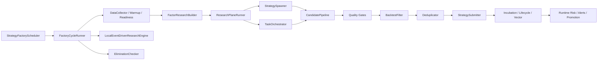

# 策略工厂模块审计总览

> 审计对象：`策略工厂-模块01-调度器.md` 至 `策略工厂-模块12-自主研究任务.md`
> 代码基准：`packages/strategy-factory` 与 `packages/akshare-mcp/src/akshare_mcp/tools/managers/strategy_manager.py`

---

## 审计结论

这 12 份模块文档的模块划分与主流程总体正确，但不能直接作为“当前实现说明”使用。文档里混有三类内容：实际已落地能力、部分落地能力、建议改造伪代码。修订后的阅读规则是：

1. 先看每份文档的“代码审计结论”区块，确认准确性状态与代码证据。
2. “已实现能力”可以视为当前行为说明。
3. “过时/夸大描述”和“仍然成立的问题”用于区分需要改写的旧描述与真实待改进点。
4. 下方“优化方向”中的代码块默认是概念示例，不代表仓库当前已实现，除非同一节明确标注“已实现”。

| 模块 | 准确性状态 | 关键修订 |
|---|---|---|
| 01 调度器 | 基本准确 | 补 `dispatch_run`、任务板、run lock/join、read_only/状态化边界 |
| 02 周期运行器 | 基本准确 | 补 readiness authority、research/governance plane；明确无阶段级 timeout |
| 03 因子研究 | 基本准确 | 标明冷启动已实现；保留串行反馈加载、静态 stale/mapping、熵无告警 |
| 04 策略生成器 | 部分过时 | 改掉候选扩展、市场适配和参数采样的绝对化旧表述 |
| 05 质量门禁 | 基本准确 | 补 Pre-Gate、Gate A/B/C；保留值域、预加载 retry、密度估算问题 |
| 06 回测筛选器 | 部分过时 | 标明候选级 shared result 已有；保留无早停和无 timeout |
| 07 去重器 | 描述偏简 | 补语义/血统/refresh/revision/质量压力；新增扫描范围风险 |
| 08 提交器 | 基本准确 | 补 coordinator、lane、read_only、incubation budget 输出 |
| 09 事件引擎 | 基本准确 | 修正主题库描述：默认库会落库，但 refresh 仍遍历默认库 |
| 10 淘汰检查器 | 准确 | 直接 deprecated、无 probation、无年龄保护、环境红旗均成立 |
| 11 孵化预算 | 准确 | 标明机器可读反馈字段丰富，但缺人类可读分配理由 |
| 12 自主研究 | 部分不准 | 修正 TaskOrchestrator 为 thin wrapper；保留白名单缓存和 Spawner/LLM 协调问题 |

---

## 真实边界

- 核心实现位于 `packages/strategy-factory/src/strategy_factory`，策略工厂不是单个文件，而是由调度器、周期运行器、研究平面、治理平面、提交器、孵化/运行态服务共同组成。
- 对外运行和治理入口主要在 `strategy_manager`：`capabilities`、`factory_status`、`factory_run_once`、`factory_dispatch_run`、`factory_runs`、`factory_run_detail`、`execution_audit_verification`、`submission_replay`、`submit`、`incubation_*`、`runtime_*`、`vector_*`、`domain_projection*`、`ai_generate`。
- 默认应按只读审查处理；`factory_run_once`、`factory_dispatch_run`、`submit`、`runtime_control_set`、`vector_rebuild`、`domain_projection_rebuild`、`ai_generate` 等状态化动作必须显式触发。
- BFF/Web/Desktop 表面用于产品承载与只读核验，不等于完整闭环已经自动上线运行。

---

## 优先级

| 优先级 | 主题 | 文档处理方式 |
|---|---|---|
| P0 | 文档准确性 | 修正过时描述、补代码证据、补 MCP/public entrypoints |
| P1 | 稳定性 | 阶段级 timeout、半开断路器、预加载 retry、提交 retry/DLQ、交易日历 |
| P2 | 量化治理 | DSR/PBO/SPA、样本外验证、过拟合审计、淘汰 probation |
| P3 | 性能 | 有界并发、TTL 缓存、白名单缓存、CPU 密集行为向量用进程池评估 |

---

## 外部依据

- Python `asyncio` 官方文档支持用 `wait_for`/timeout 约束异步等待，并说明 `to_thread` 主要适合 IO-bound 场景：<https://docs.python.org/3.14/library/asyncio-task.html>
- Python `concurrent.futures` 官方文档说明 `ProcessPoolExecutor` 可绕开 GIL，但要求任务与参数可 pickle：<https://docs.python.org/3.14/library/concurrent.futures.html>
- 上交所官方交易日历说明 A 股交易日不是简单工作日：<https://english.sse.com.cn/start/trading/schedule/> 与 <https://www.sse.com.cn/disclosure/announcement/general/c/c_20251222_10802507.shtml>
- `pandas_market_calendars` / `exchange_calendars` 可作为交易日历实现参考：<https://pandas-market-calendars.readthedocs.io/en/latest/calendars.html>
- SR 11-7 支持把策略工厂文档升级为“开发、验证、持续监控、结果分析”的治理闭环：<https://www.federalreserve.gov/supervisionreg/srletters/sr1107.htm>
- 回测过拟合与多重检验建议可引用 DSR/PBO/SPA：<https://papers.ssrn.com/sol3/Delivery.cfm/SSRN_ID2460551_code87814.pdf?abstractid=2460551&mirid=1>、<https://www.semanticscholar.org/paper/The-Probability-of-Backtest-Overfitting-Bailey-Borwein/b1233b4f5384f003e85c2e0eec1a2dfc08f624c5>、<https://papers.ssrn.com/sol3/papers.cfm?abstract_id=264569>

---

## 文档维护规则

- 每份模块文档必须保留“代码审计结论”区块，且字段固定为：`准确性状态`、`代码证据`、`已实现能力`、`过时/夸大描述`、`仍然成立的问题`、`建议优先级`。
- 新增优化建议必须标明 `已实现`、`部分实现`、`待实现` 或 `仅建议`。
- 涉及状态化动作时必须写清楚“默认只读、显式触发才执行”。
- 引用伪代码时必须标注“概念示例”，避免把设计建议误读为当前实现。
