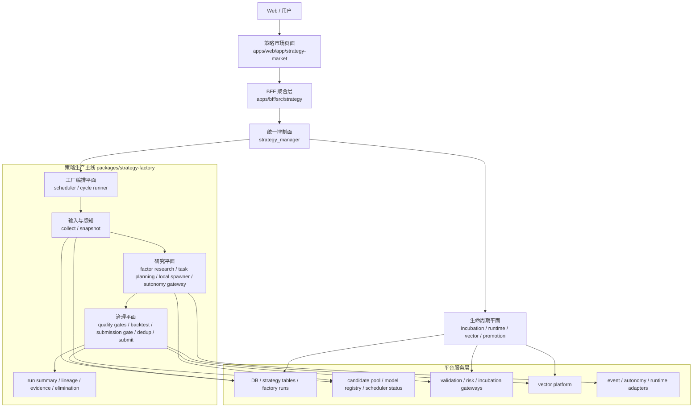

# 策略工厂架构优化方案

> 文档日期：2026-04-08  
> 放置位置：项目根目录  
> 适用范围：`packages/strategy-factory`、`packages/akshare-mcp`、`apps/bff`、`apps/web`、策略工厂运行/治理/孵化/运行时闭环  
> 关联文档：`策略工厂/README.md`、`策略工厂/策略工厂整改详细清单.md`、`docs/plans/策略工厂策略对象协议.md`、`策略工厂实际问题调整方案-2026-04-07.md`  
> 本文目标：基于当前真实代码、真实运行链路和 2026-04-08 的工厂运行状态，给出一份面向后续 2-3 个阶段的策略工厂架构优化方案，避免把研究蓝图误写成当前能力，也避免把已有能力误判为“尚未实现”

> 2026-04-11 代码核对修订说明：
> 1. 本文中“已经具备/已经落地”优先指仓库代码、接口、页面和测试证据已经存在。
> 2. 本文中涉及 `默认 steady-state`、`连续 3 次真实 run`、`cohort 比例`、`live-ready` 的内容，仍属于运行验收口径，不应仅凭代码存在就视为已经证明稳定。
> 3. 本次核对确认：主链能力大部分已落地，但默认运行稳定性、质量右移、live-ready 持续产出和研究主链复杂度收口仍未完成验收。

---

## 一、结论先行

当前策略工厂已经不是“只有页面和榜单”的半成品，但它也不是“AI 全自动闭环策略操作系统”。更准确的判断是：

1. 它是一套真实可运行的分布式策略生产与治理系统，已经具备调度、readiness、多级门禁、去重、提交、孵化、运行时风控、向量治理和生命周期扫描。
2. 本地候选生成器仍以规则引擎为主。`StrategySpawner` 的基础触发源是 4 类本地规则批次，外加变体扩展与配额补位；它不是本地自主推理的 LLM 生成器。
3. Autonomy 路径已经接在工厂主调度链路上，但其实现通过外部网关适配器承载，而不是内嵌在 `strategy-factory` 内部的本地推理引擎。
4. `Gate-3` 不是“只有阈值常量”。`submission_gate.py` 已经实际执行 `deflated_sharpe`、`PBO`、`White Reality Check`、`Hansen SPA` 以及补充性的 `Walk-Forward / Purged K-Fold / Bootstrap / 参数敏感性 / 多期稳健性` 检验。
5. 当前最大的结构性问题不是“缺少模块”，而是“证据闭环没有成为生产主目标”。系统能稳定生成和提交策略，但前向信号、观测天数和 promotion 证据积累明显不足。

因此，架构优化的首要目标不应是“继续扩展生成能力”，而应是：

1. 把代码中已经存在的真实能力边界写清楚。
2. 把证据闭环抬到高于候选产量的优先级。
3. 把 governed pool 的供给问题和 lifecycle 反馈问题显式收口。
4. 修正部分调度/SLO 指标口径，避免用失真的指标驱动错误优化。

## 一点五、截至 2026-04-11 仍存在的六个问题

下面这六点，是当前真实代码与真实运行下仍未收口的问题。它们意味着“主链改造大部分已经落地”，但还不能把这份架构方案视为已经完全验收。

1. 默认 steady-state 仍不稳定。最新默认 run `factory_run_1775874046_da5aad36` 状态为 `skipped`，`factory_readiness_decision=blocked`，说明默认工厂仍会被 readiness/governed pool 硬门控挡住，而不是持续稳定地产出新样本。
2. 总体质量分布仍然偏弱。当前真实 cohort 为 `A=6, B=16, C=30, D=348`，`raw_validation_b_rate=0.04`，`raw_b_or_above_rate=0.055`，意味着系统已能打出高质量样本，但总体仍然是 `D` 主导。
3. 三个重点 family 提升不均。`momentum` 已经能在 `long + candidate_target_only` 这一桶打出 `raw A/B`，`ma_cross` 也不再是 `raw B=0`，但其主桶 `medium + candidate_target_only` 仍然 `D` 偏多；`quality_factor` 的主桶目前仍是 `raw B=0`、`live=0`。
4. strict incubation 的改善快于 live。当前 `strict_incubation_ready_rate=0.195`，但 `live_candidate_ready_rate=0.0075`，说明多数样本最多只是进入严格孵化，不代表已经形成稳定 live-ready 候选。
5. 外部 LLM 运行稳定性仍是运营风险。兼容层和 fallback 已经打通，但受控真实 run 中仍观察到 `HTTP503` 与 provider 波动，这意味着外部探索能力可用，但稳定性还不足以当作完全可靠的默认生产能力。
6. 物理架构收口还未彻底完成。`factor_research.py` 已瘦身为别名壳，但实际复杂度仍集中在 `packages/strategy-factory/src/strategy_factory/application/research/factor_research_builder.py`，截至 2026-04-11 仍有约 `1990` 行，后续改 feedback / allocation / quality 仍存在较高回归风险。

这六点也意味着当前架构工作的重心，已经从“补能力空白”切换成“让默认运行面稳定、让质量分布继续右移、让架构复杂度继续下降”。

---

## 二、当前真实架构复盘

基于当前代码，策略工厂的真实入口与主链大致为：

1. 用户与页面入口：`apps/web/app/strategy-market`
2. BFF 聚合入口：`apps/bff/src/strategy`
3. 统一控制面：`packages/akshare-mcp/src/akshare_mcp/tools/managers/strategy_manager.py`
4. 工厂主链：`packages/strategy-factory/src/strategy_factory/application`
5. 生命周期、向量、风控、孵化等运行态能力：由 `strategy_manager + BFF + DB/service` 组合承载

当前真实工厂主链：

```text
warmup
-> collect
-> factor_research
-> readiness
-> spawn
-> autonomy
-> quality_gate / backtest / submission_gate
-> deduplicate
-> submit
-> elimination
-> persist
```

这里要特别澄清三点：

1. `spawn` 不是纯 AI 生成，而是“本地规则生成 + 变体扩展 + 配额补位”。
2. `autonomy` 不是旁路实验，而是调度器主链中的一段外部网关调用。
3. `submission_gate` 已经承担了真实的统计检验职责，不能再把它当成“未来规划”。

从逻辑上，当前系统已经自然长成 5 个层次。

### 2.1 产品与交互层

- `apps/web/app/strategy-market`
- `apps/bff/src/strategy`

职责：

- 展示工厂运行态、策略详情、孵化、运行时、向量、实验结果。
- 暴露 `/strategy-market/*` 产品接口。

当前优势：

- 页面和后台接口已经真实打通，不是空壳。
- 详情页已经按 `summary / incubation / runtime / vectors / experiments` 分区组织。

当前问题：

- 页面上的“工厂闭环感”强于实际证据闭环强度，容易让人误读为策略已经完成实盘级验证。

### 2.2 控制面

- `strategy_manager`
- BFF 中的 `StrategyMarketService`

职责：

- 聚合工厂运行、策略详情、生命周期、运行时、向量治理等能力。
- 为 Web 和其他调用方提供统一 action surface。

当前优势：

- 已形成统一入口。
- 工厂状态、运行历史、run detail、runtime control、promotion review、vector ANN 等都能从这一层读到。

当前问题：

- action surface 持续膨胀。
- 控制面读到了大量运行摘要，但其中部分 SLO 字段口径仍混合了“预算维度”和“全量宇宙维度”，需要继续收敛。

### 2.3 工厂编排层

- `StrategyFactoryScheduler`
- `FactoryCycleRunner`

职责：

- 负责 `daily / continuous / run_once` 调度。
- 编排工厂各阶段顺序、保存 run 结果、维护最近摘要。

当前优势：

- 已具备运行锁、防重入、run history persist、summary 聚合、observability 基础字段。
- 已显式接入 `AutonomyGateway`、Factor Research、Risk、Incubation 等网关。

当前问题：

- 编排层中仍承载了不少阶段内分析与 summary 拼装逻辑。
- 运行侧反馈虽然被读取，但还没有对上游研究与排程形成稳定的硬约束。

### 2.4 策略生产与治理层

- `collect.py`
- `factor_research.py`
- `opportunity.py`
- `stock_strategy_matrix.py`
- `spawner.py`
- `quality_gates.py`
- `deduplicator.py`
- `submitter.py`
- `submission_gate.py`

职责：

- 采集输入、生成研究任务与候选、执行多级门禁、去重、提交、审计和落库。

当前优势：

- 这是当前系统最完整、最有工程厚度的一层。
- readiness、多级门禁、去重刷新、质量报告、lineage、vector profile 都已经落地。
- `submission_gate.py` 已经实际执行 multiple-testing 与补充统计检验。

当前问题：

- 研究平面与提交流水线耦合较深。
- 本地 spawner 仍以规则触发为主，尚未形成“本地自治研究引擎”。
- 去重和门禁很细，但上游 governed candidate pool 过窄时，会把大量产能消耗在少数 family 的变体上。

### 2.5 生命周期闭环层

- 孵化：`incubation_overview / incubation_metrics / paper_account / paper_orders / paper_nav`
- 运行时：`risk_events / risk_snapshots / runtime_alerts / runtime_control`
- 向量：`vector_profiles / vector_ann_search / vector_indexes / vector_health`
- 晋级与治理：`promotion_reviews / lifecycle_scan / domain_events / domain_projection`

职责：

- 管理策略从提交后进入孵化、运行观察、风险控制、晋级与淘汰的全过程。

当前优势：

- 生命周期能力比很多“策略工厂蓝图”更落地。
- 已经具备真实闭环雏形，而不是只有 candidate generation。

当前问题：

- 生命周期反馈还没有被工厂主链作为一等约束使用。
- 当前更像“能观察、能评审”，还不是“能靠运行证据自动收敛预算与产量”。

---

## 三、当前运行现实（截至 2026-04-08）

结合 `factory_status`、`lifecycle_scan` 和本地代码，当前真实运行状态可以概括为：

### 3.1 工厂是能跑通的

- 最近一次完整运行 `success`。
- 最近一轮共生成 `145` 个候选，其中 `132` 个来自 autonomy 生成，`31` 个自治任务全部完成。
- `bulk_stock_matrix` 已开启，且 `selected_bulk_task_count = planned_bulk_task_count = 20`，说明 bulk 预算并未失效。

这意味着问题不是“工厂跑不起来”，而是“跑出来的东西没有完成证据闭环”。

### 3.2 当前最大的瓶颈是证据债务，不是候选产量

- `readiness_hard_block_enabled = false`。
- 最近运行里 `promotion_review_count = 0`。
- `incubating_count = 370`。
- `lifecycle_scan` 扫描出的阻塞项里，最常见的是 `有效信号数 0 < 10`。

这说明当前系统在持续把策略送入 `incubating`，但没有同步把“信号样本、前向收益、晋级证据”积累起来。结果是：

1. 研究和提交看起来很活跃。
2. 生命周期里却堆积了大量没有证据的新策略。
3. 系统优化目标客观上偏向“产出数量”，而不是“验证完成率”。

### 3.3 governed pool 是现实瓶颈之一

- `governed_source_candidate_count = 9`
- `active_candidate_count = 2`
- `governed_candidate_pool_mode = strict_governed`
- 大量 excluded candidate 的主要原因是 `registry_stage_validated`

这说明当前 active pool 过窄，研究面不是在广泛探索，而是在围绕少量严格 governed 候选持续派生变体。严格治理本身没有问题，但如果不区分：

1. 真正被风险审计 block 的候选
2. 仅处于 `validated`、等待晋级的候选

就会把“治理质量高”误读成“候选池几乎不可用”。

### 3.4 部分调度/SLO 指标口径仍会放大问题

当前 `bulk_queue_imbalance` 和 `governed_blocked_ratio` 这类指标，仍可能把不同层级的量混在一起：

1. bulk 预算是否打满
2. 全量股票矩阵的 batch 总量
3. governed pool 中的 blocked 与 pending

这类指标如果不拆口径，会把“预算已打满但全量宇宙未覆盖”误报成调度瓶颈，也会把“validated backlog”误报成“风险 blocked backlog”。

### 3.5 运行时反馈尚未真正驱动上游生产

- `event_runtime_mode = readonly`
- lifecycle review 广泛停留在 `watch / observe`
- 大量策略 `quality_passed = true`，但 `promotion_ready = false`

这代表当前系统已经有：

1. 研究门
2. 提交门
3. 生命周期评审门

但三者尚未形成“证据不足就收缩生成预算”的强反馈回路。

---

## 四、架构优化目标

本轮架构优化要同时达成 6 个目标。

### G1. 写实分层

把当前系统稳定划分为：

1. 产品层
2. 控制面
3. 编排层
4. 研究平面
5. 治理与提交平面
6. 生命周期平面
7. 平台服务层

同时明确每一层当前“已经实现了什么”和“还没有实现什么”。

### G2. 从产量导向切换到证据导向

把工厂的主优化目标从：

1. 候选生成数
2. 提交数
3. 任务覆盖率

切换到：

1. 有效信号积累率
2. observed forward days 覆盖率
3. promotion review 吞吐
4. incubating backlog 去化率

### G3. 收紧治理边界

让门禁、去重、提交、质量报告、multiple-testing、lineage 全部收敛到明确的治理平面中，避免策略语义在多处漂移。

### G4. 强化生命周期硬反馈

把孵化、运行风险、运行告警、promotion review 的结果，稳定回流到：

1. family feedback
2. target pool feedback
3. generator mode feedback
4. 下一轮任务预算与排程

并允许在必要时对工厂形成硬约束，而不是只形成只读摘要。

### G5. 平台化底层能力

逐步把以下能力从“调用散点”提升为“平台能力”：

1. snapshot
2. governed candidate pool
3. evidence / lineage registry
4. vector governance
5. backtest assumptions
6. cost / capacity / execution assumptions

### G6. 保持增量兼容

不打断现有：

1. `strategy_manager`
2. BFF `/strategy-market/*`
3. Web `/strategy-market`
4. `akshare_mcp.services.strategy_factory.*` 兼容路径

---

## 五、目标架构



这张图不是“未来幻想图”，而是对当前代码结构的写实收口。区别只在于：

1. 把当前已存在但混合在一起的职责显式分层。
2. 把研究平面、治理平面和生命周期平面作为独立优化对象。
3. 把“本地规则生成”和“外部 autonomy 生成”同时纳入研究平面，而不是继续统一用“AI 工厂”一笔带过。

---

## 六、各层职责边界

### 6.1 产品层

应负责：

- 页面展示
- 用户触发
- 查询参数组织
- 结果可视化

不应负责：

- 策略语义决策
- 门禁决策
- 工厂运行编排

### 6.2 控制面

应负责：

- action 路由
- 聚合多域状态
- 对外暴露统一接口
- run summary / factory observability 读取

不应负责：

- 直接生成候选
- 持有复杂策略语义
- 嵌入具体门禁规则

### 6.3 编排层

应负责：

- 调度
- 阶段顺序
- 超时与重入控制
- run 持久化
- 工厂级 summary 聚合

不应负责：

- 具体策略对象判定
- 具体风险规则
- 具体去重逻辑

### 6.4 研究平面

应负责：

- 市场输入解释
- governed pool 消费
- 因子研究 artifact
- 研究任务生成
- 本地规则候选生成
- 外部 autonomy 候选生成
- 实验记录与任务证据

不应负责：

- 最终是否提交
- 刷新旧策略还是派生新实验的最终裁决
- 生命周期状态迁移

### 6.5 治理平面

应负责：

- Gate-0 ~ Gate-3
- dedup / refresh / revision 判定
- quality report
- submission lane 决策
- strategy lineage / multiple-testing / vector profile 落库

不应负责：

- 直接采集外部行情或事件
- 决定下一轮工厂排程

### 6.6 生命周期平面

应负责：

- 孵化与模拟盘
- runtime risk / alerts / control
- promotion review
- lifecycle scan
- domain projection

不应负责：

- 直接生成新候选
- 直接修改研究任务合同

### 6.7 平台服务层

应负责：

- 数据存储与索引
- governed pool / model registry / vector platform
- validation / risk / incubation 等外部能力适配

不应负责：

- 注入业务判断
- 承担工厂主编排职责

---

## 七、建议的物理目录收口方式

当前不建议立刻做大规模目录重构，但建议按“逻辑先、物理后”的顺序逐步收口。

### 7.1 第一阶段先做逻辑收口

在 `packages/strategy-factory/src/strategy_factory/application/` 内部明确四块逻辑域：

1. `orchestrator`
   - `factory_scheduler`
   - `cycle_runner`
   - `_factory_scheduler_loop`
   - `_factory_scheduler_runtime`
   - `_factory_scheduler_analysis`

2. `research`
   - `collect`
   - `factor_research`
   - `opportunity`
   - `stock_strategy_matrix`
   - `spawner`
   - autonomy task planning 相关能力

3. `governance`
   - `quality_gates`
   - `backtest_filter`
   - `deduplicator`
   - `submitter`
   - `submission_gate`

4. `lifecycle_feedback`
   - family / target pool / generator mode feedback 相关聚合逻辑

这一阶段先不迁目录，只先统一 import 边界和模块归属。

### 7.2 第二阶段再做物理迁移

当逻辑边界稳定后，再考虑迁成：

```text
strategy_factory/
  application/
    orchestrator/
    research/
    governance/
    lifecycle_feedback/
```

迁移原则：

1. 先迁无兼容压力模块。
2. 保留 facade 暴露。
3. 旧路径通过 compat 或桥接保留一段时间。

---

## 八、分阶段优化方案

### P0：运行口径收口与真实指标化

目标：

1. 修正调度、governed pool、生命周期几个最容易误导的 summary 口径。
2. 把“blocked / pending / validated backlog / active”区分清楚。
3. 让工厂摘要对架构优化起到正确导向。

执行项：

1. 收紧 `run summary`、`factory_status`、`readiness summary` 的字段口径。
2. 把 governed pool 中的 `blocked` 和 `pending promotion` 分开统计。
3. 把 bulk 预算是否打满与全量矩阵覆盖率拆开统计。
4. 让 `summary`、详情页和生命周期扫描使用同一套证据字段。

验收：

1. `factory_status` 中不再把预算达成问题和全量宇宙覆盖问题混为一谈。
2. `governed_blocked_ratio` 不再包含纯 `validated` backlog。
3. 用户看到的“瓶颈”能直接映射到真实优化动作。

### P1：证据闭环硬化

目标：

1. 把工厂的主优化目标从“持续生成”切到“持续补证据”。
2. 降低 `incubating` 中的零信号 backlog。

执行项：

1. 为 `effective_signal_count`、`observed_forward_days`、`promotion_review_count` 建立硬反馈。
2. 当 `incubating` 中零信号策略占比过高时，压缩新生成预算，优先补 observation / paper / signal accumulation。
3. 把 lifecycle review 的 `watch / observe / reject / promote` 明确映射到下轮预算控制。
4. 把 `readiness_hard_block_enabled` 从“默认不拦截”推进到“有证据债务时可拦截”。

验收：

1. `incubating` 零信号策略占比下降。
2. `missing_forward_days` 和 `observed_forward_days` 的覆盖率明显改善。
3. promotion review 不再长期为零。

### P2：governed pool 与治理平面硬化

目标：

1. 缓解当前 governed pool 过窄的问题。
2. 让治理平面真正表达“哪些候选是风险阻断，哪些只是待晋级”。

执行项：

1. 把 active pool 从单一 `strict_governed` 拓展为“strict 为主、provisional 补位”的混合池。
2. 单独跟踪 `registry_stage_validated` backlog，不再把它等价为 blocked。
3. 收紧 untargeted / zero-coverage bulk candidate 的入口放行。
4. 继续补齐 `tested_object_hash / candidate_contract_hash` 相关 backfill 和决策诊断。

验收：

1. `source candidate -> active candidate` 的转化更稳定。
2. active family / regime 更丰富，减少围绕少数 family 的重复变体。
3. dedup、refresh、revision 的决策能够完整审计。

### P3：研究平面独立化

目标：

1. 让 `factor_research + task planning + local spawner + autonomy gateway` 成为独立研究平面。
2. 研究平面只输出候选与证据，不直接承担提交职责。

执行项：

1. 收口 `MarketOpportunityScanner`、`StockStrategyMatrixPlanner`、本地 spawner、autonomy task planning 的输入输出合同。
2. 明确 research artifact、task artifact、candidate artifact 三类对象。
3. 明确区分：
   - 本地规则候选
   - 外部 autonomy 候选
   - governed candidate activation
4. 把自治实验、外部 LLM 健康、task evidence 统一沉淀为研究证据。

验收：

1. 研究平面输出可以单独被测试和观测。
2. “本地生成器能力边界”与“外部自治能力边界”在代码和文档中一致。

### P4：平台服务层显式化

目标：

1. 把底层能力从“散落调用”提升为“稳定平台接口”。
2. 为后续更强 AI 研究能力预留平台基础。

执行项：

1. 显式抽象 snapshot service。
2. 显式抽象 governed candidate pool service。
3. 显式抽象 evidence / lineage registry。
4. 显式抽象 vector governance service。
5. 显式抽象 cost / capacity / execution assumptions service。

验收：

1. 上层业务不再依赖零散 DB 能力探测。
2. 控制面和工厂主线更容易测试、替换和扩展。

---

## 九、哪些现在不要做

以下动作当前不建议立即推进：

1. 不要重写一个全新的工厂主控系统。
2. 不要把本地规则生成器包装成“全自动 AI 生成引擎”。
3. 不要在证据 backlog 未消化前继续单纯追求候选数量。
4. 不要在短期内移除 `strategy_manager` 统一入口。
5. 不要把孵化、runtime、vector、promotion 重新并回工厂主链。
6. 不要在边界未稳定前大规模删除 compat surface。
7. 不要在 SLO 口径未修正前，把 `bulk_queue_imbalance` 一类指标直接当成主要产能瓶颈。

原因：

1. 当前系统真实主链已经存在。
2. 目前更大的问题是证据闭环与口径一致性，而不是模块数量不够。
3. 一次性大重构会破坏现有 BFF / Web / MCP 使用面。

---

## 十、优先级建议

如果只能做一轮架构优化，建议优先级如下：

1. `P0 运行口径收口与真实指标化`
2. `P1 证据闭环硬化`
3. `P2 governed pool 与治理平面硬化`
4. `P3 研究平面独立化`
5. `P4 平台服务层显式化`

原因：

1. 当前最大收益来自“先把问题看清楚”。
2. 现在最贵的不是研究能力不足，而是系统在证据不足的情况下持续扩张 `incubating` backlog。
3. research plane 的抽象固然重要，但在证据闭环没有硬反馈之前，继续扩展生成能力只会放大存量问题。

---

## 十一、架构验收指标

架构优化完成后，至少应能稳定观测以下指标：

### 11.1 运行与门禁

1. 工厂各阶段 `completed / partial / failed / skipped` 比例。
2. readiness 阻断原因 Top N。
3. `pre-gate -> gate-1 -> gate-2 -> gate-3` 转化率。
4. `refresh_existing / spawn_revision_from_existing / created_strategy_pool / created_audit_only` 比例。

### 11.2 研究与治理

1. research task 按 `task_source / family / target_pool / generator_mode` 的产出与通过率。
2. 本地 spawner 与 autonomy gateway 的候选占比及通过率。
3. governed source pool 的 `active / pending / blocked` 分布。
4. family / target pool / generator mode feedback 命中率。

### 11.3 生命周期与证据

1. `incubating` 策略中 `total_signals = 0` 的占比。
2. `observed_forward_days` 覆盖率。
3. promotion review 触发率、通过率、平均等待时长。
4. 孵化进入率、晋级率、运行风险触发率、淘汰率。

### 11.4 平台与可观测性

1. vector coverage、ANN 命中率、索引健康状态。
2. governed pool freshness、active family count、active regime count。
3. 预算打满率与全量宇宙覆盖率的分离统计是否稳定。

这些指标的意义不是“做看板”，而是验证架构分层之后，各层是否真的形成了稳定闭环，并且没有继续被错误口径误导。

---

## 十二、最终建议

这套策略工厂接下来的正确架构方向，不是“再做一个更大的工厂”，而是：

1. 保持当前分布式主链不被打断。
2. 把本地规则生成、外部 autonomy 生成、治理平面和生命周期平面边界写实化。
3. 把 `submission_gate` 已有的统计能力和 lifecycle 的证据要求接成真正的闭环。
4. 把系统目标从“生成更多候选”切到“让已有候选更快完成验证与晋级”。
5. 让底层能力逐步平台化。

如果这五件事做好，策略工厂就会从当前的“真实可运行、治理较强、统计门已落地、但证据闭环不足的策略生产系统”，进一步升级为：

**一个以分布式调度为骨架、以多级治理为中枢、以证据闭环为主目标、并为自治研究能力预留平台接口的策略生产与治理操作系统。**
