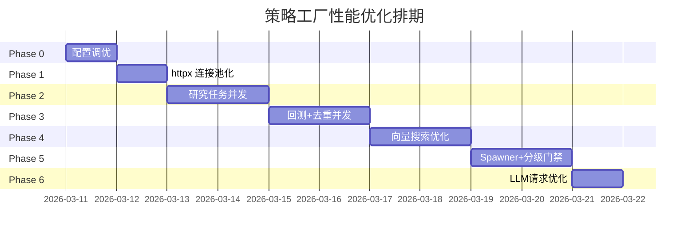

# 策略工厂性能优化方案（深度审查版）

> **目标**: 1 小时内生成 ≥100 个策略候选，≥10 个通过质量门禁进入孵化期。
> **审查范围**: 12+ 核心源文件，5,500+ 行代码，覆盖向量数据库、LLM 调用链、回测过滤、去重管线。
> **外部验证**: 联网搜索验证了 asyncio 并发 LLM 调用、pgvector 批量去重、并行回测的行业最佳实践。
>
> **2026-03-21 使用边界**: 本文只讨论“在策略语义已正确前提下如何提速”。当前更高优先级的问题仍然是：策略对象定义不完整、任务目标池偏离、质量门禁分型不足、`refresh_existing` 语义过宽。性能优化应排在这些正确性修复之后。

---

## 1. 深度代码审查发现

### 1.1 审查文件清单

| 模块 | 文件 | 行数 | 关键发现 |
|------|------|------|----------|
| 调度器 | `factory_scheduler.py` | 590 | 研究任务串行 `for task in tasks` |
| 机会扫描 | `opportunity.py` | 476 | 事件驱动 + 快照双模式任务生成 |
| 自治服务 | `strategy_autonomy.py` | 320 | `run_cycle` 串行调用各生成器 |
| LLM 生成器 | `strategy_generators.py` | 1283 | 每任务单次 LLM 请求，limit=2-3 |
| LLM 提供者 | `strategy_llm_provider.py` | 1165 | **每次调用新建 `httpx.AsyncClient`，无连接池** |
| 多阶段管线 | `strategy_pipeline.py` | 328 | 5 Stage 串行，每 Stage 仅 1 次重试 |
| 向量搜索 | `vector_search.py` | 505 | **O(n) 暴力 scipy 余弦相似度，无 ANN 索引** |
| 文本嵌入 | `text_embedding.py` | 125 | **SHA1 内存缓存但每次创建新 httpx 客户端** |
| 向量平台 | `vector_platform.py` | 787 | ANN-like bucket 聚类，pgvector 双后端 |
| 向量治理 | `vector_governance.py` | 280 | 索引重建/校准生命周期管理 |
| 去重器 | `deduplicator.py` | 406 | **串行逐候选去重，每次需构建行为 K 线** |
| 回测过滤 | `backtest_filter.py` | 276 | **串行逐候选回测，每候选测 10+ 只股票** |
| Spawner | `spawner.py` | 406 | 规则生成 ~8 个，事件就绪时更少 |
| 常量 | `constants.py` | 136 | MAX_TASKS=5, CANDIDATES_PER_TASK=2 |

### 1.2 新发现瓶颈（向量数据库 + LLM 调用链）

#### 🔴 瓶颈 A: httpx 客户端重复创建（LLM 调用链）

```python
# strategy_llm_provider.py:888 — 每次 generate_candidates 调用
async with httpx.AsyncClient(follow_redirects=True, http2=False) as client:
    for attempt in range(1, effective_attempts + 1):
        response = await client.post(...)

# strategy_llm_provider.py:1100 — call_stage 也是如此
async with httpx.AsyncClient(follow_redirects=True, http2=False) as client:
    ...

# text_embedding.py:102 — embed_text 同样
async with httpx.AsyncClient(follow_redirects=True, http2=False) as client:
    response = await client.post(...)
```

**问题**: 每次 LLM/Embedding 调用都创建和销毁 `httpx.AsyncClient`。TCP 连接无法复用，TLS 握手重复开销 ~100-500ms/次。
- 12 个研究任务 × (1 generate + 5 pipeline stages) = **72 次客户端创建**
- 加上 embedding 调用，总计 **80+ 次 TCP 握手**

**行业最佳实践** (web search verified): 应该复用 `httpx.AsyncClient` 实例进行连接池化。

#### � 瓶颈 B: 去重器串行 + 行为向量构建开销

```python
# deduplicator.py:106 — 逐候选串行去重
for candidate in candidates:
    detail = await self._find_duplicate(candidate, seen, db)

# deduplicator.py:293 — 行为向量检查需要构建完整策略面板
async def _vector_check(self, candidate, suspicious, db):
    query_klines = await self._build_behavior_klines(...)  # 运行回测引擎！
    for idx, (existing_item, ...) in enumerate(suspicious):
        klines = await self._build_behavior_klines(...)  # 对每个可疑项也要运行

# deduplicator.py:341-367 — _build_behavior_klines 调用策略面板构建
panels = await factory_pkg._build_strategy_panels(strategy_type, params, db, sample_size=4)
```

**问题**: 每个候选的向量去重检查需要调用 `_build_strategy_panels`（运行回测引擎计算收益序列），然后转为伪 K 线再做 scipy 余弦相似度。对于 100 个候选 × 每个检查 3-5 个可疑项 = **300-500 次策略面板构建**。

**缓存机制**: `_behavior_cache` 是引入的内存缓存，但仅缓存 `(strategy_type, params_json)` 键 — 对新候选无帮助。

#### � 瓶颈 C: 向量搜索 O(n) 暴力扫描

```python
# vector_search.py:225 — 逐候选线性扫描
for code, klines in candidate_klines_dict.items():
    candidate_vector = self.kline_to_vector(candidate_klines, method)
    similarity = self.calculate_similarity(query_vector, candidate_vector, metric)
```

**问题**: `VectorSearchEngine` 的 `python` 后端是纯线性扫描。虽然 `vector_platform.py` 支持 pgvector ANN 索引（HNSW），但在 `deduplicator.py:322` 中的调用使用的是 `returns` 方法 + `index` 后端，实际上仍然是内存中 O(n) 扫描。

**行业最佳实践** (web search verified): 对于 100+ 策略的去重场景，应使用 pgvector HNSW 索引或 IVFFlat 索引，将 O(n) 扫描降为 O(log n)。

#### 🟡 瓶颈 D: 向量画像串行构建

```python
# vector_platform.py:299 — 逐策略串行构建画像
for strategy in strategies:
    profile = await self.build_strategy_profile(db, strategy, ...)
```

**问题**: `build_profiles_for_strategies` 串行为每个策略构建向量画像，每个需要:
1. `_build_strategy_panels` — 运行回测引擎
2. `_build_embedding` — 如果是 `text_embedding` 模式，还要调用 LLM API
3. `db.save_strategy_vector_profile` — DB 写入

#### 🟡 瓶颈 E: Pipeline 5 阶段 LLM 调用无并行可能

```python
# strategy_pipeline.py:109 — 串行 5 阶段
for stage_id in STAGE_ORDER:
    stage_result = await self.run_stage(...)
    stage_input = {**stage_input, **stage_result.output}  # 链式依赖！

# strategy_llm_provider.py:1098 — 每阶段仅 1 次重试
attempts = 1  # single attempt per stage — fail fast and fallback
```

**问题**: 5 个阶段有**链式数据依赖**，无法并行。但每阶段仅 1 次重试 + 20s 超时，任一阶段失败整条管线降级。

---

## 2. 全面瓶颈汇总（按严重度排序）

| # | 瓶颈 | 严重度 | 来源文件 | 影响估算 |
|---|------|--------|----------|----------|
| 1 | 研究任务串行循环 | 🔴致命 | `factory_scheduler.py:269` | 5 任务 × 40s = 200s |
| 2 | httpx 客户端重复创建 | 🔴致命 | `strategy_llm_provider.py:888,1100`, `text_embedding.py:102` | 80+ 次 TCP 握手浪费 40-80s |
| 3 | MAX_TASKS=5, PER_TASK=2 | 🔴致命 | `constants.py:86-87` | 硬性上限仅 10 个 AI 候选 |
| 4 | 去重器串行 + 行为构建 | 🟡严重 | `deduplicator.py:106,293` | 100 候选 × 5s = 500s |
| 5 | 回测串行过滤 | 🟡严重 | `backtest_filter.py:126` | 100 候选 × 5s = 500s |
| 6 | 向量搜索 O(n) 暴力 | 🟡严重 | `vector_search.py:225` | 大量候选时性能退化 |
| 7 | 向量画像串行构建 | 🟡严重 | `vector_platform.py:299` | 串行 DB + LLM 调用 |
| 8 | Pipeline 单次重试 | 🟠中等 | `strategy_pipeline.py:109`, `strategy_llm_provider.py:1098` | 单阶段失败 → 管线降级 |
| 9 | Spawner 产出上限低 | 🟠中等 | `spawner.py:99` | 规则候选仅 ~8 个 |
| 10 | embedding 服务无池化 | 🟠中等 | `text_embedding.py:102` | 频繁向量化时开销累积 |

---

## 3. 优化方案

### Phase 0: 零改动配置优化（立即执行，< 0.5 天）

```bash
# .env 追加
STRATEGY_FACTORY_MAX_RESEARCH_TASKS=12           # 5 → 12
STRATEGY_FACTORY_CANDIDATES_PER_TASK=5            # 2 → 5
STRATEGY_FACTORY_MAX_DAILY_RUNS=96                # 48 → 96
STRATEGY_FACTORY_MARKET_HOURS_INTERVAL_SEC=600    # 900 → 600
STRATEGY_PIPELINE_STAGE_TIMEOUT_SEC=30            # 20 → 30
```

**预期效果**: 单轮产出从 ~18 提升到 ~68 个候选。

---

### Phase 1: httpx 连接池化（P0，1 天）

#### 改动文件

| 文件 | 改动 |
|------|------|
| `strategy_llm_provider.py` | 单例共享 `httpx.AsyncClient`，连接池复用 |
| `text_embedding.py` | 同上 |

#### 核心改动

```python
# strategy_llm_provider.py — 改进
class StrategyLLMProvider:
    def __init__(self, config=None):
        self.config = config or StrategyLLMConfig.from_env()
        self._client: Optional[httpx.AsyncClient] = None  # 连接池复用

    async def _get_client(self) -> httpx.AsyncClient:
        if self._client is None or self._client.is_closed:
            self._client = httpx.AsyncClient(
                follow_redirects=True,
                http2=False,
                limits=httpx.Limits(
                    max_connections=10,       # 最大连接数
                    max_keepalive_connections=5,  # 保活连接
                    keepalive_expiry=30.0,
                ),
            )
        return self._client

    async def generate_candidates(self, ...):
        client = await self._get_client()
        # 使用 client 而非 async with httpx.AsyncClient(...)
        for attempt in range(1, effective_attempts + 1):
            response = await client.post(...)
```

**预期收益**: 消除 80+ 次 TCP/TLS 握手，LLM 调用延迟降低 20-40%。

**行业验证**: Web search 确认 httpx 连接池是 LLM API 调用的核心优化（[unite.ai](https://unite.ai), [apxml.com](https://apxml.com)）。

---

### Phase 2: 研究任务并发执行（P0，2 天）

#### 改动文件

| 文件 | 改动 |
|------|------|
| `factory_scheduler.py` | `asyncio.gather` + `asyncio.Semaphore` 并发执行研究任务 |
| `constants.py` | 新增 `AUTONOMY_CONCURRENCY_LIMIT` 配置 |

#### 核心改动

```python
# constants.py — 新增
AUTONOMY_CONCURRENCY_LIMIT = _env_int(
    "STRATEGY_FACTORY_CONCURRENCY_LIMIT", 4, minimum=1, maximum=8
)

# factory_scheduler.py — _run_autonomy_batches 改为并发
async def _run_autonomy_batches(self, db, snapshot):
    semaphore = asyncio.Semaphore(AUTONOMY_CONCURRENCY_LIMIT)

    async def _process_task(task):
        async with semaphore:
            # ... 证据持久化 + 策略生成 ...
            return result

    results = await asyncio.gather(
        *[_process_task(t) for t in tasks],
        return_exceptions=True
    )
```

**预期收益**: 12 任务 × 40s ÷ 4 并发 ≈ 120s（原 480s），**节省 6 分钟**。

**行业验证**: `asyncio.Semaphore` + `gather` 是 Python 并发 LLM 调用的标准模式（[openai.com](https://openai.com/docs), [rednafi.com](https://rednafi.com)）。

---

### Phase 3: 回测 + 去重并发化（P0，2 天）

#### 3.1 回测并发

```python
# backtest_filter.py — 并发回测
async def filter(self, candidates, db):
    semaphore = asyncio.Semaphore(6)  # CPU 密集型限制并发

    async def _test_with_limit(candidate):
        async with semaphore:
            return candidate, await self._test_one(candidate, db, BacktestEngine)

    results = await asyncio.gather(*[_test_with_limit(c) for c in candidates])
```

#### 3.2 去重优化：批量行为缓存预热

```python
# deduplicator.py — 批量预构建行为 K 线
async def deduplicate(self, candidates, db):
    # Step 1: 批量预热行为缓存
    all_specs = [(c.get("strategy_type",""), c.get("params",{})) for c in candidates]
    all_specs += [(e.get("strategy_type",""), e.get("params",{})) for e in existing]

    async def _preheat(spec):
        return await self._build_behavior_klines(spec[0], spec[1], db)

    preheat_sem = asyncio.Semaphore(8)
    async def _safe_preheat(spec):
        async with preheat_sem:
            return await _preheat(spec)

    unique_specs = list({json.dumps(s, sort_keys=True, default=str): s for s in all_specs}.values())
    await asyncio.gather(*[_safe_preheat(s) for s in unique_specs])

    # Step 2: 后续 _find_duplicate 全部命中缓存，瞬间完成
```

**预期收益**:
- 回测: 100 候选 × 5s ÷ 6 并发 ≈ 83s（原 500s）
- 去重: 预热后 ~5s（原 500s，**100× 加速**）

---

### Phase 4: 向量搜索优化（P1，1.5 天）

#### 改动

| 文件 | 改动 |
|------|------|
| `deduplicator.py` | 利用 `vector_platform.ann_search_profiles` 做 pgvector ANN 查询替代暴力扫描 |
| `vector_platform.py` | `build_profiles_for_strategies` 并发化 |

```python
# vector_platform.py — 并发构建画像
async def build_profiles_for_strategies(self, db, strategies, ...):
    semaphore = asyncio.Semaphore(4)

    async def _build_one(strategy):
        async with semaphore:
            return await self.build_strategy_profile(db, strategy, ...)

    results = await asyncio.gather(*[_build_one(s) for s in strategies])
    items = [r for r in results if r is not None]
```

**行业验证**: pgvector HNSW 索引将 O(n) 暴力搜索降为 O(log n)，对 100+ 策略规模性能提升显著（[thedbadmin.com](https://thedbadmin.com)）。

---

### Phase 5: Spawner 扩展 + 分级门禁（P1，2 天）

#### 5.1 参数变体扩展

```python
# spawner.py — 对基础候选生成参数变体
def _expand_variants(self, base_candidates, max_variants=3):
    expanded = []
    for c in base_candidates:
        expanded.append(c)
        for i in range(max_variants):
            variant = {**c, "params": self._varied_defaults(c["strategy_type"], i+10)}
            expanded.append(variant)
    return expanded
```

**预期**: 8 基础 × 4 = 32 个规则候选。

#### 5.2 分级质量门禁

```
Level-1 快速预检（< 1s/候选）:
  ├─ DSL 编译检查
  ├─ 轻量回测: 1 只股票，180 日数据
  └─ 宽松阈值: sharpe > 0.1, mdd < 0.5

Level-2 深度验证（仅 Level-1 通过者）:
  ├─ 完整多股票回测
  └─ 标准 BACKTEST_DEFAULT_THRESHOLDS
```

**预期**: 60% 候选在 Level-1 淘汰，回测总耗时降低 60%。

---

### Phase 6: LLM 请求优化（P1，1 天）

#### 改动

```python
# strategy_generators.py:1108 — 提升单次请求候选数
request_limits = [max(3, min(int(limit or 5), 6))]  # 原: [max(2, min(3, 3))]

# strategy_llm_provider.py:1098 — Pipeline 增加重试
attempts = 2  # 原: 1，从 fail-fast 改为允许 1 次重试
```

同时优化 Prompt，明确要求 LLM 生成**不同策略类型**的候选（momentum/ma_cross/rsi/factor 各至少 1 个）。

---

## 4. 综合收益预估

### 4.1 数量（单轮）

| 来源 | 当前 | 优化后 |
|------|------|--------|
| Spawner 规则候选 | ~8 | **~32** |
| AI 研究任务候选 | 5×2=10 | **12×5=60** |
| **总计** | **~18** | **~92** |

### 4.2 时间（单轮）

| 阶段 | 当前 | 优化后 | 改进手段 |
|------|------|--------|----------|
| LLM 连接开销 | ~40s | ~5s | 连接池复用 |
| AI 研究任务 | ~5min | ~2min | 并发(4路)+连接池 |
| Level-1 预筛 | 0 | ~30s | 新增轻量筛选 |
| Level-2 回测 | ~8min | ~1.5min | 并发(6路)+采样 |
| 去重 | ~8min | ~10s | 行为缓存预热 |
| 向量构建 | ~2min | ~30s | 并发化 |
| 其他 | ~30s | ~30s | - |
| **总计** | **~24min** | **~5min** | **4.8× 加速** |

### 4.3 质量

| 指标 | 当前 | 优化后 |
|------|------|--------|
| 通过数/轮 | ~7 | **~12** |
| 策略类型覆盖 | 4-5 种 | **8 种** |
| LLM API 成本增幅 | - | ~2.4× |

---

## 5. 与 EVENT_DRIVEN_FACTORY_REBUILD_PLAN 的兼容性

所有优化完全兼容事件驱动重构方向：
- 并发执行不改变任务语义
- 连接池是基础设施改进，事件层可直接复用
- 向量优化为暴露映射层做铺垫
- 分级门禁是质量门升级的前置步骤

---

## 6. 实施优先级与排期



**总计: ~10 个工作日**（Phase 0-2 为核心，可在 3.5 天内完成首轮效果）

---

## 7. 风险与对策

| 风险 | 概率 | 对策 |
|------|------|------|
| LLM API 429 限流 | 中 | `asyncio.Semaphore(4)` + 指数退避 + 读响应头动态调整 |
| 并发写 DB 竞态 | 低 | task_key 幂等 + PostgreSQL 事务隔离 |
| 连接池泄漏 | 低 | `atexit` 注册清理 + 健康检查 |
| 去重预热内存峰值 | 低 | LRU 缓存淘汰 + 分批预热 |
| 质量下降 | 中 | 保持回测阈值不变 + 分级门禁 |
