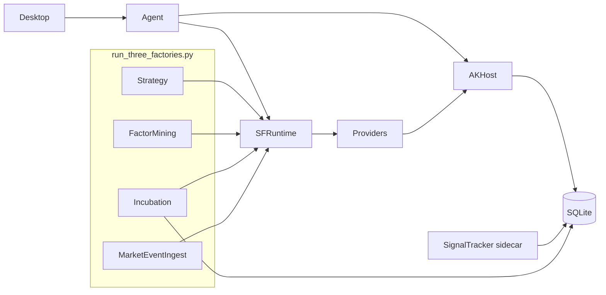

# 当前实际架构（代码对标）

> 更新：2026-07-13  
> 本文是 **current-state**。只描述源码与启动脚本的真实边界；目标迁移见 `../specs/四工厂独立化与MCP瘦身拆分开发方案-2026-06-23.md`。  
> 一页摘要：`../CURRENT.md`。历史进度报告：`../archive/historical/`（非 SoT）。

---

## 1. 总体定位

AIASK 是跨包运行体系，不是单脚本线性流水线。诊断必须分四层：

1. **控制面**：谁触发（Desktop / Agent Intent / supervisor / quality session）  
2. **运行体**：哪个进程在跑（四工厂 + 可选 sidecar）  
3. **证据表**：signals / orders / trades / positions / audit 是否可串联  
4. **状态契约**：hard gate / promotion_ready / incubation phase 如何裁决  

### 包边界（以依赖方向 + 源码职责为准）

| 包/目录 | 拥有（现状） | 不拥有 / 禁止假定 |
| --- | --- | --- |
| `packages/strategy-factory` | 领域编排契约、`runtime/*` facade、`contracts/*` pure gate、bootstrap、phase 表 | 静态 import `akshare_mcp`；MCP tool 暴露；SQLite 私有实现 |
| `packages/akshare-mcp` | MCP host、数据源、host provider 注册、Incubation runner I/O、matching/promotion 实现、FactoryDiagnostics | 契约阈值的第二真相；Desktop 直连 |
| `packages/aiask-quant-core` | SQLite schema/storage、回测/因子 primitives | Agent facade、工厂业务编排 |
| `packages/agent` | HTTP 控制面、ActionIntent、tool risk、readiness、in-process adapters | 绕过 Intent 的写路径给 Desktop |
| `desktop/` | UI；mock 本地 / live→Agent | MCP/DB 直连 |
| `scripts/factories` | 进程 lifecycle、诊断脚本 | 生产状态机真相 |

**依赖方向（声明）**：`aiask-quant-core` ← `strategy-factory` ← `akshare-mcp` ← `agent` ← `desktop`。  
**运行现实**：SF 通过动态 configurator/entry point 注入 host providers；AK 仍持有大量 factory support 实现 → **逻辑 ownership 与物理文件位置尚未完全重合**。

### 关键边界代码

- Bootstrap：`strategy_factory/runtime/default_bootstrap.py`  
  - `DEFAULT_REQUIRED_RUNTIME_PROVIDERS` = **19**  
  - env：`AIASK_STRATEGY_FACTORY_RUNTIME_CONFIGURATOR`  
  - entry group：`aiask.strategy_factory.runtime`  
- Host 注册：`akshare_mcp/adapters/strategy_factory_runtime.py`  
- Runtime services 注册表：`strategy_factory/infrastructure/runtime_services.py`  
- `infrastructure/mcp_services.py`：**compat re-export** of `runtime_services`，不是独立业务模块  

---

## 2. 运行拓扑（supervisor 源码）

文件：`scripts/factories/run_three_factories.py`

```text
SUPERVISED_FACTORY_NAMES =
  strategy_factory
  factor_mining_factory
  incubation_factory
  market_event_ingest

REQUIRED_SCRIPTS =
  run_strategy_factory.py
  run_factor_mining_factory.py
  run_incubation_factory.py
  run_market_event_ingest.py
```

| 入口 | 代码角色 |
| --- | --- |
| `run_three_factories.py` | 正式 supervisor；进程 lifecycle only |
| `run_all_factories.py` | 兼容委托 supervisor |
| `run_*_factory.py` / `run_market_event_ingest.py` | 单体 runner |
| `run_signal_tracker.py` | **sidecar**；不在 SUPERVISED 列表 |
| `run_strategy_factory_quality_session.py` | 验证会话；非生产 supervisor |



`strategy_factory.runtime` 现有模块：

- `default_bootstrap.py`
- `factor_mining.py` / `incubation.py` / `market_event_ingest.py` / `signal_tracker.py`
- `incubation_phases.py` / `incubation_orchestrator_shell.py`

---

## 3. Host 依赖口径（不要再数错）

### 3.1 必需 providers = 19

以 `DEFAULT_REQUIRED_RUNTIME_PROVIDERS` 为准（名称列表见该常量；文档禁止再写“必需 20+”）。

缺少任一 → `ensure_default_runtime_services()` 抛 `RuntimeError`。

### 3.2 Host 还更宽

`configure_strategy_factory_runtime_services()` 可注册比 19 更宽的 support/glue。  
评估“吃了多少宿主能力”应分：

1. MCP host surface（tools/resources）  
2. Runtime provider surface（bootstrap 必需 + 可选）  
3. Adapter/support surface  
4. Factory implementation surface（仍在 `akshare_mcp.services.*` 的代码量）  

细节审计：`12`、`13`（若与代码冲突，以源码与本文件为准，并修 12/13）。

### 3.3 Paper ownership

生产 supervisor 口径下 paper 引擎归属 **incubation_factory**（env：`AIASK_FACTORY_PAPER_OWNER`）。  
MatchingEngine / NavEngine 由孵化 host runner 路径拉起，而不是 MCP server 内嵌 lifecycle。

---

## 4. 契约与晋级（代码常量）

### 4.1 Hard gate

`strategy_factory.contracts.hard_gate`：

- `PRODUCTION_TRADE_FLOOR_DEFAULT = 20`  
- expectancy **>** 0  
- pnl_conversion **>** 0  
- execution_conversion **≥** 0.20  
- 状态序列：`missing → bootstrap_pending → insufficient_samples → failed_metrics | bootstrap_ready | passed`  
- **生产通过只认 `passed`**；`bootstrap_*` 仅诊断/样本债  

### 4.2 Promotion / evidence

- `promotion_ready.py`：pure floors（n/coverage/stability + hard gate 布尔）  
- `evidence_gaps.py`：缺口 schema  
- `execution_universe.py`：可执行 universe  

Overview/pipeline 在 host 侧装载 DB 后应 **委托** 上述 pure 函数，避免双实现。

### 4.3 Incubation phases

`incubation_phases.py` 锁定 once-cycle 顺序；**required**：

- `intake`  
- `exit_signal_paper_execution`  
- `execution_audit_acceptance`  
- `pipeline`  

Host runner 必须使用同名 `_run_phase(...)`。  
`incubation_orchestrator_shell.py` 只做 plan/dry-run 壳，**不**替代 host I/O。

---

## 5. 控制面（Agent / Desktop）

| 事实 | 源码 |
| --- | --- |
| Desktop 默认 mock | `useConnectionSettings.ts` `mode: "mock"` |
| Live API 默认 8765 | 同文件 `baseUrl: http://127.0.0.1:8765` |
| Intent 创建 fail-closed 外部 runner 动作 | `intents.assert_intent_executable` + `AGENT_EXECUTABLE_STRATEGY_ACTIONS` |
| incubation run_once 默认 dry-run | intents safety defaults + `desktop_ops._execute_incubation_factory` |
| readiness 分层 | `production_ready` / `maturity_level` / `code_closed_loop_ready` |
| SignalTracker 可观测 | readiness gate `signal_tracker_presence` + diagnostics `signal_tracker` |

Desktop **不得**直连 MCP/SQLite。Agent 确认后可 **in-process** 调 host managers——这是控制面设计，不是 Desktop 绕过。

---

## 6. 证据链与运行态现实

### 6.1 期望链

```text
MarketEvent → FactorPool → Strategy candidates
  → SignalTracker (signals / forward)
  → Incubation (paper orders/trades/positions / audit)
  → hard_gate.passed → promotion_ready 评估
```

### 6.2 常见真实库态

- 行情表很大（如 `kline_1d`、`stock_quotes`）  
- `strategies/signals/paper_orders/paper_trades` 可为 **0**  
- diagnostics 应给出 `bootstrap_factory_runtime` 或 `start_signal_tracker_sidecar`，而不是“健康空”

这表示 **代码闭环在、证据未点亮**，不是门禁未写。

### 6.3 Quality session

只能验证/暴露；**禁止**用其补偿生产 formal 或伪造 round-trip。

---

## 7. 拆分进度（诚实、可证伪）

| 已可在代码中指出 | 仍未完成 |
| --- | --- |
| SF runtime facade + contracts + bootstrap owner | 大量 host services 物理仍在 `akshare-mcp` |
| phase 表 ownership 在 SF | `IncubationFactoryRunner` 大体量 I/O 仍 host |
| hard gate re-export 路径 | 全链路 live formal>0 需运行态样本 |
| Agent Intent/readiness 产品化 | runner 深抽离（R2）与 exit SLO（R1） |

禁止把 “Phase x 完成报告” 写进本文件当现状。

---

## 8. 现行问题清单（架构层）

| 问题 | 代码表现 | 处理方向 |
| --- | --- | --- |
| 证据 sidecar 不共管 | SignalTracker ∉ SUPERVISED | 共启 + diagnostics/readiness 暴露缺席 |
| 宿主过重 | runner/matching/promotion 实现在 AK | 契约已上移；I/O 渐进 port，不降 gate |
| 控制面可确认≠可执行 | confirm 名单 ⊃ executable 集合 | 创建 intent 时 fail-closed（已实现） |
| 文档双真相 | 历史进度混 SoT | 活跃树只留 00–13 + specs；历史进 archive |
| 假绿测试风险 | readiness 可注入 diagnostics | 文档与 maturity 字段区分 code vs live |

---

## 9. 相关文档

- 术语裁决：`00-术语与四工厂口径裁决.md`  
- 运行规范：`03-四工厂运行规范.md`  
- 生命周期：`02-策略工厂全链路生命周期规范.md`  
- SignalTracker：`04-SignalTracker与证据闭环规范.md`  
- 禁止补丁：`11-禁止的修复方式与正确路径.md`  
- 生产闭环方案：`../specs/五大生产缺陷闭环*.md`  
- 运维共启：`../../scripts/factories/COSTART_EVIDENCE_LOOP.md`
