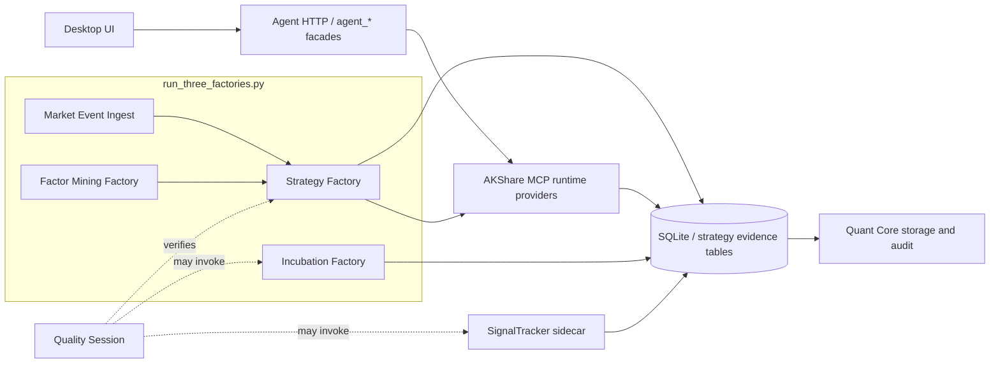

# 当前实际架构

## 总体定位

当前系统是一个跨包运行体系：`packages/strategy-factory` 拥有策略工厂领域编排和契约，`packages/akshare-mcp` 提供金融数据、LLM、因子、孵化、SignalTracker、事件摄取等运行实现，`packages/aiask-quant-core` 提供 SQLite 存储、回测、因子计算、信号跟踪、execution audit 和 shared quant primitives。

这不是单包线性脚本。问题诊断必须按“控制面、运行体、证据表、状态契约”四层看，而不能只追某个单轮指标。

## 证据来源

- 当前源码：`scripts/factories/`、`packages/strategy-factory`、`packages/akshare-mcp`、`packages/aiask-quant-core`。
- Graphify：`reports/code-graph/full-2026-05-29/curated/CURATED_SUMMARY.json` 显示 core 图谱 7638 nodes / 19921 edges。
- Graphify package 规模：`akshare-mcp` 4190 nodes / 11216 edges，`strategy-factory` 1754 / 4032，`aiask-quant-core` 619 / 1253，`agent` 540 / 1897。
- Graphify 跨包边：`akshare-mcp -> strategy-factory` 47 条，`strategy-factory -> aiask-quant-core` 21 条，`akshare-mcp -> aiask-quant-core` 16 条。
- AKShare MCP resources：当前可见 server capability 报告 179 tools、14 resource templates、7 prompts；治理报告 resource 读取失败，说明治理报告入口本身仍需可观测化。
- 当前会话未暴露 `thinking` MCP；不能声称已调用 thinking MCP。

Graphify 文件生成时间早于部分 6 月修改，因此它是架构证据，不是最终真相。关键结论必须回到当前源码复核。

## 包边界

| 包/目录 | 拥有内容 | 不应拥有内容 |
| --- | --- | --- |
| `packages/strategy-factory` | 策略生成编排、cycle pipeline、admission、quality gates、submission、readiness、生命周期契约 | AKShare 具体 manager、MCP tool 暴露、运行数据库私有实现 |
| `packages/akshare-mcp` | AKShare/TDX/TQCenter 数据与服务实现、Strategy runtime providers、因子挖掘、孵化、SignalTracker、市场事件摄取 | Strategy Factory 的核心领域契约所有权 |
| `packages/aiask-quant-core` | SQLite schema/storage、回测、因子计算、信号/仓位/audit primitives | MCP tool、Agent facade、策略工厂业务编排 |
| `packages/agent` | Desktop-facing HTTP API、`agent_*` 工具、ActionIntent 和安全控制面 | 直接运行策略工厂内部 manager 或绕过 guardrail 的写操作 |
| `scripts/factories` | 启动器、supervisor、验证会话、兼容入口 | 生产状态机和业务真相所有权 |

`packages/strategy-factory/src/strategy_factory/infrastructure/mcp_services.py` 明确写明 Strategy Factory owns orchestration and contracts；AKShare MCP 通过 `configure_runtime_services` 注入 DB、LLM、lifecycle、warmup、factor pool、execution audit 等 provider。这是当前最重要的边界。

## 当前运行拓扑

## 运行入口

| 入口 | 标准用途 | 规范判断 |
| --- | --- | --- |
| `scripts/factories/run_three_factories.py` | 当前正式四运行体 supervisor | 启动 Strategy、Factor Mining、Incubation、Market Event Ingest |
| `scripts/factories/run_all_factories.py` | 兼容入口 | 委托 `run_three_factories.py`，旧 SignalTracker 参数只作为兼容处理 |
| `scripts/factories/run_strategy_factory.py` | Strategy Factory 独立 runner | 单体调试或受控运行 |
| `scripts/factories/run_factor_mining_factory.py` | Factor Mining Factory 独立 runner | 因子挖掘单体调试或维护 |
| `scripts/factories/run_incubation_factory.py` | Incubation Factory 独立 runner | 孵化、paper evidence、audit 验证 |
| `scripts/factories/run_market_event_ingest.py` | Market Event Ingest 独立 runner | 事件源同步/桥接 |
| `scripts/factories/run_signal_tracker.py` | SignalTracker sidecar 独立 runner | 证据闭环，不在四工厂 supervisor 内 |
| `scripts/factories/run_strategy_factory_quality_session.py` | 质量验证会话 | 验证契约，不是生产 supervisor |

## 核心数据流

1. Market Event Ingest 读取官方/可信事件源，归一化为可审计市场事件，并桥接到策略工厂事件候选。
2. Factor Mining Factory 从 SQLite-backed 市场数据构建因子候选，经过 sandbox/QC/validation 后进入 active factor pool。
3. Strategy Factory 从事件、因子池、市场画像、历史反馈、LLM/staged pipeline 中生成候选策略，经 gate、dedupe、submission/admission 后进入 formal、observe、paper 或 diagnostic 通道。
4. SignalTracker 读取可执行策略集合，生成 `strategy_signals`、paper execution 相关证据、forward returns 或对应 blocker。
5. Incubation Factory intake observe/paper/incubating 策略，执行前向验证、paper evidence、hit-rate、metrics、execution audit acceptance 和反馈写入。
6. Quant Core storage 汇总 signals、orders、trades、positions、forward returns、signal evidence 和 execution audit snapshots，为 hard gate 和生命周期判断提供事实。

## 当前架构问题

| 问题 | 表现 | 架构原因 | 应落入的规范 |
| --- | --- | --- | --- |
| 多套局部真相 | `success`、`partial_infra`、`submitted`、`healthy` 互相覆盖 | 缺少统一 `FactoryRunContract` 和生命周期账本 | `02`、`05` |
| quality session 补偿化 | 验证脚本能补 evidence，但生产链路未必自然产生 | 验证入口与生产控制面边界不够硬 | `05`、`06` |
| SignalTracker 缺位 | 有 observe/paper 账户但无信号、无 order、无 forward returns | sidecar 不在四工厂 supervisor 内，缺少显式依赖检查 | `04` |
| paper 证据未 round-trip | buy/open 增长但 closed positions 少，hard gate 不通过 | execution universe、stale close、settlement、audit 样本债未统一 | `02`、`04` |
| factor mining 健康不可证明 | 跳过 factor mining 后仍可能被误报为健康 | factor generation/consumption 未进入同一质量契约 | `03`、`05` |
| governance resource 不稳定 | `resource://governance/system/report` 读取失败 | MCP resource 可用性本身未纳入健康门禁 | `08`、`10` |

## 架构结论

策略工厂的根问题不是“某个 phase 偶发失败”，而是生产线缺少统一控制面。四工厂要解决的是生产职责分离；SignalTracker 要解决的是证据闭环；Quant Core 要解决的是事实存储；quality session 只能解决验证可见性。任何把这些层混在一起的修复都会继续制造新问题。
