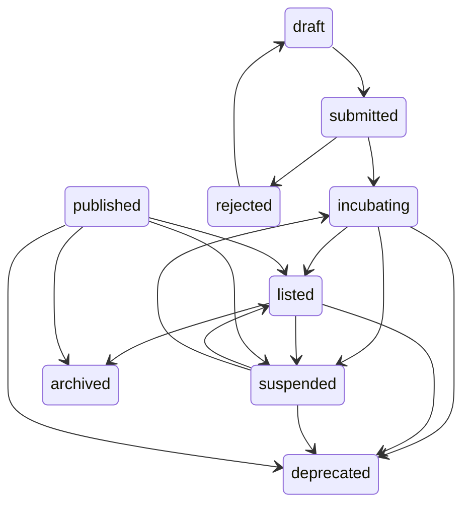
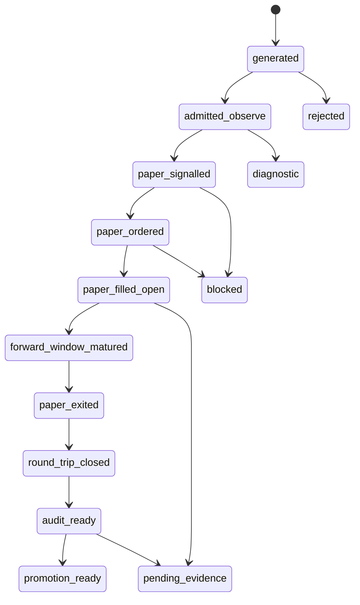

# 策略工厂全链路生命周期规范

## 目标

策略工厂的生命周期规范必须能同时回答两个问题：

1. 当前代码和数据库实际存了什么状态。
2. 从业务闭环看，一条策略到底停在“生成、观察、信号、订单、成交、前向、回合、审计、晋级”的哪一段。

因此本文档不把 `generated -> admitted_observe -> paper_signalled -> ...` 写成数据库枚举。它们是证据派生的业务生命周期覆盖层。真实物理状态仍以当前源码中的表字段和 transition map 为准。

## 事实源

当前实现中至少存在三层状态事实：

| 层 | 主要字段 | 当前实现口径 | 证据路径 |
| --- | --- | --- | --- |
| 策略主状态 | `strategies.status` | `draft`、`submitted`、`rejected`、`incubating`、`listed`、`suspended`、`deprecated`、`published`、`archived`；`published` 会规范化为 `listed` | `strategy_lifecycle_shared/common.py`、`_strategy_crud_core.py` |
| 孵化账户状态 | `strategy_incubation_accounts.stage/status` | `warmup`、`paper`、`observe`、`diagnostic`、`candidate`、`graduation_ready`、`listed`、`promoted` 等在查询/写入路径中出现；`status` 常见为 `active/archived` | `_strategy_crud_core.py`、`incubation_factory/intake.py`、`incubation_pipeline.py` |
| 孵化流水线状态 | `strategy_incubation_pipeline_snapshots.pipeline_stage/pipeline_status` | `warmup`、`observe`、`candidate`、`graduation_ready`、`promoted`、`listed`、`failed` 等派生阶段 | `incubation_pipeline.py`、`strategy_lifecycle_shared/incubation.py` |

规范中的业务生命周期状态只允许从这些物理字段加证据表派生，不能直接写回 `strategies.status` 当作新枚举。

## 物理状态机

`strategies.status` 的当前 transition map 来自 `packages/akshare-mcp/src/akshare_mcp/services/strategy_lifecycle_shared/common.py`：

这个状态机回答“策略记录处于哪个主生命周期阶段”。它不直接回答是否已经有 signal、paper order、trade、closed round-trip 或 audit evidence。

## 业务生命周期覆盖层

业务生命周期覆盖层用于诊断和验收，不新增数据库主状态枚举。

## 映射规则

| 覆盖层状态 | 物理状态/表证据 | 进入条件 | 常见 blocker |
| --- | --- | --- | --- |
| `generated` | candidate artifact、factory run payload；可能尚未保存为 strategy row | 候选已生成，可进入 gate/admission | payload 不合约、LLM timeout、缺市场上下文 |
| `admitted_observe` | `strategies.status in ('submitted','incubating')`，且存在 active `strategy_incubation_accounts` 或 admission/handoff metadata | 已进入 observe/paper/diagnostic/warmup 轨道 | account 缺失、stage 不一致、handoff 不可追溯 |
| `paper_signalled` | `strategy_signals` 非零记录或 `strategy_signal_event_snapshots` | 策略在可执行宇宙中产生信号 | SignalTracker 未运行、universe 未覆盖、runtime control 阻塞 |
| `paper_ordered` | `paper_orders` 可追溯 `strategy_id/account_id`，可用时关联 `signal_id/position_id` | 非零 signal 已转 paper order，或 Incubation backlog 已补单 | 价格缺失、账户缺失、shares 规则不满足、skip reason 缺失 |
| `paper_filled_open` | `paper_trades` buy/fill + open `strategy_trade_positions` | order 已成交并形成持仓入口 | settlement 未跑、只有 order 无 trade |
| `forward_window_matured` | `signal_forward_returns` 覆盖 horizon，或 `strategy_incubation_metrics.effective_n_*` 增长 | 前向窗口已有样本或明确未成熟 | horizon 未到、行情缺失、forward backfill 截断 |
| `paper_exited` | exit order/trade 或 stale close 执行记录 | 持仓发生退出动作 | stale close 未启用、退出信号未产生 |
| `round_trip_closed` | closed `strategy_trade_positions`、`realized_trade_count > 0` | 完成真实 paper round-trip | 只有 open positions、成交方向不完整 |
| `audit_ready` | `strategy_execution_audit_snapshots`、`run_execution_audit_acceptance` 返回值、trade audit summary | audit 已运行且 gate status 可解释 | `missing`、`needs_remediation`、`bootstrap_pending`、`insufficient_samples` |
| `promotion_ready` | `execution_audit_gate_status='passed'`、risk/governance gate 通过、pipeline stage candidate/graduation/promoted | 可进入正式晋级讨论 | production 样本不足、risk/governance 不过 |

## 证据表口径

文档中使用的证据表按当前 schema 分为原始证据和派生摘要：

| 证据 | 当前实现 | 用途 |
| --- | --- | --- |
| signals | `strategy_signals`、`strategy_signal_event_snapshots` | 证明策略产生过信号或 signal event snapshot |
| signal evidence | `strategy_signal_evidence` | 记录 native lineage，修复 trades without signal evidence |
| forward returns | `signal_forward_returns` | 原始 signal horizon 前向收益表 |
| incubation metrics | `strategy_incubation_metrics.effective_n_5d` 等字段 | 孵化视角的派生样本数、命中率、LCB、forward IC/Sharpe |
| orders/trades | `paper_orders`、`paper_trades` | paper execution 入口和成交证据 |
| positions | `strategy_trade_positions` | open/closed round-trip、entry/exit、realized PnL |
| audit snapshots | `strategy_execution_audit_snapshots` | execution audit 快照和 verdict |
| audit acceptance | `run_execution_audit_acceptance` 路径/运行结果；可通过 `strategy_execution_audit_snapshots` 保存 verdict/acceptance 快照 | schema/migration/lineage/round-trip/hard gate acceptance |

不能把 `signal_forward_returns` 和 `strategy_incubation_metrics.effective_n_5d` 二选一。前者是原始前向收益序列，后者是孵化/晋级使用的派生摘要。

## Gate 语义

`evaluate_execution_audit_gate` 当前语义如下：

| gate status | 含义 | 是否 production hard gate 通过 |
| --- | --- | --- |
| `missing` | 无 audit summary，或无 realized trade 且无 runtime evidence | 否 |
| `bootstrap_pending` | 有 runtime evidence 或账户痕迹，但 `realized_trade_count <= 0` | 否 |
| `insufficient_samples` | realized trades 大于 0，但低于 bootstrap floor | 否 |
| `failed_metrics` | 样本数达到 bootstrap floor，但 expectancy/PNL/execution conversion 等指标失败 | 否 |
| `bootstrap_ready` | 指标通过且达到 bootstrap floor，但低于 production floor | 否 |
| `passed` | 指标通过且 `realized_trade_count >= production_trade_floor` | 是 |

当前 production floor 默认是 `20`，由 `evaluate_execution_audit_gate(..., production_trade_floor=20)` 给出；bootstrap floor 来自 provisional/backtest thresholds 的较大值，最低为 `1`。因此“bootstrap 不进入 production hard gate”的正确表达是：`bootstrap_pending` 和 `bootstrap_ready` 可以作为诊断/样本债状态出现，但不能被解释为 `passed`。

## 失败状态

| 状态 | 含义 | 必须暴露的 blocker |
| --- | --- | --- |
| `rejected` | 候选未通过准入、质量、治理、去重或门禁 | gate reason、validation reason、dedupe reason |
| `diagnostic` | 仅诊断观察，不可晋级 | diagnostic reason、缺失 production evidence |
| `blocked` | 当前状态无法推进 | 缺失表、缺失关联、组件未运行、timeout、skip reason |
| `pending_evidence` | 证据方向正确但样本未成熟 | sample debt、forward window、open position、round-trip debt |

`pending_evidence` 不是成功，也不是必须修的错误。它表示链路方向正确但真实样本还不够。`blocked` 才表示链路断裂或组件未运行。

## 指标解释

| 指标 | 正确解释 |
| --- | --- |
| `submitted=0` | 必须拆成 `live_submitted`、`formal_incubation_created`、`observe_paper_created`、`audit_only_created` 后再判断 |
| `signals_generated>0` | 只说明策略产生过信号，不说明 paper execution 闭环健康 |
| `paper_orders>0` | 只说明有下单入口，不说明有成交、持仓、前向或 audit evidence |
| `paper_trades>0` | 若只有 buy，不代表 round-trip 成熟 |
| `saved_signal_evidence=0` | 有 signal/order/trade 时是证据链 blocker；无 signal 时是上游未运行或未覆盖 |
| `hard_gate_passed=0` | 在真实 closed round-trip 样本不足时是诚实结果 |
| `execution_audit_gate_status=missing` | 链路缺失或 audit 未运行，不能当作 pending 样本债 |

## 晋级规则

- `promotion_ready` 不允许由 bootstrap/backtest 单独触发。
- production hard gate 只认 `execution_audit_gate_status='passed'`，也就是达到真实 paper realized trade production floor 并通过执行指标。
- bootstrap/backtest 可以用于诊断、代码路径验证、样本债估算，但不能进入 production hard gate。
- `success=True` 不能覆盖底层 `failed`、`partial_infra`、phase timeout 或 evidence missing。
- quality session 是脚本级验证会话，不是 package 内领域状态机，也不能拥有生产生命周期状态。

## 最小验收

一次健康的短验证不要求立刻 `hard_gate_passed>0`，但必须能说明：

- 哪些策略映射到哪个业务生命周期覆盖层状态。
- 覆盖层状态能由物理字段和证据表复核。
- 非零 signal 是否转成 order；未转时 skip reason 是什么。
- order 是否转成 trade；未转时 settlement blocker 是什么。
- open positions 是否有 aging/exit policy。
- forward returns 或 `effective_n_*` 是否在增长，或窗口是否未成熟。
- execution audit 不是全量 `missing`。
- hard gate 未通过时，是真实 round-trip 样本债，不是链路断裂。
