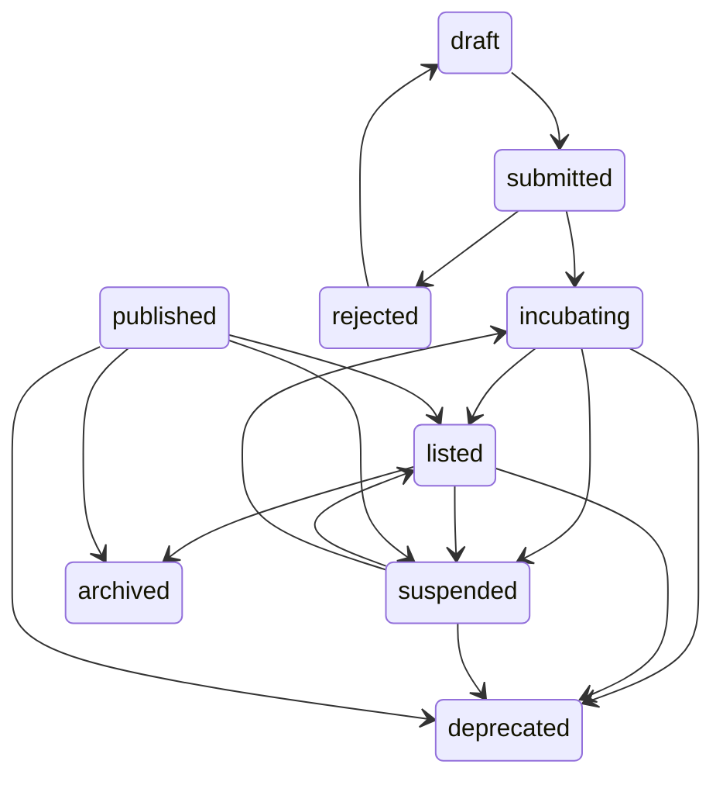
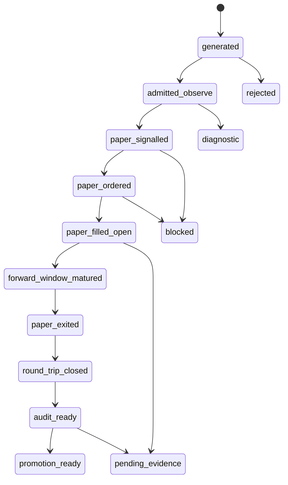

# 策略工厂全链路生命周期规范

## ⚠️ 强制性规范

**本文档是策略工厂开发的强制性技术规范。**

所有涉及策略生命周期状态查询、状态判断、健康诊断、证据链路的代码，**必须**遵守本规范定义的物理状态机和业务生命周期覆盖层。

### 禁止行为

1. ❌ **禁止**绕过统一生命周期状态机，从多个局部表查询拼接出"策略当前状态"
2. ❌ **禁止**把业务覆盖层状态（如 `paper_signalled`、`promotion_ready`）写入数据库主状态字段
3. ❌ **禁止**在没有证据表支撑的情况下，假设策略"已完成某阶段"
4. ❌ **禁止**用 Quality Session 的补偿逻辑（backlog/backfill）来掩盖生产链路缺陷
5. ❌ **禁止**把 `bootstrap_pending` 或 `bootstrap_ready` 解释为 production hard gate 通过

### 强制要求

1. ✅ **必须**使用统一的 `StrategyLifecycleLedger` 作为单一真相来源（已实现：`aiask_quant_core.strategy_lifecycle_ledger`）
2. ✅ **必须**区分物理状态（数据库字段）和业务覆盖层（证据派生状态）
3. ✅ **必须**在诊断报告中明确标注策略卡在哪个证据环节、哪个组件负责
4. ✅ **必须**在 hard gate 不通过时，区分"链路断裂（missing）"和"样本债（insufficient_samples）"
5. ✅ **必须**确保 SignalTracker 和 Incubation Factory 使用相同的执行宇宙查询契约

## 目标

策略工厂的生命周期规范必须能同时回答两个问题：

1. 当前代码和数据库实际存了什么状态。
2. 从业务闭环看，一条策略到底停在“生成、观察、信号、订单、成交、前向、回合、审计、晋级”的哪一段。

因此本文档不把 `generated -> admitted_observe -> paper_signalled -> ...` 写成数据库枚举。它们是证据派生的业务生命周期覆盖层。真实物理状态仍以当前源码中的表字段和 transition map 为准。

## 事实源

当前实现中至少存在三层状态事实：

| 层 | 主要字段 | 当前实现口径 | 证据路径 |
| --- | --- | --- | --- |
| 策略主状态 | `strategies.status` | `draft`、`submitted`、`rejected`、`incubating`、`listed`、`suspended`、`deprecated`、`published`、`archived`；`published` 会规范化为 `listed` | `strategy_lifecycle_shared/common.py`、`_strategy_crud_core.py` |
| 孵化账户状态 | `strategy_incubation_accounts.stage/status` | **实际数据库中 stage 值**：`warmup`、`diagnostic`、`failed`；**status 值**：`active`、`archived`、`retired`。**注意**：规范描述的 `paper`、`observe`、`candidate`、`graduation_ready`、`listed`、`promoted` 等阶段在当前数据库中**未实际使用**，可能是设计中的目标状态或已废弃 | `_strategy_crud_core.py`、`incubation_factory/intake.py`、`incubation_pipeline.py`、**实际数据**: `data/db/akshare_mcp.sqlite3` |
| 孵化流水线状态 | `strategy_incubation_pipeline_snapshots.pipeline_stage/pipeline_status` | **实际数据库中 pipeline_stage 值**：`warmup`；**pipeline_status 值**：`collecting`。**注意**：规范描述的 `observe`、`candidate`、`graduation_ready`、`promoted`、`listed`、`failed` 等阶段在当前数据库中**未实际使用** | `incubation_pipeline.py`、`strategy_lifecycle_shared/incubation.py`、**实际数据**: `data/db/akshare_mcp.sqlite3` |

规范中的业务生命周期状态只允许从这些物理字段加证据表派生，不能直接写回 `strategies.status` 当作新枚举。

## 物理状态机

`strategies.status` 的当前 transition map 来自 `packages/akshare-mcp/src/akshare_mcp/services/strategy_lifecycle_shared/common.py`：



这个状态机回答“策略记录处于哪个主生命周期阶段”。它不直接回答是否已经有 signal、paper order、trade、closed round-trip 或 audit evidence。

## 业务生命周期覆盖层（诊断派生状态，非数据库枚举）

**重要说明**: 以下状态是从物理表字段和证据表派生的**诊断视图**，不是数据库中实际存储的枚举值。它们用于回答"策略停在哪个证据环节"，而非直接写入 `strategies.status` 或 `strategy_incubation_accounts.stage`。

实际数据库中只有:
- `strategy_incubation_accounts.stage`: `warmup`、`diagnostic`、`failed` (已验证)
- `strategy_incubation_accounts.status`: `active`、`archived`、`retired` (已验证)
- `strategy_incubation_pipeline_snapshots.pipeline_stage`: `warmup` (已验证)
- `strategy_incubation_pipeline_snapshots.pipeline_status`: `collecting` (已验证)

业务生命周期覆盖层用于诊断和验收，不新增数据库主状态枚举。



## 映射规则

| 覆盖层状态 | 物理状态/表证据 | 进入条件 | 常见 blocker |
| --- | --- | --- | --- |
| `generated` | candidate artifact、factory run payload；可能尚未保存为 strategy row | 候选已生成，可进入 gate/admission | payload 不合约、LLM timeout、缺市场上下文 |
| `admitted_observe` | `strategies.status in ('submitted','incubating')`，且存在 active `strategy_incubation_accounts` (实际 stage 为 `warmup`、`diagnostic` 或 `failed`) 或 admission/handoff metadata | 已进入 warmup/diagnostic 轨道 (注意: 实际数据库中无 `observe`、`paper` 等 stage 值) | account 缺失、stage 不一致、handoff 不可追溯 |
| `paper_signalled` | `strategy_signals` 非零记录或 `strategy_signal_event_snapshots` | 策略在可执行宇宙中产生信号 | SignalTracker 未运行、universe 未覆盖、runtime control 阻塞 |
| `paper_ordered` | `paper_orders` 可追溯 `strategy_id/account_id`，可用时关联 `signal_id/position_id` | 非零 signal 已转 paper order，或 Incubation backlog 已补单 | 价格缺失、账户缺失、shares 规则不满足、skip reason 缺失 |
| `paper_filled_open` | `paper_trades` buy/fill + open `strategy_trade_positions` | order 已成交并形成持仓入口 | settlement 未跑、只有 order 无 trade |
| `forward_window_matured` | `signal_forward_returns` 覆盖 horizon，或 `strategy_incubation_metrics.effective_n_*` 增长 | 前向窗口已有样本或明确未成熟 | horizon 未到、行情缺失、forward backfill 截断 |
| `paper_exited` | exit order/trade 或 stale close 执行记录 | 持仓发生退出动作 | stale close 未启用、退出信号未产生 |
| `round_trip_closed` | closed `strategy_trade_positions`、`realized_trade_count > 0` | 完成真实 paper round-trip | 只有 open positions、成交方向不完整 |
| `audit_ready` | `strategy_execution_audit_snapshots`、`run_execution_audit_acceptance` 返回值、trade audit summary | audit 已运行且 gate status 可解释 | `missing`、`needs_remediation`、`bootstrap_pending`、`insufficient_samples` |
| `promotion_ready` | `execution_audit_gate_status='passed'`、risk/governance gate 通过 (注意: 实际数据库 pipeline_stage 当前只有 `warmup`，规范描述的 `candidate`/`graduation`/`promoted` 等阶段为目标设计) | 可进入正式晋级讨论 | production 样本不足、risk/governance 不过 |

## 证据表口径

文档中使用的证据表按当前 schema 分为原始证据和派生摘要：

| 证据 | 当前实现 | 用途 |
| --- | --- | --- |
| signals | `strategy_signals`、`strategy_signal_event_snapshots` | 证明策略产生过信号或 signal event snapshot |
| signal evidence | `strategy_signal_evidence` | 记录 native lineage，修复 trades without signal evidence |
| forward returns | `signal_forward_returns` | 原始 signal horizon 前向收益表 |
| incubation metrics | `strategy_incubation_metrics.effective_n_5d` 等字段 | 孵化视角的派生样本数、命中率、LCB、forward IC/Sharpe |
| orders/trades | `paper_orders`、`paper_trades` | paper execution 入口和成交证据 |
| positions | `strategy_trade_positions` | open/closed round-trip、entry/exit、realized PnL |
| audit snapshots | `strategy_execution_audit_snapshots` | execution audit 快照和 verdict |
| audit acceptance | `run_execution_audit_acceptance` 路径/运行结果；可通过 `strategy_execution_audit_snapshots` 保存 verdict/acceptance 快照 | schema/migration/lineage/round-trip/hard gate acceptance |

不能把 `signal_forward_returns` 和 `strategy_incubation_metrics.effective_n_5d` 二选一。前者是原始前向收益序列，后者是孵化/晋级使用的派生摘要。

## Gate 语义

`evaluate_execution_audit_gate` 当前语义如下：

| gate status | 含义 | 是否 production hard gate 通过 |
| --- | --- | --- |
| `missing` | 无 audit summary，或无 realized trade 且无 runtime evidence | 否 |
| `bootstrap_pending` | 有 runtime evidence 或账户痕迹，但 `realized_trade_count <= 0` | 否 |
| `insufficient_samples` | realized trades 大于 0，但低于 bootstrap floor | 否 |
| `failed_metrics` | 样本数达到 bootstrap floor，但 expectancy/PNL/execution conversion 等指标失败 | 否 |
| `bootstrap_ready` | 指标通过且达到 bootstrap floor，但低于 production floor | 否 |
| `passed` | 指标通过且 `realized_trade_count >= production_trade_floor` | 是 |

当前 production floor 默认是 `20`，由 `evaluate_execution_audit_gate(..., production_trade_floor=20)` 给出；bootstrap floor 来自 provisional/backtest thresholds 的较大值，最低为 `1`（注意：具体 provisional/backtest 阈值需查阅 `strategy_lifecycle_shared/common.py` 或 `incubation_factory` 相关代码）。因此”bootstrap 不进入 production hard gate”的正确表达是：`bootstrap_pending` 和 `bootstrap_ready` 可以作为诊断/样本债状态出现，但不能被解释为 `passed`。

## 失败状态

| 状态 | 含义 | 必须暴露的 blocker |
| --- | --- | --- |
| `rejected` | 候选未通过准入、质量、治理、去重或门禁 | gate reason、validation reason、dedupe reason |
| `diagnostic` | 仅诊断观察，不可晋级 | diagnostic reason、缺失 production evidence |
| `blocked` | 当前状态无法推进 | 缺失表、缺失关联、组件未运行、timeout、skip reason |
| `pending_evidence` | 证据方向正确但样本未成熟 | sample debt、forward window、open position、round-trip debt |

`pending_evidence` 不是成功，也不是必须修的错误。它表示链路方向正确但真实样本还不够。`blocked` 才表示链路断裂或组件未运行。

## 指标解释

| 指标 | 正确解释 |
| --- | --- |
| `submitted=0` | 必须拆成 `live_submitted`、`formal_incubation_created`、`observe_paper_created`、`audit_only_created` 后再判断 |
| `signals_generated>0` | 只说明策略产生过信号，不说明 paper execution 闭环健康 |
| `paper_orders>0` | 只说明有下单入口，不说明有成交、持仓、前向或 audit evidence |
| `paper_trades>0` | 若只有 buy，不代表 round-trip 成熟 |
| `saved_signal_evidence=0` | 有 signal/order/trade 时是证据链 blocker；无 signal 时是上游未运行或未覆盖 |
| `hard_gate_passed=0` | 在真实 closed round-trip 样本不足时是诚实结果 |
| `execution_audit_gate_status=missing` | 链路缺失或 audit 未运行，不能当作 pending 样本债 |

## 晋级规则

- `promotion_ready` 不允许由 bootstrap/backtest 单独触发。
- production hard gate 只认 `execution_audit_gate_status='passed'`，也就是达到真实 paper realized trade production floor 并通过执行指标。
- bootstrap/backtest 可以用于诊断、代码路径验证、样本债估算，但不能进入 production hard gate。
- `success=True` 不能覆盖底层 `failed`、`partial_infra`、phase timeout 或 evidence missing。
- quality session 是脚本级验证会话，不是 package 内领域状态机，也不能拥有生产生命周期状态。

## 最小验收

一次健康的短验证不要求立刻 `hard_gate_passed>0`，但必须能说明：

- 哪些策略映射到哪个业务生命周期覆盖层状态。
- 覆盖层状态能由物理字段和证据表复核。
- 非零 signal 是否转成 order；未转时 skip reason 是什么。
- order 是否转成 trade；未转时 settlement blocker 是什么。
- open positions 是否有 aging/exit policy。
- forward returns 或 `effective_n_*` 是否在增长，或窗口是否未成熟。
- execution audit 不是全量 `missing`。
- hard gate 未通过时，是真实 round-trip 样本债，不是链路断裂。

## 规范符合性验收标准

**所有代码提交必须通过以下验收标准**：

### 验收项 1：统一生命周期状态查询

```python
# ✅ 正确 - 通过统一入口
ledger = StrategyLifecycleLedger(db)
state = await ledger.get_state(strategy_id)
print(f"策略 {strategy_id} 当前状态：{state.db_status}")
print(f"卡在：{state.blocker_component} - {state.blocker_reason}")

# ❌ 错误 - 绕过统一入口，多表拼接
status = db.query("SELECT status FROM strategies WHERE id=?", strategy_id)
signals = db.query("SELECT COUNT(*) FROM strategy_signals WHERE strategy_id=?", strategy_id)
orders = db.query("SELECT COUNT(*) FROM paper_orders WHERE strategy_id=?", strategy_id)
# ... 自行判断策略状态
```

### 验收项 2：执行宇宙一致性

```python
# ✅ 正确 - SignalTracker 和 Incubation 共用契约
universe_contract = ExecutionUniverseContract()
strategies = await universe_contract.list_executable_strategies(db, as_of=date.today())

# ❌ 错误 - 各自实现查询逻辑
signal_tracker_strategies = await list_execution_universe_candidates(db)  # SignalTracker 路径
incubation_strategies = await list_active_paper_observation_strategies(db)  # Incubation 路径
```

### 验收项 3：证据链路完整性

```python
# ✅ 正确 - 完整链路包含 exit
await sync_signals_to_orders(db, strategy, signal_date)
await settle_orders(db, strategy, signal_date)
await process_exit_signals(db, strategy, signal_date)  # 必须有
await close_stale_positions(db, strategy, signal_date)  # 必须有

# ❌ 错误 - 只生产 open，不生产 close
await sync_signals_to_orders(db, strategy, signal_date)
await settle_orders(db, strategy, signal_date)
# 缺失 exit 和 close 逻辑
```

### 验收项 4：Quality Session 纯验证模式

```python
# ✅ 正确 - Quality Session 不启用补偿
async def run_quality_session():
    # 不设置 backlog/backfill/stale close 环境变量
    factory_result = await run_strategy_factory_once()
    ledger = StrategyLifecycleLedger(db)
    states = await ledger.reconcile_all()
    return pure_diagnostic_report(states)

# ❌ 错误 - Quality Session 启用补偿掩盖缺陷
os.environ["INCUBATION_FACTORY_PAPER_EXECUTION_BACKLOG_ENABLED"] = "1"
os.environ["INCUBATION_FACTORY_EXECUTION_AUDIT_NATIVE_EVIDENCE_BACKFILL_ENABLED"] = "1"
os.environ["INCUBATION_FACTORY_STALE_PAPER_POSITION_CLOSURE_ENABLED"] = "1"
```

### 验收项 5：调度预算正确设计

```python
# ✅ 正确 - 分阶段预算
generation_results = await asyncio.wait_for(generate_candidates(), timeout=300)
for batch in batched(generation_results, batch_size=10):
    await asyncio.wait_for(process_batch(batch), timeout=60)

# ❌ 错误 - 单一整轮超时
results = await asyncio.wait_for(
    process_all_candidates(200_strategies),
    timeout=420  # 数学不成立
)
```

### 强制性测试要求

所有策略工厂相关代码修改必须通过：

```bash
# 1. 生命周期账本一致性测试（已实现）
uv run python scripts/factories/test_lifecycle_ledger_consistency.py

# 2. 执行宇宙一致性测试（已实现）
uv run python scripts/factories/test_execution_universe_consistency.py

# 3. 证据链路完整性测试（已实现）
uv run python scripts/factories/test_evidence_chain_completeness.py

# 4. Quality Session 纯验证模式（不启用补偿）
uv run python scripts/factories/run_strategy_factory_quality_session.py \
  --no-backlog \
  --no-backfill \
  --no-stale-close
```

**测试状态**：
- ✅ 生命周期账本一致性测试 - 验证 `StrategyLifecycleLedger` 正确派生业务状态
- ✅ 执行宇宙一致性测试 - 验证 SignalTracker 和 Incubation Factory 使用相同查询逻辑
- ✅ 证据链路完整性测试 - 验证 signal -> order -> trade -> position -> forward -> audit 链路完整

**代码提交前必须验证**：
1. 是否绕过了统一状态查询入口
2. 是否在 Quality Session 中启用了补偿逻辑

## StrategyLifecycleLedger 使用指南

### 基本用法

```python
from aiask_quant_core.storage.sqlite import get_db
from aiask_quant_core.strategy_lifecycle_ledger import StrategyLifecycleLedger
import asyncio

# 初始化
db = get_db()
await db.initialize()
ledger = StrategyLifecycleLedger(db.connection)

# 查询单个策略
snapshot = ledger.get_snapshot("strategy_id_123")

# 访问快照数据
print(f"物理状态: {snapshot.physical_status}")
print(f"业务状态: {snapshot.business_stage.value}")
print(f"信号数: {snapshot.signal_count}")
print(f"订单数: {snapshot.order_count}")
print(f"成交数: {snapshot.trade_count}")
print(f"Hard Gate: {snapshot.hard_gate_passed}")
if snapshot.blocker_reason:
    print(f"阻塞原因: {snapshot.blocker_reason}")

# 批量查询
snapshots = ledger.batch_get_snapshots(["id1", "id2", "id3"])
for strategy_id, snapshot in snapshots.items():
    print(f"{strategy_id}: {snapshot.business_stage.value}")
```

### 业务状态枚举

`BusinessLifecycleStage` 枚举定义了所有可能的业务状态：

| 状态 | 含义 | 进入条件 |
| --- | --- | --- |
| `generated` | 候选已生成 | candidate artifact/payload 存在 |
| `admitted_observe` | 已进入观察轨道 | `strategies.status` in ('submitted','incubating') 且有 active incubation account |
| `paper_signalled` | 产生信号 | `strategy_signals` 有非零记录 |
| `paper_ordered` | 信号转订单 | `paper_orders` 可追溯到策略 |
| `paper_filled_open` | 订单成交 | `paper_trades` + open `strategy_trade_positions` |
| `forward_window_matured` | 前向窗口成熟 | `signal_forward_returns` 有样本 |
| `paper_exited` | 持仓退出 | exit order/trade 存在 |
| `round_trip_closed` | 完成回合 | closed `strategy_trade_positions` |
| `audit_ready` | 审计就绪 | `strategy_execution_audit_snapshots` 存在 |
| `promotion_ready` | 可晋级 | `execution_audit_gate_status='passed'` |
| `rejected` | 被拒绝 | `strategies.status='rejected'` |
| `diagnostic` | 仅诊断 | `incubation_stage='diagnostic'` |
| `blocked` | 阻塞 | 状态无法推进 |
| `pending_evidence` | 等待证据 | 证据方向正确但样本不足 |

### 快照字段说明

`StrategyLifecycleSnapshot` 包含以下字段：

- **物理状态**：
  - `physical_status`: `strategies.status` 值
  - `incubation_stage`: `strategy_incubation_accounts.stage` 值
  - `incubation_status`: `strategy_incubation_accounts.status` 值
  - `pipeline_stage`: `strategy_incubation_pipeline_snapshots.pipeline_stage` 值

- **业务状态**：
  - `business_stage`: 派生的 `BusinessLifecycleStage` 枚举值

- **证据计数**：
  - `signal_count`: 非零信号数
  - `order_count`: paper order 数
  - `trade_count`: paper trade 数
  - `open_position_count`: 开仓数
  - `closed_position_count`: 平仓数
  - `forward_return_count`: 前向收益记录数
  - `audit_snapshot_count`: 审计快照数

- **关键指标**：
  - `execution_audit_gate_status`: audit gate 状态
  - `hard_gate_passed`: 是否通过 production hard gate
  - `blocker_reason`: 阻塞原因（如果有）

### 集成到诊断工具

诊断脚本 `diagnose_factory_health.py` 已集成 `StrategyLifecycleLedger`：

```bash
# 运行诊断（自动使用 StrategyLifecycleLedger）
uv run python scripts/factories/diagnose_factory_health.py

# 详细模式
uv run python scripts/factories/diagnose_factory_health.py --verbose

# 保存 JSON 报告
uv run python scripts/factories/diagnose_factory_health.py --output report.json
```

诊断报告中的 `strategy_lifecycle_state` 检查项会显示：
- `ledger_enabled: true` 表示使用了统一账本
- `physical_stats`: 物理状态分布
- `business_stats`: 业务状态分布
3. 是否通过打补丁掩盖了根因问题

