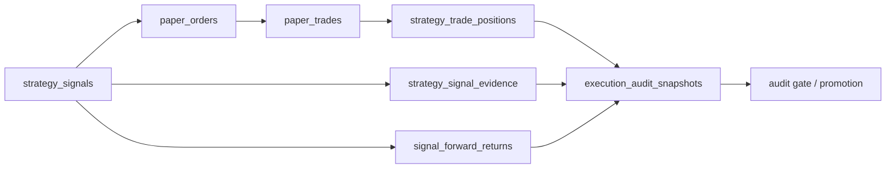

# SignalTracker 与证据闭环规范

## 定位

SignalTracker 是策略工厂到孵化晋级之间的闭环 sidecar。它不属于正式四工厂 supervisor 的四个运行体，但它是 paper evidence 生产和孵化 hard gate 的必需组件。

如果 SignalTracker 没有运行，系统可能出现：

- 策略进入 observe/paper 账户，但没有 `strategy_signals`。
- 孵化 metrics 中 `total_signals=0` 或 `effective_n=0`。
- warmup 账户长期堆积。
- execution audit 长期 `missing` 或 `bootstrap_pending`。
- hard gate 无法诚实通过。

## 运行入口

标准入口是 `scripts/factories/run_signal_tracker.py`。它是仓库根 wrapper，实际目标位于 `packages/akshare-mcp/scripts/run_signal_tracker.py`。

SignalTracker 可以：

- 按 daemon 方式定时运行。
- 以 `--once` 单次运行。
- 被 quality session 显式调用，用于短验证。

不得假设 MCP server 或四工厂 supervisor 已经隐式启动 SignalTracker。

## 当前实现与缺口

当前代码已经提供独立 SignalTracker wrapper，也已经在 `signal_tracker_parts/specs.py` 中纳入多类策略来源：

| 来源 | 当前查询路径 |
| --- | --- |
| listed/incubating 策略 | `db.list_strategies('listed')`、`db.list_strategies('incubating')` |
| submitted runtime 策略 | `_load_runtime_submitted_strategies()`，读取 `submission_lane`、paper/live review metadata |
| paper/observe/warmup 策略 | `list_active_paper_observation_strategies()`、`list_paper_observation_strategies()` |

**重要说明**：canonical `ExecutionUniverseContract` 已存在于 `packages/strategy-factory/src/strategy_factory/contracts/execution_universe.py`，并由 `strategy_factory.api.contracts` 对外公开。当前缺口不再是“契约不存在”，而是 SignalTracker/Incubation 消费面仍保留 contract-first + legacy fallback 的兼容路径，尚未完全收敛到单一路径。

Incubation Factory 仍主要从 `strategy_incubation_accounts` 和自身 phase 输入加载 `warmup/diagnostic` 等策略（注意：实际数据库中无 `paper`/`observe`/`candidate` 等 stage 值）。两者已经有部分共享 DB helper，但没有一个独立类、接口或只读诊断命令裁决”今天哪些策略应进入 paper execution universe”。

当前必须按以下口径描述：

- `ExecutionUniverseContract` 的 canonical owner 已在 `strategy-factory`，并已有守门测试冻结 owner。
- 当前实现仍是“canonical contract 已落位 + 多条兼容查询路径待继续收敛”，因此仍有 drift 风险。
- 若 SignalTracker 与 Incubation 对同一策略是否可执行得出不同结论，质量报告必须标为 contract mismatch。
- supervisor 当前不拥有 SignalTracker，因此生产启动手册必须要求 sidecar preflight 或单独启动，而不能只写”运行四工厂”。

## 闭环职责

SignalTracker 至少需要覆盖以下职责：

1. 选择可执行策略集合，包括 listed、incubating、submitted runtime、paper observation 中应参与 paper execution 的策略。
2. 生成或刷新 `strategy_signals` 和 `strategy_signal_event_snapshots`。
3. 将非零信号转换为 paper order，或记录明确 skip reason。
4. 推进 settlement、metrics 或将结果交给 Incubation paper runtime。
5. 计算或触发 `signal_forward_returns`，并报告 forward window 是否成熟。
6. 推进 incubation pipeline、runtime risk、lifecycle scan、vector registry 和 projection snapshot，但这些是辅助闭环，不可替代 signal->paper evidence 主链。
7. 将 phase timeout、partial result、error count 和处理数量写入质量快照。

## 当前 Phase 语义

当前 `signal_tracker_parts/specs.py` 已有 phase-level timeout 与 partial result 结构，至少包括：

| Phase | 当前职责 | 健康判断 |
| --- | --- | --- |
| A | 为 listed/incubating/observation/submitted runtime 策略生成 signals 和 event snapshots | 必须报告 active/submitted/paper runtime/executable/processed 数 |
| B | 为历史 signal 和 backlog 计算 forward returns | 必须报告 computed、windows、truncated |
| C | 调用 incubation service 处理 paper orders、fills、NAV、metrics | 非零 signal 后 orders=0 必须有 skip reason |
| D | runtime risk scan | risk events/actions 可解释 |
| E | incubation pipeline 推进与 submitted runtime snapshot | auto promotion 为 0 时要有 blocker |
| F | lifecycle scan | transitions 可解释 |
| G | vector registry reconciliation | registry updates 可解释 |
| H | domain projection snapshot rebuild | projection count 可解释 |

Phase timeout 不能吞掉已完成 phase 的结果。任一 phase 超时后，`phase_results` 中必须保留 timeout、elapsed、errors、metric_deltas 和已完成 phase 的 deltas。

## 证据闭环



## 最小不变量

- 非零 signal 不能静默停在 signal-only backlog。
- paper order 必须能追溯到 `strategy_id`；可用时必须追溯到 `signal_id` 和 `position_id`。
- paper trade 必须能追溯到 source order。
- open position 必须最终进入 closed、archived、diagnostic 或明确 pending 状态。
- `signal_forward_returns=0` 必须被视为 evidence blocker 或未成熟窗口，而不是健康状态。
- `saved_signal_evidence=0` 在有 signal/order/trade 时必须被解释为 backfill 或 native lineage blocker。
- `execution_audit_gate_status=missing` 是链路缺失，不是样本债。

## ExecutionUniverseContract（canonical owner 已落位，消费面仍在去 compat 化）

**重要说明**：`ExecutionUniverseContract` 已是当前代码中的 canonical contract，不再是纯目标概念。下面字段描述既是当前 canonical owner 所承载的统一语义，也是后续继续清理 fallback/query drift 的裁决基线。

SignalTracker 与 Incubation Factory 最终必须使用同一套可执行策略集合定义。最小字段设计：

| 字段 | 含义 |
| --- | --- |
| `strategy_id` | 全链路主键 |
| `account_id` | paper/observe/incubation account |
| `stage/status` | warmup、diagnostic、failed、incubating、listed 等当前状态 (注意: 实际数据库中无 `paper`、`observe`、`candidate` 等值) |
| `paper_lane_ready` | 是否允许 paper execution |
| `runtime_control` | 是否被暂停、阻塞、diagnostic-only |
| `universe/codes` | 可执行股票集合 |
| `strategy_type/params` | runtime strategy 构造所需信息 |
| `skip_reason` | 未进入执行宇宙时的标准原因 |

如果 SignalTracker 认为策略不可执行，而 Incubation backlog 认为可执行，必须暴露为 contract mismatch。

目标落地顺序：

1. 先做只读诊断：输出 SignalTracker 查询集合、Incubation 查询集合和差集。
2. 再把 shared DB helper 收敛为一个 provider，例如 `list_execution_universe_candidates()`。
3. 最后让 SignalTracker Phase A/C 和 Incubation Phase 3/3c 共用同一 provider。

**当前落地状态**：canonical owner、公开导出和 contract guard tests 已完成；SignalTracker/Incubation 运行面仍保留兼容 fallback，因此文档不能声称“消费面已经完全单一路径化完成”。

**验证方式**：
```bash
# 验证 canonical owner 与消费面
rg "class ExecutionUniverseContract" packages/strategy-factory packages/akshare-mcp
grep -r “list_execution_universe” packages/
```

## Sidecar 依赖检查

由于四工厂 supervisor 不启动 SignalTracker，当前生产/验证必须补上显式检查：

| 检查 | 当前推荐做法 |
| --- | --- |
| sidecar 是否近期运行 | 查询最近 `strategy_runtime_cycle` task run、SignalTracker stdout 或 quality session snapshot |
| Phase A/B/C 是否成功 | 查看 `phase_results` 中 status、timeout、elapsed、metric_deltas |
| 信号是否转 paper order | 对比 `strategy_signals` 与 `paper_orders`，没有 order 时查 skip reason |
| 孵化是否能消费信号 | 对比 Incubation Phase 3/3c 的 selected、orders、trades、metrics |

未来代码应把该检查放入 supervisor preflight 或只读 health command；在实现前，`run_three_factories.py` 进程存活不能等同于证据闭环健康。

## 与 Incubation Factory 的关系

Incubation Factory 可以批量消化 signal-only backlog，也可以运行 paper execution backlog、stale close 和 native evidence backfill。但这不能替代 SignalTracker 的主职责。

正确关系是：

- SignalTracker 负责每日信号和执行宇宙。
- Incubation Factory 负责孵化视角的 evidence 消费、修复、验收和反馈。
- 当前两者已经共享 canonical `ExecutionUniverseContract` owner；剩余工作是继续移除 compat fallback 并通过只读对账发现差集。
- quality session 只能调用或验证两者，不能在生产语义上成为第三套补偿入口。

## 健康标准

SignalTracker 健康不是“signals_generated > 0”，而是至少满足：

- 没有整轮 timeout；若 phase timeout，必须有 partial result 和 blocker。
- 非零 signal 有 order/trade/evidence 路径，或有明确 skip reason。
- forward returns 正在增长，或窗口未成熟被显式记录。
- execution audit 不再停留在全量 `missing`。
- open/closed round-trip 状态可解释。

## 失败分级

| 失败 | 含义 | 下一步 |
| --- | --- | --- |
| `signal_tracker_not_run` | sidecar 未执行，闭环不可验证 | 启动 sidecar 或将质量报告标为未验证 |
| `phase_timeout` | 某 phase 超时 | 查看 phase 名称、elapsed、partial result |
| `execution_universe_empty` | 没有可执行策略 | 查 stage/status/runtime control/account |
| `signal_only_backlog` | 有信号但无 paper order | 查 price/account/shares/skip reason |
| `orders_no_trades` | 有订单但未成交或未 settlement | 查 settlement、market price、order status |
| `trades_without_signal_evidence` | 有成交但 native signal evidence 缺失 | 运行 native evidence backfill，查 lineage |
| `forward_returns_missing` | 缺少前向收益证据 | 查 horizon、market data、backfill truncation |
| `closed_round_trip_missing` | 无真实 closed paper round-trip | 继续 paper execution/stale close，不放宽 gate |

## 验收测试

- 模拟 200+ incubating/submitted/paper 策略，Phase A/B/C 超时不吞已完成结果。
- 非零 signal 至少生成 paper order，或输出标准 skip reason。
- paper order settlement 后生成 trade、position、metrics。
- native evidence backfill 后 `strategy_signal_evidence` 可被 audit acceptance 看到。
- bootstrap/backtest 只能作为诊断证据，不能纳入 production hard gate。
