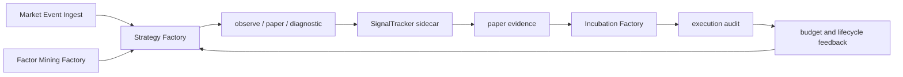

# 技术治理与修复路线图

## 根问题

当前问题不是单个 bug，而是缺少统一生命周期控制面。系统里同时存在多套局部真相：

- Strategy Factory run status。
- SignalTracker phase result。
- Incubation phase result。
- Quant Core evidence/audit summary。
- Quality Session health snapshot。
- MCP governance/resource health。

当这些真相没有被同一套状态机裁决时，修复会变成“看到一个指标修一个指标”：`success`、`submitted`、SignalTracker timeout、`saved_signal_evidence`、execution audit、warmup backlog、hard gate 等都会被局部修补，但系统仍然无法闭环。

## 反补丁化原则

- 先定义契约，再修行为。
- 先做只读诊断，再做写入修复。
- 先判断生命周期状态，再判断单个指标。
- 质量会话只验证生产契约，不能成为生产补偿控制面。
- 不放宽 strict/live gate。
- 不伪造订单、成交、收益或 round-trip。
- bootstrap/backtest 只用于诊断，不进入 production hard gate。
- 所有 phase 必须报告 processed、elapsed、errors、skip reason 和 evidence deltas。
- 任一“成功”必须能被证据表独立复核。

## 目标控制面

需要收敛到以下契约：

| 契约 | 目的 | 最小字段 |
| --- | --- | --- |
| `FactoryRunContract` | 统一 run status、partial/degraded/failed/success 语义 | status、healthy、partial_reasons、phase_failures、timeouts |
| `GenerationBudgetContract` | 管理 LLM/task 并发、超时、partial result 和取消行为 | task_scope、budget、elapsed、cancelled、fallback |
| `LifecycleLedgerContract` | 每个 strategy 当前状态和下一责任组件 | strategy_id、state、evidence_present、blockers、owner |
| `ExecutionUniverseContract` | 统一 SignalTracker 与 Incubation 的可执行策略集合 | strategy_id、account_id、stage、runtime_control、skip_reason |
| `PaperEvidenceContract` | 统一 signal/order/trade/position/forward/evidence 的最小闭环 | signal_count、order_count、trade_count、open/closed positions、forward returns、evidence |
| `AuditGateContract` | 统一 bootstrap、pending、insufficient、passed 的 gate 语义 | gate_status、real_round_trips、bootstrap_round_trips、sample_debt、hard_gate_passed |
| `QualitySessionContract` | 规定质量会话只能读取和验证，不承担生产补偿 | verified_components、skipped_components、issue_flags、evidence_deltas |

当前实现状态必须分清：

| 契约 | 当前状态 |
| --- | --- |
| `FactoryRunContract` | 部分实现于 Strategy Factory run result、quality session report、AKShare envelopes，尚未统一 |
| `LifecycleLedgerContract` | 目标契约；当前需要人工拼 `strategies`、incubation accounts、signals、orders、audit |
| `ExecutionUniverseContract` | 目标契约；当前 SignalTracker 与 Incubation 有多条查询路径和部分共享 helper |
| `PaperEvidenceContract` | 部分实现于 Quant Core schema、SignalTracker、Incubation paper phases，仍缺统一只读账本 |
| `HealthStatus` 五级模型 | 规范目标；当前无统一 enum/class，只有各组件局部 `healthy/degraded/partial` |

## 修复路线

### 对账后的立即修正优先级

| 优先级 | 事项 | 当前本文档处理 | 后续代码动作 |
| --- | --- | --- | --- |
| P0 | 生命周期状态定义与代码脱节 | 已拆分物理状态机与业务生命周期覆盖层 | 实现只读 lifecycle ledger |
| P0 | 证据表名称与 schema 对齐 | 已明确 `signal_forward_returns` 是原始表，`strategy_incubation_metrics` 是派生摘要，audit snapshot/acceptance 是不同层 | 增加 schema/report contract tests |
| P0 | Quality Session 概念边界 | 已明确它是 `scripts/factories` 脚本级验证会话 | 将补偿逻辑迁出 quality-session-only 路径 |
| P1 | `run_three_factories.py` 命名历史债 | 已记录文件名与四运行体不一致 | 新增 `run_four_factories.py` wrapper 或迁移文件名 |
| P1 | SignalTracker 依赖检查 | 已要求 sidecar preflight/health | supervisor 或只读 health command 检查 last run/phase/evidence delta |
| P1 | bootstrap gate 语义 | 已写明 `bootstrap_pending/bootstrap_ready` 不等于 `passed` | 统一报告字段和样本债解释 |
| P2 | 五级健康模型 | 已标为规范目标而非已实现 enum | 实现统一 health classifier |
| P2 | 诊断流程自动化 | 已标为手册级 runbook | 封装只读诊断命令 |
| P2 | Market Event Ingest 功能边界 | 已降级为已实现/配置依赖/目标边界 | 补 adapter/bridge coverage tests |
| P2 | ExecutionUniverseContract 标准化 | 已标为目标契约 | 实现 shared provider 并替换两边查询 |

### Phase 0：冻结补丁式修复

- 暂停新增 quality-session-only 行为补偿。
- 暂停把单个指标改为成功的局部修复。
- 标记历史乱码脚本和旧报告为非规范来源。
- 建立本文档作为架构规范入口。

验收标准：后续 issue 和修复 PR 必须引用本文档中的生命周期状态或契约。

### Phase 1：只读生命周期账本

新增只读诊断，按每个 strategy 输出：

  - 当前业务生命周期覆盖层状态。
- 已有证据：signal、order、trade、position、forward return、signal evidence、audit。
- 缺失 blocker。
- 下一责任组件。
- 是否可重试、是否应 archive/diagnostic。

验收标准：能解释 active warmup、signal-only backlog、orders-no-trades、open positions、closed round-trip debt。

### Phase 2：统一状态契约

- Strategy Factory run result 不再把底层 failed/partial 弱化为 success。
- SignalTracker 与 Incubation 返回相同 evidence delta 字段。
- `submitted` 拆为 live/formal/observe/audit-only。
- `missing`、`needs_remediation`、`bootstrap_pending`、`insufficient_samples`、`pending_evidence`、`passed` 在所有报表中语义一致。

验收标准：任一质量报告能从同一套字段解释失败，不需要人工拼多个日志。

### Phase 3：统一执行宇宙

- SignalTracker 和 Incubation 使用同一策略选择规则。
- signal-only backlog 不由某个 phase 私下补偿，而是进入可观测队列。
- skip reason 标准化：无持仓卖出、shares 不足、价格缺失、窗口未成熟、账户缺失、runtime control 阻塞等。

验收标准：SignalTracker 生成信号但订单为 0 时，必须能解释是否是真实 skip，而不是路径断裂。

### Phase 4：真实 paper round-trip

- open position aging、exit signal、time stop、settlement、metrics 形成统一流程。
- forward returns 与 closed positions 对齐。
- execution audit 只在真实 closed round-trip 足够时通过 production hard gate。

验收标准：能看到真实 buy/open、forward matured、exit、closed、audit-ready 的完整样本。

### Phase 5：质量会话瘦身

- quality session 只启动或调用验证流程，不写入生产补偿。
- 报告展示 lifecycle state distribution、evidence debt、phase timeouts、sample debt。
- 若跳过 factor mining、SignalTracker 或 Incubation，报告必须明确“未验证”。

验收标准：quality session 失败时给出根因路径，成功时可由证据表独立复核。

### Phase 6：治理面产品化

- MCP resources、Agent status、Desktop factory pages 使用同一健康枚举。
- governance report resource 读取失败要进入可观测问题，而不是被调用方吞掉。
- 每个工厂的健康、证据债、样本债、运行入口状态都可在只读 API 查询。

验收标准：不用打开日志也能从只读状态知道是“未运行、退化、样本待成熟、阻塞、健康”。

## 验收测试矩阵

| 测试 | 必须证明 |
| --- | --- |
| run status resolution | failed/partial/timeout 不被 success 掩盖 |
| SignalTracker phase result | phase timeout 返回 partial result，不吞 completed phase |
| execution universe | SignalTracker 与 Incubation 选中同一类 paper/incubating/observe 策略 |
| signal to order | 非零 signal 生成 paper order，或输出标准 skip reason |
| paper settlement | order 生成 trade 和 position linkage |
| forward return | signal horizon 形成 forward return 或窗口 blocker |
| execution audit | bootstrap 不能纳入 production hard gate |
| lifecycle ledger | 每个 active strategy 可解释当前状态和下一责任组件 |
| quality session | 跳过组件时标为未验证，不报健康 |
| governance resource | resource 读取失败进入 degraded/blocked，而不是静默成功 |

## 不再接受的修复方式

- 只改报表字段让 `healthy=true`。
- 只把 timeout 加长而不管理并发和 partial result。
- 只在 quality session 里回填证据，然后宣称生产链路健康。
- 用 bootstrap/backtest 让 hard gate 通过。
- 把 SignalTracker 缺席解释为 Incubation 的问题。
- 把 open positions 长期堆积解释为自然等待，而没有 aging 和 exit policy。
- 把 MCP resource 读取失败当作“外部问题”忽略。

## 架构目标

最终目标不是“让最近一轮报告好看”，而是建立一条可审计策略生产线：

这条线只在真实 evidence 成熟时晋级；在 evidence 不足时保持 pending；在链路断裂时明确 blocked。
