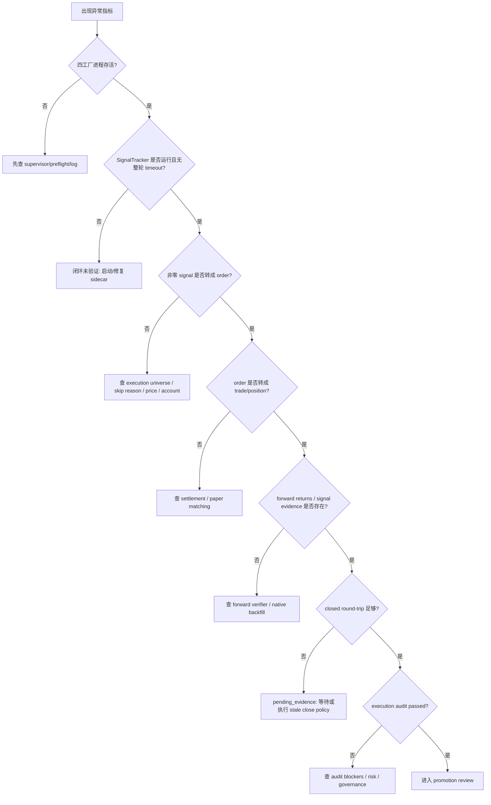
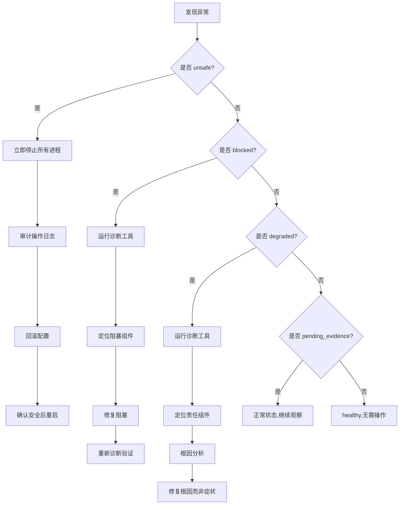

# 运行与诊断手册

## ⚠️ 强制性规范

**本手册是策略工厂运维和诊断的强制性规范。**

所有运维操作、健康诊断、问题排查，**必须**遵守本手册定义的诊断流程和失败分级标准。

### 禁止行为

1. ❌ **禁止**通过修改 Quality Session 环境变量来掩盖生产问题
2. ❌ **禁止**手工修改数据库来"修复"证据链路
3. ❌ **禁止**单纯增加 timeout 数值而不诊断调度预算失配
4. ❌ **禁止**把 `bootstrap_pending` 报告为"健康"或"接近通过"
5. ❌ **禁止**在诊断报告中用 `success` 掩盖 `partial_infra` 或 `failed`

### 强制要求

1. ✅ **必须**使用自动化诊断工具，而非手工 SQL 拼接
2. ✅ **必须**在诊断报告中明确标注责任组件和 blocker reason
3. ✅ **必须**区分"待证据成熟（pending_evidence）"和"链路断裂（degraded/blocked）"
4. ✅ **必须**验证数据库配置路径与实际运行路径一致
5. ✅ **必须**在修复问题前，先通过诊断工具确认根因

## 安全边界

默认运行只允许策略研究、paper、diagnostic、read-only 或受控工厂流程。不得默认进入 live trading。涉及 broker/live order 的路径必须遵守 ActionIntent、control token 和 live trading guardrail。

本文档不保存任何凭证值、`.env` 内容或数据库 dump。

## 数据库配置

策略工厂使用 SQLite 数据库存储所有证据数据（策略、信号、订单、成交、持仓、前向收益、审计快照）。

### 默认路径

```
data/db/akshare_mcp.sqlite3
```

### 自定义路径

通过环境变量配置：

```powershell
# Windows PowerShell
$env:AKSHARE_MCP_SQLITE_PATH = "D:\custom\path\aiask.db"

# Bash
export AKSHARE_MCP_SQLITE_PATH=/custom/path/aiask.db
```

### 验证配置

检查当前生效的数据库路径：

```powershell
uv run python -c "from aiask_quant_core.config import get_settings; print(get_settings().sqlite_path)"
```

### 数据库初始化

数据库表结构会在首次运行时自动创建。如需手动初始化或迁移，运行：

```powershell
uv run python scripts/factories/init_database.py
```

### 配置优先级

1. 命令行参数 `--db-path`（诊断脚本等支持）
2. 环境变量 `AKSHARE_MCP_SQLITE_PATH`
3. 默认路径 `data/db/akshare_mcp.sqlite3`

## 启动四工厂 supervisor

标准入口（注意：文件名 `run_three_factories.py` 是历史遗留命名；**默认最多**拉起四个运行体，可被 CLI/环境变量裁剪）：

```powershell
uv run python scripts/factories/run_three_factories.py
```

常用参数：

```powershell
uv run python scripts/factories/run_three_factories.py `
  --strategy-dispatch-run `
  --strategy-dispatch-default-universe `
  --strategy-dispatch-default-universe-limit 200 `
  --incubation-run-time 18:30
```

兼容入口：

```powershell
uv run python scripts/factories/run_all_factories.py
```

注意：
1. 文件名 `run_three_factories.py` 是历史命名债务；**默认最多**拉起四个运行体（strategy_factory、factor_mining_factory、incubation_factory、market_event_ingest），不是不可变集合。
2. 兼容入口 `run_all_factories.py` 委托给 `run_three_factories.py`。
3. **重要**：supervisor 不会启动 SignalTracker，必须单独启动（见下节）。旧参数如 `--signal-tracker-*` 会被忽略或不再代表当前规范。
4. paper ownership 入口不一致：生产 supervisor 默认强制孵化工厂拥有 paper；quality session 明确关闭 paper ownership。排障先看入口，不要混读日志。
5. 环境变量存在“强制覆盖”与 `setdefault` 两套语义；后者可被外部环境悄悄改写（Catalog/部分 prediction toggle 等）。
6. 文档禁句检查：`python scripts/factories/check_factory_doc_banned_phrases.py`（扫描进程数措辞、必需 provider 数、状态机单向边、硬门槛与成熟度空话等）。

## 启动 SignalTracker sidecar

单次验证：

```powershell
uv run python scripts/factories/run_signal_tracker.py --once
```

守护运行：

```powershell
uv run python scripts/factories/run_signal_tracker.py --daemon --run-time 18:00
```

建议 SignalTracker 在 Incubation Factory 日运行前完成，确保 `strategy_signals`、paper evidence 和 forward verifier 有输入。

## 运行 quality session

短验证用于验证契约，不是生产 supervisor。当前它是 `scripts/factories/` 下的脚本级验证会话，不是 `packages/strategy-factory` 或 `packages/akshare-mcp` 中的领域类：

```powershell
uv run python scripts/factories/run_strategy_factory_quality_session.py `
  --with-incubation `
  --max-runs 3 `
  --pause-sec 60 `
  --universe-limit 200 `
  --quality-modes observe-first `
  --min-validation-grade C
```

quality session 报告必须显式说明：

- 是否运行 factor mining。
- 是否运行 SignalTracker。
- 是否运行 Incubation Factory。
- 是否存在 phase timeout。
- 是否存在 signal-only backlog、orders-no-trades、open positions、closed round-trip debt。
- hard gate 未通过时，是证据不足还是链路断裂。

注意：quality session 可以显式调用 Strategy Factory、SignalTracker、Incubation 和 factor mining 做短验证，但这不等于四工厂 supervisor 已经拥有这些补偿能力。报告中若出现补证据、回填或调用 sidecar 的动作，必须标注为验证路径。

## 停止进程

优先使用已有停止脚本或受控运维入口：

```powershell
bash stop_all_factories.sh
```

若手动停止，必须先确认目标进程 command line，避免误杀无关 Python/uv 进程。

## 日志位置

| 类型 | 默认位置 |
| --- | --- |
| 四工厂 supervisor 子进程日志 | `logs/three_factories/` |
| quality session 状态 | `logs/strategy_factory_quality_sessions/<session_id>/state.json` |
| quality session stdout/stderr | `logs/strategy_factory_short_verify_*.out.log` / `.err.log` |
| 历史启动包装日志 | `logs_four_factory_launch.out` 或 root 脚本指定位置 |

## 排障决策树



## 诊断顺序

1. 看进程是否启动：只判断 supervisor/sidecar 是否存活，不代表链路健康。
2. 看 Strategy Factory run status：`failed`、`partial_infra`、timeout 不能被外层 success 覆盖。
3. 看 SignalTracker：是否运行，是否 phase timeout，是否从 signal 到 order。
4. 看 Incubation：intake 是否工作，metrics 是否增长，是否 auto promotion 为 0 且原因清楚。
5. 看 evidence tables：signals、orders、trades、positions、forward returns、signal evidence、audit snapshots 是否串起来。
6. 看 audit gate：`missing` 是链路缺失；`bootstrap_pending` 是诊断/样本债状态；`passed` 才可进入 promotion 讨论。
7. 看 factor mining：是否运行、是否生成/验证/入池、是否被 Strategy Factory 消费。
8. 看 Market Event Ingest：source adapter/bridge 是否 degraded，事件是否只是 diagnostic。

## 自动化诊断工具（推荐）

推荐使用自动化诊断脚本，而不是手工执行 SQL：

```powershell
# 运行完整诊断
uv run python scripts/factories/diagnose_factory_health.py

# 详细模式
uv run python scripts/factories/diagnose_factory_health.py --verbose

# 保存诊断报告到 JSON
uv run python scripts/factories/diagnose_factory_health.py --output report.json
```

该脚本自动执行以下 8 项检查：
1. 四工厂 supervisor 进程是否存活
2. SignalTracker 是否近期运行（< 2 天）
3. 非零信号是否转成 paper order
4. paper order 是否转成 trade
5. 持仓状态分布（open vs closed）
6. 前向收益证据是否存在
7. execution audit gate 状态
8. 策略生命周期状态分布

输出示例：
```
[OK] 找到 4 个工厂相关进程
[OK] SignalTracker 最近运行：0 天前
[WARN] signal-only backlog: 15/50 策略
[OK] paper orders 正常转成 trades: 234 笔成交
[WARN] 持仓状态：120 open / 30 closed (80% open)
[OK] 前向收益证据：456 条 signal_forward_returns
[WARN] hard_gate_passed=3/50（样本债：45 insufficient, 2 bootstrap_pending）
[OK] 策略状态分布：3 listed, 25 incubating, 共 50 个策略

整体状态: PENDING_EVIDENCE
```

**状态标记说明**：
- `[OK]` - 检查通过
- `[WARN]` - 警告（不阻塞运行）
- `[FAIL]` - 失败（需要修复）
- `[BLOCK]` - 阻塞（必须立即修复）

## 关键只读检查（手工 SQL 方式）

若诊断脚本不可用，可手工执行以下 SQL（只用于诊断，不能手工改库）：

```sql
SELECT status, COUNT(*) FROM strategy_trade_positions GROUP BY status;
SELECT source, status, direction, COUNT(*) FROM paper_orders GROUP BY source, status, direction;
SELECT trade_type, COUNT(*) FROM paper_trades GROUP BY trade_type;
SELECT COUNT(*) FROM signal_forward_returns;
SELECT verdict_status, COUNT(*) FROM strategy_execution_audit_snapshots GROUP BY verdict_status;
```

若需要看孵化派生样本数，而不是原始 forward return 行数：

```sql
SELECT stage, SUM(COALESCE(effective_n_5d, 0)) AS effective_n_5d_sum, COUNT(*) AS rows
FROM strategy_incubation_metrics
GROUP BY stage;
```

需要解释 signal-only backlog 时：

```sql
SELECT COUNT(*)
FROM (
  SELECT s.strategy_id
  FROM strategy_signals s
  LEFT JOIN paper_orders o ON o.strategy_id = s.strategy_id
  WHERE COALESCE(s.signal, 0) <> 0
  GROUP BY s.strategy_id
  HAVING COUNT(o.id) = 0
) x;
```

## 指标含义解释表

| 指标 | 代表什么 | 不代表什么 |
| --- | --- | --- |
| `active warmup` | 有策略停在观察/孵化前期 | 不代表会自动晋级 |
| `signal_only_backlog` | 有 signal 但没有 paper order | 不代表策略无效，先查 execution universe |
| `orders_no_trades` | paper order 未成交或 settlement 未跑 | 不代表 hard gate 可用 |
| `open_positions` | paper 入口证据存在 | 不代表 closed round-trip 成熟 |
| `closed_round_trips` | 有真实完整回合 | 仍需样本数、risk、governance 通过 |
| `saved_signal_evidence` | native lineage 已保存 | 不是单独晋级条件 |
| `execution_audit_gate_status=missing` | audit 链路缺失 | 不是 pending evidence |
| `execution_audit_gate_status=insufficient_samples` | audit 已跑但真实样本不足 | 不是代码坏了 |
| `hard_gate_passed=0` | 未满足 production hard gate | 在样本不足时是正确状态 |

## 失败分级

| 级别 | 条件 | 典型场景 | 应对措施 | **禁止措施** |
| --- | --- | --- | --- | --- |
| `healthy` | run status、SignalTracker、Incubation、evidence、audit 都符合生命周期预期 | 生产环境稳定运行，所有检查通过 | 继续观察，无需操作 | - |
| `pending_evidence` | 有真实 paper 入口证据，但 forward/closed round-trip 样本不足 | 策略刚部署，样本积累中；这是**正常状态** | 继续生产证据，不放宽 gate；等待样本成熟（通常数周到数月）| ❌ 不得通过 backlog/backfill 补偿掩盖；❌ 不得把 `bootstrap_pending` 报告为"接近通过" |
| `degraded` | phase timeout、partial infra、signal-only backlog、orders-no-trades、forward returns 缺失 | SignalTracker timeout、settlement 未运行、执行宇宙不一致 | **必须**进入根因诊断；**必须**通过 `diagnose_factory_health.py` 定位责任组件 | ❌ 不得单纯增加 timeout；❌ 不得启用补偿逻辑掩盖 |
| `blocked` | 链路断裂：audit=missing、无 signal、无 order、无 trade、无 forward、组件未启动 | 数据库连接失败、表缺失、四工厂进程未启动、SignalTracker 从未运行 | **立即修复阻塞组件**；修复后重新运行诊断 | ❌ 不得手工插入数据；❌ 不得跳过阻塞继续验证 |
| `unsafe` | live trading 误启用、风控规则缺失、合规检查失败、生产数据泄露 | 配置错误导致纸面交易变成真实下单 | **立即停止所有工厂进程**；回滚配置；审计操作日志 | ❌ 不得在未确认安全前重启 |

## 运维操作强制性规范

### 运维操作清单

所有运维操作必须遵守以下规范：

| 操作类型 | 正确做法 | 禁止做法 | 验收标准 |
| --- | --- | --- | --- |
| **启动四工厂** | 使用标准入口 `run_three_factories.py`；不修改默认参数 | ❌ 在启动脚本中添加 `--enable-backlog`；❌ 修改 timeout 为极大值 | 诊断工具显示 4 个进程存活 |
| **健康检查** | 使用 `diagnose_factory_health.py`；保存 JSON 报告 | ❌ 手工拼接 SQL；❌ 只看进程是否存活就判断健康 | 报告包含 8 项检查结果和责任组件 |
| **问题修复** | 先诊断根因，再修复阻塞组件 | ❌ 单纯重启进程；❌ 手工修改数据库；❌ 增加 timeout 掩盖 | 修复后诊断状态从 `blocked`/`degraded` 变为 `healthy`/`pending_evidence` |
| **证据补全** | 等待系统自然生产 exit signal 和 closed position | ❌ 启用 Quality Session backlog；❌ 手工插入 paper_trades | `realized_trade_count` 自然增长 |
| **配置修改** | 修改 `.env` 或配置中心；重启验证 | ❌ 直接修改 `run_quality_session.py` 环境变量；❌ 绕过配置中心 | 配置路径与运行路径一致 |

### 紧急情况处理流程


| `degraded` | phase timeout、partial infra、signal-only backlog、orders-no-trades、forward returns 缺失 | 部分功能异常，但不完全阻塞 | 进入根因诊断，查看具体失败项并修复 |
| `blocked` | required component 未运行、schema/linkage 缺失、audit missing 长期不变 | 核心组件故障，无法正常运行 | 停止扩大运行，先修契约或数据链路 |
| `unsafe` | live trading guardrail 不清、broker 写入风险、凭证泄露风险 | 安全风险 | 立即停止相关路径 |

**重要说明**：
- `pending_evidence` 是策略工厂的**正常运行状态**，表示证据链完整但样本尚未成熟
- 只有 `blocked` 和 `unsafe` 需要立即修复，其他状态可继续运行
- 诊断脚本返回 `PENDING_EVIDENCE` 时，表示健康运行中

这是规范级健康模型，不是当前已统一实现的 `HealthStatus` 枚举。当前代码里存在多处局部口径：Incubation 返回 phase result 和 metrics delta，Strategy Factory 有 run status/partial/degraded，quality session 有 `healthy` 和 issue flags，AKShare MCP envelope 有 `degraded`。在统一健康枚举落地前，运维判断必须把这些局部结果汇总到上表，不得声称代码中已经存在同名统一模型。

## 诊断自动化缺口

本文的 SQL 和决策树当前仍是手册级 runbook。`run_three_factories.py` 只负责 supervisor 进程生命周期，不封装生命周期诊断命令。后续应实现只读诊断工具，至少输出：

- SignalTracker 与 Incubation 的 execution universe 差集。
- 每个 active strategy 的业务生命周期覆盖层状态。
- signal/order/trade/position/forward/evidence/audit 缺口。
- `missing`、`bootstrap_pending`、`bootstrap_ready`、`insufficient_samples`、`failed_metrics`、`passed` 的计数和样本债。

在自动化工具落地前，诊断流程可执行性的边界是“可手工复核”，不是“一条命令自动判断全部问题”。

## 常见误判

- `signals_generated > 0` 不等于闭环健康。
- `paper_orders > 0` 不等于可晋级。
- `paper_trades` 全是 buy 时，不代表 round-trip 成熟。
- `execution_audit_acceptance=bootstrap_pending` 不是失败修复完成，而是样本债仍在。
- `hard_gate_passed=0` 在没有真实 closed round-trip 时是正确结果。
- quality session 生成 evidence 不代表生产四工厂自然具备同样能力。
- factor mining 被跳过时，不能把策略工厂整体标为已验证健康。
