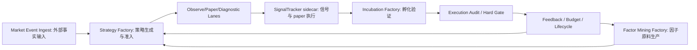

# 四工厂目标与业务价值

## 总目标

四工厂最终要实现的不是“定时跑几个脚本”，而是一条可审计的策略生产线：

1. 持续吸收市场事件和可信上下文。
2. 持续挖掘、验证、维护因子原料。
3. 持续生成、筛选、提交策略候选。
4. 持续用 paper evidence 孵化、淘汰、反馈策略。
5. 只在真实 paper closed round-trip、forward returns、execution audit、risk/governance 全部满足时进入晋级讨论。

这条生产线的价值是把“策略想法”变成“可追溯证据”，把“LLM 叙事”变成“可验证候选”，把“偶然回测好看”变成“真实 paper 样本逐步成熟”。

## 生产线视图

## 四工厂分别做什么

| 工厂 | 核心问题 | 产出 | 业务价值 |
| --- | --- | --- | --- |
| Market Event Ingest | 市场发生了什么可信事件 | normalized events、event anchors、source tier、bridge signals | 让策略生成有外部事实锚点，减少空泛主题和低可信新闻驱动 |
| Factor Mining Factory | 哪些因子可能有稳定解释力 | factor candidates、validation evidence、QC labels、active pool | 给策略生成提供可复用 alpha 原料，降低只靠 LLM 编故事的风险 |
| Strategy Factory | 应该生成和接纳哪些策略 | candidate artifacts、admission、handoff、run status | 把事件、因子、市场画像和 LLM 组合成可验证策略候选 |
| Incubation Factory | 哪些策略经得起前向/paper 检验 | metrics、hit-rate、forward evidence、audit acceptance、feedback | 把候选策略变成可审计证据，并淘汰或反馈弱策略 |

SignalTracker sidecar 不生产策略，也不挖因子。它的价值是把策略从“被接纳观察”推进到“产生信号、下 paper order、形成成交、产生 forward returns 和 audit evidence”。

## 业务目标

### Strategy Discovery

策略工厂应该持续提出不同来源、不同假设、不同约束的候选策略。候选可以来自事件、因子、股票画像、主题传播、历史反馈或 staged LLM pipeline，但必须能落到结构化 contract。

成功标准：

- 候选有明确 hypothesis、universe、entry/exit/risk、data dependencies。
- 候选能通过 gate 或给出拒绝原因。
- observe/paper/diagnostic handoff 可追踪。
- LLM fallback、timeout、partial result 不被隐藏。

### Factor Production

因子挖掘工厂应该持续发现和维护可复用因子，而不是只在质量会话里临时证明“跑过”。因子要有来源、family、表达式、验证、QC、入池/拒绝理由。

成功标准：

- 每轮能解释 raw、quick passed、validated、accepted。
- active pool 中的因子有 freshness 和 validation metadata。
- 跳过或失败时报告 `factor_mining_not_run`、数据不足或 validation blocker。

### Incubation Evidence

孵化工厂应该持续把策略推进到真实 paper evidence。它不能靠 bootstrap 让 gate 看起来通过，也不能让 warmup/paper 账户无限堆积。

成功标准：

- signal-only backlog 持续下降或有明确 skip reason。
- order/trade/position/forward/evidence 串联。
- open positions 有 aging/exit policy。
- execution audit gate 不长期全量 `missing`。
- `hard_gate_passed=0` 时能解释为真实样本不足，而不是链路断裂。

### Event Intake

市场事件摄取应该持续把外部事实转成可信事件 anchor。它的目标不是最大化新闻数量，而是最大化可审计、可桥接、可复核的事件质量。

成功标准：

- source tier、provider chain、reliability、degraded reason 可见。
- Tier A/B 官方/可信事件能桥接到 Strategy Factory。
- Tier C/news/media 不进入 production evidence。

## 工程目标

| 目标 | 含义 |
| --- | --- |
| 可复现 | 同一 strategy/factor/event/audit 有稳定 ID、输入、输出、版本和 lineage |
| 可观测 | 每个 phase 有 processed、elapsed、errors、skip reason、evidence delta |
| 可回滚 | 错误修复不修改历史真相；回填只使用已有可信数据 |
| 可审计 | hard gate 和 promotion 能从证据表独立复核 |
| 可降级 | LLM、数据源、MCP resource、factor mining 失败时给出 degraded reason |
| 可治理 | live trading、broker、凭证、外部写入默认受 guardrail 约束 |

## 不追求的目标

- 不追求立即让 `hard_gate_passed>0`。没有真实 paper closed round-trip 时，0 是正确状态。
- 不追求用 bootstrap/backtest 替代 paper evidence。
- 不追求让 quality session 成为生产补偿控制面。
- 不追求把所有策略都留在 warmup/active 池里等待自然变好。
- 不追求把 LLM 生成速度当作策略质量。

## 最终验收图景

一个真正健康的策略工厂应该能回答：

- 最近策略从哪些事件、因子和市场画像产生。
- 哪些候选被拒绝，为什么。
- 哪些策略进入 observe/paper/diagnostic。
- 哪些策略产生了非零信号，哪些转成 paper order。
- 哪些订单成交并形成 open/closed positions。
- 哪些 forward returns 已成熟。
- 哪些 execution audit 仍缺样本，哪些已经通过。
- 哪些反馈回到了 Strategy Factory 或 Factor Mining Factory。

能回答这些问题，才说明四工厂是在生产策略资产，而不是只是在“跑起来”。
