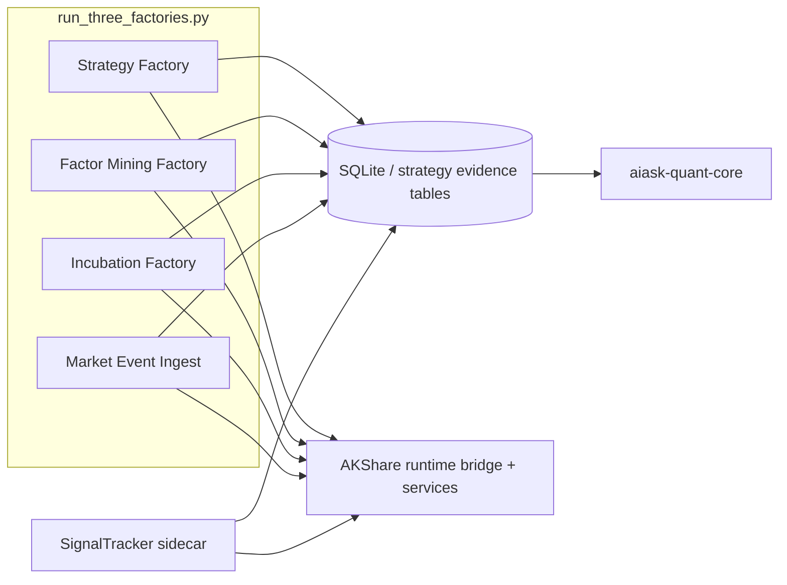

# 四工厂真实流程与 MCP 依赖审计

## 文档定位

本文档是当前代码口径下的 source-of-truth 审计文档，回答两个问题：

1. 四工厂实际上如何运行，真实流程链落在什么包和什么入口。
2. 四工厂到底用了多少 `akshare-mcp` 能力，应该按什么口径统计。

本文档只描述当前实际情况，不描述目标态目录迁移方案。目标态请看 `strategy-factory-spec/`，但该目录不是现状证明。

本轮正式 target-state 主方案见：

- `../specs/四工厂独立化与MCP瘦身拆分开发方案-2026-06-23.md`

## 文档归类说明

- 仓库级文档导航见 `../README.md`。
- 本文档属于 current-state 真实流程链审计，负责说明四工厂现在实际怎么跑。
- 历史运行报告与阶段性观测记录统一位于 `appendix/reports/`，用于旁证，不替代本审计文档的 current-state 结论。

## 结论速览

- `scripts/factories/run_three_factories.py` 当前默认监督最多 4 个运行体：`strategy_factory`、`factor_mining_factory`、`incubation_factory`、`market_event_ingest`；CLI/环境变量可裁剪到更少。
- `SignalTracker` 是独立 sidecar，通过 `scripts/factories/run_signal_tracker.py` 单独运行，不在 supervisor 内。
- `packages/strategy-factory` 当前不仅拥有领域编排骨架，也已拥有四工厂的 canonical runtime facade；`akshare-mcp` 侧主要保留 support/provider/integration/compat。
- `akshare-mcp` 的 manager/runtime facade 与 `services/` 边界层当前已只依赖 `strategy_factory.api.*`、`strategy_factory.runtime.*` 和本地 bootstrap，不再直连 `strategy_factory` 根包 facade 或私有实现层。
- Strategy Factory 的 host 依赖不能只按 FastMCP tool 数量估算。当前真实代码至少包含：
  - `configure_strategy_factory_runtime_services()` 注入的 host runtime provider 注册面；canonical bootstrap **必需 19 个**（`DEFAULT_REQUIRED_RUNTIME_PROVIDERS`）。历史“20 个/20+”口径不得再当作必需数。
  - `MCPRuntimeAdapters` 提供的 7 条 runtime adapter 通道；若只统计 gateway 通道，则是 6 条，再加 1 条 repository 通道。
  - `configure_akshare_storage_runtime_hooks()` 注入到共享存储层的额外 runtime hook。
- 因子挖掘、孵化、SignalTracker、事件摄取当前仍大量依赖 `akshare-mcp` 的 support/provider/integration/service 代码，但其 canonical orchestration 已不再全部留在 `akshare-mcp`。

## 统计口径

本轮“用了多少 MCP 功能”统一按四层统计，不再用单一 tool 总数替代真实依赖面：

| 层级 | 含义 | 当前代表 |
| --- | --- | --- |
| `MCP host surface` | server/tool/resource/prompt/manager facade | `akshare_mcp.server`、manager facade、runtime manager action |
| `Runtime provider surface` | 通过 `configure_strategy_factory_runtime_services()` 注入给 `strategy-factory` 的 host 能力 | DB、factor pool、warmup、runtime control、LLM、semantic、execution audit 等 |
| `Runtime adapter surface` | 通过 `MCPRuntimeAdapters` 注入的 repository/gateway 通道 | repository、vector search、autonomy、factor research、incubation、validation、risk |
| `Factory implementation surface` | 真正承载四工厂运行逻辑的 service/runtime 代码 | `factor_mining_factory`、`incubation_factory`、`signal_tracker_parts`、`market_event_sources`、`strategy_lifecycle_shared`、`matching_engine`、`nav_engine` |

因此，“当前 `akshare-mcp` 很大”并不是因为 tool catalog 很多，而是因为它同时承担了 host facade、runtime provider 装配和多条工厂运行实现。

## 当前运行拓扑

需要特别冻结的现状：

- supervisor 的正式口径是“4 工厂运行体 + 1 个独立 sidecar”，而不是“5 个都放进一个 supervisor”。
- `run_all_factories.py` 当前只是兼容 wrapper，不再负责混合启动 `SignalTracker`。
- `IncubationFactory` 当前 owns paper-trading runtime daemon：`MatchingEngine` 和 `NavEngine`。

## 一、Strategy Factory 真实流程

### 实际流程链

`scripts/factories/run_strategy_factory.py`
-> `strategy_factory.api.runtime.build_scheduler_runtime_kwargs()`
-> provider 缺失时调用 `strategy_factory.runtime.default_bootstrap.ensure_default_runtime_services()`
-> 若本地尚未暴露 `akshare_mcp` 包路径，则临时补入 `packages/akshare-mcp/src` 后再次执行 canonical bootstrap
-> `strategy_factory.api.facade.get_strategy_factory_scheduler(...)`
-> `strategy_factory.application.factory_scheduler.StrategyFactoryScheduler`
-> `FactoryCycleRunner`
-> `FactoryCyclePipeline`
-> collect / factor research / readiness / research generation / evidence scoring / observe intake / promotion review / elimination / finalize

### 真实 ownership

- 领域编排归 `packages/strategy-factory`。
- canonical runner primary path 已先走 `strategy-factory` 自己的 runtime kwargs 入口；host runtime bridge、provider 装配、adapter 实现和具体 service 仍主要归 `packages/akshare-mcp`。

### 当前实际依赖面

1. `run_strategy_factory.py` 当前 primary path 不再直接依赖 `akshare_mcp.adapters.strategy_factory_runtime`；provider 缺失时也先走 `strategy_factory.runtime.default_bootstrap` 这个 canonical bootstrap。
2. `configure_strategy_factory_runtime_services()` 当前注册 35 个 provider：
   - `db_provider`
   - `factor_scheduler`
   - `factor_mining_factory`
   - `factor_mining_support_factory`
   - `factor_pool_gateway`
   - `incubation_runtime_factory`
   - `incubation_runtime_support_factory`
   - `market_event_ingest_runner`
   - `market_event_ingest_support_factory`
   - `quant_manager_callable`
   - `runtime_warmup_runner`
   - `signal_tracker_runtime_factory`
   - `signal_tracker_runtime_support_factory`
   - `strategy_promotion_pipeline_service`
   - `strategy_runtime_control_service`
   - `strategy_runtime_risk_service_factory`
   - `strategy_lifecycle_shared_runtime`
   - `event_context_builder`
   - `sentiment_analyzer`
   - `financial_semantic_service_factory`
   - `index_kline_provider`
   - `strategy_dsl_compiler`
   - `strategy_vector_platform_factory`
   - `strategy_vector_search_engine_builder`
   - `strategy_autonomy_service_factory`
   - `strategy_incubation_service_factory`
   - `strategy_incubation_pipeline_service_factory`
   - `autonomy_lifecycle_runtime`
   - `strategy_vector_profile_builder`
   - `strategy_vector_governance_service_factory`
   - `strategy_domain_projection_service_factory`
   - `strategy_lifecycle_scan_runner`
   - `execution_audit_snapshot_builder`
   - `closure_review_builder`
   - `strategy_llm_provider_loader`
3. `build_mcp_runtime_adapters()` 当前提供 7 条 adapter 通道：
   - `repository`
   - `vector_search`
   - `autonomy`
   - `factor_research`
   - `incubation`
   - `validation`
   - `risk`
4. `configure_akshare_storage_runtime_hooks()` 还会把 signal evidence、execution audit snapshot、event extraction、text embedding 等 callback 注入共享存储层。

### 审计结论

- `strategy-factory` 已经拥有公共契约和调度骨架，但当前并不是一个不依赖 host 的完整运行包。
- 它现在依赖 `akshare-mcp` 的方式主要是 compat fallback、provider/adapter 注入与 host service 装配，而不是 `strategy-factory` 包内静态 import。
- 这意味着后续拆分优先迁出的应是 orchestration 逻辑，而不是先拆 DB/外部数据/semantic/vector 这些 host 实现。

## 二、Factor Mining Factory 真实流程

### 实际流程链

`scripts/factories/run_factor_mining_factory.py`
-> `strategy_factory.runtime.default_bootstrap.ensure_default_runtime_services()`
-> `strategy_factory.runtime.factor_mining.get_factor_mining_runtime()`
-> `FactorMiningRuntime.run_once()` / `run_maintenance()`
-> `akshare_mcp.services.factor_mining_factory.FactorMiningFactory` support / provider glue
-> search / evolution / quick evidence / strict validation / QC / active pool / feedback

### 真实 ownership

- canonical orchestration owner 已位于 `packages/strategy-factory/src/strategy_factory/runtime/factor_mining.py`。
- `packages/akshare-mcp/src/akshare_mcp/services/factor_mining_factory/` 当前主要承载 support、engine/QC/pool/provider 与 compat delegate。

### 当前实际依赖面

- 主要实现层级包括：
  - `factory.py`
  - `engines/`
  - `evolution/`
  - `validation/`
  - `qc_pipeline.py`
  - `pool/`
  - `feedback/`
- 当前是直接使用 SQLite-backed runtime，不经过 MCP tool 调用链。
- 持久化依赖不仅是抽象 DB 方法，还直接使用 `acquire()` / raw SQL / 因子池专用表：
  - `factor_pool_active`
  - `factor_pool_decay_history`
  - `factor_mining_runs`

### 审计结论

- Factor Mining 不再是“完整沉在 `akshare-mcp`”的运行 owner；当前 owner 已回到 `strategy-factory.runtime.factor_mining`。
- 它对 `strategy-factory` 的主要宿主依赖仍然是 factor pool、验证、QC、外部数据和 provider 注入，而不是通过 FastMCP tool 回调。

## 三、Incubation Factory 真实流程

### 实际流程链

`scripts/factories/run_incubation_factory.py`
-> `strategy_factory.runtime.default_bootstrap.ensure_default_runtime_services()`
-> `strategy_factory.runtime.incubation.build_incubation_runtime(...)`
-> phase 1 intake
-> phase 1.5 remediation
-> phase 2 load incubating/paper/diagnostic
-> phase 3 signal generation / forward verify / metrics
-> phase 3b trade prediction outcomes
-> phase 3c signal-only paper backlog
-> phase 3d stale close
-> phase 3e native execution evidence backfill
-> phase 3f execution audit acceptance
-> phase 3g execution audit remediation
-> phase 4/5/6/7/8/9 evaluation / hit-rate / feedback / acceleration / alert / heartbeat

### 真实 ownership

- canonical orchestration owner 已位于 `packages/strategy-factory/src/strategy_factory/runtime/incubation.py`。
- `packages/akshare-mcp/src/akshare_mcp/services/incubation_factory/` 当前主要承载 support、paper runtime、provider glue 与 compat wrapper。

### 当前实际依赖面

- 直接 service 依赖包括：
  - `intake.py`
  - `signal_generator.py`
  - `forward_verifier.py`
  - `metrics_recorder.py`
  - `hit_rate_reporter.py`
  - `feedback_writer.py`
  - `trade_prediction_verifier.py`
  - `accelerator.py`
  - `alert_monitor.py`
- 直接 background runtime 依赖包括：
  - `matching_engine.py`
  - `nav_engine.py`
- 直接 DB 依赖面明显大于 Strategy Factory 的 repository 契约，除 `list_strategies` / `get_signal_stats` / `get_strategy_metrics` 外，还大量依赖：
  - `list_active_paper_observation_strategies`
  - `list_paper_observation_strategies`
  - `list_diagnostic_observation_strategies`
  - `get_strategy_incubation_account`
  - `save_strategy_incubation_account`
  - `save_strategy_domain_event`
  - `save_strategy_incubation_metric`
  - `list_strategy_signal_evidence`
  - `list_strategy_paper_orders`
  - `list_strategy_paper_trades`
  - `list_strategy_trade_positions`
  - `get_signals`
  - `save_strategy_runtime_control`
  - `save_strategy_closure_snapshot`

### 审计结论

- Incubation Factory 已不再是“root runner -> AKShare runner 才能进入真正 owner”的结构；当前 primary path 已能落到 `strategy-factory.runtime.incubation`。
- 但它也还不是完全脱离 `akshare-mcp` 的独立实现包；paper runtime、SQLite/IO、execution audit shared logic 仍主要留在 `akshare-mcp`。
- `MatchingEngine` / `NavEngine` 已经成为 Incubation 的显式背景依赖，这点必须继续保留为现状文档的一部分。

## 四、Market Event Ingest 真实流程

### 实际流程链

`scripts/factories/run_market_event_ingest.py`
-> `strategy_factory.runtime.default_bootstrap.ensure_default_runtime_services()`
-> `strategy_factory.runtime.market_event_ingest.get_market_event_ingest_runtime().run_once(...)`
-> `akshare_mcp.services.market_text_source_ingest.MarketEventIngestSupport`
-> `fetch_official_market_event_documents(...)`
-> `persist_normalized_events(...)`
-> `bridge_normalized_events_to_strategy_factory(...)`

### 真实 ownership

- canonical orchestration owner 已位于 `packages/strategy-factory/src/strategy_factory/runtime/market_event_ingest.py`。
- `packages/akshare-mcp/src/akshare_mcp/services/market_text_source_ingest.py` 与 `market_event_sources.py` 当前主要承载 source adapter、network fetch、normalized persistence、support/compat delegate。

### 当前实际依赖面

- source adapter / normalization / validation / bridge 主要落在：
  - `market_text_source_ingest.py`
  - `market_event_sources.py`
  - `_market_event_parts/event_constants.py`
  - `_market_event_parts/event_mappers.py`
  - `_market_event_parts/event_validation.py`
- DB 依赖核心是：
  - `upsert_market_event_normalized`
  - `list_market_events_normalized`
  - `save_factory_event_cluster`
  - `save_factory_event_signal`
- 当前正式 bridge 只把 Tier A/B 且验证通过的事件推进到 Strategy Factory；Tier C/news/media 不应被当作 production 晋级证据。

### 审计结论

- 这条链路的复杂度主要不在 MCP tool 注册，而在 source reliability、event normalization 和 bridge 规则。
- 它已经不是“纯 AKShare-owned runner”；但 bridge 规则真正依赖的 source adapter、DB IO 和兼容入口仍大量留在 `akshare-mcp`。
- 因此它属于“Factory implementation surface + data integration surface”，而不只是一个事件抓取工具。

## 五、SignalTracker sidecar 真实流程

### 实际流程链

`scripts/factories/run_signal_tracker.py`
-> `strategy_factory.runtime.default_bootstrap.ensure_default_runtime_services()`
-> `strategy_factory.runtime.signal_tracker.get_signal_tracker_runtime()`
-> `SignalTracker.run_once()` / daemon loop
-> submitted universe load
-> observation universe load
-> phase A-H
-> signal persistence
-> forward-return backfill
-> domain event / task run update

### 真实 ownership

- canonical orchestration owner 已位于 `packages/strategy-factory/src/strategy_factory/runtime/signal_tracker.py`。
- `packages/akshare-mcp/src/akshare_mcp/services/signal_tracker_parts/` 当前主要承载 sidecar runtime support、forward-return IO、signal persistence、compat delegate。
- 它不是 supervisor 内部一个 phase，而是独立 sidecar。

### 当前实际依赖面

- 关键 DB/运行依赖包括：
  - `list_strategies("submitted")`
  - `get_strategy_quality_report`
  - `list_active_paper_observation_strategies`
  - `list_paper_observation_strategies`
  - `save_strategy_task_run`
  - `update_strategy_task_run`
  - `save_strategy_signal_event_snapshot`
  - `save_signals`
  - `get_pending_forward_returns`
  - `save_forward_returns_batch` / `save_forward_returns`
  - `get_klines`
  - `save_klines`
  - `save_strategy_domain_event`
- 当前 canonical `ExecutionUniverseContract` 已存在且 owner 正确；运行面仍保留 contract-first + legacy fallback 的兼容路径，因此还不能宣称消费面已经完全单一路径化。

### 审计结论

- SignalTracker 是孵化证据闭环的关键 sidecar；当前 primary path 已能落到 `strategy-factory.runtime.signal_tracker`，但它的 DB IO、sidecar support 和兼容入口仍主要在 `akshare-mcp`。
- 这也是为什么“supervisor 健康”不能替代“四工厂整体健康”。

## 为什么不能只按 MCP tool 数量估算边界

当前 `akshare-mcp` 的 FastMCP capability 数量可以说明它“工具面很大”，但不能说明四工厂实际吃掉了多少能力，原因有三条：

1. 四工厂生产 runner 大多是进程内直接调用 `akshare-mcp` service/runtime，而不是通过 tool catalog 回调。
2. Strategy Factory 依赖的是 provider 注册、adapter 通道和共享存储 hook，不是单个 tool 的一进一出。
3. Factor Mining、Incubation、SignalTracker、Market Event Ingest 都有大量不暴露为 MCP tool 的运行实现。

因此，后续任何拆分路线图都必须以本文档和 `13-四工厂-MCP能力占用台账.md` 为依据，而不是以 tool 数量、目录名或历史 spec 命名为依据。

## 当前口径冻结

- `strategy-factory`：拥有领域契约、scheduler、cycle pipeline、submission/readiness/theme-event 编排骨架。
- `akshare-mcp`：当前主要承担默认 runtime provider 装配，以及 factor mining / incubation / signal tracker / market event ingest 的 support、IO、provider、compat 与背景实现。
- `scripts/factories`：只拥有 runner / supervisor / 兼容入口。
- `SignalTracker`：当前必须作为 sidecar 对待，不回混到 supervisor 口径中。

## 证据路径

- `scripts/factories/run_three_factories.py`
- `scripts/factories/run_strategy_factory.py`
- `scripts/factories/run_factor_mining_factory.py`
- `scripts/factories/run_incubation_factory.py`
- `scripts/factories/run_market_event_ingest.py`
- `scripts/factories/run_signal_tracker.py`
- `packages/akshare-mcp/src/akshare_mcp/adapters/strategy_factory_runtime.py`
- `packages/strategy-factory/src/strategy_factory/infrastructure/runtime_services.py`
- `packages/strategy-factory/src/strategy_factory/infrastructure/runtime_adapters.py`
- `packages/strategy-factory/src/strategy_factory/infrastructure/mcp_services.py`
- `packages/strategy-factory/src/strategy_factory/infrastructure/mcp_adapters.py`
- `packages/akshare-mcp/src/akshare_mcp/services/factor_mining_factory/`
- `packages/akshare-mcp/src/akshare_mcp/services/incubation_factory/`
- `packages/akshare-mcp/src/akshare_mcp/services/signal_tracker_parts/`
- `packages/akshare-mcp/src/akshare_mcp/services/market_text_source_ingest.py`
- `packages/akshare-mcp/src/akshare_mcp/services/market_event_sources.py`
