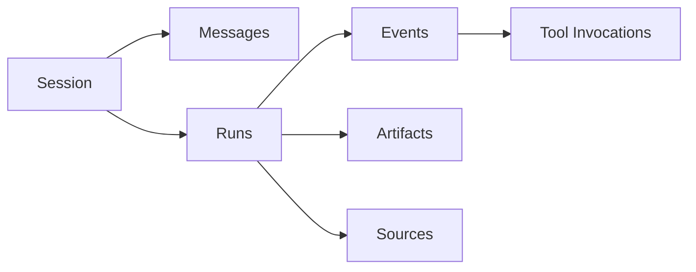

# 会话历史归档与运行事件

## 文档信息

| 项目 | 内容 |
|---|---|
| 项目名称 | AIASK V1 前端产品化 |
| 功能名称 | 会话历史归档与运行事件 |
| 功能编号前缀 | `RUN` |
| 文档版本 | 1.0.0 |
| 更新日期 | 2026-06-21 |
| V1 状态 | P0 必做 |
| 代码基准 | `desktop/src/features/agent-pages/SessionsPage.tsx`、`RunsEventsPage.tsx`、`ArtifactsPage.tsx`、`packages/agent/src/aiask_agent/routes/hermes.py`、`run_history.py`、`run_control.py` |

### 变更记录

| 版本 | 日期 | 变更内容 | 变更人 |
|---|---|---|---|
| 1.0.0 | 2026-06-21 | 按 L4 模板补齐会话、运行、事件、产物、来源、归档和测试 | Codex |

### 术语定义

| 术语 | 定义 | 代码证据 |
|---|---|---|
| Session | 对话会话和上下文恢复对象 | `/v1/hermes/sessions` |
| Run Event | 一次运行中的事件记录 | `/v1/runs/{run_id}/events` |
| Artifact/Source | 运行沉淀产物和引用来源 | `routes/run_history.py` |

## 1. 功能设计

### 1.1 需求背景与价值

| 项 | 内容 |
|---|---|
| 问题陈述 | 如果对话结果无法追踪到会话、运行、事件、产物和来源，AIASK 就难以用于真实工作。 |
| 解决方案 | 将 Sessions、Runs/Events、Artifacts/Sources 做成 V1 主链路，支持恢复、归档、过滤和证据查看。 |
| 业务价值 | 提供审计链路、错误追踪和继续任务能力。 |

### 1.2 用户故事

| 编号 | 优先级 | 用户故事 | 成功标准 |
|---|---|---|---|
| RUN-US-001 | P0 | 作为用户，我希望查看历史会话，以便继续之前任务。 | session 列表和消息可恢复。 |
| RUN-US-002 | P0 | 作为用户，我希望查看运行事件，以便知道 AI 做了什么。 | events 时间线和过滤可用。 |
| RUN-US-003 | P0 | 作为用户，我希望打开产物和来源，以便验证输出。 | artifact/source 内容或外部 URL 正确处理。 |

### 1.3 功能分解与优先级

| 功能编号 | 功能点 | 优先级 | 当前代码依据 | 待开发事项 | 验收标准 |
|---|---|---|---|---|---|
| RUN-F001 | Sessions 列表/消息 | P0 | `/v1/hermes/sessions`、`/v1/sessions/{id}/messages` | 搜索和归档筛选 | 会话可恢复 |
| RUN-F002 | Run events | P0 | `/v1/runs/{id}/events` | 事件筛选 | timeline 可追踪 |
| RUN-F003 | Artifacts/Sources | P0 | `/v1/runs/{id}/artifacts|sources` | 打开失败提示 | 产物和来源可验证 |
| RUN-F004 | stop/cancel/steer/archive/undo | P1 | `run_control.py` | 受控按钮 | control token 门禁 |

### 1.4 业务规则与边界

| 规则 | 说明 | 验收 |
|---|---|---|
| 归档是状态写入 | 需要 control token | 无 token 禁用 |
| 外部 URL 不走 Agent fetch | 避免误拦截外链 | TaskPanels 测试 |
| 事件失败不吞掉 | 工具错误显示 error_code/source | 事件详情可见 |

## 2. 流程设计

| 步骤 | 用户操作 | 前端行为 | Agent/API | 异常 |
|---|---|---|---|---|
| 1 | 打开 Sessions | 加载列表 | `/v1/hermes/sessions` | 空态显示新建入口 |
| 2 | 打开会话 | 加载消息/产物/来源 | session routes | missing 显示 RUN-101 |
| 3 | 打开 Runs | 加载运行和事件 | `/v1/desktop/runs`、run events | failed 事件可过滤 |
| 4 | 归档/undo | 调用受控 route | `/v1/sessions/{id}/archive|undo` | 无 token gated |

状态机：`loading -> ready|empty|error -> selected -> archive_pending|control_pending -> archived|failed`。

## 3. 架构设计

Desktop Agent Pages 负责列表、详情和过滤；Agent routes 负责 session/run/event/artifact/source 数据和受控操作。

## 4. 功能说明：接口与数据

| 操作 | Endpoint | Method | Token | 前端方法 |
|---|---|---|---|---|
| 会话列表 | `/v1/hermes/sessions` | GET | API | `sessionsList()` |
| 会话消息 | `/v1/sessions/{id}/messages` | GET | API | `sessionMessages()` |
| 运行事件 | `/v1/runs/{id}/events` | GET | API | `runEvents()` |
| 产物/来源 | `/v1/runs/{id}/artifacts|sources` | GET | API/control | `runArtifacts()`、`runSources()` |
| 归档/撤销 | `/v1/sessions/{id}/archive|undo` | POST | control | session methods |

## 5. 前端设计

组件：`SessionsPage -> SessionList -> MessageDrawer`、`RunsEventsPage -> RunTable -> EventTimeline`、`ArtifactsPage -> ArtifactTable -> ContentViewer`。

## 6. 开发规范

任何新增事件字段必须同步类型、mock 和事件详情 UI；外部 URL source 不得被 Agent content fetch 劫持。

## 7. 错误说明

| 错误码 | 用户提示 | 技术原因 | 处理 |
|---|---|---|---|
| RUN-101 | 会话不存在或已归档 | not found/archived | 引导 include archived |
| RUN-201 | 操作需要控制令牌 | archive/stop/undo gated | 禁用按钮 |
| RUN-301 | 事件加载失败 | route error | 可重试 |

## 8. 功能测试

| 用例编号 | 场景 | 预期 |
|---|---|---|
| TC-RUN-001 | 会话列表 | 可查看和筛选 |
| TC-RUN-002 | 归档 | 需要 control token |
| TC-RUN-003 | 运行事件 | 工具失败可见 |
| TC-RUN-004 | 外部 source URL | 不被 Agent fetch 拦截 |

## 9. 不做什么

- 不把历史事件隐藏在自然语言回复里。
- 不让归档/undo 绕过 control token。
- 不把外部 URL 当作 Agent artifact 内容。

## 10. 代码实证与成熟实现补强

### 10.1 当前代码审计

| 对象 | 代码证据 | 当前行为 | 文档结论 |
|---|---|---|---|
| Sessions | `SessionsPage.tsx` | 支持 session 列表、filter、handoff、resume context、messages、archive/undo | 会话管理要写筛选、恢复、归档、undo，不是只有历史列表 |
| Runs/Events | `RunsEventsPage.tsx` | 支持 run summary、事件过滤、trace eval、按 approval/tool/error 跳转 | run event 是验收证据链 |
| Artifacts/Sources | `ArtifactsPage.tsx`、`TaskPanels.tsx` | 支持按 run/session 读取 artifact/source，并用 API token 打开 Agent evidence | 产物和来源是独立对象，不应塞进纯文本 |
| Agent routes | `run_history.py`、`run_control.py`、`hermes.py`、`desktop_runs.py` | 提供 events/stream/artifacts/sources/messages/search/undo/archive/stop/cancel/steer | 每个操作要写 method/path/token |

### 10.2 事件和证据字段

| 字段/对象 | 用途 | UI 表现 | 测试 |
|---|---|---|---|
| `run_id` / `session_id` | 串联 response、事件、产物、来源 | 短 ID + 可复制详情 | `RunsEventsPage.test.tsx` |
| `event_type` / `kind` | 区分 tool、approval、gateway、mcp、error、system | 筛选器和跳转目标 | approval 事件跳审批页 |
| `artifact_id` / `source_id` | 打开 Agent evidence | 卡片、链接、预览 | `TaskPanels.test.tsx` |
| `archived` | 历史默认隐藏 | 开关 include archived | 归档后列表变化 |

### 10.3 成熟技术采用

OpenAI Conversation State 指导会话状态和上下文恢复；Playwright/Testing Library 指导从用户可见行为断言历史、归档和跳转。AIASK 采用 server-side session/run store + Desktop evidence panels，不采用只存在前端本地的历史状态。

## 11. 前端页面设计与布局细化

### 11.1 页面布局

| 区域 | 布局与内容 | 代码依据 | 交互要求 |
|---|---|---|---|
| 会话列表 | 搜索、include archived、session id、title、last update、approval/error 徽标 | `SessionsPage.tsx`、`AiaskApi.sessionsList()` | 归档默认隐藏，可筛选恢复 |
| 会话详情 | messages、artifacts、sources、resume context | `run_history.py`、`sessionMessages()` | 外部 source 和本地 artifact 展示规则不同 |
| 运行列表 | run id、status、started_at、duration、pending approval、errors | `RunsEventsPage.tsx`、`runsList()` | 支持按 session/status/filter 查看 |
| 时间线/产物 | event timeline、artifact/source content、tool invocation | `ArtifactsPage.tsx`、`TaskPanels.tsx` | raw evidence 折叠，错误事件单独高亮 |

### 11.2 组件树

```text
SessionsRunsArtifacts
├── SessionsPage
│   ├── SessionList
│   └── SessionDetailPanel
├── RunsEventsPage
│   ├── RunList
│   └── RunEventTimeline
└── ArtifactsPage
    ├── ArtifactSourceList
    └── ArtifactSourceContentPanel
```

### 11.3 状态和响应式

- `gated`：archive/undo/stop/cancel/steer 需要 control token；缺失时只允许查看。
- `empty`：没有历史时给出“回工作台创建任务”的入口；include archived 打开后仍为空要明确说明。
- 窄屏 master-detail 改为“列表 -> 点击进入详情 -> 返回列表”，避免三栏挤压。

## 原有内容保留

## 功能目标

用户必须能追踪 AIASK 做过什么：历史会话、运行记录、事件流、工具调用、产物、来源、归档和恢复上下文。这是 AI 对话从“聊天”变成“可审计工作台”的基础。

## 代码证据

| 能力 | 代码位置 |
|---|---|
| session store | `packages/agent/src/aiask_agent/session_store.py` |
| run history routes | `packages/agent/src/aiask_agent/routes/run_history.py` |
| run control routes | `packages/agent/src/aiask_agent/routes/run_control.py` |
| Hermes sessions | `packages/agent/src/aiask_agent/routes/hermes.py` |
| Desktop pages | `desktop/src/features/agent-pages/SessionsPage.tsx`、`RunsEventsPage.tsx`、`ArtifactsPage.tsx` |
| API client | `sessionsList`、`sessionMessages`、`sessionResumeContext`、`sessionUndo`、`sessionArchive`、`runEvents`、`runArtifacts`、`runSources` |

## 用户流程

1. 用户打开“会话”，看到最近会话、归档筛选和搜索。
2. 点击会话进入消息列表，能查看模型、工具、产物和上下文摘要。
3. 点击“恢复上下文”，把历史会话带回 Workbench。
4. 点击“归档”，会话从默认列表消失，保留可检索。
5. 打开“运行/事件”，查看 run 状态、事件时间线、错误和审批节点。
6. 打开“产物/来源”，查看生成报告、代码、数据来源和引用链。

## 前端展现

| 页面 | 必须展示 |
|---|---|
| Sessions | session_id、标题、最后更新时间、归档状态、消息数、恢复按钮 |
| Runs/Events | run_id、status、event type、tool、duration、error、stream 状态 |
| Artifacts | 文件/报告/图表/JSON 产物、kind、来源 run/session |
| Sources | 数据源、MCP 资源、文件、网页、金融数据来源 |

## API 合约

| 操作 | Endpoint |
|---|---|
| 会话列表 | `GET /v1/hermes/sessions` |
| 会话消息 | `GET /v1/sessions/{session_id}/messages` |
| 恢复上下文 | `GET /v1/hermes/sessions/{session_id}/resume-context` |
| undo | `POST /v1/sessions/{session_id}/undo` |
| archive | `POST /v1/sessions/{session_id}/archive` |
| run 列表 | `GET /v1/desktop/runs` |
| run events | `GET /v1/runs/{run_id}/events` |
| stream | `GET /v1/runs/{run_id}/events/stream` |
| artifacts/sources | `/v1/runs/{id}/artifacts`、`/sources` |

## 验收规则

1. 每条 AI 回复都能追溯到 session/run。
2. 归档会话默认隐藏但可恢复显示。
3. run 失败必须有错误摘要和来源。
4. 产物打开时不能丢失生成工具和输入上下文。
5. 事件列表不应该用 raw JSON 墙替代结构化时间线。

## 详细落地规范

### 问题场景与技术方案

| 问题 | 表现 | 技术方案 | 代码落点 | 验收 |
|---|---|---|---|---|
| 用户找不到旧对话 | 搜索、归档开关、最近会话 | sessions/search API | `routes/hermes.py`、`routes/responses.py` | 可按关键词找到 |
| 不知道 AI 做了什么 | Run timeline 展示事件 | normalized run events | `routes/run_history.py` | event type 可读 |
| 工具失败无证据 | 事件显示 tool/error/source | tool invocation + event payload | session store | 错误码可见 |
| 产物来源不清 | Artifact 绑定 run/session/tool | artifacts/sources routes | `run_history.py` | 打开产物看到来源 |
| 用户误归档 | 可恢复 archived 会话 | archive flag + includeArchived | `run_control.py` | 归档不删除数据 |

### 数据关系



### 代码生成/修改步骤

1. 新增事件类型时同步更新 Agent payload、Desktop normalizer 和事件 UI。
2. 前端历史页不直接读取 response 存储，只通过 Agent HTTP。
3. Artifacts/Sources 必须保留 run_id/session_id。
4. mock 覆盖 empty、archived、failed run、artifact with source。
5. e2e 覆盖归档、恢复上下文、事件打开。

### 不做什么

- 不把归档做成删除。
- 不展示无法追踪来源的产物。
- 不用 raw event JSON 作为主要 UI。

### 状态机补充

`sessions_loading -> sessions_ready -> session_selected -> messages_loading -> messages_ready`

运行态为 `run_pending -> run_running -> run_completed/run_failed/run_cancelled`。归档态为 `active -> archived -> restored`，归档不删除消息、事件、产物和来源。
