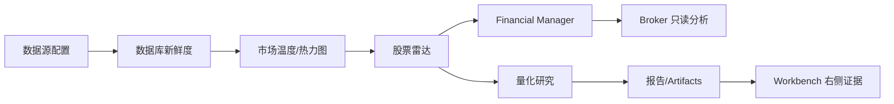

# 金融工作台

## 文档信息

| 项目 | 内容 |
|---|---|
| 项目名称 | AIASK V1 前端产品化 |
| 功能名称 | 金融工作台 |
| 功能编号前缀 | `FIN` |
| 文档版本 | 1.0.0 |
| 更新日期 | 2026-06-21 |
| V1 状态 | P0 必做，四工厂不展示 |
| 代码基准 | `desktop/src/features/workspace/FinanceLabPage.tsx`、`desktop/src/features/financial-manager/FinancialManagerWorkspace.tsx`、`desktop/src/features/quant/QuantResearchWorkspace.tsx`、`desktop/src/features/data/DataSyncWorkspace.tsx`、`desktop/src/features/stock-radar/StockRadarWorkspace.tsx`、`packages/agent/src/aiask_agent/routes/desktop_finance.py` |

### 变更记录

| 版本 | 日期 | 变更内容 | 变更人 |
|---|---|---|---|
| 1.0.0 | 2026-06-21 | 按 L4 模板补齐金融工作台范围、用户故事、接口、门禁和四工厂边界 | Codex |

### 术语定义

| 术语 | 定义 | 代码证据 |
|---|---|---|
| Finance Lab | V1 金融能力入口和流程聚合页 | `FinanceLabPage.tsx` |
| Financial Manager | 金融经理台，只读查询和受控意图 | `FinancialManagerWorkspace.tsx` |
| Broker Read-only | 券商状态、账户、持仓、订单只读展示 | `desktop_finance.py` |

## 1. 功能设计

### 1.1 需求背景与价值

| 项 | 内容 |
|---|---|
| 问题陈述 | 金融能力涉及数据、雷达、量化、经理台、券商只读和自动化，如果边界不清，用户会误以为 V1 支持策略工厂或实盘交易。 |
| 解决方案 | 金融工作台收敛为 Data、Market、Stock Radar、Financial Manager、Quant、Broker Read-only、Workflows，明确四工厂 deferred。 |
| 业务价值 | 第一版金融能力可演示、可研究、可审计，不误导交易能力。 |

### 1.2 用户故事

| 编号 | 优先级 | 用户故事 | 成功标准 |
|---|---|---|---|
| FIN-US-001 | P0 | 作为金融用户，我希望从一个入口看到数据、市场、雷达、量化和经理台。 | Finance Lab 展示 V1 金融入口。 |
| FIN-US-002 | P0 | 作为风险负责人，我希望实盘交易被明确阻断。 | 无买卖入口，broker 只读。 |
| FIN-US-003 | P0 | 作为 PM，我希望四工厂不在第一版出现。 | 页面、导航、快捷入口不含四工厂。 |

### 1.3 功能分解与优先级

| 功能编号 | 功能点 | 优先级 | 当前代码依据 | 待开发事项 | 验收标准 |
|---|---|---|---|---|---|
| FIN-F001 | Finance Lab V1 入口 | P0 | `FinanceLabPage.tsx` | 四工厂文案持续扫描 | V1 页面可跳转到非工厂模块，四工厂入口不出现 |
| FIN-F002 | Financial Manager | P0 | financial-manager feature/routes | 查询和 intent 分离 | 状态、catalog、query、intent 可见 |
| FIN-F003 | Quant Research | P0 | quant feature/routes | 报告证据 | 不跳策略工厂 |
| FIN-F004 | Broker Read-only | P1 | broker routes | 只读说明 | 交易 blocked |

### 1.4 业务规则与边界

| 规则 | 说明 | 验收 |
|---|---|---|
| V1 不展示四工厂 | strategy/factor/incubation/factory-events 不作为产品入口 | route/e2e/文案扫描 |
| 金融写入受控 | 任何 stateful/金融风险动作进入 intent | ActionIntent 可见 |
| 不实盘交易 | broker 只读或 blocked | 无下单/撤单按钮 |

## 2. 流程设计

状态机：`loading -> ready|degraded|error -> researching -> intent_pending|report_ready|blocked`。

| 步骤 | 用户操作 | 前端行为 | Agent/API | 异常 |
|---|---|---|---|---|
| 1 | 打开 Finance Lab | 展示 V1 入口 | 各金融 API 状态 | 缺数据显示 Data 入口 |
| 2 | 查看数据/市场/雷达 | 只读加载 | data/market/radar routes | stale/degraded |
| 3 | 运行量化/查询经理台 | 调用 quant/financial manager | quant/financial routes | 写入动作转 intent |
| 4 | 查看 broker | 只读 accounts/positions/orders | broker routes | live trading blocked |

## 3. 架构设计

Finance Lab 是聚合入口；具体能力在 Data、Market、Radar、Financial Manager、Quant、Broker 页面；Agent desktop_finance routes 是统一后端边界。

## 4. 功能说明：接口与数据

| 能力 | Endpoint/方法 | Token | 说明 |
|---|---|---|---|
| Financial Manager | `/v1/desktop/financial-manager/*` | API/control | catalog/status/query/intent |
| Quant | `/v1/desktop/quant/*` | API/control | presets/run/report |
| Broker read-only | `/v1/desktop/broker-*` | API/control | readiness/accounts/positions/orders |
| Stock Radar | `/v1/desktop/stock-radar/*` | API/control intents | 独立雷达 |

## 5. 前端设计

组件：`FinanceLabPage -> FinanceEntryGrid -> DataStatusCard -> MarketCard -> RadarCard -> ManagerCard -> QuantCard -> BrokerReadOnlyCard`。

## 6. 开发规范

任何金融页面新增按钮必须标注 read-only、intent、approval、blocked 或 dry-run；四工厂字段只能折叠为 deferred/internal。

## 7. 错误说明

| 错误码 | 用户提示 | 技术原因 | 处理 |
|---|---|---|---|
| FIN-201 | 金融系统未配置 | readiness gate failed | 引导 Readiness/Data |
| FIN-401 | 金融动作需要审批 | side effect | 创建 intent |
| FIN-501 | V1 不支持实盘交易 | live trading blocked | 显示只读说明 |

## 8. 功能测试

| 用例编号 | 场景 | 预期 |
|---|---|---|
| TC-FIN-001 | Finance Lab | 只展示 V1 入口 |
| TC-FIN-002 | 四工厂扫描 | 不出现四工厂入口 |
| TC-FIN-003 | 金融意图 | 创建 intent |
| TC-FIN-004 | broker read-only | 无交易按钮 |

## 9. 不做什么

- 不展示四工厂。
- 不提供实盘下单/撤单。
- 不把 stale 数据当 ready。

## 10. 代码实证与成熟实现补强

### 10.1 当前代码审计

| 对象 | 代码证据 | 当前行为 | 文档结论 |
|---|---|---|---|
| Finance Lab | `desktop/src/features/workspace/FinanceLabPage.tsx` | 只列 Financial Manager、Quant、Data、Stock Radar、Market Temperature、Workflows 六类 V1 模块 | 金融工作台不是四工厂入口 |
| Broker read-only | `brokerReadiness()`、`brokerAccounts()`、`brokerPositions()`、`brokerOrders()`、`brokerAnalyticsLatest()` | QMT/同花顺只读快照，sync 需要 consent + control token | 券商能力必须写只读边界 |
| 路由 | `routes.ts` 将旧 `/finance/strategy|factor|incubation|events` alias 到 `finance-lab` | 旧路径不会打开工厂页 | 文档要写 legacy fallback |
| 测试 | `FinanceLabPage.test.tsx`、`routes.test.ts`、`views.test.ts` | 覆盖 V1 finance surface、broker read-only、无 token 禁用 sync、factory surfaces 不注册为 V1 产品页 | QA 必须保留这些负向 |

### 10.2 金融工作台具体模块

| 模块 | 页面目标 | 代码落点 | 验收 |
|---|---|---|---|
| Financial Manager | 组合、关注、风险、受控 intent | `FinancialManagerWorkspace.tsx` | live trading blocked |
| Quant Research | 结构化研究 run/report | `QuantResearchWorkspace.tsx` | 不请求 factory endpoints |
| Data | 数据新鲜度和同步计划 | `DataSyncWorkspace.tsx` | 同步走 intent |
| Stock Radar | 候选发现和摘要 | `StockRadarWorkspace.tsx` | run/push/schedule 均 intent |
| Market Temperature | 市场宽度和行业温度 | `MarketTemperatureWorkspace.tsx` | 只读，无交易入口 |
| Broker Read-only | QMT/同花顺账户/持仓/委托快照 | `FinanceLabPage.tsx` + `desktop_finance.py` | read_only=true，live trading disabled |

### 10.3 成熟技术采用

金融数据展示采用“数据来源、时间戳、风险提示、只读/意图区分”的成熟模式；券商集成遵守最小权限和只读优先。AIASK V1 不采用实盘下单入口，不把策略工厂作为金融工作台主流程。

## 11. 前端页面设计与布局细化

### 11.1 页面布局

| 区域 | 布局与内容 | 代码依据 | 交互要求 |
|---|---|---|---|
| 金融枢纽头 | Agent HTTP/Mock、FINANCE_V1_READY、broker read-only、live trading blocked | `FinanceLabPage.tsx` | 首屏明确不是实盘交易入口 |
| V1 模块卡片 | 数据、股票雷达、市场温度、量化研究、金融经理台、工作流 | `views.ts`、`routes.ts` | 卡片只跳 V1 页面；旧四工厂路径回枢纽 |
| Broker 只读区 | accounts、positions、orders、risk flags、connector readiness | `FinanceLabPage.tsx`、finance MCP read-only | 展示 read_only 和 blocked，不提供下单按钮 |
| 分析摘要 | 数据质量、市场状态、雷达摘要、量化最近报告 | `MetricCard`、`StatusBadge` | 每个摘要带来源和更新时间 |

### 11.2 组件树

```text
FinanceLabPage
├── FinanceV1StatusHeader
├── V1ModuleNavigationGrid
├── BrokerReadOnlySnapshot
├── FinanceDataRadarMarketSummary
└── FinanceEvidencePanel
```

### 11.3 状态和响应式

- `blocked`：live trading 固定显示 blocked；QA 要验证页面没有实盘下单/撤单入口。
- `deferred`：四工厂只能作为后续能力边界，不出现卡片、导航、主按钮。
- 窄屏模块卡片两列或单列，broker 表格转为账户/持仓/订单分组卡片。

## 原有内容保留

## 功能目标

金融工作台是第一版金融能力总入口，承载数据检查、市场温度、股票雷达、金融经理台、量化研究、券商只读分析等功能。它应把金融工作组织成“数据准备 -> 市场观察 -> 股票发现 -> 研究/经理台 -> 报告/自动化”的流程。

## 代码证据

| 能力 | 代码位置 |
|---|---|
| Finance Lab | `desktop/src/features/workspace/FinanceLabPage.tsx` |
| Financial Manager | `desktop/src/features/financial-manager/FinancialManagerWorkspace.tsx` |
| Quant Research | `desktop/src/features/quant/QuantResearchWorkspace.tsx` |
| Data | `desktop/src/features/data/DataSyncWorkspace.tsx` |
| Stock Radar | `desktop/src/features/stock-radar/StockRadarWorkspace.tsx` |
| Market Temperature | `desktop/src/features/market-temperature/MarketTemperatureWorkspace.tsx` |
| Agent finance routes | `packages/agent/src/aiask_agent/routes/desktop_finance.py` |
| API client | `financialManager*`、`quant*`、`broker*`、`stockRadar*`、`marketTemperature*` |

## 用户流程

1. 打开金融工作台，先看到环境状态：模型、数据源、数据库、金融 readiness。
2. 数据准备：进入 Data & Sync 检查数据。
3. 市场观察：打开 Market Temperature/热力图。
4. 股票发现：打开 Stock Radar。
5. 研究：打开 Quant Research，运行结构化研究。
6. 管理：打开 Financial Manager 查询组合、自选、风险、绩效。
7. 券商只读：同步账户/持仓/订单快照，不提供实盘交易入口。
8. 需要自动化时跳转 Jobs/Workflows。

## 功能分区

| 分区 | 页面 | 说明 |
|---|---|---|
| 数据 | Data & Sync | 数据库、新鲜度、同步计划 |
| 市场 | Market Temperature | 热力图、行业冷热、前向验证 |
| 发现 | Stock Radar | 候选、摘要、推送/调度意图 |
| 研究 | Quant Research | presets、研究运行、报告 |
| 管理 | Financial Manager | catalog/status/query/intent |
| 券商只读 | Broker Read-only | readiness、sync、accounts、positions、orders、analytics |

## API 合约

| 模块 | Endpoint |
|---|---|
| Quant | `/v1/desktop/quant/presets`、`/research-runs`、`/report` |
| Financial Manager | `/v1/desktop/financial-manager/catalog|status|query|intent` |
| Broker | `/v1/desktop/broker-readiness`、`/broker/sync`、`/broker/accounts`、`/broker/positions`、`/broker/orders` |
| Stock Radar | `/v1/desktop/stock-radar/*` |
| Data | `/v1/desktop/data/*` |

## V1 边界

金融工作台不得展示四工厂产品入口。可以保留“后续高级能力”说明，但不能作为卡片、按钮、推荐动作、默认 tab 或 AI 后续建议。

## 验收规则

1. 金融工作台首屏能看到数据、市场、雷达、研究、经理台入口。
2. 所有金融写入/受控动作走 intent。
3. 券商能力只读，不出现下单/撤单主按钮。
4. 量化研究不跳转 Strategy Factory。
5. 数据不可用时金融页面显示修复路径而不是空白。

## 详细落地规范

### 问题场景与技术方案

| 问题 | 页面表现 | 技术方案 | 代码落点 | 验收 |
|---|---|---|---|---|
| 用户不知道金融任务顺序 | 首屏显示数据准备 -> 市场观察 -> 股票发现 -> 研究/管理 | Finance Lab 作为流程 hub | `FinanceLabPage.tsx` | 入口顺序清晰 |
| 数据没准备就研究 | 数据卡黄/红灯，研究按钮提示 data gate | 读取 data status/readiness | `DataSyncWorkspace.tsx` | blocked 不生成报告 |
| 用户混淆研究和交易 | 所有结论标注非投资建议 | UI 固定风险提示 | finance components | 无实盘交易入口 |
| Broker 可连接但有风险 | 只读确认框和 read-only badge | broker sync/readiness routes | `desktop_finance.py` | 无下单/撤单按钮 |
| PM 想看完整金融能力 | 卡片展示每个模块状态和入口 | 汇总 readiness、data、radar、quant、FM | `FinanceLabPage.tsx` | 不展示四工厂 |
| 高级工厂能力回流 | deferred 区只说明后续，不可点击 | route/v1Scope/e2e 负向 | `routes.ts`、`v1Scope.ts` | 主流程无四工厂 |

### 金融流程设计



### 页面组件拆分

| 组件 | 职责 |
|---|---|
| `FinanceReadinessStrip` | 模型、数据、MCP、金融 readiness |
| `FinanceWorkflowCards` | 数据、市场、雷达、研究、经理台 |
| `ReadOnlyBrokerPanel` | Broker readiness、sync、accounts/positions/orders |
| `RiskNotice` | 非投资建议、read-only、dry-run |
| `DeferredCapabilitiesNote` | 四工厂 deferred，不提供入口 |

### 代码生成/修改步骤

1. 新增金融模块先确认是否 V1 展示；如果属于四工厂，不能进入 Finance Lab 主入口。
2. 前端新增卡片必须有对应 `AiaskApi` 方法、mock 和测试。
3. Financial Manager 写入类动作必须走 `financialManagerIntent`。
4. Broker 只读同步必须有用户确认和 read-only 文案。
5. e2e 检查 Finance Lab 不包含策略工厂/因子工厂/孵化工厂/工厂事件。

### 不做什么

- 不做投资建议承诺。
- 不提供实盘交易按钮。
- 不把量化研究接到 Strategy Factory。
- 不让四工厂从工作流或修复建议回流。

### 状态机补充

`finance_loading -> readiness_ready -> module_selected -> module_loading -> module_ready/module_degraded/module_error`

金融流程整体以数据 readiness 为前置：`data_unready -> data_ready -> market_ready -> radar_ready -> research_ready/manager_ready`。
