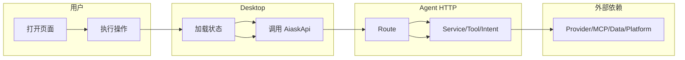
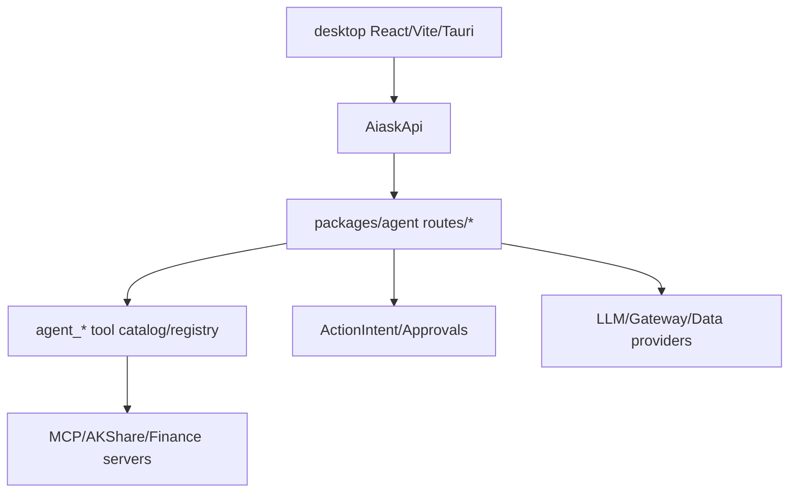

# AIASK 功能文档详细编写标准

## 文档信息

| 项目 | 内容 |
|---|---|
| 项目名称 | AIASK V1 前端产品化 |
| 文档名称 | 功能文档详细编写标准 |
| 文档编号 | `DOC-STD-025` |
| 文档版本 | 1.1.0 |
| 更新日期 | 2026-06-21 |
| 适用范围 | `frontend-screenshots/AIASK标准化功能规范-2026-06-20/*.md` 的功能文档、索引文档、参考文档 |
| V1 状态 | 必做文档治理标准 |
| 主规范 | `../../AIASK项目开发技术规范-V1前端产品化-2026-06-21.md` |
| 代码基准 | `desktop/src/App.tsx`、`desktop/src/views.ts`、`desktop/src/routes.ts`、`desktop/src/services/aiaskApi.ts`、`packages/agent/src/aiask_agent/routes/*` |

### 变更记录

| 版本 | 日期 | 变更内容 | 变更人 |
|---|---|---|---|
| 1.0.0 | 2026-06-21 | 按 AIASK V1 前端产品化要求建立 L4 功能文档模板 | Codex |
| 1.1.0 | 2026-06-21 | 补齐目录级统一 `## 文档信息` 元数据，使模板文档自身也符合标准章节检查 | Codex |

### 术语定义

| 术语 | 定义 | 代码/文档证据 |
|---|---|---|
| L4 发布级 | 同时具备用户故事、功能拆解、流程、状态机、API、字段、组件、错误、权限、测试和代码证据的文档等级 | 本文件 `8.3 通过标准` |
| 功能编号 | 用于 PM 排期、开发拆任务、QA 验收的稳定编号，如 `WB-F001`、`DATA-F001` | 本文件 `1.3 功能分解与优先级` |
| V1 Deferred | 后端或兼容代码可以存在，但第一版前端不作为产品入口展示 | `desktop/src/routes.ts` 的 `V1_DEFERRED_VIEWS` |

本文件是 AIASK 专项功能文档模板。根目录 `AIASK项目开发技术规范-V1前端产品化-2026-06-21.md` 是 V1 前端产品化主规范；本文件用于约束本目录下每一篇功能文档如何写到 PM、开发、QA 都能执行。

任何功能文档如果只写“要实现什么”，但没有写清用户故事、业务规则、流程、状态机、接口、字段、错误、门禁、测试和代码证据，不得进入 V1 开发。

---

## 0. 文档信息

每篇功能文档开头必须包含：

| 字段 | 填写要求 |
|---|---|
| 项目名称 | AIASK V1 前端产品化 |
| 功能名称 | 如“AI 对话与任务工作台” |
| 功能编号前缀 | 如 `WB`、`MODEL`、`MCP` |
| 文档版本 | 从 `1.0.0` 开始 |
| 创建/更新日期 | 使用实际日期 |
| 适用范围 | Desktop 页面、Agent route、工具、数据源、测试范围 |
| V1 状态 | 必做、可选、高级、Deferred、Legacy Diagnostic |
| 代码基准 | 引用具体路径，不写空泛描述 |

### 变更记录模板

| 版本 | 日期 | 变更内容 | 变更人 |
|---|---|---|---|
| 1.0.0 | YYYY-MM-DD | 初稿创建 | 姓名 |

### 术语定义模板

| 术语 | 定义 | 代码证据 |
|---|---|---|
| ActionIntent | 副作用动作的审批意图 | `packages/agent/src/aiask_agent/routes/intents.py` |

---

## 1. 功能设计

### 1.1 需求背景与价值

必须回答：

- 当前用户或系统有什么痛点。
- 该功能解决什么问题。
- 为什么 V1 必须做或为什么 deferred。
- 这个功能与 Workbench、Agent、MCP、金融数据、自动化、记忆、Gateway 的关系。
- 对 PM、开发、QA、交付分别有什么价值。

模板：

| 项目 | 内容 |
|---|---|
| 问题陈述 | 不能只写“需要某页面”，要写用户遇到的真实问题 |
| 解决方案 | 说明产品功能和技术方案如何闭环 |
| 业务价值 | 能演示、能定位、能审批、能追踪、能避免误用 |
| V1 状态 | 必做/可选/高级/Deferred，并说明原因 |

### 1.2 用户故事

必须使用可验收的用户故事，不写抽象口号。

| 编号 | 优先级 | 用户故事 | 成功标准 |
|---|---|---|---|
| `WB-US-001` | P0 | 作为用户，我希望打开应用即可输入任务，以便不需要理解内部能力矩阵 | 首屏有输入区、模型状态和最近任务 |

### 1.3 功能分解与优先级

功能编号统一使用以下前缀：

| 前缀 | 模块 |
|---|---|
| `WB-Fxxx` | 工作台 |
| `MODEL-Fxxx` | 模型配置 |
| `RUN-Fxxx` | 会话、运行、产物、来源 |
| `MCP-Fxxx` | MCP 与连接器 |
| `PLUGIN-Fxxx` | 插件与技能 |
| `GATEWAY-Fxxx` | Gateway 与 Webhooks |
| `DATA-Fxxx` | 数据源、数据库、同步 |
| `RADAR-Fxxx` | 股票雷达 |
| `FIN-Fxxx` | 金融经理台、量化、券商只读 |
| `OPS-Fxxx` | 健康、设置、安全门禁 |

模板：

| 功能编号 | 功能点 | 优先级 | 当前代码依据 | 待开发事项 | 验收标准 |
|---|---|---|---|---|---|
| `DATA-F001` | 数据状态展示 | P0 | `desktop/src/features/data/DataSyncWorkspace.tsx` | 补空态和错误态 | missing/stale/ready 三类状态可见 |

### 1.4 业务规则与边界

每篇文档必须写清：

- 是否只读。
- 是否写入配置。
- 是否触发本地高权限。
- 是否触发外部平台。
- 是否有金融风险。
- 是否需要 token、confirm、ActionIntent、approval 或 blocked。
- 是否涉及 V1 deferred 范围。

模板：

| 规则 | 说明 | UI 表现 | 后端/API | 验收 |
|---|---|---|---|---|
| 不直接执行外部投递 | Gateway 发送必须先创建意图 | 按钮文案为“创建发送审批” | `/intents` | e2e 不出现直接发送 |

AIASK 固定边界：

1. Desktop 只能通过 `desktop/src/services/aiaskApi.ts` 和 `desktop/src/services/api/*` 调 Agent HTTP。
2. 前端不得直接 import Python、MCP server、AKShare manager、数据库或策略工厂包。
3. 模型可见工具必须是 `agent_*`。
4. Secret 只展示配置状态和 env 名，不展示值。
5. V1 不展示 `strategy-factory`、`factor-factory`、`incubation`、`factory-events` 四工厂产品入口。

---

## 2. 流程设计

### 2.1 核心业务流程图

必须使用 Mermaid，至少包含用户、Desktop、Agent、外部依赖四类责任边界。

模板：



### 2.2 完整用户流程

不能只写 1、2、3 步。必须覆盖：

- 首次进入。
- 正常路径。
- 空状态。
- 错误路径。
- 降级路径。
- 权限不足路径。
- 用户取消/重试。
- 任务完成后的后续入口。
- mock/live 差异。

模板：

| 步骤 | 用户操作 | 前端行为 | Agent/API | 状态 | 异常 |
|---|---|---|---|---|---|
| 1 | 打开页面 | 加载状态卡和列表 | `GET /v1/...` | loading -> ready | 离线时 degraded |

### 2.3 状态机

每个功能都必须有状态机，且状态不能少于以下集合：

`idle`、`loading`、`ready`、`empty`、`error`、`degraded`、`gated`、`blocked`、`stale`、`mock`、`success`

模板：

| 当前状态 | 触发事件 | 目标状态 | UI 动作 | API/数据动作 |
|---|---|---|---|---|
| `loading` | 请求成功但 data 为空 | `empty` | 显示空态和下一步 | 保留响应元数据 |

### 2.4 异常路径

至少写 8 类异常：

| 异常 | 用户看到什么 | 技术处理 | 验收 |
|---|---|---|---|
| Agent 离线 | 显示连接失败和设置入口 | request failed -> offline/degraded | 不显示 ready |
| control token 缺失 | 高权限按钮禁用 | gated reason | 不发出写入请求 |
| secret 缺失 | 显示 env 名 | secrets_redacted | 不展示 secret 值 |
| API 超时 | 可重试错误 | timeout error_code | 不丢失用户输入 |
| 依赖降级 | 黄灯和缺失项 | warnings/partial_success | 可继续只读 |
| 后端 blocked | 策略拒绝原因 | blocked reason | 不提供绕过 |
| mock 数据 | 标记 mock | mock source | 不写成 live ready |
| V1 deferred | 显示 deferred 或隐藏入口 | route alias/feature flag | 不打开四工厂 |

---

## 3. 架构设计

### 3.1 系统全景图

必须写清 Desktop -> Agent HTTP -> Routes/Tools/MCP/AKShare/External 的依赖方向。

模板：



### 3.2 模块职责

模板：

| 模块 | 职责 | 不负责 | 代码证据 |
|---|---|---|---|
| Desktop Page | UI、状态、用户操作 | 后端策略和直接外部调用 | `desktop/src/features/...` |

### 3.3 核心设计决策

必须用 ADR 风格写“问题/方案/理由/权衡/验收”。

| ADR | 问题 | 方案 | 理由 | 验收 |
|---|---|---|---|---|
| ADR-001 | 是否可直接调 MCP | 不可，必须 Agent HTTP | 安全和可审计 | 前端无 direct MCP import |

固定 ADR：

1. Desktop 只走 Agent HTTP。
2. 模型可见工具只走 `agent_*`。
3. 副作用动作走 ActionIntent/approval/control token。
4. Mock 不等于 live。
5. 四工厂是 V1 deferred，不是 V1 产品入口。

---

## 4. 功能说明：接口与数据

### 4.1 API 接口设计规范

必须写清：

- path。
- method。
- token 类型。
- request query/body。
- response 关键字段。
- 错误码。
- side_effect 元数据。
- 是否需要 ActionIntent/approval/confirm。
- 对应前端方法。
- 对应 mock。

模板：

| 操作 | Endpoint/Tool | Method | Token | Request | Response | Side effect | 前端方法 | Mock |
|---|---|---|---|---|---|---|---|---|
| 获取状态 | `/v1/example/status` | GET | API | query | `status/data` | 只读 | `exampleStatus()` | `mockApi.ts` |

### 4.2 接口详细定义

关键接口必须给 JSON 示例。

请求示例：

```json
{
  "codes": ["600519"],
  "max_stale_days": 3
}
```

成功响应示例：

```json
{
  "object": "aiask.example",
  "status": "ready",
  "data": {},
  "secrets_redacted": true
}
```

失败响应示例：

```json
{
  "success": false,
  "error": "control token required",
  "error_code": "OPS-201",
  "meta": {
    "trace_id": "trace_xxx"
  },
  "secrets_redacted": true
}
```

### 4.3 数据与字段设计

模板：

| 字段 | 类型 | 是否可空 | 来源 | UI 展示 | 规则 |
|---|---|---|---|---|---|
| `status` | string | 否 | Agent response | Badge | ready/degraded/error/gated |

必须说明：

- 前端 TypeScript 类型在哪个文件。
- 后端 payload 字段来自哪个 route/tool。
- 字段是否可为空。
- 时间、金额、百分比、状态枚举格式。
- 是否需要 redaction。

---

## 5. 前端设计

### 5.1 页面路由与结构

模板：

| 页面 | view id | route | 当前代码 | V1 状态 | 说明 |
|---|---|---|---|---|---|
| 工作台 | `workbench` | `/` | `WorkbenchView.tsx` | 必做 | 默认入口 |

必须同时检查：

- `desktop/src/types.ts`
- `desktop/src/views.ts`
- `desktop/src/routes.ts`
- `desktop/src/App.tsx`
- `desktop/src/features/*`
- `desktop/e2e/*`

### 5.2 组件树与状态管理

模板：

```text
FeatureWorkspace
├── StatusSummary
├── FilterBar
├── ResultTable
├── DetailDrawer
├── ActionPanel
├── EvidencePanel
└── RawPayloadDetails
```

组件说明模板：

| 组件 | 职责 | Props | 状态 |
|---|---|---|---|
| `StatusSummary` | 展示 ready/degraded/gated | `status`, `updatedAt` | loading/error |

状态来源必须写清：

- 全局连接状态：`useAppConnectionSettings`。
- 工作台任务状态：`useAgentWorkbench`。
- API：`AiaskApi`。
- 页面局部状态：组件 state。
- mock/live 来源：`mockApi.ts` 或 live Agent。

### 5.3 UI 状态说明清单

每个功能必须逐项填写：

| 状态 | 文案要求 | 按钮要求 | 数据要求 |
|---|---|---|---|
| loading | 显示正在加载 | 禁用重复提交 | 保留旧数据或 skeleton |
| empty | 说明为什么为空 | 给下一步 | data/count 为空 |
| error | 用户提示 + 技术详情 | 可重试 | error_code 可见 |
| degraded | 黄灯和缺失项 | 只读可继续 | warnings 可见 |
| gated | 缺 token/OAuth/full mode | 高风险按钮禁用 | reason 可见 |
| blocked | 策略拒绝 | 不提供绕过 | blocked reason |
| stale | 数据过期 | 同步计划/刷新 | freshness 可见 |
| mock | 明确 mock | 不写 live | source 可见 |
| success | 结果和后续入口 | 可继续/查看证据 | run/intent/artifact id |

### 5.4 页面布局细化强制模板

每篇功能文档必须新增“前端页面设计与布局细化”章节，不能只写组件树。该章节至少包含 4 个部分：

| 小节 | 必填内容 | 不合格示例 | 合格标准 |
|---|---|---|---|
| 页面布局 | 逐个写页面区域、内容、代码依据、交互要求 | “展示列表” | 写清顶部指标、过滤器、主表格、详情抽屉、动作区、证据区 |
| 组件树 | 写到容器、列表/表单、详情、证据组件 | “用一个组件实现” | 能指导开发拆 `Workspace -> Summary -> Filter -> Table -> Detail -> Evidence` |
| 状态画面 | loading/empty/error/degraded/gated/blocked/stale/mock/success 每类用户看到什么 | “支持错误态” | 写清文案、按钮、数据字段和重试/修复路径 |
| 响应式 | 宽屏、平板、窄屏如何排列 | “自适应” | 写清三栏/两栏/单栏、表格卡片化、详情下置、无横向溢出 |

通用布局模板：

```text
FeatureWorkspace
├── PageShellHeader: title、status badges、search、primary action
├── MetricStrip: MetricCard/StatusBadge
├── FilterBar: search、tabs、select、date/range、status filters
├── MainRegion: table/list/form/chart/timeline
├── DetailPanel: selected item detail、schema、result、errors
├── ActionPanel: read-only/preview/create intent/approval/retry
└── EvidencePanel: RawEvidencePanel/JsonPanel/source/artifact/trace
```

页面布局表模板：

| 区域 | 布局与内容 | 代码依据 | 控件 | 状态要求 |
|---|---|---|---|---|
| 顶部指标 | 3-8 个关键指标 | `MetricCard`、feature file | 刷新、主动作 | ready/degraded/gated |
| 主表格 | 核心对象列表 | `FeatureWorkspace.tsx`、API method | 搜索、排序、过滤 | loading/empty/error |
| 详情区 | 选中对象详情和 raw evidence | `RawEvidencePanel` | 复制、重试、查看证据 | redacted/success/blocked |

响应式模板：

| 断点 | 布局 |
|---|---|
| `>=1200px` | 三栏或主内容 + 右侧详情，列表宽 280-360px，详情宽 320-420px |
| `768-1199px` | 两栏，详情下置或折叠 |
| `<768px` | 单栏，表格卡片化，过滤器换行或横向滚动，详情变折叠区/底部 sheet |

PM 验收时看“用户是否知道页面能做什么、不能做什么”；开发验收时看“能否按组件和 API 拆任务”；QA 验收时看“能否按每个状态和断点写用例”。

---

## 6. 开发规范

### 6.1 代码落地路径

模板：

| 层 | 必须说明 |
|---|---|
| Agent route | 是否已有；缺失时在哪个 `routes/*.py` 加 |
| Agent adapter/service | 是否需要 payload builder 或 adapter |
| Tool catalog | 是否新增/调整 `agent_*` 工具 |
| Desktop API | `desktop/src/services/aiaskApi.ts` 增加或复用什么方法 |
| Types | `desktop/src/types.ts` 或 `types/*` 增加什么类型 |
| Mock | `desktop/src/mockApi.ts` 或 `desktop/src/mock/*` 增加什么数据 |
| Feature page | `desktop/src/features/*` 新增/修改哪些组件 |
| Tests | Agent contract、Vitest、Playwright 各测什么 |

### 6.2 编码规范

1. 优先沿用现有组件和 CSS，不新增无必要抽象。
2. 新按钮必须标注动作性质：只读、预览、创建审批、确认、拒绝、重试。
3. 不在前端绕过后端安全策略。
4. 不展示 secret 原值。
5. 不把 mock 写成 live。
6. 不把四工厂作为 V1 产品入口。
7. 新 API 必须同步 types、mock 和测试。

### 6.3 PR 验收

| 检查项 | 要求 |
|---|---|
| 功能编号 | PR 描述引用功能编号 |
| 代码证据 | 写清 route/API/client/page/test |
| 安全门禁 | token/intent/approval/blocked 清楚 |
| 错误状态 | error_code 和 UI 错误态覆盖 |
| Mock/Live | 区分 mock e2e 和 live smoke |
| 四工厂边界 | 不新增产品入口或跳转 |

---

## 7. 错误说明

### 7.1 错误码规范

格式：`[模块]-[类型]-[序号]`

| 模块 | 范围 |
|---|---|
| `WB` | 工作台 |
| `MODEL` | 模型 |
| `RUN` | 会话运行 |
| `MCP` | MCP/连接器 |
| `PLUGIN` | 插件/技能 |
| `GATEWAY` | Gateway/Webhook |
| `DATA` | 数据 |
| `RADAR` | 股票雷达 |
| `FIN` | 金融 |
| `OPS` | 健康/设置/权限 |

错误类型：

| 类型 | 含义 |
|---|---|
| `1xx` | 参数错误 |
| `2xx` | 认证/配置/权限 |
| `3xx` | 依赖不可用/降级/超时 |
| `4xx` | 业务规则/状态冲突 |
| `5xx` | 内部错误 |

### 7.2 错误码表模板

| 错误码 | 用户提示 | 技术原因 | HTTP | 处理方案 |
|---|---|---|---|---|
| `MODEL-201` | 模型密钥未配置 | provider key missing | 401 | 引导配置 env，不展示 key |

### 7.3 全局异常处理

必须写清：

- 用户可见文案。
- 技术详情折叠字段。
- 是否可重试。
- 是否保留用户输入。
- 是否记录 trace/audit。
- 是否需要告警或人工处理。

参考 RFC 9457 Problem Details 的结构化错误思想，但兼容 AIASK 当前 `ToolEnvelope` 和 `object/data/status` 响应形态。

---

## 8. 功能测试

### 8.1 测试环境与命令

必须列出本功能需要的测试命令：

| 类型 | 命令/文件 | 必跑条件 |
|---|---|---|
| TypeScript | `cd desktop && npm run typecheck` | route/type/API 变更 |
| Vitest | `cd desktop && npm test` 或目标测试文件 | 组件/API 状态变更 |
| Playwright mock | `cd desktop && npm run test:e2e:mock` | 页面流程变更 |
| Agent contract | `packages/agent/tests/test_*.py` | Agent route 变更 |
| Live smoke | 按功能定义 | 需要真实凭据或本地服务 |

### 8.2 测试用例模板

| 用例编号 | 场景 | 前置条件 | 步骤 | 预期结果 |
|---|---|---|---|---|
| `TC-DATA-001` | 数据状态 ready | Agent 可用 | 打开 Data 页面 | 显示 ready、更新时间、来源 |

每篇文档至少包含：

- 正常路径。
- 空状态。
- API 错误。
- 权限/令牌缺失。
- 依赖降级。
- mock/live 区分。
- V1 deferred 负向断言。
- secret redaction。

### 8.3 通过标准

| 等级 | 标准 | 是否合格 |
|---|---|---|
| L0 | 只有功能描述 | 不合格 |
| L1 | 有目标和 API 名称 | 不合格 |
| L2 | 有流程、API、验收 | 可讨论但不够发布 |
| L3 | 有问题-方案矩阵、状态机、代码落地、验收 | 基础合格 |
| L4 | 有字段、组件、异常、权限、错误码、测试、live smoke 边界 | V1 发布级 |

AIASK V1 功能文档必须达到 L4。

---

## 9. 不做什么

每篇功能文档必须有“不做什么”，避免范围漂移。

固定禁止项：

1. 不展示四工厂产品入口。
2. 不直接调用 Python/MCP/manager/数据库。
3. 不展示 secret。
4. 不把 mock 当 live。
5. 不提供实盘交易入口。
6. 不把后端兼容字段自动变成产品入口。
7. 不把外部平台投递做成无审批的一键发送。

---

## 10. 文档交付验收

1. Markdown 中文可读，不允许乱码。
2. 必须包含文档信息、变更记录、术语、功能设计、流程、架构、接口、前端、开发、错误、测试、不做什么。
3. 所有“已存在”必须回指代码路径。
4. 所有“待开发”必须回指开发路径和验收标准。
5. README 必须索引新增或重写文档。
6. 外部参考必须来自可验证官方/行业来源，并写清采用和不采用。
7. 四工厂相关内容只能作为 V1 deferred/legacy/internal 说明，不能作为 V1 产品入口。

## 11. 代码审计与联网调研执行要求

本节是对所有功能文档的强制补充，目的是避免文档只按想象写、只写一句话、只放链接或只堆模板。

### 11.1 写文档前必须查看的当前代码

| 文档结论 | 必查代码 | 未查代码时怎么写 |
|---|---|---|
| 前端页面已存在 | `desktop/src/App.tsx` lazy import、`desktop/src/views.ts` registry、`desktop/src/routes.ts` mapping、对应 `desktop/src/features/*` 或 `desktop/src/components/*` | 写“待核验/待开发”，不能写已完成 |
| API 已存在 | `desktop/src/services/aiaskApi.ts`、`desktop/src/services/api/*`、`packages/agent/src/aiask_agent/routes/*.py` | 只写需求，不写 endpoint 已完成 |
| Mock/e2e 已覆盖 | `desktop/src/mockApi.ts`、`desktop/src/mock/*`、`desktop/e2e/capabilities.spec.ts` | 标明缺 mock 或缺 e2e |
| 安全门禁已覆盖 | `useAppConnectionSettings.ts`、`routes/intents.py`、`routes/approvals.py`、`tools/policy.py`、相关组件 `hasControlToken` | 写“需补 control token/ActionIntent/approval/blocked” |
| 四工厂已隐藏 | `desktop/src/routes.ts` 的 `V1_DEFERRED_VIEWS`、`desktop/src/v1Scope.ts`、`views.test.ts`、`routes.test.ts`、e2e | 不能写四工厂产品入口 |

### 11.2 联网成熟方案必须达到的深度

| 来源类型 | 不能只写 | 必须写 |
|---|---|---|
| 官方文档 | 不能只贴 URL | 标题/章节核验、采用原则、AIASK 代码对应、不采用内容、验收影响 |
| 开源库文档 | 不能只写“使用 React/TanStack/Playwright” | 该库解决哪个具体问题、落在哪个组件、为什么不引入新框架 |
| 安全规范 | 不能泛泛写“注意安全” | token、secret redaction、权限、错误、审计、负向测试 |
| 金融数据文档 | 不能写“数据源可用” | 免费/付费、限流、字段缺失、freshness、stale、missing、fallback |

### 11.3 每篇文档必须写到的功能颗粒度

| 读者 | 最低可理解信息 |
|---|---|
| PM | 用户场景、页面入口、核心按钮、每个状态用户看到什么、哪些能力 V1 不做 |
| 开发 | 组件树、API 方法、Agent route、字段、mock、测试文件、待开发文件 |
| QA | 正常路径、空态、错误态、权限不足、依赖降级、mock/live、secret、四工厂负向 |
| 交付 | 配置项 env 名、readiness、live smoke 前置、风险提示、不可承诺范围 |

### 11.4 “一句话文档”判定为不合格

如果某功能只写“展示列表”“支持测试”“查看状态”“调用接口”而没有写字段、状态、按钮、错误、门禁、路径和验收，则该功能文档不得进入 V1 开发评审。必须补成如下形式：

| 不合格写法 | 合格写法 |
|---|---|
| 展示连接器列表 | 展示 type/name/category/status/configured/connected/last_checked；读取 `/v1/connectors`；详情用 `/v1/connectors/{type}/{name}`；测试用 `/test`，无 control token disabled |
| 支持模型配置 | Models 页面按 provider preset 分组，保存 `/v1/ai/config` 需 control token，模型列表 `/v1/ai/models`，冒烟 `/v1/ai/smoke`，secret 不回显 |
| 支持股票雷达 | StockRadar 读取 status/candidates/digest，展示 tier/score/risk/source_chain，run/push/schedule 只创建 ActionIntent |
