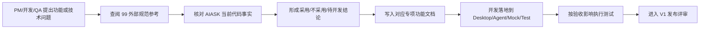
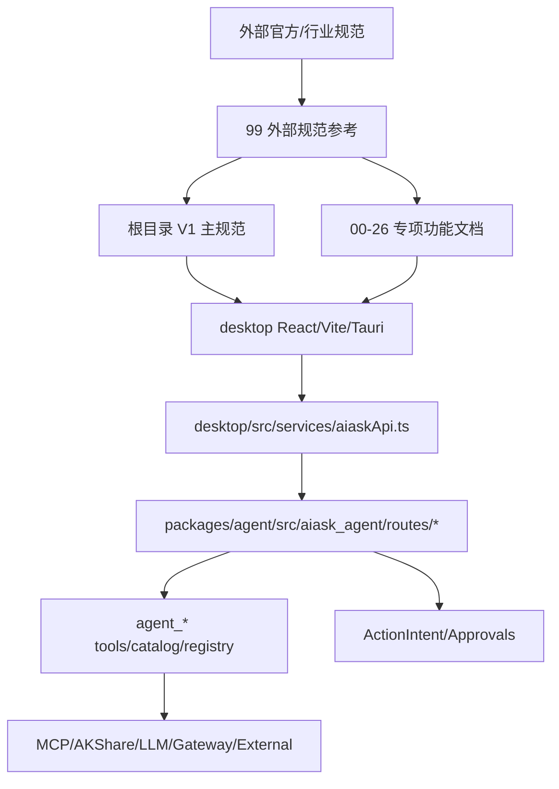

# 外部规范参考与成熟技术方案索引

本文件记录 AIASK V1 前端产品化规范采用的外部官方/行业来源。外部来源用于形成技术决策和验收口径，不替代 AIASK 当前代码事实。根目录 `AIASK项目开发技术规范-V1前端产品化-2026-06-21.md` 是主规范；本文件是其外部调研索引。

## 文档信息

| 项目 | 内容 |
|---|---|
| 项目名称 | AIASK V1 前端产品化 |
| 功能名称 | 外部规范参考与成熟技术方案索引 |
| 功能编号前缀 | `OPS-DOC` |
| 文档版本 | 1.1.0 |
| 更新日期 | 2026-06-21 |
| 适用范围 | V1 前端产品化的外部官方文档、行业规范、成熟技术方案选型、验收口径 |
| V1 状态 | 必做文档治理能力 |
| 主规范 | `../../AIASK项目开发技术规范-V1前端产品化-2026-06-21.md` |
| 代码基准 | `desktop/package.json`、`desktop/src/services/aiaskApi.ts`、`packages/agent/src/aiask_agent/routes/*`、`packages/agent/src/aiask_agent/tools/*` |

### 变更记录

| 版本 | 日期 | 变更内容 | 变更人 |
|---|---|---|---|
| 1.0.0 | 2026-06-21 | 建立外部规范参考索引，记录成熟技术方案、采用原则、不采用内容和验收影响 | Codex |
| 1.1.0 | 2026-06-21 | 按 `25-功能文档详细编写标准.md` 补齐功能设计、流程、架构、接口、前端、开发、错误、测试和不做项 | Codex |

### 术语定义

| 术语 | 定义 | 代码/文档证据 |
|---|---|---|
| 外部规范 | OpenAI、MCP、OpenAPI、OWASP、Tauri、React、FastAPI、AKShare 等官方或行业来源 | 本文“已联网核验来源” |
| 采用原则 | AIASK 从外部来源吸收的工程约束、交互原则或验收要求 | 本文“已联网核验来源”表格 |
| 不采用内容 | 不照搬、不承诺或暂不进入 V1 的部分，避免把外部能力误写成产品事实 | 本文“已联网核验来源”表格 |
| 代码对应 | 外部原则在 AIASK 仓库中的落点或待落点 | `desktop/src/services/aiaskApi.ts`、`packages/agent/src/aiask_agent/routes/*` |
| 验收影响 | PM、开发、QA 需要根据该外部原则增加的界面、接口、错误、测试或负向断言 | 本文“验收规则” |

## 1. 功能设计

### 1.1 需求背景与价值

AIASK V1 前端产品化不是从零设计，当前代码已经采用 React/Vite/Tauri、FastAPI、Agent HTTP、MCP、`agent_*` 工具、AKShare/金融数据、Gateway、插件技能、Vitest 和 Playwright。外部规范索引的目标是把这些成熟技术的“采用方式”写清楚，避免文档凭感觉追加，也避免把外部文档中的能力直接当成 AIASK 已完成事实。

| 项目 | 内容 |
|---|---|
| 问题陈述 | 旧文档容易只写链接或口号，没有说明 AIASK 采用什么、不采用什么、代码在哪里、怎么验收 |
| 解决方案 | 以官方/行业文档为输入，逐项落到 AIASK 的代码事实、V1 边界、接口表、错误码和测试要求 |
| 业务价值 | PM 能判断成熟方案来源，开发能按现有技术栈落地，QA 能按外部规范补安全、权限、降级和负向测试 |
| V1 状态 | 必做；作为所有功能文档的 ADR 输入和验收依据 |

### 1.2 用户故事

| 编号 | 优先级 | 用户故事 | 成功标准 |
|---|---|---|---|
| `OPS-DOC-US-001` | P0 | 作为产品经理，我希望每个技术选择都有成熟来源和采用边界，以便评审时知道哪些是产品承诺 | 每个来源都包含 URL、采用原则、不采用内容、AIASK 代码对应和验收影响 |
| `OPS-DOC-US-002` | P0 | 作为开发负责人，我希望外部方案能映射到实际代码路径，以便按当前栈实施而不是另起炉灶 | 参考项能回指 `desktop/package.json`、`AiaskApi`、Agent routes、tool catalog 或测试文件 |
| `OPS-DOC-US-003` | P0 | 作为 QA，我希望外部安全和接口规范能转成测试断言，以便覆盖 token、secret、ActionIntent、mock/live 和错误码 | 验收规则中包含负向场景和测试类型 |
| `OPS-DOC-US-004` | P1 | 作为后续维护者，我希望新增外部平台或数据源时有固定写法，以便文档不会再次散乱 | 本文提供“进入专项文档的写法”模板 |

### 1.3 功能分解与优先级

| 功能编号 | 功能点 | 优先级 | 当前依据 | 待开发/维护事项 | 验收标准 |
|---|---|---|---|---|---|
| `OPS-DOC-F001` | 外部来源登记 | P0 | 本文“已联网核验来源” | 新增来源必须补 URL、核验状态、采用/不采用、代码对应、验收影响 | 表格字段完整，不能只有 URL |
| `OPS-DOC-F002` | 代码事实映射 | P0 | `desktop/src/services/aiaskApi.ts`、`packages/agent/src/aiask_agent/routes/*` | 每条“已采用”都要能回指代码路径或写明待开发 | 不把外部文档写成 AIASK 已实现 |
| `OPS-DOC-F003` | ADR 输入 | P0 | 根目录主规范“核心设计决策” | 功能文档引用外部规范时要说明决策和权衡 | ADR 有问题、方案、理由、验收 |
| `OPS-DOC-F004` | 安全验收落地 | P0 | OWASP、Tauri Security、AIASK token/intent 规则 | 涉及 secret、外部投递、本地高权限、金融风险时补负向测试 | secret 不回显，副作用必须 intent/approval/blocked |
| `OPS-DOC-F005` | V1 边界校验 | P0 | `desktop/src/routes.ts` 的 `V1_DEFERRED_VIEWS` | 外部成熟方案不能恢复四工厂产品入口 | 四工厂只可写 deferred/internal/legacy |

### 1.4 业务规则与边界

| 规则 | 说明 | UI/文档表现 | 后端/API | 验收 |
|---|---|---|---|---|
| 外部规范不替代代码事实 | 官方文档只能作为方案来源，不能证明 AIASK 已完成 | 文档必须写“当前代码对应” | 以 Agent route、Desktop API、测试为准 | 所有“已存在”有路径 |
| 安全规范必须落成门禁 | OWASP/Tauri/平台权限要求要转成 token、confirm、ActionIntent、approval、blocked | 高风险入口显示 gated/blocked | `/intents`、`/v1/approvals`、control token | 负向测试不发写入请求 |
| Secret 只展示状态 | Tushare、Gateway、LLM provider 等只展示 env 名和 configured/missing | 不显示 key/token 原值 | 响应需 redaction | 文档和 UI 都无 secret 值 |
| Mock 不等于 live | Playwright mock 和 mock API 只证明前端流程 | 明确 mock/source | `desktop/src/mockApi.ts` | 不写成生产可用 |
| 四工厂不进入 V1 产品入口 | 即使外部方案支持策略/因子/孵化，也不恢复四工厂导航 | 只写 deferred/internal | `desktop/src/routes.ts` | 不出现在 V1 正向页面矩阵 |

## 2. 流程设计

### 2.1 核心业务流程图



### 2.2 完整用户流程

| 步骤 | 用户操作 | 文档行为 | 代码/API 依据 | 状态 | 异常 |
|---|---|---|---|---|---|
| 1 | 提出功能方案 | 先查本文是否已有成熟来源 | 本文“已联网核验来源” | `ready` | 没有来源则补调研 |
| 2 | 判断是否适合 AIASK | 对照当前 Desktop/Agent 代码 | `desktop/src/services/aiaskApi.ts`、`routes/*` | `ready`/`gap` | 代码缺失时写待开发，不写已完成 |
| 3 | 写入专项文档 | 增加采用原则、接口、状态、错误和测试 | `25-功能文档详细编写标准.md` | `success` | 不满足 L4 不进入开发 |
| 4 | 开发实现 | 按现有技术栈修改对应文件 | React/Vite/Tauri、FastAPI、Pydantic、Vitest/Playwright | `in_progress` | 跨边界直接调用判定为不合格 |
| 5 | QA 验收 | 按验收影响执行正向/负向测试 | Agent contract、Vitest、Playwright | `success` | mock 被误写为 live 判定失败 |

### 2.3 状态机

| 当前状态 | 触发事件 | 目标状态 | 文档动作 | 验收动作 |
|---|---|---|---|---|
| `idle` | 新增功能或外部方案 | `loading` | 查找官方/行业来源 | 记录来源 URL |
| `loading` | 来源可访问且与 AIASK 相关 | `ready` | 填写采用/不采用/代码对应 | 可进入专项文档 |
| `loading` | 来源不可验证 | `blocked` | 标记不可作为唯一依据 | 不进入 V1 承诺 |
| `ready` | 代码已存在 | `success` | 引用具体路径 | 加入测试用例 |
| `ready` | 代码不存在 | `gap` | 写待开发路径和验收标准 | 不写“已实现” |
| `gap` | 补齐接口/组件/测试 | `success` | 更新专项文档 | 运行相应测试 |
| `success` | 新外部规范或代码变更 | `stale` | 重新核验 | 更新引用和验收 |
| `ready` | 涉及 secret/外部投递/金融风险 | `gated` | 明确 token/intent/approval/blocked | 执行负向断言 |
| `ready` | 涉及四工厂产品入口 | `deferred` | 只保留内部/deferred 说明 | V1 正向入口不可见 |

### 2.4 异常路径

| 异常 | 用户看到什么 | 技术处理 | 验收 |
|---|---|---|---|
| 外部链接不可访问 | 不能作为唯一成熟方案依据 | 标记核验失败或待复核 | 不进入 V1 主承诺 |
| 外部方案与当前栈冲突 | 记录“不采用内容” | 保持 React/Vite/Tauri/FastAPI 现有栈 | 不引入未评审框架 |
| 代码路径不存在 | 该项是待开发，不是已完成 | 补落地路径或移除已实现措辞 | `rg` 能验证路径 |
| secret 示例泄露 | 文档删除原值，只保留 env 名 | redaction 处理 | 搜索不到密钥值 |
| 副作用未写门禁 | 文档补 ActionIntent/approval/control token | 对应接口走 `/intents` 或审批 | 负向测试不执行写入 |
| mock 被写成 live | 文档标注 mock/live 差异 | 保留 mock source | QA 不把 mock e2e 当 live smoke |
| 四工厂被写成 V1 入口 | 改为 deferred/internal/legacy | 对照 `V1_DEFERRED_VIEWS` | 正向页面矩阵无四工厂 |
| 参考只剩 URL | 补采用原则、不采用内容、代码对应、验收影响 | 不允许空泛链接列表 | 表格字段完整 |

## 3. 架构设计

### 3.1 系统全景图



### 3.2 模块职责

| 模块 | 职责 | 不负责 | 代码/文档证据 |
|---|---|---|---|
| `99-外部规范参考.md` | 记录成熟来源、采用原则、不采用内容、验收影响 | 代替代码事实或直接承诺功能已完成 | 本文 |
| 根目录主规范 | 定义 V1 范围、架构、阶段、接口、错误、测试总规则 | 无序收纳所有旧内容 | `AIASK项目开发技术规范-V1前端产品化-2026-06-21.md` |
| 专项功能文档 | 把外部原则落成某个功能的用户故事、流程、API、组件、测试 | 泛泛列 URL | `00-项目完整功能总览.md` 到 `26-问题到技术方案全局矩阵.md` |
| Desktop | 使用成熟前端栈实现 UI、路由、状态和 mock/live 展示 | 直接调用 Python、MCP、manager、数据库 | `desktop/src/App.tsx`、`desktop/src/views.ts`、`desktop/src/routes.ts` |
| Agent HTTP | 暴露 Desktop-facing contracts、工具、意图、审批、连接器 | 暴露 secret 或 raw manager 工具名 | `packages/agent/src/aiask_agent/routes/*` |

### 3.3 核心设计决策

| ADR | 问题 | 方案 | 理由 | 验收 |
|---|---|---|---|---|
| `ADR-OPS-DOC-001` | 是否只贴外部链接 | 不可以，必须写采用原则、AIASK 代码对应、不采用内容和验收影响 | 链接不能说明产品边界 | 本文每行来源字段完整 |
| `ADR-OPS-DOC-002` | 是否用外部成熟方案替换现有栈 | V1 只在现有 React/Vite/Tauri/FastAPI/Pydantic/Agent HTTP 上吸收成熟做法 | 降低重构风险，贴合当前代码 | `desktop/package.json` 和 Agent routes 不被无关替换 |
| `ADR-OPS-DOC-003` | 外部平台和高权限能力如何产品化 | 按 token、confirm、ActionIntent、approval、blocked 实现 | 防止误投递、误写入、误交易 | Gateway/Webhook/Jobs/Native/Finance 均有负向门禁 |
| `ADR-OPS-DOC-004` | mock 能否代表 live 成熟方案 | 不能，mock 只验证 UI 行为 | 避免交付时误判生产可用 | 文档和测试区分 mock/live |
| `ADR-OPS-DOC-005` | 策略/因子/孵化成熟方案是否进 V1 前端 | 不进入四工厂产品入口，只作为 deferred/internal 事实 | 用户明确 V1 不展示策略工厂四工厂 | `desktop/src/routes.ts` deferred 口径不被破坏 |

## 4. 功能说明：接口与数据

### 4.1 API/资料接口设计规范

本文件本身不定义运行时 HTTP 接口，但定义“外部规范资料”进入功能文档的字段契约。任何外部来源进入专项文档时都必须保留以下字段。

| 操作 | 资料字段 | 类型 | 必填 | 说明 | 对应文档/代码 |
|---|---|---|---|---|---|
| 登记来源 | `source_url` | URL | 是 | 官方或行业来源地址 | 本文“已联网核验来源” |
| 核验状态 | `verification_status` | string | 是 | 已确认可访问/待复核/不可访问 | 本文“已联网核验来源” |
| 采用原则 | `adoption_rule` | string | 是 | AIASK 采用的具体规则 | 专项功能文档 ADR |
| 代码对应 | `code_mapping` | path list | 是 | 当前代码路径或待开发落点 | `desktop/src/*`、`packages/agent/src/*` |
| 不采用内容 | `non_adoption` | string | 是 | 不照搬或暂不做的内容 | V1 边界说明 |
| 验收影响 | `acceptance_impact` | string | 是 | 需要增加的测试或评审点 | 功能测试章节 |

### 4.2 接口详细定义

资料条目示例：

```json
{
  "topic": "MCP",
  "source_url": "https://modelcontextprotocol.io/docs/getting-started/intro",
  "verification_status": "已确认可访问",
  "adoption_rule": "servers/tools/resources/prompts/OAuth 分层管理",
  "code_mapping": [
    "packages/agent/src/aiask_agent/routes/mcp.py",
    "desktop/src/services/aiaskApi.ts"
  ],
  "non_adoption": "不让动态 MCP 工具绕过 AIASK agent_* facade",
  "acceptance_impact": "MCP 页面必须分层，资源读取/OAuth 受控"
}
```

### 4.3 数据与字段设计

| 字段 | 类型 | 是否可空 | 来源 | UI/文档展示 | 规则 |
|---|---|---|---|---|---|
| `topic` | string | 否 | 外部调研 | 表格主题列 | 主题必须能映射到功能编号 |
| `source_url` | string | 否 | 官方/行业页面 | Markdown 链接或纯 URL | 优先官方来源 |
| `verification_status` | string | 否 | 调研结果 | 已确认/待复核/不可访问 | 不可访问不能作为唯一依据 |
| `adoption_rule` | string | 否 | AIASK 决策 | 采用原则 | 必须具体到交互/API/测试 |
| `code_mapping` | path list | 否 | 当前仓库 | 代码路径 | “已存在”必须有真实路径 |
| `non_adoption` | string | 否 | AIASK 决策 | 不采用内容 | 避免范围漂移 |
| `acceptance_impact` | string | 否 | QA/发布标准 | 验收影响 | 必须可测试 |

## 5. 前端设计

### 5.1 页面路由与结构

| 页面/文档入口 | view id | route | 当前代码/文档 | V1 状态 | 说明 |
|---|---|---|---|---|---|
| 外部规范索引 | 文档入口 | N/A | `99-外部规范参考.md` | 必做 | 给 PM/开发/QA 提供成熟方案依据 |
| 主规范 | 文档入口 | N/A | `AIASK项目开发技术规范-V1前端产品化-2026-06-21.md` | 必做 | V1 范围和开发标准权威入口 |
| Desktop 运行入口 | `workbench` 等 | 由 `desktop/src/routes.ts` 映射 | `desktop/src/App.tsx`、`desktop/src/views.ts` | 必做 | 外部方案必须落到实际页面 |
| 四工厂入口 | `strategy-factory` 等 | deferred alias | `desktop/src/routes.ts` | Deferred | 不作为 V1 产品入口 |

### 5.2 组件树与状态管理

```text
ExternalReferenceGovernance
├── SourceRegistry
├── AdoptionDecision
├── CodeMapping
├── NonAdoptionBoundary
├── AcceptanceImpact
└── FeatureDocumentBacklink
```

| 组件/文档块 | 职责 | 输入 | 输出 |
|---|---|---|---|
| `SourceRegistry` | 维护 URL 和核验状态 | 官方/行业来源 | 可验证来源清单 |
| `AdoptionDecision` | 写清采用原则 | 外部规范 + AIASK 代码事实 | ADR 输入 |
| `CodeMapping` | 对照当前仓库 | `desktop/src`、`packages/agent/src` | 已存在/待开发判断 |
| `NonAdoptionBoundary` | 防止范围漂移 | V1 范围、四工厂边界、安全规则 | 不采用说明 |
| `AcceptanceImpact` | 转成 QA 断言 | 外部规范要求 | 测试用例和发布门禁 |

### 5.3 UI 状态说明清单

| 状态 | 文档表现 | 按钮/入口要求 | 数据要求 |
|---|---|---|---|
| `loading` | 来源待核验 | 不进入 V1 承诺 | 暂无代码对应 |
| `ready` | 来源已核验且映射清楚 | 可进入专项文档 | URL、采用、不采用、代码、验收齐全 |
| `empty` | 某功能暂无成熟来源 | 提醒补调研 | 不写外部依据 |
| `error` | 链接或引用错误 | 需要修正文档 | URL 不可用或路径不存在 |
| `degraded` | 来源可用但 AIASK 只部分采用 | 明确 partial adoption | 写清不采用内容 |
| `gated` | 涉及安全/权限/secret/外部投递 | 必须 token/intent/approval | 验收补负向测试 |
| `blocked` | 来源无法核验或与 V1 边界冲突 | 不进入 V1 范围 | 写 blocked 原因 |
| `stale` | 外部规范或代码已变化 | 需要重新核验 | 更新日期和变更记录 |
| `mock` | 只有 mock/e2e 证据 | 不写 live ready | 标注 mock source |
| `success` | 来源、代码、验收闭环 | 可用于 PM/开发/QA | 进入对应功能文档 |

## 6. 开发规范

### 6.1 代码落地路径

| 层 | 必须说明 |
|---|---|
| Desktop API | 外部方案涉及前端调用时，必须落到 `desktop/src/services/aiaskApi.ts` 或 `desktop/src/services/api/*` |
| Desktop 页面 | 必须说明对应 `desktop/src/features/*`、`desktop/src/components/*` 或 `desktop/src/App.tsx` |
| Agent route | 必须说明是否已有 `packages/agent/src/aiask_agent/routes/*.py` |
| Tool catalog | 涉及模型可见工具时必须确认 `packages/agent/src/aiask_agent/tools/catalog.py` 中是 `agent_*` |
| Intent/approval | 涉及写入、外部投递、金融风险、本地高权限时必须说明 `/intents`、`/v1/approvals` 或 blocked |
| Mock/test | 必须说明 `desktop/src/mockApi.ts`、Vitest、Playwright 或 Agent contract 是否需要更新 |

### 6.2 编码/文档规范

1. 新增外部来源不能只贴 URL，必须写采用原则、不采用内容、代码对应和验收影响。
2. 任何“已实现”都必须能被 `rg` 或文件路径验证。
3. 不因外部方案成熟就替换 AIASK 现有技术栈。
4. 不把后端存在、mock 存在、类型存在写成 V1 产品入口完成。
5. 涉及 secret、外部平台、MCP 管理、插件变更、本地高权限、金融风险时必须写门禁。
6. 四工厂相关资料只能作为 deferred/internal/legacy，不进入 V1 正向前端入口。

### 6.3 PR/评审验收

| 检查项 | 要求 |
|---|---|
| 来源完整 | URL、核验状态、采用、不采用、代码、验收齐全 |
| 代码真实 | 路径存在且与描述一致 |
| 安全明确 | token/intent/approval/blocked/redaction 清楚 |
| 测试可执行 | 能指出 Vitest、Playwright、Agent contract 或 live smoke 边界 |
| V1 范围 | 不恢复四工厂产品入口 |

## 7. 错误说明

### 7.1 错误码规范

本文档治理类错误使用 `OPS-DOC-*` 前缀。

| 错误码 | 用户提示 | 技术原因 | 处理方案 |
|---|---|---|---|
| `OPS-DOC-101` | 外部来源字段不完整 | 只有 URL，缺少采用/不采用/代码/验收 | 补齐资料字段 |
| `OPS-DOC-201` | 来源不可作为 V1 依据 | 链接不可访问或非官方且无替代证据 | 标记待复核，不进入承诺 |
| `OPS-DOC-301` | 代码对应失效 | 引用路径不存在或已迁移 | 更新路径并重新核验 |
| `OPS-DOC-401` | 文档越过 V1 边界 | 把 deferred/四工厂/实盘交易写成产品入口 | 改为 deferred/blocked/internal |
| `OPS-DOC-501` | 安全验收缺失 | 涉及高风险能力但没有 token/intent/approval/blocked | 补门禁和负向测试 |

### 7.2 全局异常处理

| 场景 | 处理 |
|---|---|
| 外部来源更新 | 更新本文变更记录，并检查引用该来源的专项文档 |
| AIASK 代码迁移 | 更新代码对应路径，不保留失效路径作为已实现证据 |
| 发现 secret 原值 | 立即删除原值，只保留 env 名和配置状态 |
| 发现四工厂产品入口描述 | 改为 V1 deferred/legacy/internal，并补负向验收 |
| 发现 mock/live 混淆 | 标注 mock source，补 live smoke 前置条件 |

## 8. 功能测试

### 8.1 测试环境与命令

| 类型 | 命令/文件 | 必跑条件 |
|---|---|---|
| 文档结构 | `rg -n "## 文档信息|## 1\\. 功能设计|## 9\\. 不做什么" frontend-screenshots/AIASK标准化功能规范-2026-06-20` | 更新本目录文档 |
| 路径核验 | `rg -n "desktop/src/services/aiaskApi.ts|packages/agent/src/aiask_agent/routes" frontend-screenshots/AIASK标准化功能规范-2026-06-20` | 文档写“已存在” |
| V1 边界 | `rg -n "strategy-factory|factor-factory|incubation|factory-events" frontend-screenshots/AIASK标准化功能规范-2026-06-20` | 四工厂相关内容变更 |
| Markdown 检查 | `git diff --check` | 提交前 |

### 8.2 测试用例

| 用例编号 | 场景 | 前置条件 | 步骤 | 预期结果 |
|---|---|---|---|---|
| `TC-OPS-DOC-001` | 来源字段完整 | 新增外部来源 | 检查表格列 | URL、采用、不采用、代码、验收均存在 |
| `TC-OPS-DOC-002` | 代码路径真实 | 文档写“已存在” | 用 `rg` 或文件路径核验 | 路径存在且与描述一致 |
| `TC-OPS-DOC-003` | 高风险来源门禁 | 来源涉及外部投递或本地高权限 | 检查专项文档 | 有 token/intent/approval/blocked |
| `TC-OPS-DOC-004` | mock/live 区分 | 来源涉及测试或 mock | 检查验收影响 | 不把 mock e2e 写成 live ready |
| `TC-OPS-DOC-005` | 四工厂负向 | 来源涉及策略/因子/孵化 | 检查 V1 范围 | 只出现 deferred/internal/legacy 口径 |

### 8.3 通过标准

| 等级 | 标准 | 是否合格 |
|---|---|---|
| L0 | 只有链接列表 | 不合格 |
| L1 | 有链接和简单说明 | 不合格 |
| L2 | 有采用原则但无代码/验收 | 不合格 |
| L3 | 有采用、不采用、代码和验收 | 基础合格 |
| L4 | 能进入专项文档、ADR、接口、错误和测试闭环 | V1 发布级 |

## 9. 不做什么

1. 不把外部文档直接当成 AIASK 已实现事实。
2. 不用外部成熟方案替换当前 React/Vite/Tauri/FastAPI/Agent HTTP 主线。
3. 不展示或记录 secret 原值。
4. 不把 mock/e2e 结果写成 live provider 或生产可用。
5. 不把四工厂恢复为 V1 前端产品入口。
6. 不把 raw MCP/manager 动作绕过 `agent_*` 和 ActionIntent。
7. 不把实盘交易、外部投递、本地高权限动作写成无审批一键执行。

## 10. 联网深度核验与模块采用清单

### 10.1 2026-06-21 联网核验记录

本轮使用当前网络直接访问官方/行业资料，状态均为 HTTP 200。以下标题来自页面 `<title>` 或页面一级/二级标题抽取，用于证明不是只凭记忆引用。

| 主题 | URL | 核验标题/章节 | AIASK 采用方式 |
|---|---|---|---|
| OpenAI Tools | https://platform.openai.com/docs/guides/tools | `Using tools`、`Available tools`、`Usage in the API` | Workbench/Tools 展示工具名、输入、输出、错误和副作用 |
| OpenAI Conversation State | https://platform.openai.com/docs/guides/conversation-state | `Conversation state`、`Manually manage conversation state`、`Managing the context window` | Sessions/Runs/Responses 需要稳定 ID、恢复上下文和归档 |
| MCP | https://modelcontextprotocol.io/docs/getting-started/intro | `What is the Model Context Protocol (MCP)?`、`Build servers` | MCP 页面按 servers/tools/resources/prompts/OAuth 分层 |
| OpenAPI 3.2 | https://spec.openapis.org/oas/latest.html | `OpenAPI Specification v3.2.0`、`Format` | 每个文档接口表必须写 method/path/request/response/error |
| RFC 9457 | https://www.rfc-editor.org/rfc/rfc9457.html | `Problem Details for HTTP APIs` | 错误码、trace、用户提示、技术原因分层 |
| Tauri Security | https://v2.tauri.app/security/ | `Security`、`Trust Boundaries` | Native/full mode 不由 Desktop 直接执行 |
| Playwright | https://playwright.dev/docs/intro | `Introduction`、`Running the Example Test`、`HTML Test Reports` | V1 页面矩阵和 mock/live smoke 用真实浏览器覆盖 |
| TanStack Table | https://tanstack.com/table/latest/docs/introduction | `What is "headless" UI?` | 长表格保留 headless 表格能力，UI 仍按 AIASK 样式 |
| TanStack Virtual | https://tanstack.com/virtual/latest/docs/introduction | `Introduction` | runs/events/messages/大表格可引入虚拟滚动 |
| Lightweight Charts | https://tradingview.github.io/lightweight-charts/ | `Getting started`、`API reference` | 金融图表轻量展示，但必须标注数据来源和时间 |
| FastAPI | https://fastapi.tiangolo.com/ | `FastAPI`、`Requirements`、`Installation` | Agent routes 保持 APIRouter/HTTP contract 清晰 |
| Pydantic | https://docs.pydantic.dev/latest/ | `Why use Pydantic?`、`Pydantic examples` | 请求/响应 payload 校验和 redaction |
| AKShare | https://akshare.akfamily.xyz/ | `AKShare 1.18.64 文档` | 免费数据源按 freshness/missing/degraded 处理 |
| Tushare | https://tushare.pro/document/1 | `Tushare数据` | token/权限/积分只展示状态，不回显值 |
| 飞书开放平台 | https://open.feishu.cn/document/home/index | `开发文档 - 飞书开放平台` | Gateway 平台凭据、权限、回调和失败状态 |
| Discord Developers | https://discord.com/developers/docs/intro | `Discord Developer Platform` | Discord bot/channel 权限和发送失败处理 |
| Home Assistant REST | https://developers.home-assistant.io/docs/api/rest | `REST API` | 读状态和调用服务分离，服务调用需确认 |

### 10.2 模块级成熟实现模式

| AIASK 模块 | 成熟方案输入 | 当前代码对应 | 必须采用 | 不采用 |
|---|---|---|---|---|
| Workbench | OpenAI Tools + Conversation State | `WorkbenchView.tsx`、`responses.py`、`run_history.py` | 工具证据、会话恢复、产物来源 | 纯 Markdown 黑盒回复 |
| Models | OpenAI-compatible + Pydantic | `ModelsWorkspace.tsx`、`routes/ai.py` | redacted secret、smoke test、provider preset | 前端保存 key 原值 |
| MCP/Connectors | MCP official + OpenAPI | `McpConnectorsPage.tsx`、`routes/mcp.py`、`connectors.py` | servers/tools/resources/prompts/OAuth 分层 | raw MCP stateful tool 直给模型 |
| Gateway/Webhooks | 平台开放文档 + OWASP | `GatewayPage.tsx`、`WebhooksPanel.tsx`、`gateway.py` | preview -> intent -> approval -> delivery | 一键无审批外发 |
| Data/Finance | AKShare/Tushare + financial data quality | `DataSyncWorkspace.tsx`、`StockDataSourcesPanel.tsx` | freshness/stale/missing/source_chain | 数据不可用仍显示 ready |
| Native/full mode | Tauri Security + OWASP | `DiagnosticsPanel.tsx`、`full_controls.py` | Desktop 只调 Agent HTTP，full/control gated | 前端直调本机能力 |
| Test | Vitest/Testing Library/Playwright | `desktop/src/**/*.test.*`、`desktop/e2e/*` | 组件行为 + 页面流程 + live smoke 边界 | mock e2e 代替生产可用 |

### 10.3 文档引用规则

以后任何专项文档引用外部成熟方案时，必须复制本表对应的“采用/不采用”边界，并补到本功能自己的 API、组件和测试表中。只出现 URL、没有 AIASK 代码对应和验收影响的引用视为无效。

### 10.4 前端成熟方案对 AIASK 页面布局的采用方式

| 来源 | 采用到页面设计的原则 | AIASK 落点 | 不采用内容 | 验收影响 |
|---|---|---|---|---|
| React | 用小组件组合复杂工作台，状态和 props 明确 | `features/*Workspace.tsx`、`components/PageShell.tsx` | 不引入新前端框架替代 React | 组件树必须能拆分和测试 |
| React Router | 产品入口、旧路径 alias 和 deferred 边界集中管理 | `desktop/src/routes.ts`、`views.ts` | 不让旧四工厂路径成为 V1 页面 | 路由负向测试必须通过 |
| Radix Dialog/Tabs/Tooltip | tabs、tooltip、弹层采用可访问组件模式 | MCP tabs、工具详情、icon button tooltip | 不自造不可访问的 tabs/dialog | 键盘和焦点顺序可验收 |
| TanStack Table/Virtual | 大表格和长事件列表采用 headless/virtual 思路 | Runs、Tools、Connectors、Evidence、Matrix | 小列表不强制复杂化 | 长列表不卡顿且列语义清晰 |
| Lightweight Charts | 金融图表轻量、聚焦趋势和来源 | Market Temperature、Quant report | 不承诺 TradingView 全量终端能力 | 图表必须有数据源、时间和降级态 |
| Testing Library | 组件按用户可见行为断言 | `desktop/src/**/*.test.tsx` | 不主要断言内部实现细节 | loading/error/gated 状态要可测 |
| Playwright | 页面矩阵和响应式用真实浏览器验证 | `desktop/e2e/capabilities.spec.ts` | 不把 mock e2e 写成 live 可用 | V1 页面布局和四工厂负向可验收 |
| OWASP/Tauri Security | 本地高权限、secret、外部投递必须可见门禁 | Security、Native、Gateway、Settings | 不让前端绕过 Agent 策略 | 按钮 disabled/gated/blocked 状态必须有证据 |

## 原有内容保留

## 使用原则

1. 外部文档不能直接变成产品承诺，必须先对照当前代码。
2. 每个来源都要写清采用原则、不采用内容、AIASK 代码对应和验收影响。
3. 涉及 secret、外部投递、金融风险、本地高权限、插件变更、MCP/OAuth 的能力，必须落到 token、confirm、ActionIntent、approval、blocked 或 disabled。
4. Mock/e2e 只能证明 UI 行为，不能证明 live provider、MCP、数据源或外部平台生产可用。
5. 私有页面或需要登录才能验证的页面不能作为唯一依据。

## 已联网核验来源

| 主题 | 来源 | 核验状态 | 采用原则 | AIASK 代码对应 | 不采用内容 | 验收影响 |
|---|---|---|---|---|---|---|
| LLM 工具调用 | https://platform.openai.com/docs/guides/tools | 已确认可访问 | 工具调用必须展示工具名、输入摘要、输出摘要、错误、耗时和副作用 | `desktop/src/components/WorkbenchView.tsx`、`desktop/src/components/TaskPanels.tsx`、`packages/agent/src/aiask_agent/tools/catalog.py` | 不照搬 OpenAI UI 或把工具执行藏进 Markdown | Workbench 回复必须有工具证据卡 |
| 会话状态 | https://platform.openai.com/docs/guides/conversation-state | 已确认可访问 | 会话、上下文、恢复、归档要有稳定 ID 和可追踪状态 | `routes/responses.py`、`routes/hermes.py`、`routes/run_history.py`、Sessions/Runs 页面 | 不把会话状态只存在前端本地 | 会话恢复、归档、搜索用例必须覆盖 |
| MCP | https://modelcontextprotocol.io/docs/getting-started/intro | 已确认可访问 | MCP servers/tools/resources/prompts/OAuth 分层管理 | `routes/mcp.py`、`McpConnectorsPage.tsx`、`AiaskApi.mcp*` | 不让动态 MCP 工具绕过 AIASK `agent_*` facade | MCP 页面必须分层，资源读取/OAuth 受控 |
| OpenAPI 3.2 | https://spec.openapis.org/oas/latest.html | 已确认可访问 | endpoint、method、request、response、错误、schema 必须清楚 | `packages/agent/src/aiask_agent/routes/*`、`desktop/src/services/aiaskApi.ts` | 不要求 V1 立刻生成全量 OpenAPI 文件 | 每个文档接口表必须精确到 method/path/token |
| JSON Schema | https://json-schema.org/overview/what-is-jsonschema | 已确认可访问 | 工具参数和 payload 要可验证、可描述 | `tools/schemas.py`、`tools/catalog.py`、`ToolCatalogItem.input_schema` | 不在组件里散写不可复用 schema | 工具目录和表单生成要有 schema 来源 |
| RFC 9457 Problem Details | https://www.rfc-editor.org/rfc/rfc9457.html | 已确认可访问 | 结构化错误应包含类型、标题、状态、详情和实例思想 | `ToolEnvelope.error_code`、`meta.trace_id`、Agent routes | 不强制替换现有 envelope | 错误码、trace/audit、用户提示分层 |
| OWASP API Security Top 10 | https://owasp.org/API-Security/editions/2023/en/0x11-t10/ | 已确认可访问 | 访问控制、对象授权、数据暴露、配置错误要进验收 | token、control token、ActionIntent、redaction | 不写泛泛安全口号 | 高权限和 secret 负向测试 |
| OWASP ASVS | https://owasp.org/www-project-application-security-verification-standard/ | 已确认可访问 | 身份、访问控制、错误处理、日志审计作为安全基线 | intents、approvals、audit metadata、settings/mode | 不把 ASVS 全量作为 V1 一次性交付 | PR 安全检查清单 |
| FastAPI | https://fastapi.tiangolo.com/ | 已确认可访问 | Agent HTTP route 应有清晰契约和异常处理 | `packages/agent/src/aiask_agent/routes/*` | Desktop 不依赖 Python 内部细节 | 后端 contract 测试 |
| Pydantic | https://docs.pydantic.dev/latest/ | 已确认可访问 | 请求/响应 payload 应校验并保持 redaction | Agent request/response models 和服务层 | 前端不复制后端所有校验 | 字段类型和错误路径一致 |
| Tauri Security | https://v2.tauri.app/security/ | 已确认可访问 | 桌面本地能力、本地文件、远程访问、权限需要明确边界 | Tauri Desktop、Settings、full mode、本地高权限工具 | 不做无门禁本地文件/终端/浏览器写入 | Native/full mode 动作 gated |
| React | https://react.dev/learn | 已确认可访问 | 使用组件组合和单向状态，避免页面巨型组件 | `desktop/src/features/*`、`desktop/src/components/*` | 不引入新状态库作为默认方案 | 组件拆分和可测试性 |
| React Router | https://reactrouter.com/start/library/routing | 已确认可访问 | 路由、别名、默认回落必须可预测 | `desktop/src/routes.ts` | 不保留四工厂正向产品路由 | route tests 和旧路径回落 |
| Vite | https://vite.dev/guide/ | 已确认可访问 | 保持现有构建和开发流程 | `desktop/package.json` | 不替换构建栈 | typecheck/build 是基础门禁 |
| Vitest | https://vitest.dev/guide/ | 已确认可访问 | 单元测试覆盖组件状态、API client、路由 | `desktop/src/**/*.test.tsx` | 不用 e2e 替代单测 | 状态和错误路径测试 |
| Playwright | https://playwright.dev/docs/intro | 已确认可访问 | 真实浏览器流程覆盖 V1 主路径和负向边界 | `desktop/e2e/*` | 不把 mock e2e 当 live ready | V1 页面矩阵和四工厂负向 |
| Testing Library | https://testing-library.com/docs/react-testing-library/intro/ | 已确认可访问 | 按用户可见行为断言组件 | React component tests | 不主要断言内部实现细节 | 文案、按钮、状态可访问性 |
| TanStack Table | https://tanstack.com/table/latest/docs/introduction | 已确认可访问 | 表格列、排序、过滤、选择可组合 | runs/events/data/finance 表格 | 小表格不强制使用 | 列定义和筛选验收 |
| TanStack Virtual | https://tanstack.com/virtual/latest/docs/introduction | 已确认可访问 | 长列表/事件流虚拟化 | runs/events/messages/large tables | 小列表不强制虚拟化 | 性能和滚动稳定性 |
| Lightweight Charts | https://tradingview.github.io/lightweight-charts/ | 已确认可访问 | 金融图表轻量展示，数据源清楚 | market temperature、quant、finance 图表 | 不承诺 TradingView 全能力 | 图表必须标注数据来源和时间 |
| AKShare | https://akshare.akfamily.xyz/ | 已确认可访问 | 免费数据源字段、可用性、限流、失败要显式降级 | `packages/akshare-mcp`、Data、Market、Radar | 不承诺免费源永远稳定 | freshness、missing、degraded 验收 |
| Tushare | https://tushare.pro/document/1 | 已确认可访问 | 付费/积分/token 数据源配置要单独展示和测试 | Stock Data Sources、Data | 不展示 token 原值 | 数据源信号灯和 secret redaction |
| 飞书开放平台 | https://open.feishu.cn/document/home/index | 已确认可访问 | 应用凭据、授权、回调、权限范围、发送/读取状态要可见 | Gateway、Connectors | 不在未授权时假装可发送 | 外部平台 gated 和错误态 |
| Discord Developers | https://discord.com/developers/docs/intro | 已确认可访问 | bot/app/channel 权限、发送失败、重试要可见 | Gateway platforms/messages | 不绕过平台权限 | 平台状态和 retry 测试 |
| Home Assistant REST | https://developers.home-assistant.io/docs/api/rest | 已确认可访问 | 读状态和调用服务必须分离 | Gateway/Connectors/Home Assistant | 不把服务调用当只读 | side_effect 和确认测试 |

## 进入专项文档的写法

涉及外部生态的功能文档必须增加“成熟技术方案”小节，格式如下：

| 来源 | 采用点 | 对 AIASK 的具体影响 | 当前代码 | 不采用/暂不做 | 验收 |
|---|---|---|---|---|---|
| MCP 官方 | tools/resources/prompts/OAuth 分层 | MCP 页面不能只列 server | `routes/mcp.py` | 不绕过 `agent_*` | resource/OAuth 受控 |

## 统一设计原则

1. 工具调用必须可解释：展示工具名、输入摘要、输出摘要、错误码、耗时、是否写入。
2. 集成必须可验证：每个 provider/connector/MCP/plugin/platform 都要有测试按钮或状态灯。
3. 会话必须可恢复：新建、历史、归档、恢复上下文和来源证据要分清。
4. Secret 必须不可见：只展示 configured/missing/expired/env name。
5. 金融数据必须显式降级：免费源、付费源、本地源、缓存源、fallback、stale、missing 都要可见。
6. 外部动作必须先确认：消息投递、Webhook、平台控制、任务调度和金融风险动作不能静默执行。
7. V1 四工厂必须 deferred：后端存在、mock 存在或类型存在，都不能自动成为 V1 产品入口。

## 验收规则

1. 新增外部平台必须补官方文档链接、授权/权限/失败状态。
2. 新增模型/provider 必须补配置字段、secret redaction、smoke test 和错误码。
3. 新增金融数据源必须补免费/付费/权限/限流/字段缺失说明。
4. 新增 MCP 能力必须说明 tools/resources/prompts/OAuth 属于哪一类。
5. 新增副作用动作必须说明 token、confirm、ActionIntent、approval、blocked 或 disabled。
6. 外部参考不能替代代码证据；所有“已实现”必须引用 AIASK 路径。
