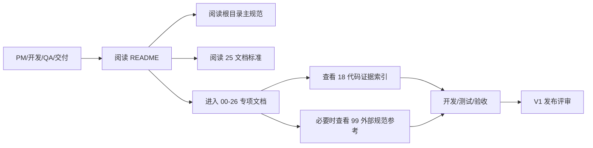
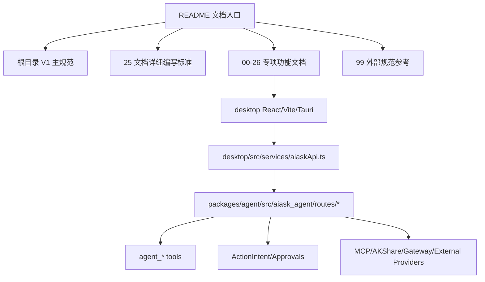

# AIASK 标准化功能规范

日期：2026-06-20
主规范：`../../AIASK项目开发技术规范-V1前端产品化-2026-06-21.md`

本目录用于承接 AIASK 第一版前端产品化的专项功能文档。根目录主规范是 PM、开发、QA 共同评审的权威入口；本目录文档负责把各专项能力继续拆成细节、证据、流程和验收。

## 文档信息

| 项目 | 内容 |
|---|---|
| 项目名称 | AIASK V1 前端产品化 |
| 功能名称 | 标准化功能规范目录入口 |
| 功能编号前缀 | `OPS-DOC` |
| 文档版本 | 1.1.0 |
| 更新日期 | 2026-06-21 |
| 适用范围 | `frontend-screenshots/AIASK标准化功能规范-2026-06-20` 目录下全部 Markdown 文档 |
| V1 状态 | 必做文档入口与治理索引 |
| 主规范 | `../../AIASK项目开发技术规范-V1前端产品化-2026-06-21.md` |
| 代码基准 | `desktop/src/App.tsx`、`desktop/src/views.ts`、`desktop/src/routes.ts`、`desktop/src/services/aiaskApi.ts`、`desktop/src/services/api/*`、`packages/agent/src/aiask_agent/routes/*` |

### 变更记录

| 版本 | 日期 | 变更内容 | 变更人 |
|---|---|---|---|
| 1.0.0 | 2026-06-21 | 建立 V1 前端产品化专项文档索引，明确旧文档、新规范、功能文档和外部参考关系 | Codex |
| 1.1.0 | 2026-06-21 | 按 `25-功能文档详细编写标准.md` 补齐 README 自身的标准化章节、流程、架构、错误和测试规则 | Codex |

### 术语定义

| 术语 | 定义 | 代码/文档证据 |
|---|---|---|
| 主规范 | 根目录权威 V1 前端产品化开发技术规范 | `../../AIASK项目开发技术规范-V1前端产品化-2026-06-21.md` |
| 专项功能文档 | 本目录 `00` 到 `26` 的功能、阶段、证据、矩阵类文档 | 本 README“文档索引” |
| 外部参考 | 联网核验后的成熟技术方案与行业规范输入 | `99-外部规范参考.md` |
| L4 文档 | 达到用户故事、功能分解、流程、状态机、API、组件、错误、测试、代码证据完整度的发布级文档 | `25-功能文档详细编写标准.md` |
| V1 Deferred | 后端或兼容代码可以存在，但第一版前端不作为产品入口展示 | `desktop/src/routes.ts` 的 `V1_DEFERRED_VIEWS` |
| 四工厂 | `strategy-factory`、`factor-factory`、`incubation`、`factory-events` | `desktop/src/routes.ts` 已将其排除出 V1 正向入口 |

## 1. 功能设计

### 1.1 需求背景与价值

AIASK 的功能文档从旧截图、审计、功能说明、开发方案逐步演进而来，信息量大但容易分散。README 的职责不是替代主规范或专项文档，而是让 PM、开发、QA 知道先读什么、每份文档负责什么、哪些能力属于 V1、哪些只是后端事实或 deferred 证据。

| 项目 | 内容 |
|---|---|
| 问题陈述 | 旧文档散落在多个文件中，容易混淆 V1 产品入口、后端能力、mock 证据和待开发事项 |
| 解决方案 | 用 README 作为目录入口，固定阅读顺序、文档索引、代码证据总线、V1 范围锁定和交付验收 |
| 业务价值 | PM 能按范围评审，开发能快速找到落地文档，QA 能找到测试规则和负向边界 |
| V1 状态 | 必做；所有新增/重命名文档必须同步更新 README |

### 1.2 用户故事

| 编号 | 优先级 | 用户故事 | 成功标准 |
|---|---|---|---|
| `OPS-DOC-US-101` | P0 | 作为产品经理，我希望从一个入口看到 V1 文档体系，以便判断发布范围和延期范围 | README 列出主规范、模板、专项文档、外部参考、代码证据和 V1 范围 |
| `OPS-DOC-US-102` | P0 | 作为开发负责人，我希望每份文档都能对应到代码事实，以便安排任务时不依赖猜测 | README 明确 Desktop、Agent、Mock、工具、数据路径 |
| `OPS-DOC-US-103` | P0 | 作为 QA，我希望入口文档直接告诉我哪些文档用于测试和验收，以便按模块执行 | README 指向 `16`、`18`、`25`、`26`、`99` 和各功能文档 |
| `OPS-DOC-US-104` | P0 | 作为交付负责人，我希望四工厂边界在入口处被锁死，以便第一版不出现范围漂移 | README 明确四工厂不展示、不进导航、不进正向页面矩阵 |

### 1.3 功能分解与优先级

| 功能编号 | 功能点 | 优先级 | 当前文档依据 | 待维护事项 | 验收标准 |
|---|---|---|---|---|---|
| `OPS-DOC-F101` | 阅读顺序 | P0 | README“阅读顺序” | 主规范或模板变化时同步 | 新成员能按 1-5 步阅读 |
| `OPS-DOC-F102` | 文档索引 | P0 | README“文档索引” | 新增/重命名文档必须更新 | 目录内全部 MD 均被索引 |
| `OPS-DOC-F103` | 代码证据总线 | P0 | README“当前代码证据总线” | 代码迁移时更新路径 | “已存在”能力能回指路径 |
| `OPS-DOC-F104` | V1 范围锁定 | P0 | README“V1 范围锁定” | 路由/导航变化时复核 | 四工厂不作为 V1 产品入口 |
| `OPS-DOC-F105` | 文档交付验收 | P0 | README“文档交付验收” | 文档标准变化时更新 | 每篇 MD 达到 `25` 定义的 L4 或明确说明文档类型 |

### 1.4 业务规则与边界

| 规则 | 说明 | 文档表现 | 代码/API | 验收 |
|---|---|---|---|---|
| 主规范优先 | 根目录主规范是 V1 权威入口 | README 只做索引和导航 | `AIASK项目开发技术规范-V1前端产品化-2026-06-21.md` | 不与主规范冲突 |
| 代码事实优先 | 文档必须对照当前代码 | 代码证据总线列出路径 | `desktop/src/*`、`packages/agent/src/*` | 路径存在 |
| Desktop 只走 Agent HTTP | 前端不得直连 Python/MCP/manager/数据库 | README 使用规则写明 | `desktop/src/services/aiaskApi.ts` | 文档不鼓励越界调用 |
| V1 四工厂 deferred | 四工厂不作为产品入口 | README 范围锁定明确禁止 | `desktop/src/routes.ts` | 正向入口无四工厂 |
| Secret 不可见 | 只展示 env 名和配置状态 | README 使用规则写明 | settings/data/model/gateway docs | 搜索不到 secret 原值 |
| Mock 不等于 live | mock/e2e 只证明 UI | README 使用规则写明 | `desktop/src/mockApi.ts`、`desktop/e2e/*` | live readiness 另行说明 |

## 2. 流程设计

### 2.1 核心业务流程图



### 2.2 完整用户流程

| 步骤 | 用户操作 | README 行为 | 关联文档/代码 | 状态 | 异常 |
|---|---|---|---|---|---|
| 1 | 打开目录 | 先看到主规范和用途说明 | 本 README | `ready` | README 未更新时标记 stale |
| 2 | 确认范围 | 阅读 V1 范围锁定 | `desktop/src/routes.ts` | `ready` | 四工厂出现正向入口则 blocked |
| 3 | 找功能文档 | 使用文档索引定位编号 | `00` 到 `26` | `success` | 文档缺失则更新索引 |
| 4 | 查代码事实 | 查看当前代码证据总线和 `18` | `desktop/src/*`、`packages/agent/src/*` | `ready` | 路径不存在则修正文档 |
| 5 | 查成熟方案 | 涉及外部生态时进入 `99` | `99-外部规范参考.md` | `ready` | 只有 URL 无采用说明则不合格 |
| 6 | 进入开发/测试 | 按 `25` 的 L4 模板执行 | Desktop/Agent/test | `success` | mock/live 混淆则失败 |

### 2.3 状态机

| 当前状态 | 触发事件 | 目标状态 | README 动作 | 验收动作 |
|---|---|---|---|---|
| `idle` | 新成员进入目录 | `ready` | 提供阅读顺序 | 能找到主规范 |
| `ready` | 新增文档 | `stale` | 更新文档索引 | 全部 MD 被列出 |
| `stale` | 索引更新完成 | `success` | 更新变更记录 | 结构扫描通过 |
| `ready` | 代码路径迁移 | `degraded` | 更新代码证据总线 | 路径核验通过 |
| `degraded` | 路径无法确认 | `blocked` | 标记待核验 | 不写已实现 |
| `ready` | 四工厂被加入入口 | `blocked` | 恢复 deferred 口径 | 正向页面矩阵无四工厂 |
| `ready` | 文档只写“要做什么” | `error` | 指向 `25` L4 标准 | 补用户故事/API/测试 |
| `ready` | mock 被写成 live | `gated` | 标注 mock/live 差异 | live smoke 另列前置条件 |

### 2.4 异常路径

| 异常 | 用户看到什么 | 技术处理 | 验收 |
|---|---|---|---|
| README 未包含新增文档 | 索引缺失 | 更新“文档索引” | 目录内 MD 全部可见 |
| 主规范路径错误 | 无法打开权威文档 | 修正相对路径 | 链接可定位 |
| 代码证据过期 | 文档指向不存在文件 | 用 `rg` 复核并更新 | 路径存在 |
| 四工厂范围漂移 | README 或专项文档把四工厂写成 V1 入口 | 改为 deferred/internal/legacy | `desktop/src/routes.ts` 口径一致 |
| 外部参考缺失 | 找不到成熟技术依据 | 补 `99` 来源和采用原则 | 不是纯 URL |
| 安全门禁缺失 | 高风险动作没有 token/intent/approval | 补 `16` 和专项文档验收 | 负向测试覆盖 |
| mock/live 混淆 | 误以为 e2e mock 等于生产可用 | 标注 mock source | live smoke 单独列 |
| secret 泄露 | 文档出现 key/token 原值 | 删除原值，只留 env 名 | 搜索不到 secret |

## 3. 架构设计

### 3.1 系统全景图



### 3.2 模块职责

| 模块 | 职责 | 不负责 | 代码/文档证据 |
|---|---|---|---|
| README | 文档入口、索引、代码证据总线、V1 范围锁定 | 替代主规范细节 | 本文件 |
| 主规范 | V1 产品化完整开发技术规范 | 每个功能的全部细节 | `../../AIASK项目开发技术规范-V1前端产品化-2026-06-21.md` |
| `25` 模板 | 定义每篇文档必须具备的 L4 结构 | 具体功能实现 | `25-功能文档详细编写标准.md` |
| `99` 参考 | 提供成熟技术方案索引 | 证明 AIASK 已实现某能力 | `99-外部规范参考.md` |
| 功能文档 | 说明某能力的故事、流程、接口、组件、测试 | 变更代码 | `00` 到 `26` |
| Desktop | UI、路由、状态、API client、mock/live 展示 | 直接调用 Python/MCP/manager | `desktop/src/App.tsx`、`views.ts`、`routes.ts`、`aiaskApi.ts` |
| Agent | HTTP routes、工具、意图、审批、连接器、数据 | 暴露 secret 或绕过安全门禁 | `packages/agent/src/aiask_agent/routes/*` |

### 3.3 核心设计决策

| ADR | 问题 | 方案 | 理由 | 验收 |
|---|---|---|---|---|
| `ADR-README-001` | 文档入口是否继续分散 | README 作为本目录唯一索引入口，主规范作为权威入口 | 降低阅读成本 | 新增 MD 同步索引 |
| `ADR-README-002` | 是否把旧文档内容删除 | 不删除，重排并保留原始要求 | 保留审计和开发方案历史 | 专项文档有“原有内容保留” |
| `ADR-README-003` | 文档如何判断代码真实 | 所有已存在结论必须引用路径 | 避免把 mock/后端事实误写成产品完成 | `18` 和 README 证据总线可核验 |
| `ADR-README-004` | V1 是否展示四工厂 | 不展示，统一 deferred/internal/legacy 口径 | 符合 V1 发布范围 | README 和专项文档不提供正向入口 |
| `ADR-README-005` | 外部成熟技术怎么进入文档 | 先进入 `99`，再进入专项文档 ADR/验收 | 防止“想一出是一出” | 来源有采用/不采用/代码/验收 |

## 4. 功能说明：接口与数据

### 4.1 文档索引数据规范

README 不提供运行时 API，但定义本目录索引字段。所有新增文档进入 README 时必须写清以下字段。

| 字段 | 类型 | 必填 | 说明 | 示例 |
|---|---|---|---|---|
| `document_name` | string | 是 | 文件名 | `12-股票雷达.md` |
| `coverage` | string | 是 | 覆盖范围 | 股票雷达 status/candidates/digest/intents |
| `usage` | string | 是 | 使用方式 | V1 独立股票雷达 |
| `v1_status` | string | 是 | 必做/可选/高级/Deferred/Legacy | 必做 |
| `code_evidence` | path list | 建议 | 关键代码路径 | `desktop/src/features/stock-radar/StockRadarWorkspace.tsx` |

### 4.2 接口详细定义

索引条目示例：

```json
{
  "document_name": "24-Connectors统一连接器.md",
  "coverage": "统一连接器 summary/list/detail/test",
  "usage": "连接器",
  "v1_status": "必做",
  "code_evidence": [
    "packages/agent/src/aiask_agent/routes/connectors.py",
    "desktop/src/services/api/integrations.ts"
  ]
}
```

### 4.3 数据与字段设计

| 字段 | 类型 | 是否可空 | 来源 | README 展示 | 规则 |
|---|---|---|---|---|---|
| `document_name` | string | 否 | 文件系统 | 文档索引第一列 | 必须与真实文件名一致 |
| `coverage` | string | 否 | 功能文档摘要 | 覆盖范围 | 不能只写“功能说明” |
| `usage` | string | 否 | PM/开发/QA 使用场景 | 使用方式 | 指向具体开发/验收用途 |
| `code_path` | string | 可选但推荐 | 当前仓库 | 当前代码证据总线 | 写“已存在”时必须提供 |
| `v1_boundary` | string | 否 | 主规范和路由 | V1 范围锁定 | 四工厂必须是 deferred |

## 5. 前端设计

### 5.1 页面路由与结构

| 页面/文档 | view id | route | 当前代码/文档 | V1 状态 | 说明 |
|---|---|---|---|---|---|
| Workbench | `workbench` | `/` | `desktop/src/App.tsx`、`WorkbenchView.tsx` | 必做 | 默认 AI 任务入口 |
| 文档入口 | N/A | N/A | 本 README | 必做 | 功能规范目录导航 |
| 主规范 | N/A | N/A | 根目录主规范 | 必做 | 产品化开发权威规范 |
| 四工厂 | `strategy-factory` 等 | deferred alias | `desktop/src/routes.ts` | Deferred | 不作为 V1 产品入口 |

### 5.2 组件树与状态管理

```text
DocumentationPortal
├── MainSpecLink
├── ReadingOrder
├── UsageRules
├── DocumentIndex
├── CodeEvidenceBus
├── V1ScopeLock
└── DeliveryAcceptance
```

| 组件/文档块 | 职责 | 输入 | 状态 |
|---|---|---|---|
| `MainSpecLink` | 指向根目录主规范 | 主规范路径 | ready/error |
| `ReadingOrder` | 告诉读者先读什么 | 文档体系 | ready/stale |
| `DocumentIndex` | 列出全部 MD | 文件列表 | ready/stale/error |
| `CodeEvidenceBus` | 提供关键代码路径 | 当前仓库 | ready/degraded |
| `V1ScopeLock` | 锁定必做和 deferred | 主规范、`routes.ts` | ready/blocked |
| `DeliveryAcceptance` | 定义文档交付验收 | `25` 模板 | ready/success |

### 5.3 UI 状态说明清单

| 状态 | 文案要求 | 入口要求 | 数据要求 |
|---|---|---|---|
| `loading` | 文档体系整理中 | 暂不作为最终范围 | 标记待更新 |
| `ready` | 文档可用于评审 | 可进入专项文档 | 索引完整 |
| `empty` | 某模块无专项文档 | 需要补文档 | 不写已覆盖 |
| `error` | 链接/路径错误 | 需要修正 | 路径不存在 |
| `degraded` | 代码事实部分缺失 | 标记待核验 | 不写已完成 |
| `gated` | 高风险能力需门禁 | 指向 `16` | token/intent/approval |
| `blocked` | V1 边界冲突 | 不进入发布范围 | 四工厂/实盘等阻断 |
| `stale` | 文档索引落后 | 更新 README | 新文件未索引 |
| `mock` | 仅有 mock 证据 | 不写 live | 标注 mock source |
| `success` | 可进入开发/验收 | 使用对应文档 | L4 结构完整 |

## 6. 开发规范

### 6.1 文档落地路径

| 层 | 必须说明 |
|---|---|
| 主规范 | 根目录 `AIASK项目开发技术规范-V1前端产品化-2026-06-21.md` 是权威来源 |
| 功能文档 | 本目录 `00` 到 `26` 必须遵守 `25` 的 L4 模板 |
| 外部参考 | 成熟技术方案统一进入 `99`，再被专项文档引用 |
| Desktop 证据 | 统一从 `desktop/src/App.tsx`、`views.ts`、`routes.ts`、`services/aiaskApi.ts`、`features/*` 查证 |
| Agent 证据 | 统一从 `packages/agent/src/aiask_agent/routes/*`、`tools/*`、`capabilities.py` 查证 |
| 测试证据 | 统一从 `desktop/src/**/*.test.*`、`desktop/e2e/*`、`packages/agent/tests/*` 查证 |

### 6.2 编码/文档规范

1. 新增或更新 Markdown 时必须同步 README 索引。
2. 写“已实现”必须引用真实代码路径。
3. 写“待开发”必须说明落地文件和验收标准。
4. 不把 mock、类型、兼容 API、后端存在写成 V1 产品完成。
5. 不展示四工厂产品入口。
6. 不展示 secret 原值。
7. 不允许前端文档建议直接调用 Python、MCP、manager 或数据库。

### 6.3 PR/交付验收

| 检查项 | 要求 |
|---|---|
| README 同步 | 新增/重命名/删除文档后更新索引 |
| 标准章节 | 每个 MD 包含 `## 文档信息` 和 1-9 标准章节，或说明文档类型并补齐等价内容 |
| 代码证据 | 已实现结论可由路径核验 |
| V1 边界 | 四工厂不作为正向入口 |
| 外部参考 | 成熟技术来源写清采用/不采用/代码/验收 |

## 7. 错误说明

### 7.1 错误码规范

| 错误码 | 用户提示 | 技术原因 | 处理方案 |
|---|---|---|---|
| `OPS-DOC-README-101` | README 索引缺失 | 目录存在 MD 但未登记 | 补“文档索引” |
| `OPS-DOC-README-201` | 主规范链接不可用 | 相对路径错误或文件不存在 | 修正路径 |
| `OPS-DOC-README-301` | 代码证据失效 | 文件路径迁移或删除 | 重新 `rg` 查证 |
| `OPS-DOC-README-401` | V1 范围冲突 | 四工厂或实盘交易被写成入口 | 改为 deferred/blocked |
| `OPS-DOC-README-501` | 文档标准不达标 | 缺少用户故事、API、状态、错误或测试 | 按 `25` 补齐 |

### 7.2 全局异常处理

| 场景 | 处理 |
|---|---|
| 新增功能文档 | 更新文档索引、阅读顺序或使用规则 |
| 代码路径变化 | 更新代码证据总线和相关专项文档 |
| V1 范围变化 | 先更新根目录主规范，再同步 README 和专项文档 |
| 外部参考变化 | 更新 `99`，再检查引用文档 |
| 发现 secret 原值 | 删除原值并改为 env 名/configured 状态 |

## 8. 功能测试

### 8.1 测试环境与命令

| 类型 | 命令/文件 | 必跑条件 |
|---|---|---|
| 文件索引 | `Get-ChildItem frontend-screenshots/AIASK标准化功能规范-2026-06-20 -Filter *.md` | 更新 README |
| 章节检查 | 检查每个 MD 是否包含 `## 文档信息` 和 1-9 标准章节 | 批量文档更新 |
| 代码路径检查 | `rg -n "desktop/src|packages/agent/src" frontend-screenshots/AIASK标准化功能规范-2026-06-20` | 写代码证据 |
| V1 边界检查 | `rg -n "strategy-factory|factor-factory|incubation|factory-events" frontend-screenshots/AIASK标准化功能规范-2026-06-20` | 涉及四工厂 |
| Markdown diff | `git diff --check` | 提交前 |

### 8.2 测试用例

| 用例编号 | 场景 | 前置条件 | 步骤 | 预期结果 |
|---|---|---|---|---|
| `TC-README-001` | 全部 MD 被索引 | 目录内存在 29 个 MD | 对照文件列表和 README 索引 | 每个文档都有入口 |
| `TC-README-002` | 标准章节完整 | 批量更新文档 | 运行章节扫描 | 不缺 `## 文档信息` 和 1-9 章节 |
| `TC-README-003` | 主规范可定位 | 打开 README | 检查主规范路径 | 指向根目录主规范 |
| `TC-README-004` | 四工厂负向 | 文档提到四工厂 | 检查上下文 | 只作为 deferred/internal/legacy，不作为 V1 入口 |
| `TC-README-005` | 代码证据真实 | README 写代码路径 | 文件系统或 `rg` 验证 | 路径存在 |

### 8.3 通过标准

| 等级 | 标准 | 是否合格 |
|---|---|---|
| L0 | README 只有文件列表 | 不合格 |
| L1 | 有文件列表和简单说明 | 不合格 |
| L2 | 有阅读顺序和范围说明 | 可读但不足以交付 |
| L3 | 有索引、代码证据、V1 边界和交付验收 | 基础合格 |
| L4 | 同时具备文档信息、用户故事、流程、架构、数据字段、维护规则、错误和测试 | V1 发布级 |

## 9. 不做什么

1. 不把 README 当成主规范替代品。
2. 不删除旧文档要求；已重排内容继续保留在专项文档中。
3. 不把四工厂作为 V1 前端产品入口。
4. 不把 mock/e2e 证据当作 live provider 或生产可用。
5. 不展示 secret 原值。
6. 不允许前端越过 Agent HTTP 直接调用 Python、MCP、manager 或数据库。
7. 不把外部成熟技术链接直接写成 AIASK 已实现事实。

## 10. 当前实码审计与阅读方法补强

### 10.1 这批文档现在如何证明“看过代码”

| 证据 | 已纳入文档的位置 | 说明 |
|---|---|---|
| `desktop/package.json` | `00`、`18`、`99` | 确认 React/Vite/Tauri/Vitest/Playwright/TanStack/Lightweight Charts 现有栈 |
| `desktop/src/App.tsx` | `00`、`18`、各页面文档 | 确认 lazy renderer 和页面挂载 |
| `desktop/src/views.ts` | `00`、`15`、`18` | 确认 V1 导航/registry |
| `desktop/src/routes.ts` | `00`、`15`、`16`、`18`、`README` | 确认四工厂 deferred fallback |
| `desktop/src/v1Scope.ts` | `05`、`16`、`18` | 确认 deferred factory tools 过滤 |
| `desktop/src/services/aiaskApi.ts`、`desktop/src/services/api/*` | 各功能文档 | 确认 Desktop 只走 Agent HTTP |
| `packages/agent/src/aiask_agent/routes/*` | 各功能文档 | 确认 Agent endpoint |
| `desktop/src/**/*.test.*`、`desktop/e2e/capabilities.spec.ts` | 各功能测试章节 | 确认 mock/live/负向验收入口 |

### 10.2 这批文档现在如何证明“做过联网成熟方案核验”

| 资料类型 | 文档入口 | 使用方式 |
|---|---|---|
| OpenAI Tools/Conversation State | `99-外部规范参考.md`、`01`、`05`、`06` | 工作台、工具证据、会话恢复 |
| MCP 官方 | `99`、`03`、`24` | MCP servers/tools/resources/prompts/OAuth 分层 |
| OpenAPI/JSON Schema/FastAPI/Pydantic | `99`、`25`、各接口章节 | endpoint、schema、payload、错误 |
| OWASP/RFC 9457/Tauri Security | `99`、`16`、`19` | token、redaction、Problem Details、本地能力边界 |
| React/React Router/Vite/Vitest/Playwright/Testing Library | `99`、`00`、`25` | 前端栈、路由、测试分层 |
| TanStack/Lightweight Charts/AKShare/Tushare | `99`、`09`、`13`、`22` | 表格/图表/金融数据质量 |

### 10.3 评审时不要只读第一段

每篇文档的 `## 10. 代码实证与成熟实现补强` 是这次补强后的核心阅读区。新增的 `## 11. 前端页面设计与布局细化` 是页面落地阅读区：PM 看页面区域和用户状态，开发看组件树和控件，QA 看响应式和异常态。前面的 1-9 章提供标准结构，后面的“原有内容保留”保留历史要求和更长的旧方案。

### 10.4 前端设计阅读索引

| 文档 | 页面设计重点 | 代码入口 |
|---|---|---|
| `01` | Workbench 三栏、输入区、消息流、Inspector 证据 | `desktop/src/components/WorkbenchView.tsx` |
| `02` | 模型配置表单、provider pool、模型列表、smoke 结果 | `desktop/src/features/models/ModelsWorkspace.tsx` |
| `03` | MCP servers/tools/resources/prompts/OAuth tabs 和连接器详情 | `desktop/src/features/agent-pages/McpConnectorsPage.tsx` |
| `04` | Skills/Plugins 双区、生命周期卡、命令/工具测试 | `desktop/src/features/agent-pages/PluginsSkillsPage.tsx` |
| `05` | 工具目录、意图队列、审批队列、schema 详情 | `desktop/src/features/agent-pages/ToolsIntentsApprovalsPage.tsx` |
| `06` | Sessions/Runs/Artifacts master-detail 和事件时间线 | `desktop/src/features/agent-pages/*Page.tsx` |
| `08` | Gateway 平台、消息、目录、Webhooks 审批链路 | `desktop/src/features/agent-pages/GatewayPage.tsx` |
| `09-13` | 数据源、数据同步、自动化、雷达、市场温度的表单/表格/图表 | `desktop/src/features/settings`、`desktop/src/features/data`、`desktop/src/features/stock-radar` |
| `15/22/23` | 金融枢纽、量化研究、金融经理台和 broker 只读 | `desktop/src/features/workspace`、`desktop/src/features/quant`、`desktop/src/features/financial-manager` |
| `16/20/21/24` | 安全、Readiness、Learning/RL、Connectors 的矩阵/诊断/详情 | `desktop/src/features/settings`、`desktop/src/features/agent-pages`、`desktop/src/features/connectors` |

阅读专项文档时，先看 `## 11` 判断页面是否能被设计和验收，再回到 `## 4` 和 `## 10` 对齐接口与代码证据。

## 原有内容保留

## 阅读顺序

1. 先读根目录 `AIASK项目开发技术规范-V1前端产品化-2026-06-21.md`，确认 V1 范围、技术栈、四工厂边界、架构、API、错误和测试标准。
2. 再读本目录 `25-功能文档详细编写标准.md`，确认后续功能文档必须采用的模板。
3. 按功能阅读 `01` 到 `24` 的专项文档。
4. 涉及外部平台、MCP、模型、金融数据源时，同时阅读 `99-外部规范参考.md`。
5. 开发前查看 `18-代码证据索引.md`，避免把旧方案、mock 或后端存在误写成已完成前端产品。

## 使用规则

1. 开发任何功能前，先阅读主规范和对应专项文档。
2. 前端只能通过 `desktop/src/services/aiaskApi.ts` 和 `desktop/src/services/api/*` 调用 Agent HTTP。
3. 模型可见工具必须是 `agent_*` facade，不暴露 AKShare manager 原始名称。
4. 写入、外部投递、插件变更、MCP 变更、终端/文件/浏览器、金融风险动作必须有 control token、确认、ActionIntent、approval 或明确 blocked 状态。
5. 第一版前端不展示 Strategy Factory、Factor Factory、Incubation Factory、Factory Events 四个工厂产品入口；相关后端事实只能作为 deferred/legacy/internal 证据保留。
6. 每个页面都要覆盖 loading、empty、error、degraded、gated、blocked、stale、mock、success 状态。
7. Mock/e2e 通过不等于 live provider、live MCP、live 数据源或外部平台生产可用。
8. Secret 只能展示 configured/missing/expired/env name，不展示真实值。

## 文档索引

| 文档 | 覆盖范围 | 使用方式 |
|---|---|---|
| `00-项目完整功能总览.md` | 全项目能力分层、V1 范围、四工厂边界 | PM 范围确认 |
| `01-AI对话与任务工作台.md` | 对话、新建、上传/引用、历史、归档、运行事件、工具调用 | Workbench 开发与验收 |
| `02-模型配置与LLM可用性.md` | provider、官方直连、中转商、模型列表、smoke test、信号灯 | 模型配置和发送前预检 |
| `03-MCP服务管理.md` | 内置股票 MCP、添加、发现、资源、Prompt、OAuth、测试 | MCP 页面和集成验收 |
| `04-Skills与Plugins管理.md` | 内置 skills、安装、更新、删除、插件工具测试 | 插件/技能生命周期 |
| `05-Agent工具与Hermes能力.md` | `agent_*` 工具、文件/代码/终端/浏览器/多模态、full mode | 工具目录与高权限边界 |
| `06-会话历史归档与运行事件.md` | sessions、runs、events、artifacts、sources、undo/archive | 运行证据链 |
| `07-记忆与个人能力.md` | 画像、习惯、标签、记忆、搜索、数据导出/删除 | 用户数据与学习边界 |
| `08-应用联动Gateway与Webhooks.md` | 飞书、Discord、Home Assistant、Webhook、外部投递 | 外部平台投递和审批 |
| `09-股票数据源配置与测试.md` | AKShare、Tushare、TDX/TQCenter、免费/付费、信号灯 | 数据源配置与 redaction |
| `10-数据库状态与数据同步.md` | SQLite、freshness、sync plan、同步按钮和降级 | 数据新鲜度和同步计划 |
| `11-自动化盯盘与任务处理.md` | jobs、cron、盯盘、任务运行历史、审批 | 自动化任务 |
| `12-股票雷达.md` | status、candidates、digest、run/push/schedule intents | V1 独立股票雷达 |
| `13-热力图与市场温度.md` | 市场温度、行业冷热、前向验证、热力图前端表达 | 市场概览 |
| `14-金融联动右侧扩展栏.md` | AI 对话右侧上下文、金融证据、该显示/不该显示 | Workbench 右侧证据 |
| `15-金融工作台.md` | 金融实验室、Financial Manager、Quant、Broker read-only | 金融主流程 |
| `16-安全门禁与验收矩阵.md` | token、ActionIntent、approval、测试与发布验收 | 安全验收 |
| `17-旧文档要求映射与开发阶段.md` | 旧 10 份文档要求映射、P0-P7 开发阶段 | 保留旧要求 |
| `18-代码证据索引.md` | Desktop、Agent、AKShare MCP 代码证据索引 | 开发前查证 |
| `19-Native文件代码终端浏览器能力.md` | 文件、代码、终端、浏览器、网页和多模态 native 能力 | full mode/native 能力边界 |
| `20-Readiness健康诊断与运维.md` | health、Hermes readiness、capability parity、运维状态 | 交付诊断 |
| `21-Learning-RL-MoA学习能力.md` | 学习循环、技能反思、MoA、RL/Atropos | 学习/RL 高级能力 |
| `22-量化研究与报告.md` | Quant Research presets、research runs、reports | 量化研究 |
| `23-FinancialManager与Broker只读.md` | Financial Manager、券商只读、交易风险边界 | 金融经理台与 broker |
| `24-Connectors统一连接器.md` | 统一连接器 summary/list/detail/test | 连接器 |
| `25-功能文档详细编写标准.md` | AIASK 专项功能文档模板和 L4 发布级标准 | 后续文档必须遵守 |
| `26-问题到技术方案全局矩阵.md` | 产品问题到技术方案、代码落点、验收规则的全局映射 | 问题驱动排期 |
| `99-外部规范参考.md` | 联网检索的官方/行业参考源、采用原则、不采用内容、验收影响 | 成熟技术方案依据 |

## 当前代码证据总线

| 层 | 代码路径 | 说明 |
|---|---|---|
| Desktop 前端 | `desktop/` | React/Vite/Tauri 前端 |
| 前端入口 | `desktop/src/App.tsx` | lazy renderer、全局状态、页面挂载 |
| 页面注册 | `desktop/src/views.ts` | view registry、导航分组 |
| 路由规则 | `desktop/src/routes.ts` | route/view 映射、V1 deferred views |
| API 客户端 | `desktop/src/services/aiaskApi.ts` | Desktop 唯一 Agent HTTP 聚合入口 |
| API 分模块 | `desktop/src/services/api/*` | AI、workbench、finance、integrations、desktop state 等 |
| Mock | `desktop/src/mockApi.ts`、`desktop/src/mock/*` | mock/live UX 和 e2e fixture |
| Agent 路由 | `packages/agent/src/aiask_agent/routes/*` | Desktop-facing HTTP contracts |
| Agent 工具 | `packages/agent/src/aiask_agent/tools/catalog.py`、`packages/agent/src/aiask_agent/tool_registry.py` | `agent_*` 工具目录与注册 |
| Agent 能力映射 | `packages/agent/src/aiask_agent/capabilities.py` | Hermes/reference 到 AIASK 能力映射 |
| AKShare MCP | `packages/akshare-mcp/src/akshare_mcp/server.py`、`packages/akshare-mcp/src/akshare_mcp/tools/*` | 金融数据和 MCP 能力 |
| 数据与同步 | `packages/akshare-mcp/src/akshare_mcp/tools/db_freshness.py`、`packages/akshare-mcp/src/akshare_mcp/tools/data_sync.py` | 数据库新鲜度和同步 |

## V1 范围锁定

V1 产品前端必须保留：

- Workbench 工作台。
- Models 模型配置。
- Sessions / Runs / Artifacts / Sources。
- Tools / Intents / Approvals。
- MCP / Connectors。
- Plugins / Skills。
- Gateway / Webhooks。
- Data / Sync / Stock Data Sources。
- Market Temperature。
- Stock Radar。
- Financial Manager。
- Quant Research。
- Broker read-only。
- Automation / Jobs / Workflows。
- Readiness / Health / Settings / Mode。
- User / Memory / Learning / RL / Extensions 的基础可发现路径。

V1 产品前端不展示：

- 不展示 Strategy Factory。
- 不展示 Factor Factory。
- 不展示 Incubation Factory。
- 不展示 Factory Events。

这四类可以作为后端兼容、mock、legacy diagnostic 或 deferred 证据存在，但不得成为 V1 导航、卡片、快捷入口、主流程按钮、readiness 跳转或 e2e 正向页面矩阵。

## 文档交付验收

1. 新增或更新功能文档必须符合 `25-功能文档详细编写标准.md`。
2. 所有“已实现”都必须引用代码路径。
3. 所有“待开发”都必须写清落地文件和验收标准。
4. 所有外部生态方案必须能在 `99-外部规范参考.md` 找到来源或补充来源。
5. 四工厂相关内容必须标记 V1 deferred/legacy/internal。
6. README 必须随着文档新增或重命名同步更新。
