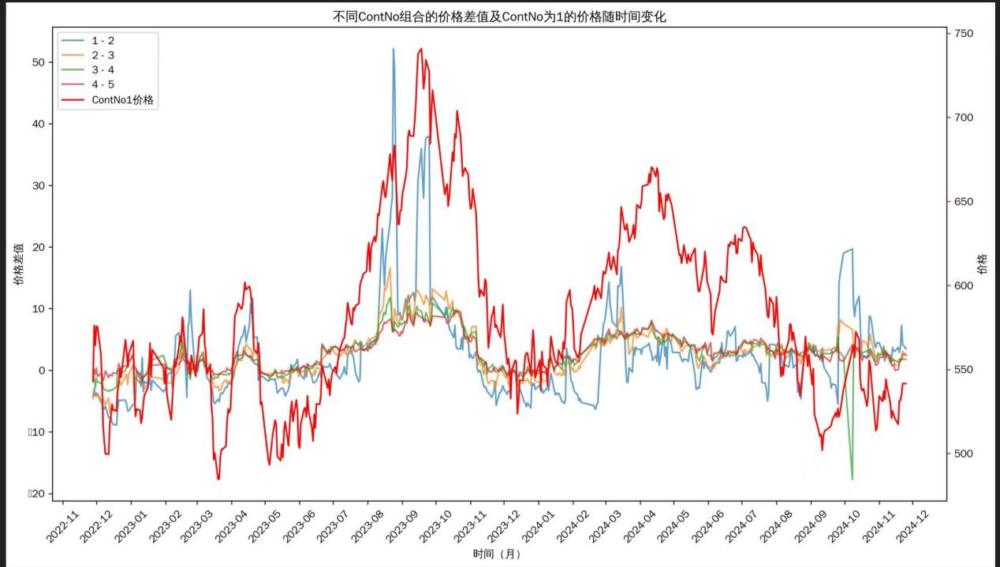

# 原油跨月价差交易备忘

## 研究目标
通过对历史行情的分析找到规律从而找到合适的交易品种

## 选品原则
- 有较长的历史行情或可以借鉴的相关性高的品种
- 有比较明确的“规律”如下：
- 比较稳定的生贴水结构：排除一些季节性品种、交割不连续合约，这类品种不是不能做而是要更多的考虑强弱月的关系。
- 比较明确的价格与价差间关系：例如行情上涨、下跌时价差波动的方向和幅度
- 对时间的理解：例如ec交易对时间的把握及交割时交割对期现价差的影响等，如股指有分红月等一些对价差产生一些除行情波动外的一些方向性的影响

## SC 案例说明

- 上图中，红色线为sc主力连、其他线依次为sc1-2、sc2-3...这里的1、2不是月份而是第一合约-第二合约，那么每个月都会有sc2-3变sc1-2，sc3-4变sc2-3的过程，这么显示与我们日常交易的价差不同，是为了更好的表现趋势和升贴水的变化。

### 图中观察
- 单边价格变化>价差变化且同向
- Sc1-2>Sc2-3>Sc3-4...且同向
- Sc1-2（蓝线）我们从图中看到的价格波动在每一次月份变更时的波动是由合约转换导致，24次换月统计中有17次由贴水转升水，可以中中找到的规律：在没有趋势行情下越靠近交割升水越明显，但升水幅度有限。
- Sc1-2（蓝线）随单边价格上涨时贴水幅度扩大，且贴水幅度远大于上面所讲的升水幅度变化。
- 由上面几点我们可以看出日常交易，喜欢卖近买远的原因是因为回归次数多，但一旦出现趋势上涨行情时风险很大。
- 利用上面的特征把握交易机会的选择，收益来源应该从趋势和波动两方面考虑，并制定相应的交易策略

## 交易策略
### 趋势策略
- 优先捕捉上涨趋势，可以交易的策略为
- 单边交易：价格相对较低波动率低、无明显下跌趋势下，少量单边交易第3、4个月份的合约，收益来源平均月均差带来的carry收益+单边上涨收益+极端趋势行情下贴水转升水，如平均月均差在5个点，那么在全年现货价格不变的情况下收益=月均差*12，这里要考虑到上面所提到的17次进入现货月前时转升水的过程，因此在没有明确上涨的行情下需要提前换月，也就是03、04合约持仓在变成01前进行移仓。
- 单边行情需要对品种有一定方向性理解和判断和稳定的贴水结构

### 套利策略
- 通过对历史行情的统计（附件）
- 我们看到各分页里各合约组合下1%、25%、75%、90%几列的统计，我们可以从中看到的过程是如果用sc3-4，25%均线位置建仓（0.5），在不移仓的情况下最大风险为变成Sc1-2的1%位置（-7.6），如果平仓可参考sc2-3（4.4）。
- 结论，如图越远的组合波动越小，合理的贴水价格入场价位风险越小，越远间隔组合越容易获得价差的收益回测比越小（可观察各组合下1%和99%对比）
- 那么最优的买近抛远组合为在没有出现极端近月升水的行情下（大涨之后的回归行情）03/04-越远的合约平水位置越安全，这样当合约将变成01前只需要把前合约单独换月后合约继续持仓就好。
- 原油远期合约开口大且不容易成交，建仓过程缓慢，但这类持仓的风险和收益比合适，适合慢慢建仓等时间临近时提前换月，而且合约为连续合约，这样可以分布在各月份分布建仓，随着时间临近还可以做些细微的波动来扩大收益，另外在该持仓下还可以做少量Sc1-2、Sc2-3的反向波动交易
- 收益为carry+波动

## 风险与收益
- 单边下跌风险+现货持续低迷时贴水转升水风险
- 收益为carry+波动
- 原油宝事件，现货极度下跌。

## 可类比品种
- 铁矿石、pb
- 股指（需考虑分红月1、9）集运（交割差价计算）
- 有色（需贴水稳定且月均差有一定carry）

## AI 调用提示
- 这份文档适合作为 `research` 类型写入 `market_documents`，并在 chunk metadata 中标记 `strategy_framework`。
- 若要做策略工厂检索，优先把 `交易策略` 与 `风险与收益` 两段拆成独立 chunk，以提升查询命中率。
