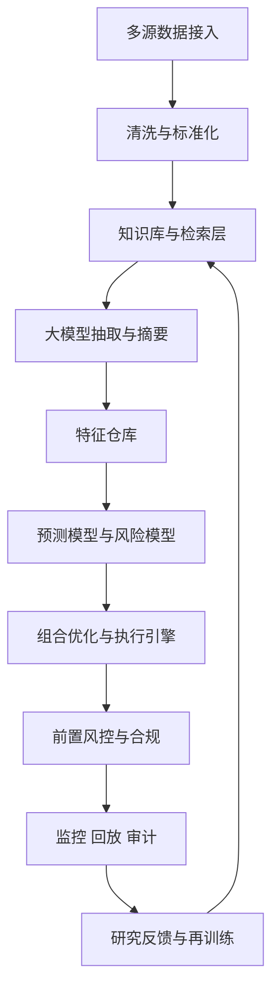

# 大模型 AI 提升量化交易能力研究报告（扩展版）

## 摘要
本文基于公开学术论文、监管机构报告、行业组织材料、金融机构与开源项目资料，对“如何利用大模型 AI 提升量化交易能力”进行系统分析。核心结论是：大模型最可靠的价值并非替代整套量化框架，而是充当“非结构化信息处理与研究增效基础设施”，在新闻、财报、电话会、监管文本、研报、社媒和另类数据中提取可交易信号，并通过事件驱动策略、中低频基本面增强、风险解释与研究自动化转化为投资收益。对于高频交易，大模型受制于推理延迟、稳定性和确定性，通常不适合进入微秒级热路径；对于中频事件驱动和低频基本面量化，其语义理解、长文本建模、跨文档对齐、跨语言迁移和小样本抽取能力更具现实价值。本文也强调，大模型若要形成真实交易优势，必须嵌入严格的数据时间戳治理、样本外验证、交易成本建模、容量约束、模型降级和独立硬风控体系之中。

## 1. 研究结论摘要
第一，大模型最适合解决量化体系中长期未被充分利用的“非结构化信息问题”，尤其是文本密集、语义复杂、更新频繁、难以靠规则库维护的任务。第二，大模型最可能形成交易价值的场景不是高频盘口预测，而是新闻事件、财报电话会、政策冲击、信用风险和产业链传导等中低频场景。第三，大模型更常作为“信息层”和“研究层”发挥作用：负责摘要、抽取、分类、比较、问答、知识压缩与标签生成；真正的收益预测、仓位控制、成本优化、订单执行和硬风控仍应由传统统计模型、机器学习模型、优化器和规则引擎完成。第四，若只看 NLP benchmark、情绪分类准确率或人工阅读体验，而不看成本后收益、容量、延迟、样本外表现和实盘偏离，就极易出现“模型看起来非常聪明，但实盘没有收益”的假象。第五，实务上更可行的工程路线通常是“大模型离线生成高质量标签和表征，小模型或传统模型在线推理与执行”。

## 2. 大模型在量化交易中的基本原理
### 2.1 LLM：金融文本的通用语义引擎
LLM 的核心能力不在于直接预测价格，而在于把复杂文本映射为语义表征。对量化研究来说，这意味着它能把新闻、财报、电话会、招股书、监管公告、分析师研报、社媒讨论等来源，统一转化为结构化信息，例如事件类型、情绪方向、影响对象、置信度、时效期限、潜在传导路径、管理层措辞变化、风险主题暴露等。与传统金融 NLP 相比，LLM 不必过度依赖固定词典、模板规则或任务专属标签体系，能够通过上下文理解否定、转折、隐含表达、多主体关系和跨段落逻辑。

### 2.2 多模态模型：把表格、图像、PDF 和文本一起理解
多模态模型在量化中的价值主要体现在“原始材料复杂但信息密度高”的场景，例如财报 PDF 中的表格和图表、电话会演示文稿、行业白皮书、航运图像、卫星图、仓储图片、商品库存照片、政府公告扫描件等。它们可以帮助提取图文不一致、图表趋势、文本未直接写出的业务变化，尤其适合另类数据研究与基本面扩展。但这类应用对数据清洗、标注、解析和验证要求更高，目前公开可验证的成熟交易案例少于纯文本方向，因此更适合被视为“潜力方向”而非已普遍验证的稳健 alpha 来源。

### 2.3 时间序列基础模型：预训练思想向价格序列迁移
TimeGPT、TimesFM、Chronos 等时间序列基础模型试图把语言模型中的“大规模预训练 + 下游迁移”思想迁移到时间序列上。理论上，这类模型可用于收益、波动率、交易量、流动性状态、宏观 nowcasting 和多资产协同预测，并在小样本场景中提供更好的初始化或泛化能力。但金融时间序列不同于一般工业时序：它信噪比极低、非平稳、存在市场反馈与行为适应，且可交易 alpha 极易被套利消耗。因此，时间序列基础模型值得跟踪，但目前更合理的定位是“候选增强器”，而不是已被证明能系统替代强基线时序模型的通用方案。

## 3. 与传统量化方法的核心差异
传统统计模型擅长结构清晰、可解释性强、样本效率高的任务，例如波动率建模、风险估计、因子暴露分解和资产协整关系分析；传统表格型机器学习在结构化特征上通常更强，训练与部署成本更低，线上稳定性也更高；规则引擎则仍是交易执行和硬风控中最可靠的部分。大模型的不同之处在于，它更像一个跨任务的“信息压缩器”和“语义中间层”，擅长把难以手工结构化的信息变成可被量化系统进一步利用的特征。真正有效的架构通常不是“用大模型替代旧系统”，而是把大模型置于旧系统上游，扩大研究信息集和标签质量，再由成熟的量化栈完成预测、优化和交易闭环。

## 4. 大模型可提升量化能力的关键环节
### 4.1 研究环节：最确定、最先见效的价值来源
研究环节是大模型最容易产生 ROI 的地方。它可以自动归纳新闻流、比较不同卖方研报的观点差异、从多季电话会中识别管理层语气变迁、辅助研究员构思新因子、自动生成 SQL/Python 框架、做实验记录整理和失败原因归纳。这里的价值不一定直接表现为单个策略收益提高，而常常表现为研究吞吐量、覆盖面、迭代速度和假设生成效率显著提升。对于量化团队而言，这种“研究生产率提升”往往比单个模型在回测中多出几个基点更稳定、更容易复利。

### 4.2 信号生成：从文本世界到因子世界的映射
大模型最重要的可交易功能，是把复杂文本转成因子。典型信号包括新闻情绪分数、事件严重性、管理层指引变化、诉讼与监管风险标签、供应链冲击映射、政策受益/受损行业归类、文本 surprise、语气变化因子、财报问答中的防御性措辞、ESG/治理事件抽取等。其优势不是简单“判断正负面”，而是把文本放在具体资产、行业和市场环境下理解，从而推断其对未来现金流、风险溢价和市场预期修正的影响。

### 4.3 事件驱动交易：最可能直接形成 alpha 的方向之一
在财报发布、电话会、并购公告、产品审批、监管处罚、重大诉讼、地缘冲突、宏观政策解读等事件中，信息往往先以文本形式出现，且市场对其定价存在速度和深度差异。如果大模型能够比传统关键词系统更快抽取“事件类型—影响对象—影响方向—影响期限—传导路径”，就有可能形成日内到数日的事件驱动优势。公开研究支持“大模型对金融新闻和电话会文本的语义抽取优于部分传统情绪方法”的方向，但这类优势是否持续，需要进一步考虑市场拥挤、信息扩散速度、交易成本和容量约束。

### 4.4 组合管理与风控辅助：更适合解释层，而非最终决策层
在组合管理上，大模型可用于聚合组合持仓的主题暴露、解释异常回撤、识别同一风险在不同资产上的共振、自动生成情景分析与投资备忘录；在风控上，大模型可自动阅读监管公告、公司突发事件、诉讼和评级变动，辅助风险经理识别“模型未显式纳入但值得警惕”的外生风险。需要强调的是，这些应用最适合作为解释与发现工具，而不是单独承担硬风控职责，因为硬风控需要的是确定性、低延迟、可追责和可审计的规则体系。

## 5. 大模型在量化中的具体优势及其形成交易优势的机制
### 5.1 新闻、财报、研报、公告中的优势
传统 NLP 方法在金融文本里常被否定、双重含义、跨句依赖和行业语境打败，例如“营收超预期但全年利润指引下调”“监管调查主要影响非核心业务”“看似利好但现金流前景变差”等。大模型更擅长捕捉这些条件化语义，因此其输出更接近投资者真正关心的变量：未来盈利修正、资本开支变化、定价权变化、需求拐点和风险溢价上升。只有当文本信号与这些经济机制建立连接时，文本理解优势才有机会转化为交易优势。

### 5.2 跨市场信息整合优势
金融市场中，很多可交易机会并不来自一条单独新闻，而来自“这个信息会如何通过产业链、地区、资产类别和风险偏好传导”。例如，一项出口管制政策可能先影响半导体设备商，再影响下游制造商，最终映射到汇率、商品和信用利差。大模型能够在跨文档、跨语种、跨市场语境中建立这种传导关系，因此特别适合宏观主题、跨资产策略和行业链条研究。

### 5.3 它更常产生“信息处理优势”，而不一定直接产生长期独占 alpha
从公开研究和机构实践看，大模型更确定的优势是提高信息处理速度、覆盖面和研究一致性。至于是否形成可持续 alpha，需要满足几个条件：信息具有新颖性；市场尚未完全有效吸收；模型输出足够稳定；交易成本和容量可接受；回测设计不存在泄漏或幸存者偏差。因此，对多数机构而言，大模型的直接价值更偏向“增强研究—改进特征—辅助决策”，而不是“独立预测机器”。

## 6. 特点、局限与风险
### 6.1 主要特点
大模型在金融场景的突出特点包括：对非结构化数据的天然适配；对长文本和多文档的上下文理解；较好的零样本和小样本能力；通过 prompt 或少量微调快速切换任务；可将问答、摘要、分类、抽取、比较统一到一个接口中；在跨语言和跨区域信息处理上具有更强迁移能力。这些特点解释了为什么它在投研环节提升明显。

### 6.2 主要局限
首先是幻觉和格式漂移，模型可能生成看似合理但实际上不成立的事件解释。其次是时效性，如果不接入外部实时数据，模型的知识会过期。第三是评估陷阱，包括新闻发布时间戳错误、使用事后修订文本、训练测试交叉污染、prompt 泄漏和标签构造偏差。第四是线上部署问题：延迟高、成本高、版本漂移、稳定性不足。第五是经济学问题：即使模型在文本分类上表现更好，也不代表收益更高，因为 alpha 可能被成本、拥挤和容量限制吞噬。第六是治理问题：模型输出难以像规则系统那样精确审计，需要建立版本控制、回放机制和人工复核边界。

### 6.3 高频、中频、低频的适用性差异
在高频交易中，大模型通常只适合做研究、复盘、日志解释、新闻预警标签和离线特征工程，不适合进入微秒级订单决策与风控热路径。在中频交易中，大模型最有希望形成交易价值，尤其是事件驱动、新闻反应、财报解读、政策冲击和跨市场主题传导。在低频和基本面量化中，大模型的价值最稳健，适合用于年报、季报、电话会、研报、监管文件、治理和 ESG 等文本密集型任务，成为基本面因子的补充来源。

## 7. 可执行的系统落地架构
### 7.1 数据层设计
系统应统一接入结构化和非结构化数据：价格与成交、订单簿、新闻、公告、财报、电话会、监管文件、卖方研报、社媒、替代数据。所有文本类数据必须保留首次可见时间戳、来源标识、原始内容、修订版本和实体映射，以保证因果时间顺序正确。对外部数据供应商，需要做去重、延迟质量评估和覆盖一致性评估。

### 7.2 预处理与知识层
预处理包括 OCR/PDF 解析、转录纠错、语言检测与翻译、段落切分、表格提取、图表解析、命名实体识别、ticker 映射、知识图谱构建和向量索引。知识层的目标不是仅做一个聊天机器人，而是建立可检索、可追溯、可版本化的研究语料库，使大模型在推理时能基于真实材料而非纯参数记忆输出结论。

### 7.3 大模型理解层
这一层负责摘要、问答、事件抽取、情绪与立场识别、关系抽取、风险标签、主题聚类、embedding 生成和文本比较。工程上应优先约束输出结构，例如强制输出 JSON 字段：event_type、entities、direction、confidence、time_horizon、evidence_spans、requires_human_review。这样做的目的，是让模型从“自然语言助手”转变为“受约束的信息抽取组件”。

### 7.4 特征工程与建模层
大模型输出并不直接等于可交易信号，必须与价格、成交量、波动率、基本面、因子暴露、宏观变量、流动性和历史事件样本进行融合。典型方式包括：把大模型输出作为分类特征或 embedding 特征，输入到 XGBoost、线性因子模型、事件收益模型或风险模型中；或使用大模型离线标注训练样本，再蒸馏出更轻量的线上分类器。这里的核心原则是让大模型提供“高质量信息表征”，而不是让其单独承担全部预测任务。

### 7.5 回测、评估与上线层
回测必须严格采用时间顺序切分，并对每类数据使用真实发布时间；应当加入交易成本、滑点、冲击成本、成交不确定性和容量约束。上线前至少应经历离线回测、事件回放、paper trading、shadow mode、小资金实盘和监控稳定性测试。若模型在文本任务上有改进但对成本后收益无增益，应当果断判定为“研究价值存在、交易价值不足”，而非继续自我强化叙事。

### 7.6 生产风控与治理层
生产环境中，大模型必须被置于硬边界之内：订单风控、账户风控、头寸限制、价格带、合规规则和 kill switch 都不能依赖 LLM 的主观输出。需要建立 prompt 版本管理、模型版本登记、灰度发布、回滚机制、异常输出检测、漂移监控、人工审批阈值和证据链保存。对面向监管的业务，还应能追溯模型当时看到的原始文本、输出结果和下游决策路径。

## 8. 评估与验证：如何证明大模型真的创造了价值
应把评估分为三层。第一层是 NLP 层，关注抽取准确率、分类 F1、摘要覆盖度和人工一致性；第二层是信号层，关注 IC、Rank IC、事件窗口超额收益、命中率、半衰期、分层收益和跨市场稳定性；第三层是交易层，关注 Sharpe、信息比率、最大回撤、换手率、容量、成本后收益、实盘偏离、线上延迟与稳定性。只有第三层改善，才说明模型带来了可兑现的交易价值。为避免“聪明但不赚钱”的问题，必须设置强基线比较：无文本基线、传统 NLP 基线、仅 LLM 文本信号、LLM 与传统因子融合。还应进行消融实验，验证收益是否真的来自模型的语义理解，而不是来自样本选择、幸存者偏差或时间戳错误。

## 9. 公开研究、监管材料与行业实践的可验证结论
从学术方向看，BloombergGPT 说明金融领域预训练能改善金融 NLP 任务表现；FinGPT 展示了开源金融 LLM 的工程路径；Lopez-Lira 与 Tang 关于 ChatGPT 预测新闻后股票表现的研究，推动了“LLM 可能包含可交易新闻语义优势”的讨论；后续关于预期收益、新闻情绪和电话会文本的研究，大多支持“LLM 对文本信号提取优于部分传统方法”的方向，但对长期稳定 alpha 的证据仍然有限。从监管与行业角度看，IOSCO、CFA Institute 以及美国政策机构的公开材料都承认 AI/ML 已被广泛用于投资研究、算法交易辅助、情绪分析、风控和市场监控，同时也强调模型风险、治理、偏差、透明度和市场稳定性问题。换句话说，“大模型有用”已基本成立，但“如何以可审计、可持续、可交易的方式真正落地”仍是核心难题。

## 10. 应用矩阵：按频率 × 职能划分
| 频率/职能 | 研究 | 交易 | 风控 |
|---|---|---|---|
| 高频 HFT | 适合做日志总结、策略复盘、新闻标签、代码辅助、异常解释 | 不适合进入微秒级热路径；可做离线新闻预警和盘后信号研究 | 适合合规文本分析和异常归因，不适合作为唯一前置风控 |
| 中频（日内至数日） | 非常适合事件研究、新闻归因、财报与电话会比较、跨市场主题挖掘 | 最有潜力形成 alpha，尤其适合事件驱动、政策冲击、新闻反应、行业传导 | 适合组合事件暴露扫描、情景分析、模型失效解释 |
| 低频（周至季度） | 最适合长文本研究、基本面标签、治理质量、研报整理、行业知识库建设 | 适合主题投资、基本面增强、质量因子和长期风险识别 | 适合持仓基本面恶化预警、政策与监管暴露跟踪、主题集中度解释 |

## 11. 参考文献与资料清单（按类别）
### 11.1 学术论文
1. Wu et al., BloombergGPT: A Large Language Model for Finance, 2023。金融领域大模型代表性论文，证明金融预训练可提升金融 NLP 表现。
2. Yang et al., FinGPT: Open-Source Financial Large Language Models, 2023。提出开源金融大模型体系，强调数据中心化和持续更新。
3. Lopez-Lira & Tang, Can ChatGPT Forecast Stock Price Movements? Return Predictability and Large Language Models, 2023。最具传播度的早期论文之一，讨论 LLM 对新闻标题的收益预测能力。
4. Expected Returns and Large Language Models, 2023。研究 LLM 新闻信号在横截面收益中的增量信息。
5. Sentiment Trading with Large Language Models, 2024/2025 公开版本。探讨 LLM 新闻情绪分析如何映射到交易表现。
6. ECC Analyzer: Extract Trading Signal from Earnings Conference Calls using Large Language Model, 2024。说明电话会文本是 LLM 适用的重要场景。
7. TimeGPT-1, 2023。时间序列基础模型代表作，适合参考其预训练思想，但金融可交易性仍需谨慎验证。
8. A Survey of Large Language Models for Financial Applications, 2024。综述金融 LLM 的应用与限制。
9. Large Language Model Agent in Financial Trading: A Survey, 2024。适合了解 agent 化交易框架的研究前沿与风险。

### 11.2 监管与行业组织材料
10. IOSCO, The Use of Artificial Intelligence and Machine Learning by Market Intermediaries and Asset Managers, 2021。说明 AI/ML 在资本市场机构中的用法与治理问题。
11. IOSCO, Artificial Intelligence in Capital Markets: Use Cases, Risks, and Challenges, 2025。更系统总结 AI 在资本市场的场景、风险和监管关注点。
12. CFA Institute Research Foundation, Artificial Intelligence in Asset Management, 2020。适合把 AI 放回资管全流程中理解。
13. CFA Institute, Unstructured Data and AI, 2024。强调非结构化数据与 AI 在投资中的结合价值。
14. U.S. Senate/HSGAC, Hedge Fund Use of AI Report, 2024。反映 AI/ML 在对冲基金中的采用已进入公共治理视野。

### 11.3 公司、平台与行业资料
15. Bloomberg 相关技术公开材料。适合理解金融专用大模型的训练与评估思路。
16. FinGPT GitHub 与文档。适合参考开源金融 LLM 的数据管线、指令微调和工程实现。
17. 各大券商、资管机构关于 GenAI in Investing 的白皮书。适合参考研究效率、文档处理和投研助手落地路径，但需警惕营销性描述。
18. 交易所、市场基础设施和 surveillance 平台关于 AI 的公开材料。更适合理解 AI 在市场监控、异常检测和合规中的成熟应用。

## 12. 最终判断
如果把全文压缩成一句话：大模型 AI 在量化交易中最有现实价值的角色，是把海量非结构化信息转化为可被量化系统消费的结构化知识和事件信号，从而扩展研究边界、提升信息处理效率，并在中频事件驱动与低频基本面量化中创造增量优势；而在高频热路径、确定性风控和执行层面，它目前更多仍应充当辅助角色，而非核心控制器。要让这项能力具有“阅读和参考价值”，关键不是把大模型描述成万能，而是准确界定它在哪些环节强、在哪些环节弱、哪些结论有强证据、哪些仍只是行业经验或研究前沿假设。

## 13. 细分场景分析：高频、中频、低频分别如何用
### 13.1 高频交易：为什么大模型更适合“研究层”而不是“热路径”
高频交易的核心瓶颈不是“理解复杂语义”，而是“在极短延迟预算内做稳定、确定、可审计的决策”。在微秒乃至更低级别的执行链路中，真正重要的是行情解码、订单簿更新、队列位置、撤单时机、风控硬阈值、网络抖动和消息速率控制。大模型的推理延迟、输出不稳定、硬件成本和治理复杂度，使其不适合直接参与这一层。但它仍可在高频研究中发挥作用，例如对交易日志进行聚类归因、总结异常成交模式、为研究员快速浏览市场微观结构文档、从新闻流中生成开盘前风险标签、帮助构建盘后事件库。换言之，高频中大模型不是“引擎”，而更像“研发与监控辅助系统”。

### 13.2 中频交易：最适合形成真实增量收益的应用带
中频交易通常有分钟到数日的持有期，足够容纳文本推理、事件映射和策略执行，也足以让非结构化信息在价格中逐步扩散。此时，大模型最适合做三件事：第一，实时把新闻和公告抽取成事件标签；第二，对财报和电话会进行深层摘要，识别管理层态度与指引变化；第三，将宏观或产业政策冲击映射到受影响资产群。相比高频，中频不要求微秒级响应，但仍要求较快的信息摄取速度，因此“大模型离线研究 + 在线轻量分类器/规则器”的架构尤其合适。

### 13.3 低频与基本面量化：大模型最稳健的主场
在周到季度尺度上，投资优势更多来自信息深度、研究广度和非结构化数据整合能力。大模型在这里可以直接增强因子研究：例如从 10-K、20-F、MD&A、电话会、资本市场日材料中提取治理质量、资本配置纪律、产品战略变化、区域需求分化和管理层可信度。它还能把原本难以量化的叙事性信息转为稳定标签，用于构建基本面因子、主题因子或风险监测指标。低频场景对推理延迟不敏感，对解释和知识整合更敏感，因此是大模型最有希望长期沉淀流程价值的方向。

## 14. 系统落地架构图表版
### 14.1 端到端数据流图
```text
[市场数据/新闻/公告/财报/电话会/研报/社媒/另类数据]
                         |
                         v
              [采集与标准化层]
   时间戳校正 / 去重 / OCR / 翻译 / 实体映射 / 文档切片
                         |
                         v
                 [知识与检索层]
   向量索引 / 文档仓库 / 版本管理 / 证据片段 / 元数据
                         |
                         v
               [大模型理解与抽取层]
 摘要 / 事件抽取 / 情绪与立场 / 关系图谱 / embedding / 比较
                         |
                         v
                [特征仓库 Feature Store]
   文本因子 / 事件标签 / 风险标签 / 主题暴露 / 置信度
                         |
                         v
            [预测模型 + 风险模型 + 成本模型]
                         |
                         v
             [组合优化 / 交易决策 / 执行引擎]
                         |
                         v
            [前置风控 / 合规 / 审计 / 监控 / 回放]
```

### 14.2 生产环境推荐分层
| 层级 | 主要职责 | 建议技术形态 | 是否允许大模型直接决策 |
|---|---|---|---|
| 研究层 | 因子构思、文档问答、标签设计、数据探索 | 通用 LLM + 检索增强 + Notebook | 可以 |
| 抽取层 | 事件抽取、摘要、情绪/主题标签 | 金融微调模型或受约束 LLM | 可以，但必须结构化输出 |
| 预测层 | 收益预测、风险预测、成本预测 | XGBoost/线性模型/轻量深度模型 | 不建议仅由 LLM 承担 |
| 执行层 | 路由、拆单、冲击控制、成交优化 | 规则引擎 + 传统执行算法 | 不允许 |
| 风控层 | 限额、价格带、kill switch、合规检查 | 确定性规则系统 | 不允许 |
| 监控层 | 漂移、异常、复盘、解释 | LLM + 规则告警 | 可以辅助 |

### 14.3 模型输出建议 Schema
```json
{
  "event_type": "earnings_guidance_cut",
  "assets": ["AAPL"],
  "direction": "negative",
  "confidence": 0.81,
  "time_horizon": "1d-5d",
  "importance": "high",
  "themes": ["demand", "margin", "guidance"],
  "evidence_spans": ["management lowered full-year guidance"],
  "requires_human_review": false,
  "model_version": "fin-llm-v3.2"
}
```

## 15. 实施路线图：从研究到实盘的五阶段
### 阶段 1：研究原型
目标是证明信息抽取任务本身有价值。此阶段可使用通用 LLM 或金融微调模型，对新闻、财报和电话会做小规模实验，评估抽取准确率、人工可读性和标签一致性。重点不是收益，而是确认任务定义清晰、输出稳定、证据片段可追溯。

### 阶段 2：历史回测与强基线比较
将大模型输出转换为结构化因子，与无文本因子、传统 NLP 因子进行对比。必须采用严格时间切分和真实发布时间，测试事件窗口收益、IC、换手率、成本后收益和分行业稳定性。若大模型仅提升了阅读质量而未提升信号质量，应尽早调整目标定位。

### 阶段 3：蒸馏与工程化
当离线结果稳定后，可用大模型标注更多样本，再训练轻量模型或规则器在线执行。这样做可以大幅降低线上成本、延迟与不稳定性。实际工程中，很多“使用大模型的交易系统”最终并不是每次都直接调用大模型，而是让大模型承担教师模型角色。

### 阶段 4：Shadow Mode 与人工在环
模型进入影子运行，只生成信号、不真正下单，并与现有策略并行运行。此阶段观察线上数据质量、漂移、延迟、日志、人工复核成本和误报漏报情况。若输出频繁抖动、事件归类不稳定或无法解释，则不应贸然上线。

### 阶段 5：小资金实盘与灰度发布
实盘上线必须限制资金、行业、市场和策略范围，设置强制降级开关和人工干预阈值。只有在多轮样本外表现稳定、成本后收益为正、实盘偏离可接受的前提下，才逐步扩大规模。对于机构级应用，模型治理与审计能力往往和模型预测能力同等重要。

## 16. 真实案例与公开研究解读
### 16.1 BloombergGPT：证明“金融语言有行业专属性”
BloombergGPT 的意义不在于“它已经能赚钱”，而在于它证明金融语言分布与通用文本存在显著差异，金融领域预训练确实能提升金融 NLP 任务表现。这为量化领域提供了一个重要结论：如果机构拥有高质量、长期积累的金融文本语料，那么构建领域模型或持续领域适配，可能比直接依赖通用聊天模型更具可控性与长期价值。

### 16.2 FinGPT：证明“开源路线可行，但仍需严肃工程治理”
FinGPT 的贡献在于把金融大模型的构建思路公开化，包括数据抓取、清洗、指令微调和评估路线。它的实务意义是：金融大模型并不一定非得依赖闭源 API，机构可以在开源生态上搭建自己的研究与抽取系统。但开源可行不代表生产可直接使用，仍需面对数据治理、输出稳定、上线风险和持续维护的问题。

### 16.3 新闻与收益预测论文：结论有启发，但不能简单等同于实盘 alpha
Lopez-Lira 与 Tang 以及后续“Expected Returns and Large Language Models”“Sentiment Trading with Large Language Models”等研究，普遍说明 LLM 对金融新闻语义的理解，可能优于传统情绪词典或浅层分类器，并在样本中显示出收益预测信息。但这类论文的结论更应被理解为“文本理解质量可能提升信号质量”，而不是“已证明长期稳定赚钱”。真正落地时，必须重新审视交易成本、容量、新闻时效、数据供应商差异和市场拥挤。

### 16.4 电话会与财报解读：最值得深挖的高价值文本场景
财报电话会的价值在于，headline 往往很快被市场消化，而 Q&A、措辞变化和管理层回避问题等细节可能存在更慢的扩散。LLM 在此类长文本和上下文比较任务上天然更强，因此比纯新闻情绪更接近“基本面解释层”。对很多机构而言，这可能比追逐社媒情绪更可持续。

## 17. 扩展参考文献与阅读建议
### 17.1 学术研究优先阅读顺序
第一梯队建议优先读 BloombergGPT、FinGPT、Lopez-Lira & Tang，以及关于电话会与新闻收益预测的代表性论文。这些文献帮助建立“金融文本为什么值得单独建模”的基础认识。第二梯队建议阅读金融 LLM survey、LLM agent in trading survey、时间序列基础模型论文，用来把握前沿方向和尚未解决的问题。第三梯队可阅读更细分的事件驱动、情绪交易、文本 surprise、政策文本分析类论文，用于寻找策略切入点。

### 17.2 监管与行业材料阅读建议
IOSCO 的 AI/ML 与资本市场材料适合建立风险与治理框架；CFA Institute 关于 AI in Asset Management 和 Unstructured Data and AI 的材料适合建立资管全流程视角；交易所和市场监控平台材料更适合理解 AI 在异常识别和合规中的成熟应用。阅读这类材料的重点，不是找“收益承诺”，而是了解真实机构如何平衡收益、风险、合规和系统稳定性。

### 17.3 对研究团队的实际建议书单
如果团队偏量化研究，建议先读：BloombergGPT、FinGPT、新闻预测类论文、电话会类论文、CFA 的非结构化数据报告。如果团队偏工程落地，建议增加：模型治理、RAG 架构、特征仓库、向量检索、模型评估与监控相关资料。如果团队偏管理决策，建议增加：IOSCO、机构 AI 治理框架、对冲基金 AI 采用情况报告。

## 18. 报告结语
大模型进入量化交易，真正的变化不是“让机器像人一样选股”，而是让量化系统第一次有能力较低成本地消费大规模非结构化信息。它最有希望改变的是研究边界、事件理解深度、基本面信息结构化效率和风控解释能力，而不是取代执行系统的确定性内核。对实践者而言，最重要的不是追逐“AI 会不会替代量化”，而是建立一条务实路线：让大模型在自己真正擅长的地方提供增量价值，并用传统量化框架和严格治理把这种价值变成可回测、可审计、可上线、可复盘的生产能力。

---

## 附：报告使用说明
- 若用于投研讨论，建议重点阅读第 4、5、8、16 节。
- 若用于系统建设，建议重点阅读第 7、14、15 节。
- 若用于管理层评估项目优先级，建议重点阅读摘要、第 1 节、第 10 节和第 12 节。
- 若后续继续扩写，可进一步增加：具体论文逐篇拆解、公开数据源清单、指标定义附录、回测模板和 Prompt 模板附录。
## 19. 论文逐篇拆解附录（精选）
### 19.1 BloombergGPT: A Large Language Model for Finance
**研究问题**：通用大模型是否足以覆盖金融文本任务，还是需要金融领域专门预训练？
**核心方法**：构建大规模金融语料与通用语料混合训练的金融领域 LLM，并在金融 NLP 任务与通用任务上评估。
**主要结论**：金融领域预训练能显著提升金融任务表现，同时保留一定通用能力。
**对量化交易的意义**：说明金融文本存在明显领域特性，金融专有语料具有价值；若机构具备独家文本资产，构建领域适配模型可能形成研究壁垒。
**主要局限**：论文主要评估 NLP 任务，不直接证明交易收益提升。

### 19.2 FinGPT: Open-Source Financial Large Language Models
**研究问题**：能否以开源路线构建可持续更新的金融 LLM 生态？
**核心方法**：强调数据中心化、持续数据抓取、指令微调和开放式评估。
**主要结论**：金融 LLM 的迭代速度和效果很大程度依赖数据管线与评估体系，而不只是底层模型规模。
**对量化交易的意义**：对中小型团队尤其重要，因为它说明“金融大模型能力”可以拆成数据、标注、微调、评估四个可工程化环节。
**主要局限**：开源路线更容易面临线上稳定性和安全治理问题。

### 19.3 Can ChatGPT Forecast Stock Price Movements?
**研究问题**：不经过专门金融训练的 LLM，是否已经能从新闻标题中抽取股价反应方向？
**核心方法**：使用 ChatGPT 对新闻标题进行方向判断，并比较其与传统情绪方法的预测表现。
**主要结论**：在样本期内，LLM 输出包含一定收益预测信息，优于部分传统情绪方法。
**对量化交易的意义**：说明“语义理解能力”本身就可能带来增量，而不必一开始就构建超大金融专有模型。
**主要局限**：高度依赖数据集、时间窗、实验设置、新闻来源与交易成本假设，实盘可迁移性必须重新验证。

### 19.4 电话会文本类研究
**研究问题**：财报电话会中深层文本信息是否可以被 LLM 更好地提取？
**核心方法**：对 earnings conference call transcript 做摘要、情绪、风险、语气、问答重点抽取，并映射到未来收益或波动。
**主要结论**：电话会相较 headline 新闻更适合做深层语义建模，因为其包含管理层措辞、分析师追问与隐含不确定性。
**对量化交易的意义**：非常适合中频和低频策略，尤其适合做财报漂移、行业相对价值和管理层可信度因子。
**主要局限**：文本很长，标注难度大，行业差异显著，容易出现样本选择偏差。

## 20. 量化团队实施清单（Checklist）
### 20.1 数据治理清单
- 是否保存了原始文本、首次可见时间戳、供应商时间戳和入库时间戳？
- 是否做了新闻去重、相似标题归并和版本修订追踪？
- 是否有稳定的 ticker/entity 映射表？
- 是否知道某些字段是“事后修订值”而不是“当时可见值”？
- 是否可以做完整事件回放？

### 20.2 模型治理清单
- 是否记录 prompt、system instruction、模型版本、温度参数？
- 是否对输出进行 schema 校验？
- 是否保存 evidence spans，确保输出可追溯到原文？
- 是否为高风险类别设置人工复核标志？
- 是否有模型漂移与输出格式漂移监控？

### 20.3 回测与评估清单
- 是否按时间顺序切分数据，而非随机切分？
- 是否纳入交易成本、冲击成本和成交不确定性？
- 是否有无文本基线、传统 NLP 基线和融合基线？
- 是否做过跨年份、跨行业、跨市场状态稳健性检验？
- 是否测试过容量与拥挤影响？

### 20.4 上线清单
- 是否先经过 paper trading 和 shadow mode？
- 是否有灰度发布、快速回滚与降级机制？
- 是否有异常输出的熔断和报警？
- 是否有人工接管通道？
- 是否有上线后周报/月报复盘机制？

## 21. 常见失败模式与纠偏方法
### 21.1 把“摘要质量”误当成“交易价值”
很多项目在人工评审中表现很好，因为模型能写出流畅、专业、像分析师一样的总结，但这与收益没有直接关系。纠偏方法是强制要求所有文本任务最终映射到可检验信号，如事件标签、方向分数、持有期、置信度和证据片段。

### 21.2 忽略时间戳问题
如果新闻发布时间、数据库入库时间、供应商延迟和修订时间混在一起，回测结果极易虚高。纠偏方法是建立严格的数据血缘和回放系统，优先验证“当时真实可见信息集”。

### 21.3 让大模型直接承担过多职责
一个常见错误是让 LLM 同时负责读新闻、判断方向、决定仓位、解释风险甚至给出执行建议。这样既难以调试也难以治理。纠偏方法是把职责拆分：LLM 负责抽取，传统模型负责预测，优化器负责仓位，规则系统负责风控。

### 21.4 没有把模型蒸馏到线上可运行形态
直接把在线高频调用建立在大模型 API 上，常常遇到成本、延迟和稳定性问题。纠偏方法是先让大模型做教师模型和标签器，再将任务蒸馏为可控的小模型或规则器。

### 21.5 过早宣称“AI alpha”
很多团队在看到样本内回测后就把项目定义为 alpha 成功，但没有经历样本外、实时、容量和实盘验证。纠偏方法是明确分阶段定义：研究成功、信号成功、交易成功、生产成功，不能混为一谈。

## 22. Mermaid 图表示意（可用于后续渲染）


## 23. 标准引用格式建议（示例）
- Wu, S. et al. (2023). *BloombergGPT: A Large Language Model for Finance*. arXiv.
- Yang, H. et al. (2023). *FinGPT: Open-Source Financial Large Language Models*. arXiv.
- Lopez-Lira, A., & Tang, Y. (2023). *Can ChatGPT Forecast Stock Price Movements? Return Predictability and Large Language Models*. SSRN / arXiv.
- IOSCO. (2021). *The Use of Artificial Intelligence and Machine Learning by Market Intermediaries and Asset Managers*.
- IOSCO. (2025). *Artificial Intelligence in Capital Markets: Use Cases, Risks, and Challenges*.
- CFA Institute Research Foundation. (2020). *Artificial Intelligence in Asset Management*.

## 24. 下一步可继续扩写的方向
1. 增加“数据源附录”：新闻、公告、财报、电话会、政策文件、社媒、另类数据的典型供应商与差异。
2. 增加“指标附录”：IC、Rank IC、CAR、Sharpe、IR、换手、容量的定义与使用注意事项。
3. 增加“Prompt 附录”：事件抽取、财报摘要、风险标签、治理评分的 Prompt 模板。
4. 增加“回测模板附录”：如何做事件研究、滚动窗口训练和样本外检验。
5. 增加“组织流程附录”：量化研究、工程、风控、合规之间如何分工。

## 25. 本轮升级说明
本版已从简略报告升级为更完整的研究文档，新增了：论文拆解附录、实施清单、失败模式分析、Mermaid 架构图、标准引用格式建议与后续扩写路线。若继续升级，最值得补的是“带链接的完整参考文献”和“逐篇论文精读附录”，这样会更接近正式白皮书或内部研究手册。
## 附录 A：关键指标定义与使用注意事项
### A.1 信息系数（IC）与 Rank IC
IC 通常指模型信号与未来收益之间的相关性，适合衡量截面预测能力；Rank IC 则使用排序相关性，更适合处理非线性关系和异常值较多的金融数据。使用时要注意：第一，必须明确预测窗口，例如 1 日、5 日或事件后 3 日；第二，不能把样本内调参后的最优窗口直接当成稳定结论；第三，IC 高不一定代表可交易，因为换手、成本和容量可能使其失效。

### A.2 事件窗口超额收益（CAR）
CAR（Cumulative Abnormal Return）常用于事件研究，衡量事件发生后相对于基准收益的累计超额表现。对于大模型事件抽取任务，CAR 很适合检验“模型识别出的事件是否真的带来市场反应”。使用时要注意事件时间对齐、基准选择、信息泄漏和多事件重叠问题。

### A.3 Sharpe、Information Ratio 与最大回撤
Sharpe 比率衡量单位总波动对应的超额收益；Information Ratio 衡量相对基准的超额收益稳定性；最大回撤衡量策略经历的最严重净值回撤。对于大模型增强策略，不能只看 Sharpe 是否提升，还应看提升是否来自更高换手、更大尾部风险或更强风格暴露。

### A.4 换手率、容量与冲击成本
很多文本信号在回测中有效，但一旦真实交易，换手和容量就会成为约束。换手率越高，越容易被手续费、冲击成本和滑点侵蚀；容量越小，越难支持机构规模资金。因此，任何“大模型 alpha”都必须和容量一起评估，而不是只看小资金回测。

### A.5 稳定性、漂移与线上偏离
稳定性指策略在不同年份、行业、市场环境中的表现一致性；漂移指模型输出分布、输入语料分布或策略收益来源随时间变化；线上偏离则是实盘结果与回测/仿真之间的差异。大模型系统尤其要关注：语料变化、prompt 变化、模型版本变化和供应商数据变化，都会放大线上偏离。

## 附录 B：数据源附录（按类别）
### B.1 新闻与实时资讯
常见类别包括财经新闻终端、实时快讯供应商、交易所新闻流、公司新闻稿聚合源、宏观政策快讯等。研究中需要重点比较的不是“新闻多不多”，而是：首发速度、历史回溯可得性、修订记录、实体映射质量和是否保留原始时间戳。对事件驱动策略而言，数据源延迟差异可能直接决定策略是否还剩 alpha。

### B.2 公司公告、财报与电话会
这类数据包括 10-K、10-Q、8-K、20-F、业绩公告、业绩演示稿、电话会 transcript、问答记录等。其价值在于文本长、信息密度高、基本面指向明确。研究中需要注意原文和摘要稿的区别、首发公告与后续整理稿的时间差，以及 transcript 自动转录错误对模型判断的影响。

### B.3 卖方研报与行业报告
卖方研报的价值不一定体现在“直接跟随评级”，而在于理解行业共识、预期变化和叙事切换。若团队能合法合规地处理研报语料，大模型可用于提炼研究框架、找出观点分歧、跟踪盈利预测变化和行业主题迁移。但这类数据往往受版权、授权和历史留存限制，需要非常谨慎处理。

### B.4 社交媒体、论坛与另类文本
包括社交平台帖子、论坛讨论、博客、社区问答和非正式资讯。这类数据的优点是实时、覆盖长尾；缺点是噪声极高、操纵风险大、实体映射困难。大模型在这里的价值主要是去噪、主题聚类和异常情绪识别，但若缺乏强过滤机制，极易产生伪信号。

### B.5 另类数据与多模态数据
包括卫星图像、港口和航运图、仓储照片、招聘信息、专利文本、网页抓取、应用商店评论、地图热度、供应链记录等。大模型在这里更多承担“跨模态解释层”角色，而不是单独做预测器。适合低频研究和主题跟踪，不宜直接追求短期交易闭环。

## 附录 C：Prompt 模板附录（示例）
### C.1 新闻事件抽取 Prompt
任务：阅读以下新闻，输出一个严格 JSON，字段包括 event_type、affected_assets、direction、confidence、time_horizon、evidence_spans、requires_human_review。要求：不得编造原文不存在的信息；若信息不足，confidence 降低并标记 requires_human_review=true；仅基于提供文本判断，不得使用外部常识补全。

### C.2 财报摘要 Prompt
任务：阅读以下财报公告和电话会摘录，输出：1）核心业绩变化；2）管理层对需求、利润率、库存、资本开支的态度；3）与上一季度相比的语气变化；4）潜在正负面交易含义；5）对应原文证据片段。要求：区分事实与推断，推断必须显式标注。

### C.3 风险标签 Prompt
任务：从以下公告中判断是否存在监管风险、流动性风险、诉讼风险、治理风险、信用风险或供应链风险。输出必须包含 risk_type、severity、scope、time_horizon、evidence_spans。若无法确定严重程度，标注 unknown，不得强行判断。

### C.4 管理层语气变化 Prompt
任务：比较本季度和上季度电话会文本，判断管理层在需求、库存、价格、资本开支和竞争环境上的措辞是改善、恶化还是基本稳定。输出必须包含变化方向、证据语句和不确定性说明。

### C.5 Prompt 使用原则
任何 Prompt 若要进入研究或生产流程，都应遵循五个原则：输出结构化、保留证据片段、显式区分事实与推断、允许“不确定”答案、支持版本管理。没有这五项，后续评估、回放和治理都会非常困难。

## 附录 D：回测模板附录
### D.1 事件研究模板
第一步，确定事件定义，例如“guidance cut”“重大诉讼”“监管处罚”“电话会需求转弱”；第二步，建立事件发生时点和资产映射；第三步，构建事件前后窗口；第四步，计算基准调整后的超额收益；第五步，对不同事件类型、行业、市值和市场状态做分组分析。大模型在这里主要承担“识别与归类事件”的角色。

### D.2 滚动训练与样本外模板
建议采用滚动窗口或扩展窗口训练，在每个时间点只使用历史可得数据；每一轮都重新生成训练样本、评估信号和执行回测，避免“全样本一次性优化”的偏差。若模型版本会更新，还应把版本变化纳入实验设计。

### D.3 基线比较模板
至少应设置四类基线：无文本基线、传统 NLP 基线、LLM 单独信号基线、LLM 与传统结构化因子融合基线。只有融合模型优于所有合理基线，并且在成本后仍然稳定，才有资格进入下一阶段。

### D.4 交易成本模板
回测中至少纳入佣金、手续费、买卖价差、滑点、市场冲击和成交不确定性。对于事件驱动策略，还要考虑开盘跳空、盘前/盘后流动性不足和高波动时段执行失败的问题。若回测假设“永远能在收盘价成交”，通常不具参考价值。

### D.5 上线前验证模板
上线前应至少完成：离线回测、事件回放、paper trading、shadow mode、小资金实盘五层验证。每一层都要记录问题类型、错误率、收益偏离、人工复核负担和模型漂移情况，不能只记录收益数字。

## 附录 E：组织流程与职责分工建议
### E.1 量化研究团队
负责问题定义、因子设计、实验框架、样本外验证和收益归因。大模型在这里最适合作为研究助理和标签生成器，而不是代替研究员提出最终投资结论。

### E.2 数据与平台工程团队
负责数据接入、清洗、时间戳治理、文档解析、检索层、特征仓库、实验平台和生产部署。若没有这一层，任何大模型策略都很难从 demo 走向稳定系统。

### E.3 风控与合规团队
负责制定硬风控边界、模型审批流程、人工复核规则、审计要求和上线后监控。对于文本模型，风控和合规尤其需要确保：输出可追溯、数据来源合法、模型不会绕过交易限制。

### E.4 投资决策与管理层
负责判断项目目标到底是研究效率、信号增强还是直接交易 alpha。若目标定义不清，团队容易在“写出更好的摘要”和“做出更好的交易”之间反复摇摆，导致项目长期无法完成闭环。

### E.5 推荐组织节奏
较合理的节奏是：研究团队提出任务定义，数据团队搭建数据和检索底座，模型团队构建抽取器与标签器，量化团队验证信号，风控与合规团队设定上线边界，最后由交易系统团队将成熟信号纳入现有组合与执行框架。这比直接从聊天机器人跳到实盘交易要稳健得多。


