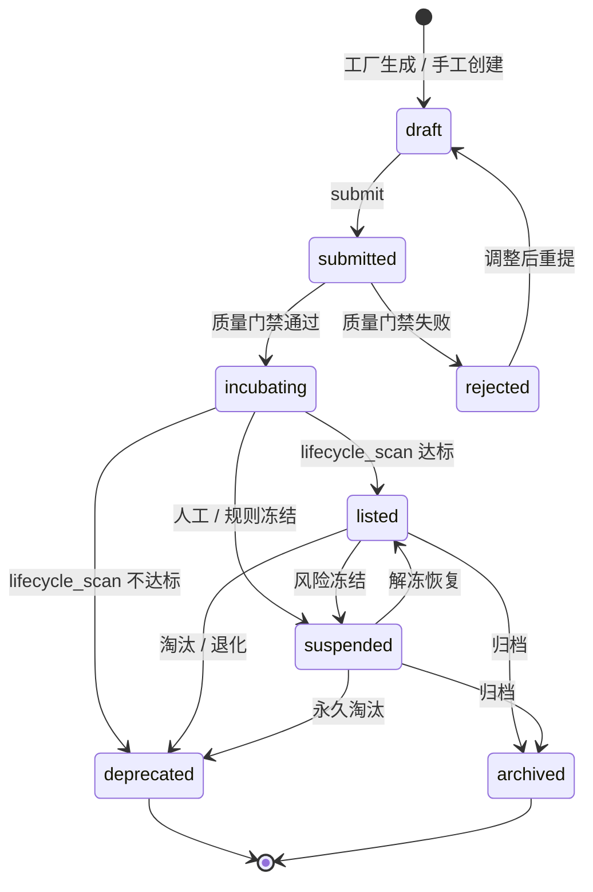
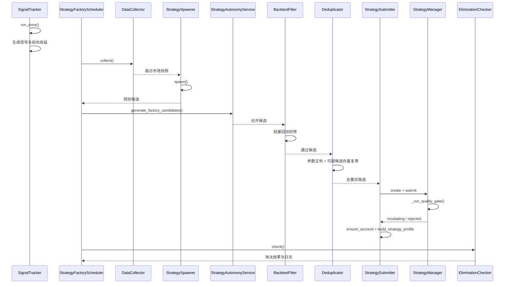
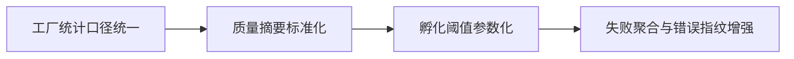

# 策略生命周期管理流程图（现状与建议演进）

> 本文档只描述两类内容：
> 1. 当前代码中已经存在的状态机与运行时序；
> 2. 基于现有实现可以继续推进的演进路径。

## 2026-03-21 校准补充

- 当前状态机描述的是“候选从提交到孵化/上架/淘汰”的运行流，**不等于**完整的研究任务生命周期，也还没有完整表达“候选、实验、正式策略修订、刷新已有策略”之间的差异。
- 后续需要在生命周期上明确区分：`research_task`、`candidate`、`experiment`、`listed_strategy_revision` 等对象，否则 `refresh_existing` 很容易吞并本应独立存在的新候选。
- 当前提交端已经默认要求 `refresh_existing` 通过 strict pass，但去重层对“什么候选可以被视为 refresh_existing”的推断仍偏宽；因此这里描述的是整改方向，而不是说当前全链路已经完全收敛。

## 1. 文档边界

- 当前状态定义必须以 `LIFECYCLE_TRANSITIONS` 为准
- 当前自动推进逻辑必须以 `_run_quality_gate()`、`_lifecycle_scan()`、`EliminationChecker.check()` 为准
- `paper_trading.py`、`pgvector/HNSW`、完整 Event Sourcing 仅能作为后续演进方向

## 2. 当前状态机

### 2.1 当前状态含义

| 状态 | 当前含义 | 主要触发方式 |
|:-----|:---------|:-------------|
| `draft` | 草稿策略 | 工厂创建或人工创建 |
| `submitted` | 已提交审核 | 调用 `submit` |
| `incubating` | 通过质量门禁，进入孵化观察 | `_run_quality_gate()` 通过 |
| `rejected` | 审核未通过 | 质量门禁失败或人工驳回 |
| `listed` | 已进入可展示/可订阅阶段 | `_lifecycle_scan()` 达标 |
| `suspended` | 风险冻结 | 人工或规则冻结 |
| `deprecated` | 已淘汰 | 退化、红旗或环境错配 |
| `published` | 兼容别名 | 输入或历史数据中仍可能出现，但当前会归一到 `listed` |
| `archived` | 已归档 | 终态 |

### 2.2 当前状态推进组件

| 转换阶段 | 当前执行组件 | 当前依据 |
|:---------|:-------------|:---------|
| `draft -> submitted` | `strategy_manager.submit` | `_validate_transition()` |
| `submitted -> incubating/rejected` | `_run_quality_gate()` | WF / PKF / Bootstrap / 参数敏感性 |
| `incubating -> listed/deprecated` | `_lifecycle_scan()` | `strategy_metrics` + `incubation_overview`（含 1/5/10/20D 观察） |
| `listed -> deprecated` | `EliminationChecker.check()` 或生命周期扫描 | 红旗、环境错配、表现退化 |
| `listed/incubating -> suspended` | 人工或规则冻结 | 兼容状态机定义 |
| 任意非法转换 | `_validate_transition()` | 直接拒绝 |

补充说明：`published` 仍在兼容映射中保留，但当前输入、查询与状态写入都统一按 `listed` 口径归一。

## 3. 当前运行时序

### 3.1 当前时序口径说明

- **`SignalTracker.run_once()` 是独立调度器**，不被 `StrategyFactoryScheduler.run_once()` 调用。上图将其画在工厂流程前方仅为说明数据时序关系（信号数据先于工厂流程产生），不代表存在代码级调用依赖
- `StrategyFactoryScheduler.run_once()` 串联的实际环节为：DataCollector → Spawner → Autonomy → BacktestFilter → Deduplicator → Submitter → EliminationChecker
- 当前去重已经是**参数主判 + 可疑候选向量复筛**，但还不是持久化 ANN 向量平台
- 当前孵化晋级已结合 `incubation_overview` 的多周期前向收益阻塞判断，但仍不是模拟盘 NAV 驱动

## 4. 当前晋级与淘汰口径

| 场景 | 当前口径 | 当前边界 |
|:-----|:---------|:---------|
| 质量门禁通过 | 进入 `incubating`，并落质量报告 | 已有结构化报告，但摘要字段与评级仍可继续丰富 |
| 孵化晋级 | `_lifecycle_scan()` 结合 `strategy_metrics`、最小观察窗口与 1/5/10/20D 前向收益阻塞判断推进 | 仍未切换到完整 NAV 驱动闭环 |
| 已上架淘汰 | 生命周期扫描或淘汰检查触发 `deprecated`，并保留淘汰日志与状态事件 | 已具备轻量审计流，但不是完整运行时风险平台 |
| 风险冻结 | 进入 `suspended` 并写入状态事件 | 当前更偏手动/规则触发，尚无独立熔断器体系 |

## 5. 建议演进流程

### 5.1 短期建议

- 目标：不改变主状态机，只继续补齐“可见性、可解释性、阈值稳定性”

### 5.2 中期建议

- 提升 `signal_forward_returns` 与净值序列在孵化晋级中的权重
- 扩展状态事件 metadata、时间线筛选与阶段摘要
- 强化工厂运行历史的趋势分析与失败归因
- 让孵化服务与模拟盘形成更紧密但仍可控的观测闭环

### 5.3 远期建议

- 让孵化真正以模拟盘 NAV / 订单级表现驱动晋级与淘汰
- 将向量去重升级为 `pgvector/HNSW` 持久化索引
- 建立工厂级熔断与运营干预能力
- 视复杂度收益比再评估完整 Event Sourcing / CQRS

## 6. 与《策略工厂方案》的每日运行流程对齐

本节第 3 节的时序图描述了代码模块间的调用关系。《策略工厂方案》（`docs/plans/策略工厂方案.md`）第七章提供了更具体的每日运行时间线：

| 时间 | 组件 | 动作 | 本文对应 |
|:-----|:-----|:-----|:---------|
| 18:00 | FactorScheduler | 计算因子值与 IC | 时序图中未显示（独立调度，为后续环节准备因子数据） |
| 18:05 | DataCollector | 采集市场快照 | 时序图中 `C.collect()` |
| 18:10 | StrategySpawner | 数据信号→候选策略 | 时序图中 `G.spawn()` |
| 18:12 | StrategyAutonomyService | 生成 AI 候选并并入候选池 | 时序图中 `A.generate_factory_candidates()` |
| 18:15 | BacktestFilter | 10 股中位数初筛 | 时序图中 `B.filter()` |
| 18:20 | Deduplicator | 参数主判 + 可疑候选向量复筛 | 时序图中 `D.deduplicate()` |
| 18:25 | StrategySubmitter | 创建+提交质检+通过后孵化/画像接线 | 时序图中 `U→M` 与 `U→U` |
| 18:30 | SignalTracker | 信号+前向收益+生命周期扫描 | 时序图中 `ST.run_once()`（独立调度，不由工厂 run_once 调用） |
| 18:40 | EliminationChecker | 淘汰检查 | 时序图中 `E.check()` |

**调度模型说明**：上表中 FactorScheduler（18:00）和 SignalTracker（18:30）各自拥有独立调度入口，不由 `StrategyFactoryScheduler.run_once()` 统一编排。`run_once()` 实际串联的是 DataCollector → Spawner → Autonomy → BacktestFilter → Deduplicator → Submitter → EliminationChecker 七个环节。三个调度器按时间先后运行，但没有代码级的依赖调用关系。

两份文档描述的是同一条链路，区别在于：
- 本文侧重**模块调用关系与状态流转规则**
- 《策略工厂方案》侧重**每个组件的具体实现逻辑与参数细节**

开发实施时应以《策略工厂方案》为准，本文作为架构参考。

## 7. 本文档最终口径

后续如果继续扩展生命周期文档，必须坚持以下规则：

1. 当前状态名只使用代码里已经存在的状态
2. 当前流程图只画已经接线的链路
3. 建议演进必须单独分栏，不得混入“现状图”
4. `published` 只作为兼容别名说明，不再作为主状态口径单独宣传

这样才能保证流程图既能服务排期，也不会误导为“当前系统已经具备完整工业化生命周期平台”。
