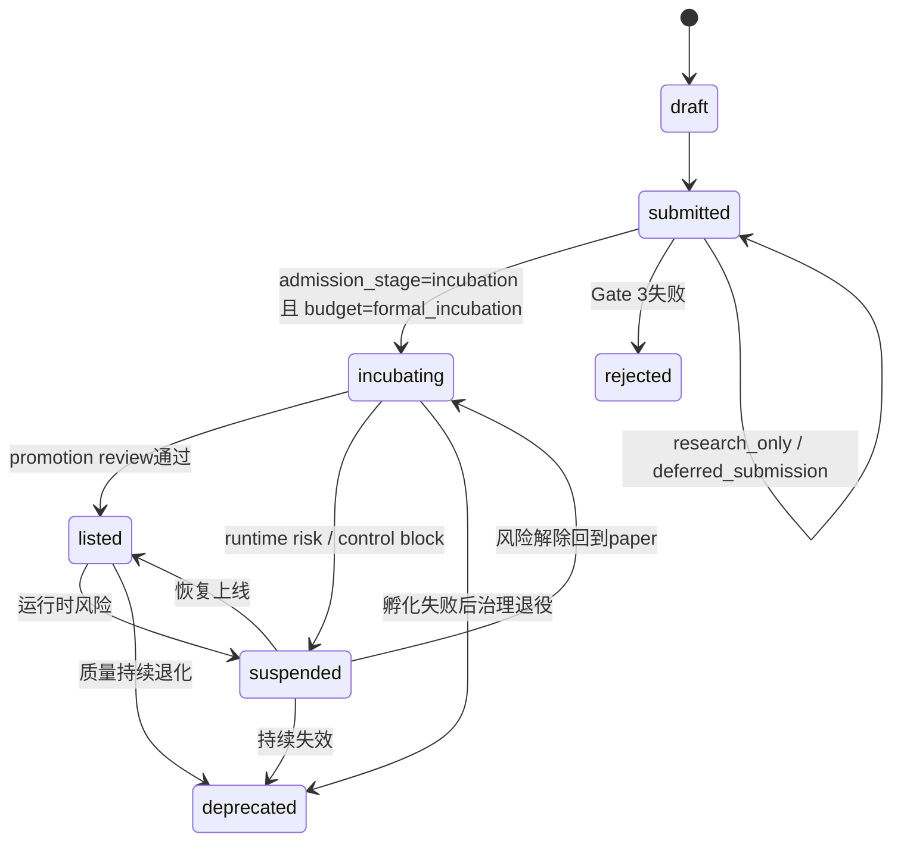
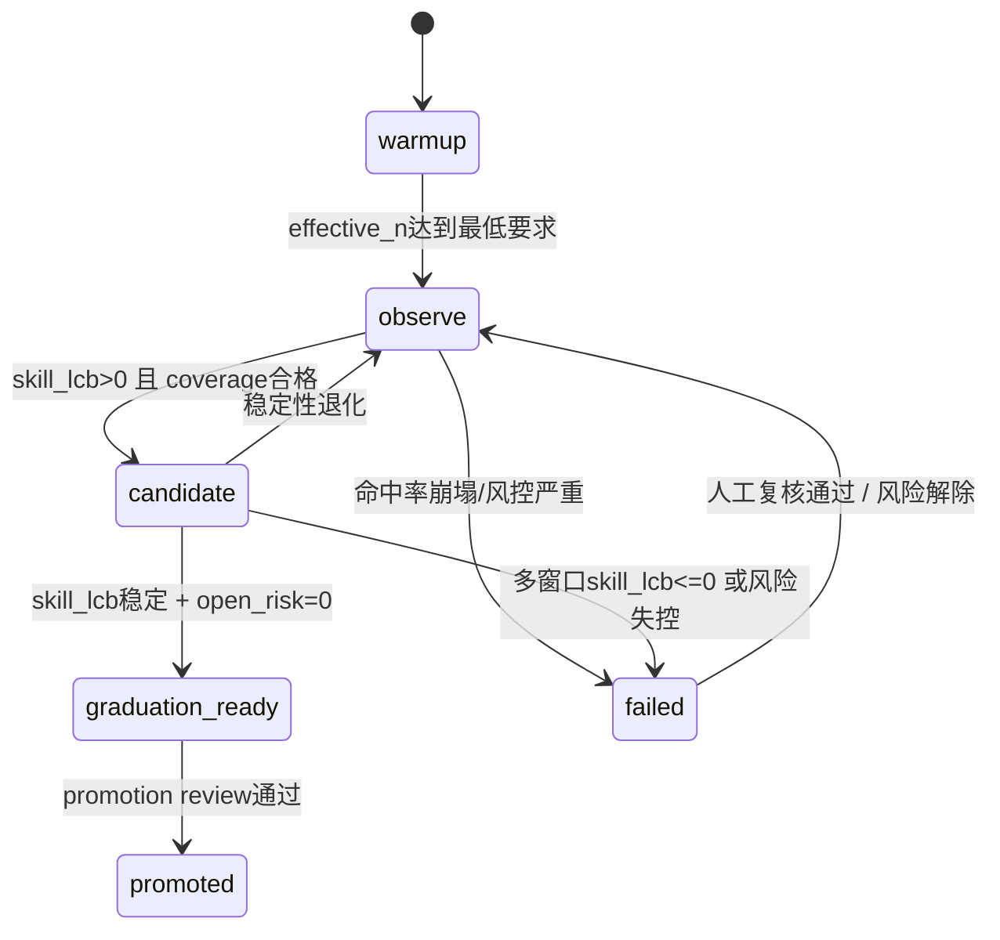
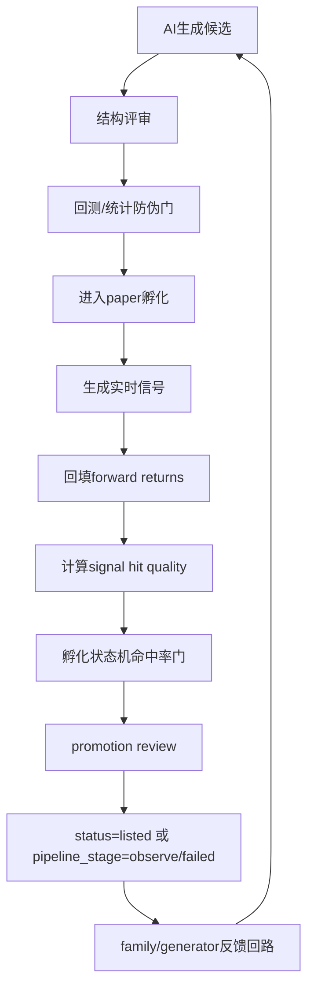

# 策略工厂孵化阶段命中率重构方案

更新日期：2026-04-12  
适用范围：`packages/strategy-factory`、`packages/akshare-mcp`、`docs/archive/strategy-factory`

---

## 1. 文档目标

本方案不是重新发明一套抽象“策略工厂蓝图”，而是基于项目当前已经存在的真实实现，回答四个工程问题：

1. 当前项目里，AI 是如何生成策略的。
2. 策略在进入孵化后，系统现在到底是如何验证“命中率/准确率”的。
3. 为什么当前实现虽然已经有命中率链路，但仍然没有把命中率变成策略工厂质量保障的主门禁。
4. 如何以最小破坏、最大复用的方式，把“经置信度调整后的信号命中率”升级为孵化阶段和工厂反馈回路的核心指标。

本方案的核心判断如下：

- 当前系统并不缺少命中率能力。
- 当前系统真正缺少的是“统一且可统计解释的命中率主门禁”。
- 当前最值得复用的资产不是回测 ROI，而是已经存在的 `SignalTracker -> strategy_signals -> signal_forward_returns -> get_signal_stats -> incubation/promotion/feedback` 证据链。
- 本次重构的重点不应该是推翻现有工厂，而应该是把现有命中率证据链从“侧指标”提升为“核心质量主线”。

### 1.1 基于实际代码核对后的可行性结论

在 2026-04-12 对项目真实代码核对后，本方案的可行性判断如下：

| Phase | 可行性 | 结论 |
| --- | --- | --- |
| Phase 1：命中率统计解释补齐 | 高 | 当前证据链完整，最适合优先落地 |
| Phase 2：反馈回路升级 | 中 | 可以做，但需要双写双读和阈值重标定 |
| Phase 3：执行层质量增强 | 中低 | 方向正确，但当前交易表语义不足，需先补执行结果口径 |
| Phase 4：表结构固化 | 中 | 应放在指标稳定跑通并完成回归后 |

需要特别说明三点：

1. 当前 `get_signal_stats()`、`build_incubation_overview()`、`incubation_pipeline.py` 的改造是**真实可落地**的。
2. 当前 `paper_hit_ratio -> family feedback -> budget feedback` 已深度耦合在多个公式和阈值里，因此 Phase 2 不是简单字段替换。
3. 当前 `paper_trades` / `paper_nav` 能支持部分执行层近似指标，但还不足以稳定支撑完整的 `execution_win_rate / avg_win_loss_ratio / trade_expectancy` 审计口径。

---

## 2. 当前实现的真实链路审计

### 2.1 工厂调度与编排入口

当前策略工厂的运行主链不在单一文件里，而是由以下模块分布式承载：

- `packages/strategy-factory/src/strategy_factory/application/factory_scheduler.py`
- `packages/strategy-factory/src/strategy_factory/application/_factory_scheduler_loop.py`
- `packages/strategy-factory/src/strategy_factory/application/cycle_runner.py`
- `packages/strategy-factory/src/strategy_factory/application/research/runner.py`
- `packages/strategy-factory/src/strategy_factory/application/services/candidate_pipeline.py`

真实工厂周期大致为：

1. 收集 snapshot。
2. 生成 factor research artifact。
3. 生成本地规则候选和 AI 自治候选。
4. 进入 Gate 0/1/2 回测与质量门。
5. 去重。
6. Gate 3 提交。
7. 若通过正式孵化轨，则置为 `incubating`。
8. 后续由 `SignalTracker`、`IncubationService`、`IncubationPipelineService` 负责真实孵化与晋级。

对应代码证据：

- `FactoryCycleRunner.run()` 中的 `spawn -> autonomy -> quality_gate -> backtest -> deduplicate -> submit -> elimination` 运行顺序，见 `cycle_runner.py:783-1013`。
- `ResearchPlaneRunner.run_generation()` 负责本地候选与自治候选合并，见 `research/runner.py:151-199`。
- `CandidatePipeline.run()` 负责 `gate-0/1/2 -> dedup -> gate-3`，见 `services/candidate_pipeline.py:41-143`。

### 2.2 AI 生成策略的真实方式

AI 生成并不是一个单一的 “LLM 一次性吐策略”，而是三个来源共同参与：

1. 本地规则生成器 `RuleStrategyGenerator`
2. 外部/代理式 LLM 生成器 `LLMProxyStrategyGenerator`
3. 参数进化器 `BanditParameterOptimizer`

关键文件：

- `packages/akshare-mcp/src/akshare_mcp/services/strategy_autonomy.py`
- `packages/akshare-mcp/src/akshare_mcp/services/strategy_autonomy_components.py`
- `packages/akshare-mcp/src/akshare_mcp/services/_strategy_generators_generate.py`
- `packages/akshare-mcp/src/akshare_mcp/services/strategy_optimizer.py`
- `packages/akshare-mcp/src/akshare_mcp/services/strategy_reviewer.py`

真实生成流程如下：

1. `AutonomyCycleOrchestrator._run_cycle_pipeline()` 进入 `generating` 阶段。
2. `CandidateGenerationService.generate()` 组装 parent strategy、历史实验摘要、研究任务上下文。
3. LLM 候选、replay 候选、evolved 候选、rule 候选合并。
4. `CommitteeReviewService.review_candidates()` 做委员会式评审。
5. `ExperimentRecorder.record_candidates()` 落实验与候选。
6. 如果 `auto_submit=True`，再调用 `StrategySubmitter.submit()` 进入工厂提交流程。

其中合并优先级很重要：

- 若存在 LLM/replay/evolved 候选，优先级是 `llm -> replay -> evolved -> rule`
- 若不存在外部/进化候选，才退化为 `rule -> llm -> replay -> evolved`

这意味着当前工厂实际上已经在“优先使用 AI 候选”，不是规则候选主导。

### 2.3 AI 候选在提交前如何被审核

当前委员会评审并不看 forward hit rate，而是偏结构性与可执行性审查。

`MultiAgentStrategyReviewer.review()` 的评分项包括：

- planner score
- risk score
- feasibility score
- execution score
- capacity score
- task alignment score
- novelty score

总分公式位于 `strategy_reviewer.py:273-282`，当前门槛逻辑为：

- `final_score >= 0.62` 且无执行/容量/任务对齐 blocker 时 `accept`
- `0.45 <= final_score < 0.62` 时 `revise`
- 否则 `reject`

这里的结论是：

- 当前 AI 生成质量控制的第一道门槛，是“结构化可行性评审”。
- 这一步并没有验证“未来预测是否成立”。
- 因而它只能回答“像不像一个合理策略”，不能回答“是不是真的有预测力”。

### 2.4 候选进入工厂质量门与孵化

候选提交的关键点：

- `packages/strategy-factory/src/strategy_factory/application/_submitter_actions.py`
- `packages/strategy-factory/src/strategy_factory/application/submission_gate.py`

真实链路如下：

1. `_submitter_actions.py:_submit_one()` 调用 `run_submission_quality_gate()`
2. `submission_gate.py` 根据 validation profile 和 admission level 做 Gate 3 评估
3. `_resolve_submission_action_plan()` 决定候选进入：
   - `research_only`
   - `observe`
   - `formal_incubation`
   - `runtime_review`
4. 若进入 `formal_incubation`，则会：
   - 更新策略状态为 `incubating`
   - 创建 paper account
   - 执行 incubation pipeline

这里必须明确一个事实：

- 当前“进入孵化”发生在真正 paper 数据积累之前。
- 所以任何依赖真实孵化样本的命中率门禁，都不可能放在 submit 前完全决定。
- Submit 前最多只能决定“是否值得进入 paper incubation”，不能决定“是否已经通过未来命中率验证”。

### 2.5 孵化阶段的真实运行链

真实孵化证据链主要在 `akshare-mcp`：

- `packages/akshare-mcp/src/akshare_mcp/services/signal_tracker.py`
- `packages/akshare-mcp/src/akshare_mcp/services/incubation.py`
- `packages/akshare-mcp/src/akshare_mcp/services/incubation_pipeline.py`
- `packages/akshare-mcp/src/akshare_mcp/services/promotion_pipeline.py`
- `packages/akshare-mcp/src/akshare_mcp/services/strategy_lifecycle_shared.py`

`SignalTracker.run_once()` 的真实步骤：

1. 对 `listed` 与 `incubating` 策略生成当日信号。
2. 写入 `strategy_signals`。
3. 回填历史信号对应的 `1/5/10/20D` 前向收益到 `signal_forward_returns`。
4. 同步孵化订单与成交。
5. 记录 paper NAV。
6. 扫描运行时风险。
7. 推进 `IncubationPipelineService`。
8. 触发 promotion review、lifecycle scan、vector governance 等。

这条链路说明：

- 当前系统已经有“实时孵化验证”的骨架。
- 真实 forward evidence 不来自 submit 前回测，而来自后续运行。
- 这恰好是将命中率升级为主门禁的最佳切入点。

---

## 3. 当前命中率到底是如何定义的

### 3.1 归档文档中的旧定义

归档文档 `docs/archive/strategy-factory/策略工厂方案.md` 中 `_recent_hit_rate()` 的定义是：

- 数据源：`strategy_signals` + `signal_forward_returns`
- 时间限制：近 `N` 天
- 固定窗口：`forward_days = 5`
- 命中判定：
  - `signal == 1` 且 `actual_return > 0`
  - 或 `signal == -1` 且 `actual_return < 0`

也就是：

`命中率 = 近 N 日内，信号方向与 5D 前向收益方向一致的比例`

这是一个典型的“信号层方向准确率”定义。

### 3.2 生产实现中的现行定义

生产代码 `signal_tracking.py:get_signal_stats()` 的定义为：

```python
hits = np.sum((signals_arr * returns_arr) > 0)
hit_rate[fd] = hits / len(records)
```

即：

`命中率 = 信号值与对应 forward return 同号的比例`

当前支持多个 horizon：

- 1D
- 5D
- 10D
- 20D

同时还会计算：

- `forward_ic`
- `forward_sharpe`

因此，现行命中率的本质是：

- 它是信号层面的方向预测准确率。
- 它不是交易撮合后的盈亏胜率。
- 它不是事件回放的 `event_window_hit_ratio`。
- 它也不是策略回测中的 `win_rate`。

### 3.3 三类“命中率/胜率”指标当前被混用

当前系统里至少存在三类容易混淆的指标：

| 指标名 | 所在位置 | 真实含义 | 当前问题 |
| --- | --- | --- | --- |
| `signal_stats.hit_rate[N]` | `signal_tracking.py` | 信号方向与未来收益方向是否一致 | 最接近“预测能力”，但还未成为统一主门禁 |
| `win_rate` | `strategy_metrics.period=backtest` | 成交后交易盈利笔数占比 | 会被仓位、止盈止损、成交模拟放大或扭曲 |
| `event_window_hit_ratio` | `submission_gate.py` trade audit | 事件窗口内方向代理命中 | 只适用于事件型 profile，不应泛化为工厂总质量 |

如果继续混用这三类指标，会导致两个问题：

1. 工厂生成质量与策略未来预测力之间无法建立稳定映射。
2. 高随机收益策略会在 ROI 维度被高估，而低收益但稳定预测的策略被低估。

---

## 4. 当前实现的核心问题

### 4.1 当前不是“没有命中率”，而是“命中率没有成为主门禁”

现状如下：

- `IncubationService.record_metrics()` 会把 `hit_rate_5d`、`forward_ic_5d`、`forward_sharpe_5d` 持久化到 `strategy_incubation_metrics`。
- `build_incubation_overview()` 会基于 `hit_rate[1/5/10/20]` 生成 blockers 与 risk flags。
- `IncubationPipelineService._readiness_score()` 会把 `hit_rate_5d` 计入 readiness score。
- `PromotionPipelineService._score()` 也会把 `hit_rate_5d` 纳入晋级评分。
- `research/_feedback_routes.py` 和 `_budget_feedback.py` 还会把 `hit_rate_5d` 作为 `paper_hit_ratio` 输入 family 反馈回路。

但是：

- `submission_gate.py` 仍把 `total_return_min` 当作硬阈值。
- `incubation_budgeter.py` 仍给 `total_return` 高权重。
- 当前 hit rate 还是全样本累计值，没有近期窗口、没有置信区间、没有有效样本数。
- 当前孵化晋级是“命中率 + Sharpe + MDD + blockers”的混合弱约束，不是命中率主导。

### 4.2 当前命中率还不具备统计解释力

当前 `get_signal_stats()` 的问题：

1. 没有 `lookback_days`，只能看全样本累计。
2. 没有 `sample_count` 与 `effective_n`。
3. 没有近期窗口命中率，无法检测命中率退化。
4. 没有 confidence interval，无法区分“小样本高命中”和“中样本稳命中”。
5. 没有 base-rate 校正，容易把市场单边上涨的自然偏置错当成策略能力。
6. 没有 neutral band，极小收益噪声也会被强行算作命中或 miss。

### 4.3 当前孵化证据层还有一层错位

当前 `hit_rate` 的证据源虽然来自 paper 阶段，但它仍然是：

- 基于信号日期到未来价格的 forward return
- 不是基于真实成交、费用、滑点和持仓路径的 execution PnL

这意味着当前系统更准确地说是在做：

- `paper signal validation`

而不是：

- `paper execution validation`

所以本次方案必须区分两层：

1. **信号层命中率**：判断策略是否真的具有方向预测能力
2. **执行层转化率**：判断这种预测能力能否通过仓位、成交和退出机制转化为收益

这两层不能互相替代。

---

## 5. 重构目标与设计原则

### 5.1 总目标

将策略工厂孵化阶段的评价逻辑改为：

> 先验证信号是否稳定地“预测对”，再验证这个预测能力能否稳定地“赚到钱”。

也就是：

- `信号命中率` 是第一性指标
- `收益率/Sharpe` 是第二性指标
- `回测 ROI` 不再是工厂孵化主门禁

### 5.2 设计原则

1. 复用现有 `strategy_signals` / `signal_forward_returns` / `get_signal_stats()` 证据链。
2. 不在 submit 前伪造“未来命中率”。
3. 不把 `win_rate` 和 `signal_hit_rate` 混成一个指标。
4. 用“置信度调整后的命中率”替代原始命中率。
5. 用“有效样本数”替代简单的观测天数。
6. 用“实时 paper 数据”作为孵化主证据，用“历史回测”作为防伪层。
7. 用 family/generator/target_pool 反馈回路反哺生成器质量。

---

## 6. 新的命中率衡量体系

## 6.1 指标分层

本方案建议将质量指标分成三层：

### 第一层：信号层预测质量

这是本次重构的主轴。

核心指标：

- `signal_hit_rate_raw`
- `signal_hit_rate_lcb`
- `signal_skill_lcb`
- `recent_hit_rate`
- `hit_rate_stability_gap`
- `effective_n`
- `coverage_ratio`

### 第二层：执行层转化质量

这是次级指标，用于解释“为什么明明预测对了却赚不到钱”。

核心指标：

- `execution_win_rate`
- `avg_win_loss_ratio`
- `trade_expectancy`
- `signal_to_fill_ratio`
- `fill_slippage_penalty`
- `paper_pnl_conversion_efficiency`

### 第三层：资本层收益质量

这是最终资本效率指标，但不再是孵化首要门槛。

核心指标：

- `paper_nav`
- `paper_sharpe`
- `paper_max_drawdown`
- `forward_sharpe`
- `post_cost_return`

## 6.2 第一层的核心定义

### 6.2.1 原始命中率

在每个 horizon `h in {1, 5, 10, 20}` 上定义：

```text
directed_return = signal * actual_return

hit    if directed_return > +eps
miss   if directed_return < -eps
neutral if |directed_return| <= eps
```

然后：

```text
raw_hit_rate = hits / (hits + misses)
```

其中：

- `eps` 用于剔除极小噪声收益
- `neutral` 不直接计入 miss

建议：

- 先用 `eps = 0.001 ~ 0.002`
- 后续按波动率自适应

### 6.2.2 置信度调整后的命中率

为了避免小样本偏差，不能直接用 `raw_hit_rate` 做主门禁，必须做置信区间下界。

推荐定义：

```text
p_hat = hits / (hits + misses)
n_eff = min(sample_count, effective_n)
hit_rate_lcb = WilsonLowerBound(p_hat, n_eff, confidence=90%)
```

这里明确约定：

- `hit_rate_lcb` 字段名继续保留，以兼容现有链路与下游字段命名。
- V1 的统计含义是“基于等价独立样本数（ESS）的 Wilson 保守下界近似”。
- 它不是严格的 Beta 后验可信区间，也不宣称是精确自由度推断。

建议同时输出元信息：

- `hit_rate_lcb_method = "wilson_ess_approx"`
- `effective_n_method = "overlap_adjusted_ess_v1"`

V2 审计增强版再补：

```text
hit_rate_lcb_audit = BlockBootstrapLowerBound(...)
```

用于线下审计、晋级复核和统计解释增强，但不作为第一版在线门禁前置依赖。

### 6.2.3 基线校正后的技能分数

命中率不能直接和 `0.5` 比，因为实际市场存在方向偏置。

定义：

```text
null_hit_rate = p(long) * p(up) + p(short) * p(down)
signal_skill_lcb = hit_rate_lcb - null_hit_rate
```

解释：

- 如果策略主要做多，而市场本身上涨占比较高，直接用 `0.5` 作为基线会虚高。
- 用 `null_hit_rate` 做校正后，才能更真实地衡量策略有没有超额方向预测能力。

### 6.2.4 近期命中率与稳定性

需要同时维护两套窗口：

- `lifetime_hit_rate_lcb`
- `recent_20d_hit_rate`

定义稳定性差：

```text
stability_gap = abs(lifetime_hit_rate - recent_hit_rate)
```

如果近期显著劣化，即使累计命中率仍高，也不能直接晋级。

### 6.2.5 有效样本数

因为 5D/10D/20D forward return 存在重叠窗口，实际样本有效自由度低于观测条数。

建议两阶段实现：

#### V1：保守近似

```text
effective_n = max(1, min(sample_count, sample_count / horizon_overlap_factor))
```

例如：

- 1D: `factor=1`
- 5D: `factor=3`
- 10D: `factor=5`
- 20D: `factor=8`

V1 的定位是：

- 为 Wilson-ESS 下界提供保守近似
- 解决重叠 horizon 下“观测条数虚高”的工程问题
- 不把它包装成严格统计学自由度

#### V2：基于自相关 / block bootstrap 修正

采用 Newey-West 风格或基于序列自相关的 `effective_n` 估计。

V1 已足够用于当前工程治理。

## 6.3 第二层执行质量定义

由于当前系统已经有 `paper_orders`、`paper_trades`、`paper_nav`，执行层增强方向是正确的，但这里需要区分当前可稳定产出的近似指标与目标态指标。

### 6.3.1 当前代码可以稳定产出的近似指标

- `signal_to_fill_ratio = filled_orders / generated_orders`
- `filled_order_ratio = filled_orders / total_orders`
- `turnover_rate`
- `paper_nav_conversion_proxy = paper_nav_change / theoretical_directed_forward_return`

### 6.3.2 目标态指标

以下指标仍然建议保留为目标态，但需要补充交易结果语义后再正式上线：

- `execution_win_rate = 盈利交易数 / 已平仓交易数`
- `avg_win_loss_ratio = 平均盈利 / 平均亏损绝对值`
- `trade_expectancy = win_rate * avg_win - (1 - win_rate) * avg_loss`
- `pnl_conversion_efficiency = realized_pnl / theoretical_directed_forward_return`

### 6.3.3 当前落地边界

现有 `paper_trades` 记录了成交方向、价格、数量、金额和手续费，但还没有稳定的：

- round-trip 成交配对
- 已实现盈亏字段
- 分笔平仓收益归因

因此 V1/V2 不建议把 `execution_win_rate`、`avg_win_loss_ratio`、`trade_expectancy` 作为强依赖门禁，而应先把它们标注为“执行层增强项 / 审计增强项”。

用途：

- 解释“高命中率但低收益”的原因
- 将信号质量问题和执行设计问题分开诊断

## 6.4 第三层资本质量定义

资本层指标保留，但降级为次级指标：

- `paper_nav`
- `paper_sharpe`
- `paper_drawdown`
- `forward_sharpe`
- `post_cost_return`

这些指标用于：

- 决定仓位上限
- 决定是否需要执行优化
- 决定 listed 后的资本分配

不再作为孵化初期的唯一主门槛。

---

## 7. 时间换空间：是否应延长孵化周期

答案是：**应该，但不是简单延长固定天数，而是转向“有效样本数驱动”的动态孵化周期**。

### 7.1 当前问题

当前 `IncubationPipelineService` 主要用：

- `observed_days`
- `trade_days`
- `promote_streak`

来决定阶段。

这会导致：

- 高频策略样本很快累积，但低频策略被误判为“长期 warmup”
- 低频但高质量信号策略难以获得公平观察期
- 高噪声高频策略可能更早因样本数优势获得晋级机会

### 7.2 建议改造

将孵化期从“固定天数”改为“双阈值控制”：

1. 最短日历天数
2. 最低有效样本数

建议：

| 阶段 | 最短日历天数 | primary horizon 有效样本数 | secondary horizon 有效样本数 |
| --- | --- | --- | --- |
| warmup | 5 | < 20 | 不要求 |
| observe | 10 | >= 20 | 不要求 |
| candidate | 15 | >= 35 | >= 15 |
| graduation_ready | 20-30 | >= 60 | >= 30 |

其中 primary horizon 由策略持有期 bucket 决定：

- 短持有：1D/5D
- 中持有：5D/10D
- 长持有：10D/20D

这样就实现了真正的“时间换空间”：

- 低频策略自动延长观察期以换取更大样本
- 高频策略即使天数短，也必须满足有效样本与稳定性要求

---

## 8. 数据来源设计：为什么应以高保真 Paper Trading 为主

### 8.1 目标态证据层次

孵化期质量证据应先回答“预测是否成立”，再回答“执行是否转化”，因此主门禁的重要性顺序应为：

1. **Paper 孵化实时信号 + future market returns**
   即 `strategy_signals + signal_forward_returns`。这是命中率主门禁的第一证据。
2. **Paper orders / trades / nav 执行转化证据**
   即 `paper_orders`、`paper_trades`、`paper_nav`。这是执行层与资本层解释的第二证据。
3. **历史 OOS / Walk-forward / Purged K-fold**
4. **纯回测 ROI/Sharpe**

### 8.2 原因

#### 回测的职责

回测适合回答：

- 该策略是否明显错误
- 参数是否极度脆弱
- 是否存在过拟合迹象
- 是否值得进入 paper 观察

#### Paper 数据的职责

paper 数据适合回答：

- `strategy_signals + signal_forward_returns` 回答方向预测是否仍成立
- `paper_orders / paper_trades / paper_nav` 回答信号是否能转化为成交与净值增长

### 8.3 当前系统的可复用部分

当前项目已经具备：

- `strategy_signals`
- `signal_forward_returns`
- `paper_orders`
- `paper_trades`
- `paper_nav`

所以本次重构并不需要推倒重来。

建议采用双层证据：

1. **V1 主证据**：继续用 `strategy_signals + signal_forward_returns` 计算 signal hit quality
2. **V2 强证据**：增加 `paper_trades` 驱动的 execution conversion quality

但这里需要补充一个实现边界：

- 现有 `paper_orders / paper_trades / paper_nav` 足以支持 `signal_to_fill_ratio`、`turnover_rate`、`NAV conversion proxy` 这类近似执行质量。
- 现有表还不足以直接支撑“已平仓胜率 / 平均盈亏比 / trade expectancy”的稳定计算。
- 因此执行层质量更适合分成 `V2-approx` 与 `V3-audit` 两步，而不是一次性宣称全部完成。

### 8.4 实施顺序（避免与目标态层次混淆）

目标态与实施顺序必须分开写：

- **目标态第一证据**始终是 paper 孵化期实时信号的 forward return 质量。
- **目标态第二证据**是 paper 订单/成交/净值带来的执行转化质量。
- **V1 实施顺序**先落 `strategy_signals + signal_forward_returns`，因为当前代码已经具备完整证据链。
- **V2 实施顺序**再补 `paper_orders / paper_trades / paper_nav` 的近似 execution quality。
- **V3 审计增强**再补交易配对、已实现盈亏与 round-trip 口径，支持完整 execution quality。
- **历史回测层**继续只承担 submit 阶段“防伪门”职责，不替代 paper 命中率门禁。

---

## 9. 新的孵化状态机设计

### 9.1 真实状态机应修改的位置

虽然用户需求里提到了 `factory_scheduler.py` 的 FSM，但当前项目真实的生命周期状态机不在 scheduler 壳层，而在：

- `strategy_lifecycle_shared.py`
- `incubation_pipeline.py`
- `promotion_pipeline.py`

因此建议：

- `factory_scheduler.py` 只负责汇总和展示命中率 gate 结果
- 实际状态推进逻辑改在 `IncubationPipelineService` 与 `build_incubation_overview()`
- 同时必须同步处理 `incubation.py` 中写入 `strategy_incubation_metrics.stage` 的 `_derive_incubation_stage()`，避免 metric stage 与 pipeline stage 双轨漂移

### 9.2 必须拆开的三层状态模型

这里必须先澄清一个实现边界：

1. `strategy.status`
   由 `strategy_lifecycle_shared.py` 维护，表示策略生命周期状态。
2. `incubation_pipeline.pipeline_stage`
   由 `incubation_pipeline.py` 维护，表示孵化内部观察阶段。
3. `incubation_account.stage/status`
   由 `incubation.py` / `incubation_pipeline.py` 维护，表示模拟盘账户承载状态。

这三层不能混为一谈。

特别说明：

- `failed` 只应定义为 `pipeline_stage`
- `failed` 不是 `strategy.status` 的正式生命周期值
- `failed` 表示“孵化流水线阻断，等待人工治理/退役/恢复”，而不是直接写库为终态

### 9.3 生命周期状态图（`strategy.status`）



### 9.4 孵化流水线阶段图（`pipeline_stage`）



### 9.5 三层状态映射规则

建议明确以下映射：

- `strategy.status = incubating`
  对应 `pipeline_stage in {warmup, observe, candidate, graduation_ready, failed}`
- `strategy.status = listed`
  在 pipeline snapshot 中映射为 `pipeline_stage = promoted`
- `pipeline_stage = failed`
  不自动写成 `strategy.status = failed`，而是保留 `strategy.status = incubating`，再由治理流程决定是否转 `deprecated` 或 `suspended`
- `account.stage`
  主要镜像 `pipeline_stage`
- `account.status`
  使用 `active / ready / promoted / retired` 这类账户语义，不复用生命周期状态

### 9.6 流水线阶段判断规则

建议新增以下阶段判断：

#### `warmup`

条件：

- `primary_effective_n < 20`
- 或 `coverage_ratio < 0.25`

#### `observe`

条件：

- `primary_effective_n >= 20`
- 但 `signal_skill_lcb <= 0`
- 或 `stability_gap > 0.08`

#### `candidate`

条件：

- `primary_signal_skill_lcb > 0`
- `coverage_ratio >= 0.5`
- `stability_gap <= 0.08`
- `open_risk_count <= 1`

#### `graduation_ready`

条件：

- `primary_effective_n >= 60`
- `secondary_effective_n >= 30`
- `primary_signal_skill_lcb > 0`
- `secondary_signal_skill_lcb > 0`
- `recent_skill_lcb > 0`
- `stability_gap <= 0.05`
- `open_risk_count == 0`

#### `failed`

条件：

- `recent_skill_lcb < -0.03`
- 或 `stability_gap > 0.10`
- 或 `execution_conversion_break = True`
- 或 `open_risk_count` 持续超阈值

### 9.7 退化与淘汰规则

建议新增三类退化门：

1. `hit_rate_collapse`
2. `stability_break`
3. `execution_conversion_break`

例如：

- `recent_skill_lcb < -0.03`
- 或 `stability_gap > 0.10`
- 或 `signal_to_fill_ratio < 0.3` 且持续 10 个交易日

则：

- `candidate -> observe`
- 或 `observe/candidate -> failed`

如果 `failed` 持续不恢复，再由治理层决定：

- `incubating -> deprecated`
- 或 `incubating -> suspended`

---

## 10. 文件级改造方案

## 10.1 `packages/akshare-mcp/src/akshare_mcp/storage/timescaledb/signal_tracking.py`

### 当前职责

- 聚合 `strategy_signals` 与 `signal_forward_returns`
- 输出 `hit_rate`、`forward_ic`、`forward_sharpe`

### 当前问题

- 没有 lookback 维度
- 没有样本置信度
- 没有 neutral band
- 没有有效样本数
- 没有 base-rate 校正

### 改造建议

新增返回结构：

```python
{
    "hit_rate": {1: ..., 5: ..., 10: ..., 20: ...},
    "hit_rate_lcb": {1: ..., 5: ..., 10: ..., 20: ...},
    "null_hit_rate": {1: ..., 5: ..., 10: ..., 20: ...},
    "skill_lcb": {1: ..., 5: ..., 10: ..., 20: ...},
    "recent_hit_rate": {1: ..., 5: ..., 10: ..., 20: ...},
    "recent_hit_rate_lcb": {1: ..., 5: ..., 10: ..., 20: ...},
    "recent_skill_lcb": {1: ..., 5: ..., 10: ..., 20: ...},
    "stability_gap": {1: ..., 5: ..., 10: ..., 20: ...},
    "sample_count": {1: ..., 5: ..., 10: ..., 20: ...},
    "effective_n": {1: ..., 5: ..., 10: ..., 20: ...},
    "hit_rate_lcb_method": "wilson_ess_approx",
    "effective_n_method": "overlap_adjusted_ess_v1",
    "neutral_count": {1: ..., 5: ..., 10: ..., 20: ...},
    "forward_ic": {...},
    "forward_sharpe": {...},
    "total_signals": ...,
}
```

并支持：

- `lookback_days: Optional[int]`
- `eps: Optional[float]`

补充实现要求：

- 必须保持现有 `get_signal_stats(strategy_id)` 调用方式继续可用。
- `packages/strategy-factory` 的 MCP adapter、API contract、manager handler 都需要同步兼容新参数，但默认值必须保持旧行为。
- 返回结构只能“加字段”，不能删除现有 `hit_rate / forward_ic / forward_sharpe / total_signals`。

## 10.2 `packages/akshare-mcp/src/akshare_mcp/services/incubation.py`

### 当前职责

- 记录 `hit_rate_5d`、`forward_ic_5d`、`forward_sharpe_5d`
- 写入 `strategy_incubation_metrics`

### 当前问题

- 只持久化单个 `5D` 命中率
- 没有写入样本置信度和稳定性
- `stage` 目前还通过 `_derive_incubation_stage()` 单独推导，容易与 `incubation_pipeline.py` 的阶段推进不一致

### 改造建议

短期不必改表结构，先把完整信号质量结构写入 `metadata.signal_quality`：

```python
metadata["signal_quality"] = {
    "primary_horizon": 5,
    "secondary_horizon": 10,
    "by_horizon": {...},
    "coverage_ratio": ...,
    "primary_skill_lcb": ...,
    "secondary_skill_lcb": ...,
}
```

保留 `hit_rate_5d` 仅用于兼容旧接口。

同时建议：

1. `metric.metadata.overview.signal_quality` 与顶层 `metadata.signal_quality` 只保留一个主副本，避免双份漂移。
2. `record_metrics()` 里的阶段判定应尽量复用 `incubation_pipeline` 的结论，至少保证 `metric.stage` 和 `pipeline_stage` 同语义映射。

## 10.3 `packages/akshare-mcp/src/akshare_mcp/services/strategy_lifecycle_shared.py`

### 当前职责

- 构建 incubation overview
- 输出 blockers/risk_flags/promotion_ready

### 当前问题

- 现在 blocker 仍以 `hit_rate < 0.45`、`hit_rate < 0.30` 这种原始阈值方式工作
- 没有 `skill_lcb`
- 没有 stability gate

### 改造建议

将 `build_incubation_overview()` 改为：

1. 读取 `signal_quality`
2. 计算 `primary/secondary horizon`
3. 基于 `skill_lcb`、`effective_n`、`stability_gap`、`coverage_ratio` 输出 blockers 与 risk_flags

新增 blocker 示例：

- `primary_effective_n_insufficient`
- `primary_signal_skill_lcb_not_positive`
- `secondary_signal_skill_lcb_not_positive`
- `forward_window_coverage_low`
- `signal_hit_stability_break`

新增 risk flag 示例：

- `recent_skill_lcb_deteriorating`
- `execution_conversion_weak`
- `signal_generation_sparse`

## 10.4 `packages/akshare-mcp/src/akshare_mcp/services/incubation_pipeline.py`

### 当前职责

- 从 `warmup/observe/candidate/graduation_ready` 推进孵化阶段

### 当前问题

- readiness score 仍然混合 `nav`、`sharpe`、`forward_sharpe_5d`、`hit_rate_5d`
- `observed_days` 比 `effective_n` 更重要
- 当前 `observed_days / trade_days / promote_streak` 还被快照、自动晋级和账户状态复用，改动时必须同步回归这些调用点

### 改造建议

阶段判定从“天数+命中率”改为“有效样本+技能下界+稳定性”：

- `warmup`: 样本不足
- `observe`: 样本够但 `skill_lcb <= 0` 或稳定性不足
- `candidate`: `skill_lcb > 0` 且稳定性基本合格，但确认样本还不足以晋级
- `graduation_ready`: 多窗口稳定为正

同时将 `_readiness_score()` 的主权重切换为：

- `primary_skill_lcb`
- `secondary_skill_lcb`
- `coverage_ratio`
- `stability_score`

降低：

- `nav`
- `sharpe_ratio`
- `forward_sharpe_5d`

并增加一条实施约束：

- 不要只改 `pipeline_stage` 判断而不改 `incubation.py:_derive_incubation_stage()`；否则 metric、pipeline snapshot、account stage 会出现同日不同结论。

## 10.5 `packages/akshare-mcp/src/akshare_mcp/services/promotion_pipeline.py`

### 当前职责

- 对 `incubating` 做晋级评审

### 当前问题

- 当前评分里 `hit_rate_5d` 只占 `0.12`
- 仍然偏收益率/概览混合打分

### 改造建议

将晋级评审拆成两步：

1. `signal_quality_gate`
2. `capital_efficiency_gate`

只有 `signal_quality_gate` 通过，才允许进入资本效率评分。

兼容建议：

- 第一版保留现有 `score/status/recommendation` 输出结构不变。
- 新增 `signal_quality_gate_passed`、`capital_efficiency_gate_passed` 等解释字段，先双写到 `review.metadata`，避免直接打破前端和测试断言。

## 10.6 `packages/strategy-factory/src/strategy_factory/application/submission_gate.py`

### 当前职责

- Gate 3 提交门禁

### 当前问题

- `total_return_min` 仍是硬阈值
- `event_window_hit_ratio` 在 trade profile 中被当作重要判断
- 但 submit 阶段没有真实 paper 命中率可用

### 改造建议

submit 阶段的目标应从：

> “该策略是否已经证明可行”

改为：

> “该策略是否值得进入 paper signal validation”

因此建议：

1. 将 `total_return_min` 从硬门槛降为软警告或低权重项。
2. 保留 DSR/PBO/统计检验作为“防伪门”。
3. **不要替换现有门禁字段**，先保留并继续输出：
   - `strict_incubation_ready`
   - `incubation_candidate_ready`
   - `live_candidate_ready`
   - `admission_stage`
4. 在兼容层新增 paper 验证上下文字段：
   - `signal_validation_required = admission_stage == "incubation"`
   - `paper_signal_validation_status = "pending"`
   - `paper_signal_validation_source = "signal_forward_returns"`
5. 明确兼容映射：
   - `paper_incubation_ready = incubation_candidate_ready`
   - `paper_signal_validation_pending = paper_signal_validation_status == "pending"`
   - submit 阶段默认不因为缺少 paper 证据而设置 `live_candidate_ready = True`
6. 对 `formal_incubation` 的要求改为“值得进入验证”，但仍保持现有 `strict_incubation_ready -> formal_incubation` 分支语义，避免 `_submitter_actions.py` 现有路由失效。

补充说明：

- `total_return_min` 与 `event_window_hit_ratio_min` 不能一刀切删除，因为它们仍是现有 Gate 3 阈值集的一部分。
- 更稳妥的做法是先把 `total_return_min` 退化为 warning 或低权重项，再保留字段输出，避免常量集、质量报告和测试全部失配。

## 10.7 `packages/strategy-factory/src/strategy_factory/application/incubation_budgeter.py`

### 当前职责

- 为候选分配 `formal / observe / deferred` 孵化预算轨道

### 当前问题

当前打分公式中：

- `sharpe * 20`
- `total_return * 40`
- `mdd * -15`

这会导致工厂倾向于预算给“收益亮眼但未来不一定可泛化”的候选。

### 改造建议

将预算器改为“两阶段优先级”：

#### 阶段 A：候选入场优先级

用：

- validation score
- DSR/PBO
- regime fit
- family feedback
- parent signal quality prior

来判断是否值得进入 paper。

#### 阶段 B：已有 family/parent 经验的强化

将现有 `paper_hit_ratio` 升级为：

- `paper_skill_lcb`
- `paper_coverage_ratio`
- `paper_stability_score`

`total_return` 权重大幅下降。

注意：

- `confidence_adjusted_signal_prior` 只能来自 family / parent / generator_mode 的历史 paper 证据
- 不能在候选提交时读取“当前 candidate 自己未来才会产生的 `paper_*` 指标”
- 预算器在 submit 前只能使用 cohort prior，不能伪造 candidate future evidence
- `paper_skill_lcb` 的数值范围不再是 `[0,1]`，而可能接近 0 或为负，因此预算器与反馈控制里的权重、偏置和阈值必须重标定，不能直接拿旧公式替换字段名

## 10.8 `packages/strategy-factory/src/strategy_factory/application/research/_feedback_routes.py`

### 当前职责

- 从孵化侧取 `hit_rate_5d` 形成 family feedback

### 当前问题

- 当前只取 `latest_metric.hit_rate_5d`
- 缺少置信度与稳定性维度

### 改造建议

改为聚合：

- `paper_skill_lcb`
- `paper_recent_skill_lcb`
- `paper_stability_gap`
- `paper_coverage_ratio`
- `execution_conversion_efficiency`

并同步修改聚合层：

- `research/_feedback_metrics.py` 中的 bucket accumulator 目前仍累计 `paper_hit_ratio_total`，这一层也必须一起切换或双写。
- 建议先双写：
  - `paper_hit_ratio`
  - `paper_skill_lcb`
  - `paper_stability_gap`
  - `paper_coverage_ratio`

等工厂反馈样本跑稳后，再把控制平面主信号从 `paper_hit_ratio` 切到 `paper_skill_lcb`。

## 10.9 `packages/strategy-factory/src/strategy_factory/application/_budget_feedback.py`

### 当前职责

- 决定 family / target_pool / generator_mode 的 cooldown / suppress / freeze

### 当前问题

- 当前核心信号是 `paper_hit_ratio`
- 还不是经过置信度调整的技能分数

### 改造建议

把内部控制逻辑切换为：

- `paper_skill_lcb <= 0` 开始 cooldown
- `paper_skill_lcb` 显著为负进入 suppress/freeze
- `paper_stability_gap` 超阈值也进入 suppress

这一步非常关键，因为它是策略工厂反哺生成器质量的核心闭环。

补充约束：

- 当前控制逻辑、预算乘数和优先级调整都默认 `paper_hit_ratio` 以 `0.5` 为中性点。
- `paper_skill_lcb` 更接近“围绕 0 的技能增量”，所以必须重新定义：
  - normal / cooldown / suppress / freeze 的阈值
  - multiplier 的中心点
  - priority adjustment 的线性映射
- 因此推荐先经历一段“双轨运行”：旧控制照常生效，新控制只记录建议值和建议原因。

## 10.10 `packages/strategy-factory/src/strategy_factory/application/factory_scheduler.py`

### 当前职责

- 工厂批次调度

### 当前问题

- scheduler 本身并不掌握真实生命周期状态机
- 但 run summary 还没有把“命中率 gate 的健康情况”聚合展示出来

### 改造建议

新增只读聚合指标：

- `incubation_signal_quality_ready_count`
- `incubation_signal_quality_blocked_count`
- `incubation_stability_break_count`
- `family_signal_skill_panel`
- `generator_mode_signal_quality_panel`

强调：

- 真正状态推进仍应在 `incubation_pipeline.py`
- scheduler 只负责可观测性汇总
- 实际聚合落点不仅是 `factory_scheduler.py`，还包括 `_factory_scheduler_analysis.py`、`research/_feedback_metrics.py` 等现有 summary builder

---

## 11. 高命中率但低盈亏比、低命中率但高盈亏比如何处理

这是本次重构必须明确的投资工程问题。

建议做四象限治理：

| 象限 | 特征 | 处理策略 |
| --- | --- | --- |
| A | 高命中率 + 高盈亏比 | 冠军池，优先晋级 |
| B | 高命中率 + 低盈亏比 | 保留，进入执行优化队列 |
| C | 低命中率 + 高盈亏比 | 小权重可选性池，延长观察期 |
| D | 低命中率 + 低盈亏比 | 淘汰 |

### 11.1 高命中率但低盈亏比

这种策略说明：

- 预测方向可能是真实有效的
- 但执行、仓位或退出逻辑没有把预测转成利润

处理原则：

- 不应因为 ROI 不高而直接淘汰
- 应进入执行优化/止盈止损/持仓周期重估队列
- 可以保留较低预算和较小 paper 仓位

### 11.2 低命中率但高盈亏比

这种策略说明：

- 可能是典型的“低胜率、高赔率”结构
- 也可能只是样本偶然性 + 尾部收益支撑

处理原则：

- 不能直接因为收益高就大规模放量
- 必须要求更强的：
  - DSR
  - PBO
  - 回撤约束
  - 更长 paper 观察期
- 默认只给小预算，作为“非主生产策略”观察

### 11.3 工厂权重分配建议

建议将工厂预算权重分成三桶：

- `Core Predictive Bucket`
  - 主要投给高 `signal_skill_lcb`
- `Execution Optimization Bucket`
  - 主要投给高命中低收益策略
- `Optionality Bucket`
  - 主要投给低命中高赔率策略，但预算小、门槛高

---

## 12. 逻辑流程图

### 12.1 当前链路与目标链路对比



### 12.2 新的质量判断顺序

```text
候选是否合理
-> 候选是否过拟合风险过高
-> 候选是否值得进入 paper signal validation
-> 实时信号是否具有显著方向预测能力
-> 这种预测能力是否稳定
-> 这种预测能力是否能转化为成交与收益
-> 是否值得晋级到 listed
```

---

## 13. 核心伪代码建议

### 13.1 `get_signal_stats()` 重构伪代码

```python
async def get_signal_stats(strategy_id: str, lookback_days: int | None = None, eps: float = 0.0015) -> dict:
    rows = load_signals_and_forward_returns(strategy_id, lookback_days=lookback_days)
    result = init_payload()

    for horizon, records in by_horizon(rows):
        hits = 0
        misses = 0
        neutral = 0

        for row in records:
            directed = float(row["signal"]) * float(row["actual_return"] or 0.0)
            if directed > eps:
                hits += 1
            elif directed < -eps:
                misses += 1
            else:
                neutral += 1

        n = hits + misses
        raw_hit_rate = hits / n if n > 0 else None
        effective_n = conservative_effective_n(records, horizon)
        n_eff = min(float(n), float(effective_n)) if n > 0 else 0.0
        hit_rate_lcb = wilson_lower_bound(raw_hit_rate, n_eff, confidence=0.90) if n > 0 else None

        p_long = proportion(records, lambda r: r["signal"] > 0)
        p_up = proportion(records, lambda r: (r["actual_return"] or 0.0) > eps)
        null_hit_rate = p_long * p_up + (1 - p_long) * (1 - p_up)
        skill_lcb = None if hit_rate_lcb is None else hit_rate_lcb - null_hit_rate

        recent_records = filter_recent(records, days=20)
        recent_stats = calc_hit_rate_stats(recent_records, horizon=horizon, eps=eps)
        recent_hit_rate = recent_stats.raw_hit_rate
        recent_hit_rate_lcb = recent_stats.hit_rate_lcb
        recent_skill_lcb = recent_stats.skill_lcb
        stability_gap = None if raw_hit_rate is None or recent_hit_rate is None else abs(raw_hit_rate - recent_hit_rate)

        result["hit_rate"][horizon] = raw_hit_rate
        result["hit_rate_lcb"][horizon] = hit_rate_lcb
        result["null_hit_rate"][horizon] = null_hit_rate
        result["skill_lcb"][horizon] = skill_lcb
        result["recent_hit_rate"][horizon] = recent_hit_rate
        result["recent_hit_rate_lcb"][horizon] = recent_hit_rate_lcb
        result["recent_skill_lcb"][horizon] = recent_skill_lcb
        result["stability_gap"][horizon] = stability_gap
        result["sample_count"][horizon] = n
        result["effective_n"][horizon] = effective_n
        result["neutral_count"][horizon] = neutral
        result["hit_rate_lcb_method"] = "wilson_ess_approx"
        result["effective_n_method"] = "overlap_adjusted_ess_v1"

    return result
```

### 13.2 `build_incubation_overview()` 重构伪代码

```python
async def build_incubation_overview(db, strategy):
    signal_stats = await db.get_signal_stats(strategy["id"])
    quality = derive_signal_quality(signal_stats, holding_period_bucket=strategy.get("holding_period_bucket"))

    blockers = []
    risk_flags = []

    if quality.primary_effective_n < 20:
        blockers.append("primary_effective_n_insufficient")
    if quality.primary_skill_lcb is None or quality.primary_skill_lcb <= 0:
        blockers.append("primary_signal_skill_lcb_not_positive")
    if quality.coverage_ratio < 0.5:
        blockers.append("forward_window_coverage_low")
    if quality.stability_gap is not None and quality.stability_gap > 0.08:
        risk_flags.append("signal_hit_stability_break")
    if quality.recent_primary_skill_lcb is not None and quality.recent_primary_skill_lcb <= 0:
        risk_flags.append("recent_signal_skill_lcb_not_positive")

    promotion_ready = (
        quality.primary_effective_n >= 60
        and quality.secondary_effective_n >= 30
        and quality.primary_skill_lcb > 0
        and quality.secondary_skill_lcb > 0
        and quality.recent_primary_skill_lcb > 0
        and quality.coverage_ratio >= 0.75
        and not blockers
    )

    return {
        ...,
        "signal_quality": quality.to_dict(),
        "blockers": blockers,
        "risk_flags": risk_flags,
        "promotion_ready": promotion_ready,
    }
```

### 13.3 `IncubationPipelineService` 重构伪代码

```python
if quality.primary_effective_n < 20:
    stage = "warmup"
elif quality.recent_primary_skill_lcb is not None and quality.recent_primary_skill_lcb < -0.03:
    stage = "failed"
elif quality.execution_conversion_break:
    stage = "failed"
elif quality.primary_skill_lcb <= 0 or quality.coverage_ratio < 0.5:
    stage = "observe"
elif quality.stability_gap > 0.08:
    stage = "observe"
elif (
    quality.primary_effective_n >= 60
    and quality.secondary_effective_n >= 30
    and quality.primary_skill_lcb > 0
    and quality.secondary_skill_lcb > 0
    and quality.recent_primary_skill_lcb > 0
    and open_risk_count == 0
):
    stage = "graduation_ready"
else:
    stage = "candidate"
```

### 13.4 `IncubationBudgeter` 重构伪代码

```python
score = 0.0
# 只能使用 family / parent / generator_mode 先验，不读取当前 candidate 尚未产生的 paper 指标
score += confidence_adjusted_signal_prior * 55.0
score += sharpe * 12.0
score += validation_score * 0.25
score += regime_bonus
score += family_feedback_priority_adjustment
score += stock_family_priority * 12.0
score += total_return * 8.0
score -= max_drawdown * 15.0
score *= family_feedback_budget_multiplier
```

---

## 14. 与 Bailey / López de Prado 理论的关系

### 14.1 为什么 ROI 主导容易放大奖励回测偶然性

Bailey 与 López de Prado 关于 PBO 的核心提醒是：

- 当研究者或系统反复试验大量候选策略时，回测最亮眼的结果往往只是选择偏差的产物。
- 单纯依赖 hold-out 或一次 OOS 并不足以阻止策略被“挑好看”。

这对策略工厂尤其致命，因为工厂天然就是“高候选数 + 高频筛选”的环境。

如果工厂继续使用：

- `total_return`
- `Sharpe`
- `win_rate`

作为孵化前主门禁，就等于在奖励“谁在回测里碰巧更漂亮”。

### 14.2 为什么转向命中率更能抑制数据挖掘偏差

将主指标切换为“paper 阶段的信号方向准确率”，好处有四个：

1. 它来自未来新数据，而不是生成时用过的历史数据。
2. 它把“预测是否对”与“收益被如何放大”拆开了。
3. 它不容易被仓位、尾部盈利、止盈止损路径伪装。
4. 它更适合作为生成器质量的反馈信号，因为它直接反映 AI 生成逻辑是否具备可泛化的方向判断能力。

### 14.3 为什么仍要保留 DSR / PBO / SPA / RC

转向命中率不等于放弃多重检验控制。

正确分工应该是：

- `DSR / PBO / RC / SPA`：控制回测阶段的过拟合与 data mining bias
- `paper signal skill lcb`：验证未来真实预测力
- `execution conversion metrics`：验证预测力是否能转化为可实现收益

也就是说：

> 回测防伪 + paper 命中率验证，二者缺一不可。

---

## 15. 分阶段实施计划

## 15.1 Phase 1：最小可落地版本

目标：

- 不改核心表结构
- 先把命中率统计解释补齐

实施内容：

1. 扩展 `get_signal_stats()`，并保持旧接口兼容
2. 扩展 `incubation.py`，把完整信号质量写入 `metadata`
3. 重写 `build_incubation_overview()` 的命中率逻辑
4. 重写 `incubation_pipeline.py` 的阶段推进逻辑
5. 同步调整 `packages/strategy-factory` 侧 adapter / contract / handler，以兼容 `lookback_days` 和新返回字段

验收标准：

- 每个 incubating 策略都能看到：
  - `sample_count`
  - `effective_n`
  - `hit_rate_lcb`
  - `skill_lcb`
  - `recent_hit_rate`
  - `recent_skill_lcb`
  - `stability_gap`
  - `hit_rate_lcb_method`

## 15.2 Phase 2：工厂反馈回路升级

目标：

- 让命中率成为工厂生成器质量学习信号

实施内容：

1. 改 `research/_feedback_routes.py`
2. 改 `research/_feedback_metrics.py`
3. 改 `_budget_feedback.py`
4. 改 `incubation_budgeter.py`
5. 改 scheduler summary 输出
6. 为 `paper_skill_lcb` 新旧控制信号并行输出一段观察期

验收标准：

- family / target_pool / generator_mode 都能看到 `paper_skill_lcb`
- 新旧反馈控制结果可并行比较
- cooldown / suppress / freeze 在阈值重标后再切换为命中率质量驱动

## 15.3 Phase 3：执行层质量增强

目标：

- 解释高命中低收益、低命中高收益

实施内容：

1. 先从 `paper_orders/paper_trades/paper_nav` 提取近似 execution quality
2. 增加 `signal_to_fill_ratio`
3. 增加 `filled_order_ratio`
4. 增加 `pnl_conversion_efficiency` 或 `nav_conversion_proxy`
5. 若要增加 `trade_expectancy / execution_win_rate / avg_win_loss_ratio`，需先补交易配对与已实现盈亏语义

验收标准：

- 每个 `candidate/graduation_ready` 策略都能区分：
  - 是“预测不行”
  - 还是“执行没转化好”
- 文档和代码都明确哪些指标是近似值，哪些指标是审计级值

## 15.4 Phase 4：表结构固化

目标：

- 将稳定字段正式入库

建议新增字段：

- `hit_rate_lcb_5d`
- `skill_lcb_5d`
- `effective_n_5d`
- `recent_hit_rate_5d`
- `recent_skill_lcb_5d`
- `stability_gap_5d`

方法学元信息建议先放在 `metadata`：

- `hit_rate_lcb_method`
- `effective_n_method`

---

## 16. 验收指标与回归检查清单

### 16.1 功能验收

- AI 新生成策略进入 `submitted` 后，仍能按照 gate 结果正常进入 `formal_incubation` 或保留在 `submitted/deferred_submission`
- `incubating` 策略能持续生成 `strategy_signals`
- `signal_forward_returns` 正常回填
- `build_incubation_overview()` 新字段完整
- `promotion review` 能读到新的命中率质量结构
- `strict_incubation_ready / incubation_candidate_ready / live_candidate_ready / admission_stage` 兼容不破

### 16.2 指标验收

- 同一策略在样本数很低时，`hit_rate_lcb` 明显低于 `raw_hit_rate`
- 市场单边上涨时，`skill_lcb` 明显低于 `hit_rate_lcb`
- 同一策略近期退化时，`recent_hit_rate` 与 `stability_gap` 能及时发出风险提示

### 16.3 工厂治理验收

- 低 `paper_skill_lcb` 的 family 会被 cooldown / suppress / freeze
- 高 `paper_skill_lcb` 但低收益 family 不会被过早全部淘汰
- 高收益但低命中率 family 不会继续占据大预算

---

## 17. 最终结论

本次重构的关键不在于“发明命中率”，而在于完成三件事：

1. **统一定义**  
   明确工厂主质量指标是“信号层预测准确度”，不是交易胜率，不是回测 ROI。

2. **升级统计解释**  
   用基于 `ESS + Wilson` 的 `hit_rate_lcb`、`skill_lcb`、`effective_n`、`recent_hit_rate`、`recent_skill_lcb`、`stability_gap` 替代裸命中率。

3. **打通质量闭环**  
   让命中率从孵化侧指标，升级为：
   - 孵化晋级门禁
   - promotion review 主轴
   - family/generator 反馈回路核心信号

一句话概括本方案：

> 让策略工厂先学会持续“预测对”，再去追求“赚得多”。

基于当前代码现状，建议把最终落地判断明确为：

- **Phase 1 高可行**：现有 `SignalTracker -> signal_forward_returns -> get_signal_stats -> incubation` 证据链已经具备。
- **Phase 2 中等可行**：需要把 `paper_hit_ratio` 相关反馈公式整体重标，而不是局部替换。
- **Phase 3 需先补语义**：执行层增强可以做，但完整交易胜率/赔率指标要在交易结果口径补齐后再主推。

因此，本方案应被理解为：

> 一套“先统计补强、再反馈切主、最后补执行审计”的渐进式重构方案，而不是一次性推翻现有孵化体系。

---

## 18. 参考资料

- Bailey, Borwein, López de Prado, Zhu, *The Probability of Backtest Overfitting*  
  链接：[https://ssrn.com/abstract=2326253](https://ssrn.com/abstract=2326253)
- Bailey, López de Prado, *The Deflated Sharpe Ratio*  
  链接：[https://www.davidhbailey.com/dhbpapers/deflated-sharpe.pdf](https://www.davidhbailey.com/dhbpapers/deflated-sharpe.pdf)
- Kinlay, Lopez de Prado, et al., *The Probability of Backtest Overfitting* 相关实践讨论可作为补充阅读
- Pesaran, Timmermann, *A Simple Nonparametric Test of Predictive Performance*  
  链接：[https://ideas.repec.org/a/bes/jnlbes/v10y1992i4p561-65.html](https://ideas.repec.org/a/bes/jnlbes/v10y1992i4p561-65.html)
- Pesaran, Timmermann 后续关于 serial dependence 的扩展讨论  
  链接：[https://www.iza.org/publications/dp/2196/testing-dependence-among-serially-correlated-multi-category-variables](https://www.iza.org/publications/dp/2196/testing-dependence-among-serially-correlated-multi-category-variables)
- Brown, Cai, DasGupta, *Interval Estimation for a Binomial Proportion*  
  链接：[https://repository.upenn.edu/handle/20.500.14332/47517](https://repository.upenn.edu/handle/20.500.14332/47517)
- Kakushadze, Yu, *In Sample and Out of Sample Performance of Trading Algorithms*  
  链接：[https://ssrn.com/abstract=2745220](https://ssrn.com/abstract=2745220)
