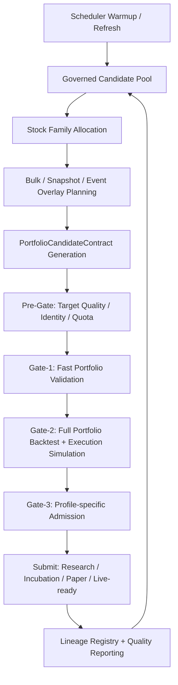

# 策略工厂完整调整方案

> 文档日期：2026-04-05  
> 适用范围：`packages/strategy-factory`、`packages/akshare-mcp` 及工厂运行主链  
> 文档定位：基于当前项目实际代码的增量收口方案，明确区分“已落地底座 / 待硬化链路 / 净新增能力”，避免把已存在模块当作缺失项重做  
> 结论先行：当前策略工厂已经具备研究候选生成、分层过滤、提交分流和观测底座，但还不满足“稳定产出可直接上交易的组合策略”

---

## 一、执行摘要

当前工厂之所以还无法满足实际需求，不是因为还漏了几个低质量 snapshot 候选，也不是因为某个 family 阈值不够紧，而是因为系统中段仍然把“研究候选”与“交易对象”混在一起处理。

最关键的结构性错位有 5 个：

1. `Gate-1` 和 `Gate-2` 仍未验证同一个归一化交易对象。
2. 多标的候选仍然不是组合级真实回测，而是“逐股票回测后再聚合”的 proxy。
3. `governed_candidate_pool`、`stock_family_allocation`、`factor_scheduler` 已经存在，但还没有被硬化为唯一主驱动。
4. `dedup/refresh` 的身份语义仍然偏“研究任务相似”，而不是“交易对象是否同一策略”。
5. 分层 summary、`live_candidate_ready` 分流、multiple testing 汇总已经存在，但语义还不够硬，指标也还不够完整。

因此，继续沿着 `pipeline_staged rsi / ma_cross / momentum` 这类 family 做微调，最多只能减少坏候选漏入 `Gate-2`，并不能把工厂升级成真实可交易策略工厂。

本方案的核心不是“重建一套新工厂”，而是在现有 contracts、readiness、summary、submission 底座上，把主链统一到三个一致性上：

- 同一候选合同：生成、Pre-Gate、Gate-1、Gate-2、Gate-3、submit 使用同一交易对象语义。
- 同一验证对象：多标的候选在所有主门禁里都按组合对象验证，而不是单票 proxy。
- 同一 admission 语义：research、incubation、paper、live-ready、promotion 都以同一 lineage 和质量账本推进。

---

## 二、为什么当前工厂无法满足实际需求

### 2.1 当前系统的真实定位

从代码事实看，当前系统更准确的定位是：

```text
研究任务驱动的候选工厂
  = 能持续生成候选
  + 能做分层质量过滤
  + 能提交到孵化/评审链
  + 能输出分层 summary / live-ready / multiple-testing 基础信息
  - 还不能稳定证明“这是一个可直接交易的组合策略”
```

这和实际需求之间的差距，不在“有没有工厂”，而在“工厂生产的对象是不是交易对象”。

### 2.2 结构性问题清单

| 问题 | 当前代码事实 | 直接后果 | 优先级 |
|------|--------------|----------|--------|
| Gate-1 / Gate-2 对象错位 | `quality_gates.py` 的 `gate_1_fast_screen()` 仍按单票 `strategy_type + params` 快筛；`backtest_filter.py` 才开始构建 `FactoryBacktestAssumptions` | `Gate-1` 好看、`Gate-2` Sharpe 崩塌成为系统性现象 | P0 |
| 多标的不是组合级回测 | `engine.py` 的 `BacktestEngine.run_backtest()` 入口仍是单 `code`；`backtest_filter.py` 对多个 `code` 逐个回测后再聚合 | 无法验证真实组合 NAV、共享现金、组合换手、容量、相关性 | P1 |
| 事件验证仍是 proxy | `backtest_filter.py` 的事件窗度量仍围绕聚合曲线尾部切片构造 | event 候选看似“有事件窗验证”，实际没做真实事件研究 | P1 |
| 执行现实性仍偏单票成交近似 | `_engine_support.py` 里已有成本、滑点、冲击、持仓约束字段，但成交仿真仍然是单票标量近似 | 回测收益与可执行收益仍有系统性偏乐观风险 | P1 |
| governed pool 已有底座但未硬化为主驱动 | `readiness_service.py`、`cycle_runner.py`、`factor_research.py` 已有 pool state / refresh trigger / governed pool load，但运行链仍可回退到 `seed_fallback` | 工厂长期停留在 governed pool 非主驱动状态 | P0 |
| factor scheduler 生命周期已有接线但仍不稳 | scheduler/provider 链已有 warmup/refresh 语义，但关键链路仍可能退到 `local_rule_fallback` | 因子研究和 governed pool 供给不稳定 | P0 |
| bulk/autonomy 预算已拆分但运行面仍可能失衡 | `_factory_scheduler_loop.py` 已拆 scan/bulk 预算；`stock_strategy_matrix.py` 已做 family interleave，但 merge 后统一排序会再次削弱多样性 | `planned_bulk_task_count` 与运行面 family mix 仍可能失真 | P1 |
| dedup/refresh 身份语义过粗 | `deduplicator.py` 已有 `refresh_metrics_only` 和 `spawn_revision_from_existing`，但主要仍看 task signature、params similarity、target overlap | 真正有新 target pool / 新验证语义的候选会被打成 `refresh_metrics_only` | P0 |
| summary / admission 口径仍不够硬 | 已存在 `research / incubation / live-ready` 三层 summary、`live_candidate_ready` 分流和 multiple testing 汇总，但缺少更强的持久化和硬阻断语义 | 团队仍难准确区分“研究产能提升”和“可交易策略产出提升” | P2 |

### 2.3 已经存在的底座，不能按缺失重建

以下能力已经在当前代码中有明确底座，不应按“尚未实现”处理：

- 候选交易字段、合同片段和结构性 Gate-0 校验已经存在，缺的是统一视图与同对象 hash，不是从零设计字段。
- `governed_candidate_pool`、pool state 解析、refresh trigger、auto refresh 已经接入主链，缺的是默认主驱动和静默降级治理。
- scan/bulk 预算拆分、`stock_family_allocation` 和 family interleave 已经存在，缺的是 merge 末端不再把多样性打散。
- `research_summary`、`incubation_summary`、`live_ready_summary`、`live_candidate_ready` 分流、multiple testing 汇总已经存在，缺的是更强的动作语义和持久化约束。

### 2.4 已经做过、但不能继续当主线的问题

以下收紧动作有价值，但已经不是当前主矛盾：

- snapshot 对齐门槛收紧
- `pipeline_staged rsi / momentum / ma_cross` 的 family 激活约束
- `rl_bandit momentum` 的 snapshot 配额与对齐阈值
- Gate-2 前 target quality 的前移拦截

这些动作解决的是“坏候选不要漏进去”，不是“好候选如何被证明可交易”。它们应该保留，但只能作为 P0 的防漏层，不应继续作为主改造方向。

---

## 三、目标状态

### 3.1 新目标定义

工厂的目标应从：

```text
尽可能多地产生研究候选
```

切换为：

```text
稳定地产生、验证并分流“可审计的交易候选”
```

### 3.2 最小可交付目标

达到“满足实际需求”的最低标准，必须同时满足下面 6 条：

1. 候选对象必须在生成阶段就具备完整交易合同视图，而不是在 `Gate-2` 才临时补齐执行假设。
2. `Gate-1` 和 `Gate-2` 必须验证同一候选合同，只允许“快版”和“完整版”的差异，不允许对象语义不同。
3. 多标的候选必须走真实组合级回测和成交仿真。
4. `Gate-3` 必须严格按当前 `validation_profile` 分流，不再用因子式统计协议主审交易规则候选；如需重命名 profile，必须通过兼容迁移完成。
5. `dedup/refresh/revision` 必须基于交易身份和 lineage 判断，而不是只看研究任务签名。
6. run summary 必须保持 `research / incubation / live-ready` 三层，且每层有独立 source / family / gate / refresh 指标。

### 3.3 设计原则

- 先统一对象，再统一流程，最后再谈规模。
- 先消灭静默降级，再提升产能。
- 先消灭 proxy 主验证，再保留 proxy 辅助审计。
- 先让 governed pool 成为主驱动，再让 snapshot/event 退回 overlay。

---

## 四、目标架构

### 4.1 统一候选合同视图：`PortfolioCandidateContract`（兼容现有 contracts）

建议以兼容层方式引入统一候选合同视图，作为生成到 admission 的唯一主对象。

这不是要求立即淘汰现有 `StrategyResearchContract`、`StrategyPortfolioSpec`、`StrategyExecutionAssumptions`、`StrategyValidationProfile`，而是要求在这些现有片段之上形成单一、可 hash、可审计的组合视图。

```json
{
  "candidate_id": "uuid",
  "candidate_family_id": "momentum_midcap_trend_v1",
  "strategy_type": "momentum",
  "generator_mode": "llm | rule | hybrid",
  "validation_profile": "trade_rule_validation",
  "targeting": {
    "target_symbols": ["600519", "300750"],
    "target_pool_id": "theme:new_energy:2026-04-05",
    "coverage_ratio": 0.82,
    "intersection_ratio": 0.77,
    "target_source": "governed_pool"
  },
  "portfolio_spec": {
    "portfolio_mode": "multi_name",
    "target_weight_scheme": "equal_weight",
    "target_weight_map": {},
    "max_position_pct": 0.1,
    "rebalance_rule": "weekly"
  },
  "execution_assumptions": {
    "initial_capital": 1000000,
    "commission_rate": 0.00025,
    "slippage_model": "market_impact",
    "market_impact_bps": 4.0,
    "capacity_participation_rate": 0.05,
    "adv_ratio_limit": 0.1,
    "t_plus_one": true
  },
  "trade_plan": {
    "entry_logic": "dsl/rule reference",
    "exit_logic": "dsl/rule reference",
    "holding_horizon": {"min_days": 5, "max_days": 20},
    "risk_rules": {"stop_loss": 0.08, "take_profit": 0.18}
  },
  "lineage": {
    "run_id": "factory_run_xxx",
    "task_signature": "xxx",
    "lineage_id": "xxx",
    "parent_candidate_ids": []
  }
}
```

### 4.2 新主链



### 4.3 三条必须独立的验证协议

系统里至少要明确拆成三条协议，不能继续混用；当前阶段应优先沿用现有 runtime 命名：

1. `trade_rule_validation`
   适用于 `momentum / ma_cross / rsi / volatility_breakout / mean_reversion_short / dsl_rule`

2. `event_trade_validation`
   适用于带真实 `event_id / event_time / event_window` 的候选

3. `factor_rank_validation`
   适用于因子暴露、横截面收益、IC/IR 这类统计对象

这里最重要的不是新增字段，而是禁止“先走一遍默认统计协议，再叠加交易规则检查”这种错配路径。

如果后续需要把第 2/3 类对外命名升级为 `event_study_validation` / `factor_stat_validation`，必须通过别名兼容和存量迁移完成，不能在当前阶段直接替换 runtime 常量。

---

## 五、完整改造路线

### P0：本周必须完成，目标是把现有底座收口为稳定主链

### P0-1 统一候选合同，消灭 Gate-1 / Gate-2 对象错位

**目标**

让 `Pre-Gate`、`Gate-1`、`Gate-2`、`Gate-3` 都围绕同一个 `PortfolioCandidateContract` 视图工作。

**改造范围**

- `packages/strategy-factory/src/strategy_factory/application/quality_gates.py`
- `packages/strategy-factory/src/strategy_factory/application/backtest_filter.py`
- `packages/strategy-factory/src/strategy_factory/domain/targets.py`
- `packages/akshare-mcp/src/akshare_mcp/services/_strategy_llm_provider_prompt.py`
- `packages/akshare-mcp/src/akshare_mcp/services/_strategy_llm_provider_normalize.py`

**动作**

- 将当前分散在 candidate 根字段、`portfolio_spec`、`execution_assumptions`、`research_task` 的关键交易字段统一收口到单一合同视图，保留现有 contracts/dataclass 作为兼容底座。
- `Gate-1` 不再直接拿裸 `strategy_type + params` 跑单票回测，而是读取候选合同的快版验证计划和归一化 assumptions。
- `Gate-2` 的 `FactoryBacktestAssumptions` 改成来自同一份合同快照，而不是二次推导出另一套对象。
- prompt/normalize 层强制输出缺失字段的默认值或显式拒收。

**验收**

- 任一进入 `Gate-1` 的候选都能直接生成完整合同快照。
- `Gate-1` 与 `Gate-2` 的 tested object hash 一致。
- run detail 中不再出现“`Gate-1` 用单票裸参数，`Gate-2` 才补 portfolio/execution”。

### P0-2 让 governed pool 成为工厂主驱动，消灭静默降级

**目标**

把 `governed_candidate_pool` 从“有则用、没有就静默 fallback”改成“默认必须有，缺失时主动 refresh / validation cycle”。

**改造范围**

- `packages/strategy-factory/src/strategy_factory/application/factor_research.py`
- `packages/strategy-factory/src/strategy_factory/application/services/readiness_service.py`
- `packages/strategy-factory/src/strategy_factory/application/cycle_runner.py`
- `packages/strategy-factory/src/strategy_factory/application/factory_scheduler.py`
- `packages/strategy-factory/src/strategy_factory/application/_factory_scheduler_loop.py`

**动作**

- governed pool 缺失时，优先复用现有 refresh trigger / readiness 路径，主动触发 scheduler warmup / refresh，而不是等 stale。
- 独立 `factory run` 启动前显式执行一次 scheduler warmup。
- 缺 pool 时把运行态标记成 `refreshing_pool` 或 `blocked_by_governed_pool`，而不是继续用 `seed_fallback` 放量。
- 把 `governed_candidate_pool_active=true` 变成标准运行态字段。

**验收**

- run summary 里 `governed_candidate_pool_active=true`。
- `factor_source_mode` 不再长期停留在 `seed_fallback`。
- governed pool 缺失时会主动刷新，不再静默降级。

### P0-3 修复 factor scheduler / provider 生命周期

**目标**

让 factor scheduler 常态工作，不再在关键链路退回 `local_rule_fallback`。

**改造范围**

- `packages/strategy-factory/src/strategy_factory/application/factory_scheduler.py`
- `packages/strategy-factory/src/strategy_factory/application/factor_research.py`
- 配置：`.env`、`packages/strategy-factory/src/strategy_factory/domain/constants.py`

**动作**

- 默认打开 `FACTOR_SCHEDULER_LLM_MINING`。
- 修正 provider 初始化、重试、缓存和失效恢复。
- scheduler run 前做 provider health check，异常时进入受控重建，而不是直接切本地 fallback。

**验收**

- 正常运行时 `factor_llm_provider` 生命周期稳定。
- scheduler trace 不再高频出现 `local_rule_fallback` 作为主供给来源。

### P0-4 保留已拆预算，修复 bulk merge 后的 family 失衡

**目标**

既要让 bulk 任务真正展开，又要避免 merge 末端再次把单一 family 推到整个预算窗口前部。

**改造范围**

- `packages/strategy-factory/src/strategy_factory/application/_factory_scheduler_loop.py`
- `packages/strategy-factory/src/strategy_factory/application/opportunity.py`
- `packages/strategy-factory/src/strategy_factory/application/stock_strategy_matrix.py`
- `packages/strategy-factory/src/strategy_factory/domain/constants.py`
- `.env`

**动作**

- 保留现有的 bulk lane 与 autonomy 预算拆分，不再让后续合并排序重新削弱独立预算效果。
- `selected_bulk_task_count` 不再因为 merge 后统一排序而隐式退化回全局统一截断。
- bulk task 展开顺序按 `stock_family_allocation`、family diversity、recent failure penalty 排序，并把这些信号贯穿 merge 后的最终排序。
- 禁止 `5485` 个 `ma_cross pass-1` 长队列排在所有 family 之前。

**验收**

- `selected_bulk_task_count` 不再持续小于 `planned_bulk_task_count`。
- run detail 中 family 分布明显更均衡。
- `ma_cross` 不再长期垄断 bulk queue 头部。

### P0-5 把 target quality 拦截前移成主门禁，而不是补丁

**目标**

让低对齐、低样本、低稳定性的 target 候选在 `Pre-Gate` 或 `Gate-1 前` 就被挡掉。

**改造范围**

- `packages/strategy-factory/src/strategy_factory/application/quality_gates.py`
- `packages/strategy-factory/src/strategy_factory/application/backtest_filter.py`
- `packages/strategy-factory/src/strategy_factory/domain/targets.py`
- `packages/akshare-mcp/src/akshare_mcp/services/_strategy_llm_provider_prompt.py`
- `packages/akshare-mcp/src/akshare_mcp/services/_strategy_llm_provider_normalize.py`

**动作**

- 将 `coverage_ratio`、`intersection_ratio`、`target sample sufficiency`、`target layer stability` 纳入统一 target quality score。
- `pipeline_staged rsi`、`rl_bandit momentum`、`volatility_breakout` 等历史问题族按同一 score 拦截。
- 保留已完成的 snapshot 收紧逻辑，但并入统一质量框架。

**验收**

- `Gate-2 input` 中不再出现极低 `coverage_ratio / intersection_ratio` 的 snapshot 候选。
- `Gate-1` 通过但 `Gate-2 target Sharpe` 全崩的比例明显下降。

### P0-6 重做 dedup / refresh 语义

**目标**

避免“有新 target pool 含义的候选”被无脑打成 `refresh_metrics_only`。

**改造范围**

- `packages/strategy-factory/src/strategy_factory/application/deduplicator.py`
- `packages/strategy-factory/src/strategy_factory/application/_submitter_actions.py`

**动作**

- 在现有 task signature / target overlap 语义之上，将 `candidate_family_id`、`validation_profile`、`portfolio_spec`、`target_pool_id`、`lineage_id` 纳入身份计算。
- 刷新判定从“任务相似”升级为“交易对象相同且目标池充分重合”。
- 对 `target_overlap` 不足、但任务签名相近的候选，优先走 `revision` 而不是 `refresh_metrics_only`，保留现有 `refresh_metrics_only` / `spawn_revision_from_existing` 两条分流。

**验收**

- 像 `601666` 这类真实通过候选，不再因为目标池语义变化却被刷成纯 refresh。
- `refresh_metrics_only` 占比下降，`revision_from_existing` 语义更准确。

---

### P1：两周内完成，目标是把验证对象升级成真实组合交易对象

### P1-1 多标的真实组合回测

**目标**

将当前“逐股票回测后曲线合成”的 proxy，升级为真实组合引擎。

**改造范围**

- `packages/strategy-factory/src/strategy_factory/application/backtest_filter.py`
- `packages/akshare-mcp/src/akshare_mcp/services/backtest/engine.py`

**动作**

- 为 `BacktestEngine` 增加 portfolio 级入口。
- 同一候选在一个引擎实例内共享现金、权重、换手和组合净值。
- 输出组合层 `NAV / drawdown / turnover / exposure / capacity`。

**验收**

- 多标的候选不再通过 per-code median 聚合计算核心指标。
- 可以直接对单个 candidate 输出组合曲线和组合交易明细。

### P1-2 执行现实性进入成交主链

**目标**

把成本、容量、冲击、持仓约束从 audit/proxy 升级为成交仿真主链的一部分。

**改造范围**

- `packages/akshare-mcp/src/akshare_mcp/services/backtest/_engine_support.py`
- `packages/akshare-mcp/src/akshare_mcp/services/backtest/engine.py`

**动作**

- 组合级 position/cash/lot/t+1/capacity 统一进撮合循环。
- 按 `ADV participation`、冲击、税费、最小成交单位、不可交易日过滤真实落单。
- 将 `implementation_shortfall_proxy` 退为审计字段，不再充当主收益修正。

**验收**

- 组合层收益、换手、成交失败率、容量占用都来自真实成交仿真。
- 关键执行假设在回测结果中可审计追溯。

### P1-3 事件研究协议独立化

**目标**

让事件候选围绕真实 `event_id / event_time` 验证，而不是用尾部窗口 proxy。

**改造范围**

- `packages/strategy-factory/src/strategy_factory/application/backtest_filter.py`
- `packages/strategy-factory/src/strategy_factory/application/submission_gate.py`

**动作**

- 引入事件样本集合、估计窗、事件窗、对照组构造。
- 输出 `CAR / BHAR / hit ratio / decay` 时必须带事件样本规模和时间锚点。
- 事件型候选进入 `event_trade_validation` 对应的独立事件研究通道，不再复用默认 trade/factor 逻辑；如后续重命名协议，走兼容迁移。

**验收**

- event 候选的核心验证指标都能追溯到真实事件样本，而不是回测尾部切窗。

### P1-4 将现有 `live_candidate_ready` 分流升级为完整动作闭环

**目标**

把现有 `live_candidate_ready` / `live_ready_review` 分流从“已有路由”升级成真正决定去向的动作闭环。

**改造范围**

- `packages/strategy-factory/src/strategy_factory/application/submission_gate.py`
- `packages/strategy-factory/src/strategy_factory/application/_submitter_actions.py`
- `packages/strategy-factory/src/strategy_factory/application/quality_reporting.py`

**动作**

- 在现有 `live_ready_review` / runtime review / paper account 绑定基础上，按 `research only / incubation / paper / runtime review / pool admission` 显式分流。
- 每次分流附带触发原因、缺口和回退条件。

**验收**

- run summary 能看到 live-ready 真正被送去哪个链路，而不是只在报告字段里出现。

---

### P2：架构收口，目标是把规模化链路和质量链路闭合

### P2-1 强化 `stock_family_allocation` 对 bulk lane 的主驱动地位

**目标**

把 allocation 从“已参与 bulk planning”升级为 bulk 任务主输入，并避免在 merge 末端被再次打散。

**改造范围**

- `packages/strategy-factory/src/strategy_factory/application/factor_research.py`
- `packages/strategy-factory/src/strategy_factory/application/stock_strategy_matrix.py`
- `packages/strategy-factory/src/strategy_factory/application/_factory_scheduler_loop.py`

**动作**

- allocation 输出必须包含 family rank、budget、failure penalty、validation profile。
- bulk task 按 allocation 直接生成，并在 merge 阶段继续保留 family diversity，而不是先生成统一 task 再让 family 抢占。

**验收**

- bulk lane 的 family 供给与 allocation 明显一致，不再被单一 pass-1 模板吞掉。

### P2-2 扩展规则模板生成器，形成 rule-first 主链

**目标**

不是只把 family 加白名单，而是让 rule-first 主链真正能产出可执行模板。

**改造范围**

- `packages/akshare-mcp/src/akshare_mcp/services/_strategy_generators_specs.py`
- 相关 generator / pipeline 文件

**动作**

- 系统化补齐 `volatility_breakout / gap_fill / mean_reversion_short / sector_rotation / north_capital_track / margin_divergence` 的执行模板。
- 每个 family 明确适用 universe、目标层、默认风险约束、组合权重方式。

**验收**

- bulk/rule-first 链能稳定产出多 family 可执行候选，而不是只有 `momentum / ma_cross / rsi`。

### P2-3 将 existing multiple testing / lineage 汇总升级为正式注册表

**目标**

把当前 run-level multiple testing / lineage 汇总升级成正式注册表。

**改造范围**

- `packages/strategy-factory/src/strategy_factory/application/submission_gate.py`
- `packages/strategy-factory/src/strategy_factory/application/_submitter_actions.py`

**动作**

- 对 `task / family / universe / template / revision` 建 lineage registry。
- `DSR / PBO / Reality Check / SPA` 缺失视为 live admission 硬阻断。

**验收**

- 候选在进入 live-ready 前有完整 lineage 和多重检验状态。

### P2-4 扩展现有三层 run summary

**目标**

不再用“提交总数”代表工厂产能，而是扩展现有三层 summary 的指标密度和动作语义。

**改造范围**

- `packages/strategy-factory/src/strategy_factory/application/cycle_runner.py`
- `packages/strategy-factory/src/strategy_factory/application/quality_reporting.py`

**动作**

- 继续输出 `research_summary`、`incubation_summary`、`live_ready_summary` 三层。
- 每层各自统计 source mix、family mix、gate hit、refresh ratio、promotion ratio。

**验收**

- 团队可以独立看到“研究候选变多”和“可交易候选变多”是否同步改善。

---

### P3：运行闭环，目标是让工厂具备持续自我修正能力

### P3-1 把 paper / runtime 风险反馈回 allocation 与 budget

**改造范围**

- `packages/strategy-factory/src/strategy_factory/application/incubation_budgeter.py`
- `packages/strategy-factory/src/strategy_factory/application/factor_research.py`

**动作**

- 将 paper 命中率、运行时风控告警、真实换手、容量拥挤度反馈到 family allocation。
- 按 family / target pool / generator mode 动态调整 incubation budget。

### P3-2 建立调度 SLO 与异常治理

**动作**

- scheduler warmup 失败、provider 退化、governed pool 失效、bulk queue 失衡必须告警。
- 为主链建立 `staleness / fallback ratio / gate drift / refresh drift` 指标。

### P3-3 固化评审节奏

**动作**

- 每周做一次 factory architecture review。
- 每次 review 只看三类东西：合同一致性、验证对象一致性、admission 结果一致性。

---

## 六、模块级改造清单

### 6.1 核心调度链

- `packages/strategy-factory/src/strategy_factory/application/cycle_runner.py`
  - governed pool 启动优先级
  - summary 扩展
  - run mode 与 fallback 显式化
- `packages/strategy-factory/src/strategy_factory/application/_factory_scheduler_loop.py`
  - bulk/autonomy merge 后排序收口
  - queue 排序重构
  - scheduler warmup / refresh 接入
- `packages/strategy-factory/src/strategy_factory/application/factory_scheduler.py`
  - provider 生命周期治理
  - warmup / refresh / retry 状态管理

### 6.2 因子研究与 allocation

- `packages/strategy-factory/src/strategy_factory/application/factor_research.py`
  - governed pool 主驱动
  - `stock_family_allocation` 输入输出升级
  - feedback loop 接入
- `packages/strategy-factory/src/strategy_factory/application/services/readiness_service.py`
  - pool active / stale / refreshing 状态治理
- `packages/strategy-factory/src/strategy_factory/application/stock_strategy_matrix.py`
  - allocation 驱动的 bulk task 展开

### 6.3 候选合同与门禁

- `packages/strategy-factory/src/strategy_factory/application/quality_gates.py`
  - `PortfolioCandidateContract` 快版验证
  - target quality 主门禁
- `packages/strategy-factory/src/strategy_factory/application/backtest_filter.py`
  - full portfolio backtest
  - event validation 独立通道
  - trade validation metrics 重构
- `packages/strategy-factory/src/strategy_factory/application/submission_gate.py`
  - validation_profile 强分流
  - lineage / multiple testing 硬门槛

### 6.4 生成合同与模板链

- `packages/strategy-factory/src/strategy_factory/domain/targets.py`
  - target contract 一致性
- `packages/akshare-mcp/src/akshare_mcp/services/_strategy_llm_provider_prompt.py`
  - 完整合同输出要求
- `packages/akshare-mcp/src/akshare_mcp/services/_strategy_llm_provider_normalize.py`
  - 合同规范化与拒收
- `packages/akshare-mcp/src/akshare_mcp/services/_strategy_generators_specs.py`
  - family 模板扩展

### 6.5 引擎与执行现实性

- `packages/akshare-mcp/src/akshare_mcp/services/backtest/engine.py`
  - portfolio engine 入口
- `packages/akshare-mcp/src/akshare_mcp/services/backtest/_engine_support.py`
  - 组合级成交、容量、冲击、税费、持仓约束

### 6.6 dedup / submit / reporting

- `packages/strategy-factory/src/strategy_factory/application/deduplicator.py`
  - 交易对象 identity
- `packages/strategy-factory/src/strategy_factory/application/_submitter_actions.py`
  - refresh / revision / live-ready 分流
- `packages/strategy-factory/src/strategy_factory/application/quality_reporting.py`
  - 三层 summary 扩展

---

## 七、实施顺序

建议严格按下面顺序推进，不建议并行打散：

1. 先完成文档基线校正以及 P0-1 到 P0-3。
   原因：对象不统一、主驱动不稳定、profile/路径命名不一致时，后面做组合引擎会建立在错误输入上。

2. 再完成 P0-4、P0-5、P0-6。
   原因：这些项大多已有底座，属于调度、target quality 和 dedup 语义的硬化，应在进入净新增大项前先收口。

3. 再进入 P1-1、P1-2、P1-3。
   原因：这是把“研究候选”升级为“交易对象”的决定性改造，也是本轮真正的净新增大项。

4. 最后做 P1-4、P2、P3。
   原因：更强的分流闭环、注册表和 feedback loop 必须建立在稳定主链之上。

---

## 八、验收指标

### 8.1 P0 验收指标

- `governed_candidate_pool_active=true`
- `factor_source_mode` 不再长期是 `seed_fallback`
- `selected_bulk_task_count / planned_bulk_task_count >= 0.8`
- `Gate-2 input` 中不再出现极低对齐 snapshot 候选
- `refresh_metrics_only` 占比明显下降
- `Gate-1` / `Gate-2` tested object hash 一致
- merge 后 family mix 不再明显偏离 allocation 规划

### 8.2 P1 验收指标

- 多标的候选的核心指标来自组合级引擎，而不是 per-code median
- 组合层输出包含 `NAV / turnover / drawdown / capacity / fills`
- event 候选具备真实事件样本验证
- 交易成本与容量约束真实进入成交主链

### 8.3 P2/P3 验收指标

- run summary 持续保持 `research / incubation / live-ready` 三层，并补齐 source / family / gate / refresh / promotion 指标
- live-ready admission 必须附带 lineage 和多重检验状态
- family allocation 能根据 paper/runtime 反馈动态收缩或放大预算

---

## 九、这次不建议再做的事情

以下动作不应再作为主线投入：

- 单独继续收紧某个 `snapshot family` 的阈值，却不改主合同
- 继续围绕单票 Sharpe 调小调大，却不做组合回测
- 继续增加白名单 family，却不补执行模板和验证协议
- 继续追求 submitted 数量，却不利用现有 research/incubation/live-ready 三层指标做主导判断

这些动作不是完全没价值，而是投入产出比已经很低，只能作为局部辅助优化。

---

## 十、交付物清单

本方案落地后，应至少形成以下产物：

1. 新的 `PortfolioCandidateContract` 统一视图与兼容层。
2. governed pool 主驱动运行链。
3. fast portfolio gate 与 full portfolio backtest 两级验证。
4. event validation 独立协议与兼容命名迁移方案。
5. 组合级执行现实性仿真。
6. dedup/refresh lineage identity。
7. 三层 run summary 扩展与 live-ready 分流闭环。
8. 持久化 multiple testing / lineage registry。

---

## 十一、最终判断

当前策略工厂已经不是空白工厂，也不是只缺几条阈值规则。它已经有 contracts、readiness、allocation、summary、submission 的主干底座，但系统主链仍把“研究候选”与“交易对象”混在一起处理。

真正需要的不是继续缩 family 漏斗，而是把整个工厂统一到：

- 同一候选合同
- 同一组合验证对象
- 同一 admission 语义

只有完成这次主干收口，策略工厂才会从“能持续生成候选”升级为“能稳定产出可直接上交易的策略”。
