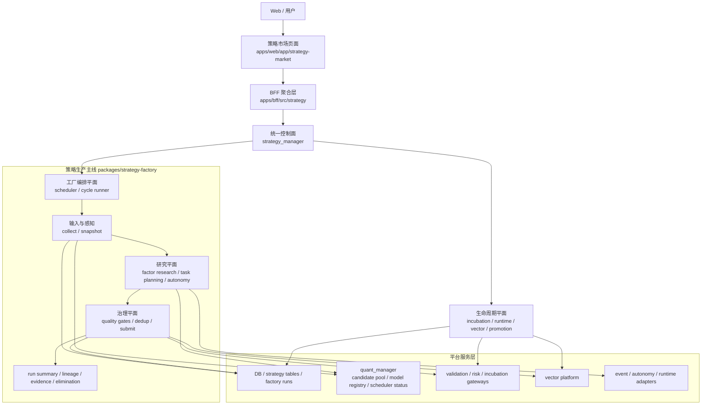

# 策略工厂架构优化方案

> 文档日期：2026-04-08  
> 放置位置：项目根目录  
> 适用范围：`packages/strategy-factory`、`packages/akshare-mcp`、`apps/bff`、`apps/web`、策略工厂运行/治理/孵化/运行时闭环  
> 关联文档：`策略工厂/README.md`、`策略工厂/策略工厂整改详细清单.md`、`docs/plans/策略工厂策略对象协议.md`、`策略工厂实际问题调整方案-2026-04-07.md`  
> 本文目标：基于当前真实代码与真实运行链路，给出一份面向后续 2-3 个阶段的策略工厂架构优化方案，避免把研究蓝图误写成当前能力

---

## 一、结论先行

当前策略工厂已经不是“只有页面和榜单”的半成品，而是一套真实可运行的分布式策略生产系统。它已经具备：

1. 工厂调度与运行记录。
2. 市场快照、因子研究与 readiness 守门。
3. 本地候选生成与自治任务生成。
4. `Gate-0 / Pre-Gate / Gate-1 / Gate-2 / Gate-3` 多级门禁。
5. 去重、刷新已有策略、派生修订实验。
6. 提交、质量报告、血统、向量画像。
7. 孵化、模拟盘、运行时风控、告警、晋级评审与生命周期扫描。

但从架构角度看，当前系统仍有 4 个明显短板：

1. 控制面、研究面、治理面、生命周期面边界还不够清晰。
2. AI 能力主要嵌在生成链路里，还没有上升为独立研究平面。
3. 数据与基础设施能力仍隐含在 DB、MCP adapter 和外部服务调用里，平台层不够显式。
4. 运行时反馈虽然已经存在，但还没有完全闭环回流到任务规划与上游研究。

因此，架构优化的目标不应是“重写一个新工厂”，而应是：

1. 保留现有真实主链。
2. 明确分层与职责边界。
3. 把研究平面从提交流水线中抬出来。
4. 把治理与生命周期闭环变成一等公民。
5. 逐步平台化底层能力，而不是一次性大拆大建。

---

## 二、当前真实架构复盘

基于当前代码，策略工厂的真实入口与主链大致为：

1. 用户与页面入口：`apps/web/app/strategy-market`
2. BFF 聚合入口：`apps/bff/src/strategy`
3. 统一控制面：`packages/akshare-mcp/src/akshare_mcp/tools/managers/strategy_manager.py`
4. 工厂主链：`packages/strategy-factory/src/strategy_factory/application`
5. 生命周期、向量、风控、孵化等运行态能力：仍由 `strategy_manager + BFF + DB/service` 组合承载

当前真实工厂主链：

```text
warmup
-> collect
-> factor_research
-> readiness
-> spawn
-> autonomy
-> quality_gate / backtest
-> deduplicate
-> submit
-> elimination
-> persist
```

从逻辑上，当前系统已经自然长成 5 个层次：

### 2.1 产品与交互层

- `apps/web/app/strategy-market`
- `apps/bff/src/strategy`

职责：

- 展示工厂运行态、策略详情、孵化、运行时、向量、实验结果。
- 暴露 `/strategy-market/*` 产品接口。

当前优势：

- 页面和后台接口已经真实打通，不是空壳。
- 详情页已经按 `summary / incubation / runtime / vectors / experiments` 分区组织。

### 2.2 控制面

- `strategy_manager`
- BFF 中的 `StrategyMarketService`

职责：

- 聚合工厂运行、策略详情、生命周期、运行时、向量治理等能力。
- 为 Web 和其他调用方提供统一 action surface。

当前优势：

- 已形成统一入口。
- 工厂状态、运行历史、run detail、runtime control、promotion review、vector ANN 等都能从这一层读到。

当前问题：

- action surface 越来越大，职责有继续横向膨胀的风险。
- 控制面和业务编排边界还不够明确。

### 2.3 工厂编排层

- `StrategyFactoryScheduler`
- `FactoryCycleRunner`

职责：

- 负责 `daily / continuous / run_once` 调度。
- 负责编排工厂各阶段顺序、保存 run 结果、维护最近摘要。

当前优势：

- 已经具备运行锁、防重入、run history persist、summary 聚合、observability 基础字段。

当前问题：

- 事件更多是“运行时消费事件”，还不是独立的事件驱动编排体系。
- 编排层里仍然承载了不少阶段内分析与 summary 拼装逻辑。

### 2.4 策略生产与治理层

- `collect.py`
- `factor_research.py`
- `opportunity.py`
- `stock_strategy_matrix.py`
- `spawner.py`
- `quality_gates.py`
- `deduplicator.py`
- `submitter.py`
- `submission_gate.py`

职责：

- 采集输入、生成研究任务与候选、执行多级门禁、去重、提交、审计和落库。

当前优势：

- 这是当前系统最完整、最有工程厚度的一层。
- readiness、多级门禁、去重刷新、质量报告、lineage、vector profile 都已经落地。

当前问题：

- 研究平面与提交流水线耦合还较深。
- 上游研究任务与下游提交协议仍有局部口径漂移风险。

### 2.5 生命周期闭环层

- 孵化：`incubation_overview / incubation_metrics / paper_account / paper_orders / paper_nav`
- 运行时：`risk_events / risk_snapshots / runtime_alerts / runtime_control`
- 向量：`vector_profiles / vector_ann_search / vector_indexes / vector_health`
- 晋级与治理：`promotion_reviews / lifecycle_scan / domain_events / domain_projection`

职责：

- 管理策略从提交后进入孵化、运行观察、风险控制、晋级与淘汰的全过程。

当前优势：

- 生命周期能力比很多“策略工厂蓝图”更落地。
- 已经具备真实闭环雏形，而不是只有 candidate generation。

当前问题：

- 生命周期反馈还没有完整回流到工厂上游规划。
- 不同运行态证据还没有统一成一套稳定的反馈合同。

---

## 三、架构优化目标

本轮架构优化要同时达成 6 个目标：

### G1. 明确分层

把当前系统稳定划分为：

1. 产品层
2. 控制面
3. 编排层
4. 研究平面
5. 治理与提交平面
6. 生命周期平面
7. 平台服务层

### G2. 抬升研究平面

让 AI / autonomy / factor research 不再只是提交流水线中的“一个阶段”，而是能独立输出研究任务、候选、实验与证据的研究平面。

### G3. 收紧治理边界

让门禁、去重、提交、质量报告、multiple-testing、lineage 全部收敛到明确的治理平面中，避免策略语义在多处漂移。

### G4. 强化生命周期闭环

把孵化、运行风险、运行告警、promotion review 的结果，稳定回流到：

1. family feedback
2. target pool feedback
3. generator mode feedback
4. 下一轮任务预算与排程

### G5. 平台化底层能力

逐步把以下能力从“调用散点”提升为“平台能力”：

1. snapshot
2. governed candidate pool
3. lineage / evidence registry
4. vector governance
5. backtest assumptions
6. cost / capacity assumptions

### G6. 保持增量兼容

不打断现有：

1. `strategy_manager`
2. BFF `/strategy-market/*`
3. Web `/strategy-market`
4. `akshare_mcp.services.strategy_factory.*` 兼容路径

---

## 四、目标架构



这张图不是“未来幻想图”，而是对当前代码的结构化收口。区别只在于：

1. 把当前已存在但混合在一起的职责显式分层。
2. 把研究平面和治理平面作为独立优化对象。
3. 把生命周期平面从附属接口提升为工厂架构的一等组成部分。

---

## 五、各层职责边界

### 5.1 产品层

应负责：

- 页面展示
- 用户触发
- 查询参数组织
- 结果可视化

不应负责：

- 策略语义决策
- 门禁决策
- 工厂运行编排

### 5.2 控制面

应负责：

- action 路由
- 聚合多域状态
- 对外暴露统一接口
- run summary / factory observability 读取

不应负责：

- 直接生成候选
- 持有复杂策略语义
- 嵌入具体门禁规则

### 5.3 编排层

应负责：

- 调度
- 阶段顺序
- 超时与重入控制
- run 持久化
- 工厂级 summary 聚合

不应负责：

- 具体策略对象判定
- 具体风险规则
- 具体去重逻辑

### 5.4 研究平面

应负责：

- 市场输入解释
- governed pool 消费
- 因子研究 artifact
- 研究任务生成
- AI / autonomy 候选生成
- 实验记录与任务证据

不应负责：

- 最终是否提交
- 刷新旧策略还是派生新实验的最终裁决
- 生命周期状态迁移

### 5.5 治理平面

应负责：

- Gate-0 ~ Gate-3
- dedup / refresh / revision 判定
- quality report
- submission lane 决策
- strategy lineage / multiple-testing / vector profile 落库

不应负责：

- 直接采集外部行情或事件
- 决定下一轮工厂排程

### 5.6 生命周期平面

应负责：

- 孵化与模拟盘
- runtime risk / alerts / control
- promotion review
- lifecycle scan
- domain projection

不应负责：

- 直接生成新候选
- 直接修改研究任务合同

### 5.7 平台服务层

应负责：

- 数据存储与索引
- governed pool / model registry / vector platform
- validation / risk / incubation 等外部能力适配

不应负责：

- 注入业务判断
- 承担工厂主编排职责

---

## 六、建议的物理目录收口方式

当前不建议立刻做大规模目录重构，但建议按“逻辑先、物理后”的顺序逐步收口。

### 6.1 第一阶段先做逻辑收口

在 `packages/strategy-factory/src/strategy_factory/application/` 内部明确四块逻辑域：

1. `orchestrator`
   - `factory_scheduler`
   - `cycle_runner`
   - `_factory_scheduler_loop`
   - `_factory_scheduler_runtime`
   - `_factory_scheduler_analysis`

2. `research`
   - `collect`
   - `factor_research`
   - `opportunity`
   - `stock_strategy_matrix`
   - autonomy task planning 相关能力

3. `governance`
   - `quality_gates`
   - `backtest_filter`
   - `deduplicator`
   - `submitter`
   - `submission_gate`

4. `lifecycle_feedback`
   - family / target pool / generator mode feedback 相关聚合逻辑

这一阶段可以先不迁目录，只先统一 import 边界和模块归属。

### 6.2 第二阶段再做物理迁移

当逻辑边界稳定后，再考虑迁成：

```text
strategy_factory/
  application/
    orchestrator/
    research/
    governance/
    lifecycle_feedback/
```

迁移原则：

1. 先迁无兼容压力模块。
2. 保留 facade 暴露。
3. 旧路径通过 compat 或桥接保留一段时间。

---

## 七、分阶段优化方案

## P0：边界收口与合同统一

目标：

1. 明确控制面、研究平面、治理平面、生命周期平面的职责。
2. 统一 candidate / research_task / submission / feedback 的对象合同。
3. 把 run summary、gate summary、feedback summary 字段收敛到稳定口径。

执行项：

1. 统一工厂阶段输出 contract。
2. 明确 `readiness` 是工厂硬门，不再把它当附属信息。
3. 统一 `research_task`、`targeting_policy`、`validation_profile`、`attempt_adjustment` 的读写路径。
4. 把 lifecycle feedback 显式定义成研究输入，而不是零散附加字段。

验收：

1. 工厂 run detail 能稳定映射到固定阶段语义。
2. 研究、治理、提交、生命周期四类证据可以互相对上。

## P1：研究平面独立化

目标：

1. 让 `factor_research + task planning + autonomy` 成为独立研究平面。
2. 研究平面只输出候选与证据，不直接承担提交职责。

执行项：

1. 收口 `MarketOpportunityScanner`、`StockStrategyMatrixPlanner`、autonomy task planning 的输入输出合同。
2. 明确 research artifact、task artifact、candidate artifact 三类对象。
3. 把自治实验、外部 LLM 统计、task evidence 统一沉淀为研究证据。

验收：

1. 研究平面输出可以单独被测试和观测。
2. 提交流水线可以在不修改研究逻辑的前提下独立演进。

## P2：治理平面硬化

目标：

1. 让门禁、去重、提交彻底成为独立治理平面。
2. 把“通过门禁”和“进入孵化/运行”的因果链统一表达。

执行项：

1. 收紧 `Gate-0 ~ Gate-3` 的阶段 contract。
2. 把 dedup 的 `refresh_existing / spawn_revision_from_existing` 决策继续显式化。
3. 统一 quality report、multiple-testing registry、lineage record、vector profile 的生成口径。
4. 补齐执行成本、容量、流动性、市场微观结构相关扩展接口，为后续更细门禁预留位置。

验收：

1. 候选从输入到提交的治理链路可以完整审计。
2. run summary 与策略详情页中的治理信息不再漂移。

## P3：生命周期反馈闭环

目标：

1. 让运行态信息真正回流到工厂上游。
2. 形成“生产 -> 运行 -> 反馈 -> 再生产”的闭环。

执行项：

1. 把 incubation、runtime risk、runtime alerts、promotion review 的结果统一映射到 feedback contract。
2. 将 feedback 分为：
   - family feedback
   - target pool feedback
   - generator mode feedback
3. 把这些反馈显式接入 task planning、budget planning、autonomy mode control。

验收：

1. 下一轮工厂任务预算能稳定受运行反馈影响。
2. 高风险 family / target pool / generator mode 能被真正抑制或冷却。

## P4：平台服务层显式化

目标：

1. 把底层能力从“散落调用”提升为“稳定平台接口”。
2. 为后续更强 AI 研究能力预留平台基础。

执行项：

1. 显式抽象 snapshot service。
2. 显式抽象 governed candidate pool service。
3. 显式抽象 evidence / lineage registry。
4. 显式抽象 vector governance service。
5. 显式抽象 cost / capacity / execution assumptions service。

验收：

1. 上层业务不再依赖零散 DB 能力探测。
2. 控制面和工厂主线更容易测试、替换和扩展。

---

## 八、哪些现在不要做

以下动作当前不建议立即推进：

1. 不要重写一个全新的工厂主控系统。
2. 不要在短期内移除 `strategy_manager` 统一入口。
3. 不要把孵化、runtime、vector、promotion 重新并回工厂主链。
4. 不要把当前研究蓝图中的 RL / MCTS / 多智能体系统直接当作现状能力来改造控制面。
5. 不要在边界未稳定前大规模删除 compat surface。

原因：

1. 当前系统真实主链已经存在。
2. 目前更大的问题是边界与口径，而不是模块数量不够。
3. 一次性大重构会破坏现有 BFF / Web / MCP 使用面。

---

## 九、优先级建议

如果只能做一轮架构优化，建议优先级如下：

1. `P0 边界收口与合同统一`
2. `P1 研究平面独立化`
3. `P3 生命周期反馈闭环`
4. `P2 治理平面硬化`
5. `P4 平台服务层显式化`

原因：

1. 当前最大收益来自“先让层次清晰”。
2. 研究平面和生命周期反馈一旦收口，后续 AI 能力增强才不会继续耦合到提交流水线里。
3. 治理平面已经比较强，当前更需要收口和标准化，而不是盲目继续堆功能。

---

## 十、架构验收指标

架构优化完成后，至少应能稳定观测以下指标：

1. 工厂各阶段 `completed / partial / failed / skipped` 比例。
2. readiness 阻断原因 Top N。
3. research task 按 `task_source / family / target_pool / generator_mode` 的产出与通过率。
4. `pre-gate -> gate-1 -> gate-2 -> gate-3` 转化率。
5. `refresh_existing / spawn_revision_from_existing / created_strategy_pool / created_audit_only` 比例。
6. family / target pool / generator mode feedback 命中率。
7. 孵化进入率、晋级率、运行风险触发率、淘汰率。
8. vector coverage、ANN 命中率、索引健康状态。

这些指标的意义不是“做看板”，而是验证架构分层之后，各层是否真的形成了稳定闭环。

---

## 十一、最终建议

这套策略工厂接下来的正确架构方向，不是“再做一个更大的工厂”，而是：

1. 保持当前分布式闭环不被打断。
2. 让控制面、研究平面、治理平面、生命周期平面边界清晰。
3. 让生命周期反馈真正回流到研究与排程。
4. 让底层能力逐步平台化。

如果这四件事做好，策略工厂就会从当前的“真实可运行、治理较强、研究与平台层尚未完全独立的策略生产系统”，进一步升级为：

**一个以分布式调度为骨架、以多级治理为中枢、以生命周期反馈为闭环、并为 AI 研究能力预留平台接口的策略生产与治理操作系统。**
